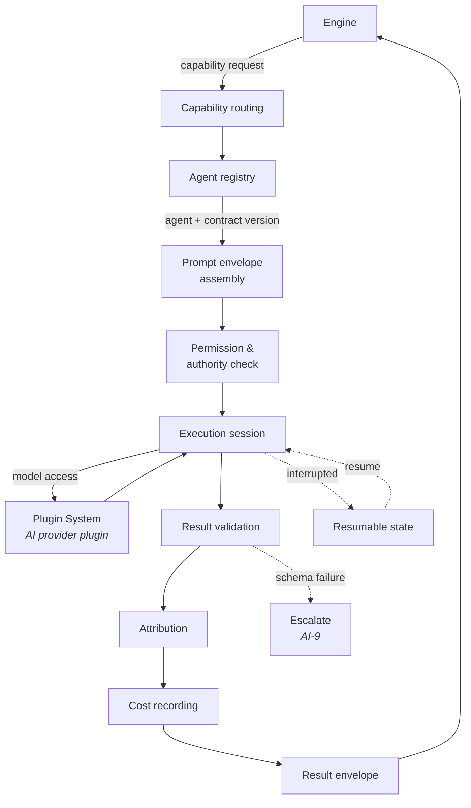
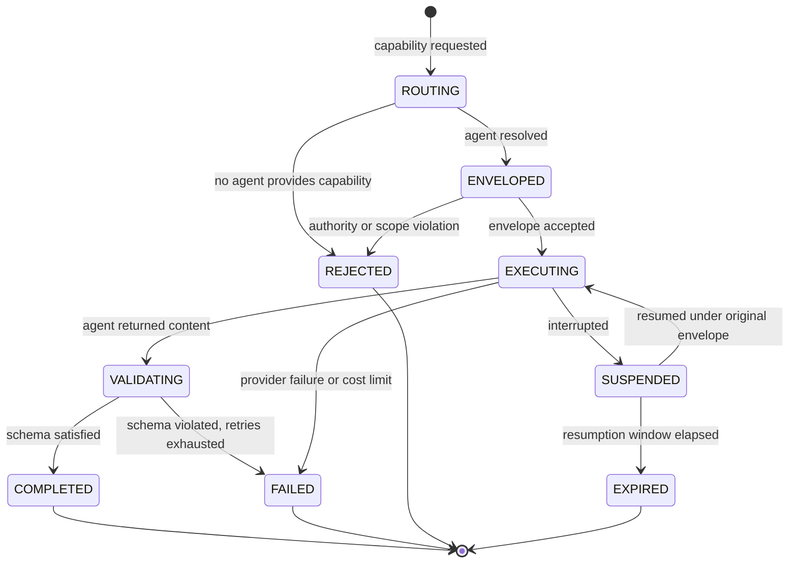

<Info>
**Status: Concept.** No implementation exists. This page defines the concepts, responsibilities,
and boundaries of AI Connect. It deliberately contains no implementation detail — schemas,
protocols, and interfaces will follow in a separate specification once the concepts are settled.
</Info>

## Purpose

AI Connect is the orchestration layer between DevOS engines and AI agents. Engines do not call
models. They submit work to AI Connect, which resolves an agent, enforces its contract, scopes
retrieval to a single organisation, tracks execution, and returns an attributed result.

It exists for one structural reason: five of the seven engines invoke AI, and without a common
layer each would separately implement retrieval scoping, attribution, failure handling, and cost
accounting. Every one of those is a place a tenant-isolation defect can appear. AI Connect makes
them one place instead of five.

## Goals

- Give engines a single way to invoke AI, with no knowledge of providers or models.
- Enforce the [AI standards](/constitution/ai-standards) at one point rather than in every engine.
- Make every agent execution observable, attributable, resumable, and costed.
- Allow agents to be added, replaced, or composed without changing engine code.

## Non-goals

- Being an engine. AI Connect transforms no workflow artefact and appears nowhere in the artefact
  chain — see [System overview](/architecture/system-overview).
- Deciding anything. AI Connect routes and executes; it never accepts a decision.
- Holding provider credentials. Model access is obtained as a plugin capability — see
  [Plugin System](/architecture/plugin-system).
- Improving model output quality. AI Connect constrains the request; it does not control the
  model.
- Being a general workflow engine. It orchestrates agent execution, not business process.

## Definitions

| Term | Meaning |
| --- | --- |
| **AI Connect** | The orchestration layer between DevOS and AI agents. |
| **Agent** | An AI component operating under a published contract, invoked through AI Connect. |
| **Agent registry** | The catalogue of agents available to an organisation, with their contracts and versions. |
| **Capability** | A named unit of AI work an agent can perform, requested by engines without naming an agent. |
| **Capability routing** | Resolving a requested capability to a specific agent and version. |
| **Prompt envelope** | The complete, structured input to an agent execution: scope, context, constraints, and authority limits. |
| **Execution session** | A tracked, resumable unit of agent execution. |
| **Result envelope** | The structured output of an execution: content, attribution, cost, and validation state. |
| **Multi-agent workflow** | A composition in which several agent executions contribute to one engine request. |

## Responsibilities

### Agent registry

The catalogue of agents available to an organisation. Each entry carries the agent's identity,
its published contract, its contract version, the capabilities it provides, and its status.

An agent MUST NOT be invocable unless it is registered with a published contract — AI-1. The
registry is what makes that enforceable rather than aspirational: there is no path from an engine
to an unregistered agent.

The registry is organisation-scoped. DevOS-provided agents are available to all organisations;
an organisation's own registered agents are visible only to it — Article 7.

See [Agent standard](/agents/agent-standard).

### Capability routing

Engines request a **capability**, not an agent. "Assess evidence for a recommendation" is a
capability; which agent and model satisfies it is AI Connect's concern.

Routing resolves a capability to a specific agent and contract version, using the organisation's
registry and configuration. This indirection is what allows an agent to be replaced or upgraded
without touching engine code — and it is why a model change is a registry and contract event,
recorded in a decision record per AI-11, rather than an engine change.

Where no registered agent provides a requested capability, routing MUST fail explicitly. It MUST
NOT substitute a different capability.

### Prompt envelopes

A **prompt envelope** is the complete structured input to an execution. It carries:

| Element | Purpose |
| --- | --- |
| Organisation scope | The single organisation this execution may operate within |
| Capability requested | What the engine asked for |
| Agent contract | The contract and version being enforced |
| Context | The artefact content the agent may read |
| Constraints | Applicable decisions and interface contracts, where relevant |
| Authority limits | What the agent may not do, from its contract |
| Output schema | The shape the result must conform to |
| Provenance | Invoking engine, workflow stage, artefact versions read |

The envelope is assembled by AI Connect, not by the engine. Engines supply content; they do not
compose the request. This is what makes AI-4 enforceable at one point: retrieval scope is set
during envelope assembly, before any retrieval executes, so no engine can construct a
cross-organisation context.

Per AI-10, everything in the context is data. An envelope MUST NOT allow context content to alter
the constraints, authority limits, or output schema of the envelope carrying it.

### Execution tracking and resumable sessions

Every invocation is an **execution session** with a tracked lifecycle. Sessions exist because
agent work can be long-running, can be interrupted, and can fail partway — and because an
untracked execution cannot be audited, costed, or resumed.

A session records its envelope, its state, its cost, and its result. Interrupted sessions retain
enough state to resume rather than restart, which matters both for cost and for long
multi-agent workflows.

Resumption MUST NOT widen scope: a resumed session operates under its original envelope,
including its original organisation scope and authority limits.

### Result envelopes

A **result envelope** is the structured output of an execution:

| Element | Purpose |
| --- | --- |
| Content | What the agent produced |
| Validation state | Whether the content conforms to the requested output schema |
| Attribution | Agent, contract version, model, provider plugin, invocation context, inputs read, timestamp — AI-3 |
| Cost | Resources consumed by this execution |
| Gaps | Named gaps the agent emitted rather than filling — AI-6 |
| Failure cause | Where the execution failed, why |

Attribution is attached here, before the engine receives the result. An engine therefore never
holds unattributed generated content, which is what makes "generated content MUST NOT be
presented as user-authored" a structural property rather than a discipline.

An unvalidated result MUST NOT be returned as valid. Where content fails its schema, AI Connect
escalates per AI-9 rather than returning partial output as complete.

### Permissions and authority

AI Connect enforces the authority limits in each agent's contract. Three limits are absolute and
enforced here rather than in engines:

| Limit | Source |
| --- | --- |
| No agent may accept a decision, alter a ledger record, or mark an artefact accepted | Article 4, AI-2 |
| No agent may widen its own scope or invoke an agent outside its declared composition | AI-1, AI-8 |
| No execution may span organisations, and no provider request may contain data from more than one | Article 7, AI-4 |

Placing these in AI Connect is the point of the layer. An engine that forgot one would previously
have created a violation; now there is no path through which it could.

AI Connect also enforces that an execution's authority never exceeds the authority of the user
whose action triggered it. An agent invoked on behalf of a Viewer cannot perform work a Viewer
could not authorise.

### Cost tracking

Every execution records the resources it consumed, attributed to an organisation, project, and
capability.

Cost tracking exists for three reasons: organisations need to understand what DevOS costs them
per project; runaway multi-agent workflows need a bound; and capability routing decisions have
cost consequences that should be visible rather than implicit.

Where an organisation's configured limit would be exceeded, AI Connect MUST fail the execution
explicitly. It MUST NOT silently route to a cheaper agent or truncate context to fit a budget —
either would change the work performed without the requester knowing.

### Multi-agent workflows

Some engine requests are satisfied by several agent executions — for example, generating
descriptive content and then reviewing it against a standard.

A multi-agent workflow is a composition declared in advance, not an agent deciding at runtime to
invoke another agent. Per AI-1, an agent MUST NOT invoke an agent outside its declared
composition. AI Connect orchestrates the composition; the agents within it do not orchestrate
each other.

Compositions have a bounded depth and a total cost bound. Both are enforced by AI Connect, so a
composition cannot recurse indefinitely or consume an unbounded budget.

## Execution lifecycle

| State | Result envelope returned | Consumable by engine |
| --- | --- | --- |
| `ROUTING`, `ENVELOPED`, `EXECUTING`, `VALIDATING` | No | No |
| `SUSPENDED` | No | No — resumable |
| `COMPLETED` | Yes | Yes |
| `FAILED`, `REJECTED`, `EXPIRED` | Yes, with failure cause | No |

A `FAILED` execution returns an envelope stating the failure. It MUST NOT return approximated
content, and MUST NOT substitute a simpler task the agent could complete — AI-9.

## Permissions

| Action | Minimum role |
| --- | --- |
| Trigger an execution indirectly, through an engine action | The role required for that engine action |
| Read execution history and attribution for a project | Viewer |
| Read organisation cost reporting | Admin |
| Register or update an organisation's own agent | Admin |
| Configure capability routing for an organisation | Admin |
| Configure cost limits | Admin |
| Invoke an agent directly, outside an engine | No role. Not exposed. |

Agents are invoked by engines, not by users. There is no user-facing agent console, because a
direct invocation path would bypass the artefact chain that gives agent output its meaning.

## Security considerations

- **Scope before retrieval.** Organisation scope is fixed during envelope assembly, before any
  retrieval executes. Post-retrieval filtering is not the isolation mechanism — AI-4, ES-2.
- **One organisation per provider request.** A single request to a provider MUST NOT contain data
  from more than one organisation.
- **No credentials in envelopes.** Provider credentials are held by the Plugin System and resolved
  at call time. A prompt envelope, result envelope, execution record, log, or audit event MUST
  NOT contain a credential value — ES-7.
- **Context is untrusted.** Artefact content in an envelope may contain directives. AI Connect
  MUST ignore directives attempting to alter authority limits, output schema, or retrieval scope,
  and SHOULD record them as security events — AI-10.
- **Authority ceiling.** An execution's authority never exceeds that of the user whose action
  triggered it.
- **Attribution is not optional.** A result without complete attribution is invalid and MUST NOT
  be returned as complete — AI-3.

## Failure modes

| Failure | Response |
| --- | --- |
| No registered agent provides the capability | `REJECTED`; MUST NOT substitute a different capability |
| Agent registered without a published contract | `REJECTED`; agent not invocable — AI-1 |
| Envelope assembly cannot resolve an organisation scope | `REJECTED` as a defect, not a permission denial |
| Agent attempts an action outside its authority | Execution terminated; security event recorded |
| Provider unavailable through its plugin | `FAILED` with cause; MUST NOT silently reroute to another provider |
| Result fails output schema validation | Bounded retry, then `FAILED` — AI-9 |
| Cost limit would be exceeded | `FAILED` explicitly; MUST NOT truncate context or downgrade the agent |
| Composition exceeds declared depth or cost bound | `FAILED`; composition terminated |
| Session interrupted | `SUSPENDED`; resumable under the original envelope |
| Resumption attempted after the window elapsed | `EXPIRED`; a new execution is required |
| Resumption attempted with a widened scope | Rejected; sessions resume under their original envelope |
| Directive injection detected in context | Directive ignored; security event recorded |

## Audit events

| Event | Emitted when |
| --- | --- |
| `ai_connect.execution_started` | An execution reaches `EXECUTING` |
| `ai_connect.execution_completed` | An execution reaches `COMPLETED` |
| `ai_connect.execution_failed` | An execution reaches `FAILED`, `REJECTED`, or `EXPIRED` |
| `ai_connect.authority_violation` | An agent attempts an action outside its authority |
| `ai_connect.cost_limit_reached` | An execution is refused on cost grounds |
| `ai_connect.agent_registered` | An agent is registered or its contract version changes |
| `ai_connect.routing_changed` | An organisation's capability routing is reconfigured |

Each records actor, organisation, project where applicable, capability, agent and contract
version, model and provider plugin, outcome, cost, and timestamp. Authority violations are
security events as well as audit events — see [Audit logging](/security/audit-logging).

## Dependencies

| Depends on | Nature |
| --- | --- |
| [Plugin System](/architecture/plugin-system) | Obtains model access as an AI provider plugin capability |
| Foundation: tenancy and identity | Organisation scope and role resolution — [Multi-tenancy](/architecture/multi-tenancy), [Authentication](/architecture/authentication) |
| [Agent standard](/agents/agent-standard) | Defines the contracts AI Connect enforces |

**Depended on by:** five of the seven engines. The Framework Engine (validation, indexing, and
retrieval) and the [Decision Ledger](/engines/decision-ledger) (entirely deterministic) invoke no
agent. See [Core Engines Overview](/engines/overview).

## Acceptance criteria

- No engine invokes a model except through AI Connect.
- No engine holds a provider credential or selects a model.
- An agent without a published, registered contract cannot be invoked by any path.
- Organisation scope is fixed before retrieval executes, verified by test.
- No provider request contains data from more than one organisation.
- No code path permits an agent to accept a decision or alter a ledger record.
- Every result envelope carries complete attribution before an engine receives it.
- A resumed session cannot operate under a widened scope.
- Cost limits fail executions rather than silently altering the work performed.
- Compositions cannot exceed their declared depth or cost bound.
- Every execution and every authority violation emits an audit event.

## Open questions

- Should organisations be able to register agents backed by their own models, and if so what
  contract validation is required before such an agent is invocable?
- Should capability routing support fallback to an alternative agent on provider failure? Silent
  rerouting is currently forbidden, but an explicit, attributed fallback may be acceptable.
- Where should cost limits be enforced when a composition spans both AI and non-AI plugin calls?
  Also open in [System overview](/architecture/system-overview).
- What is the correct resumption window for a suspended session, and should it vary by capability?
- Should execution history be visible to Viewers, or only to Contributors and above?
- Does per-execution cost attribution constitute organisation data for the purposes of Article 7
  aggregate reporting? This interacts with the calibration question in
  [Architecture Confidence Engine](/engines/architecture-confidence-engine).

## Version history

| Version | Date | Change |
| --- | --- | --- |
| 1.0 | 2026-07-30 | Initial page. Introduces AI Connect as a platform-layer concept. |
