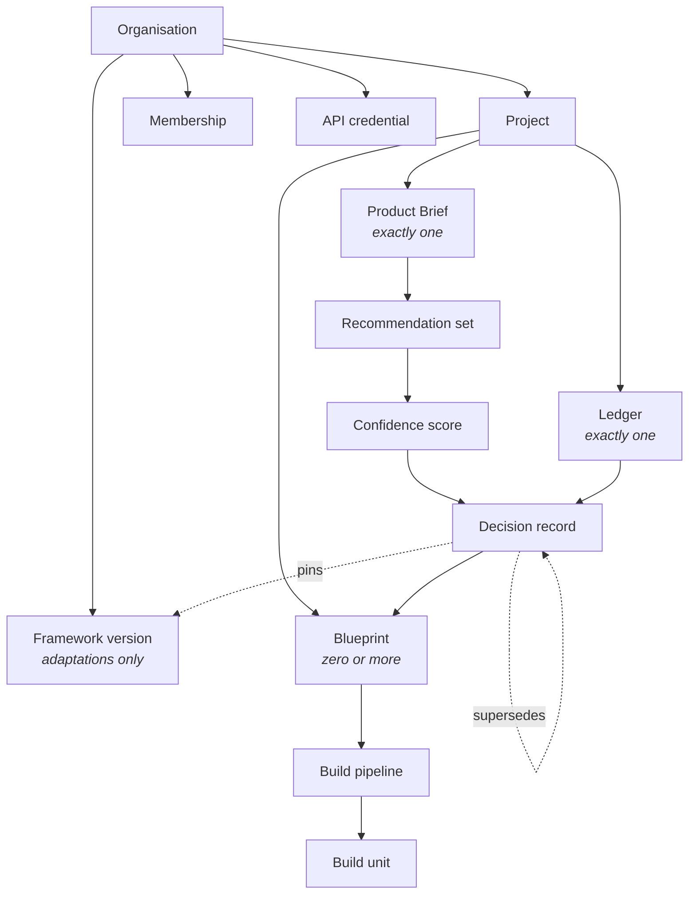

<Info>
**Status: Concept.** This page describes the **domain model** — the objects the specifications already establish and the rules relating them. It is deliberately **not a database schema**: no table, column type, index, or storage technology is specified, because none is specified anywhere in this repository.
</Info>

## Purpose

The artefact chain, the product surface, and the security baseline each declare objects and
fields in passing. This page collects them into one model, states the relationships between
them, and defines the properties any physical implementation must preserve.

It is a reconstruction. Every object below is already declared by a page that owns it, and that
page governs its fields.

## Domain objects are not tables

The distinction matters enough to state before anything else.

| Domain object | Physical table |
| --- | --- |
| A concept the specifications reason about | A storage artefact |
| Has identity, relationships, and rules | Has columns, types, and indexes |
| Specified in this repository | **Not specified in this repository** |

One domain object may become several tables, several may share one, and some — a *ledger*, for
instance — may be a query over another rather than a stored row. This page constrains what any
such mapping must preserve; it does not choose one.

<Note>
Two consequences follow. Field lists below are **the fields the owning page declares**, not a
column set: a physical schema will carry more. And the identifiers shown are conceptual — that
they are written `project_id` says a project is identified, not that a column has that name.
</Note>

## The object inventory

### Tenancy and identity

| Object | Owner page | Declared identity |
| --- | --- | --- |
| **Organisation** | [Multi-tenancy](/architecture/multi-tenancy) | `organisation_id` |
| **User account** | [Authentication](/architecture/authentication) | `user_id` |
| **Membership** | [Admin workspace](/product/admin-workspace) | `membership_id`, `organisation_id`, `user_id`, `role`, `joined_at`, `removed_at` |
| **Invitation** | [Admin workspace](/product/admin-workspace) | `invitation_id`, `organisation_id`, `email`, `role`, `expires_at`, `accepted_at` |
| **API credential** | [Admin workspace](/product/admin-workspace) | `credential_id`, `organisation_id`, `scope`, `created_by`, `last_used_at`, `revoked_at` |

A **workspace** is deliberately absent. It is a member's working context — a view over objects
they can already reach — not a stored boundary. See
[Multi-tenancy](/architecture/multi-tenancy).

### The artefact chain

| Object | Owner page | Notes |
| --- | --- | --- |
| **Project** | [Project lifecycle](/product/project-lifecycle) | `project_id`, `organisation_id`, `state`, `idea_text`, `brief_id`, `ledger_id`, `current_blueprint_id`, `schema_version` |
| **Product Brief** | [Product Interview Engine](/engines/product-interview-engine) | `brief_id`. Exactly one per project |
| **Recommendation set** | [Decision Engine](/engines/decision-engine) | `recommendation_set_id`, containing `recommendation_id`s |
| **Confidence score** | [Confidence Engine](/engines/architecture-confidence-engine) | `score_id`, `previous_score_id` for recomputation |
| **Decision record** | [Decision Ledger](/engines/decision-ledger) | `decision_id`, `ledger_id`, `sequence`, `supersedes` / `superseded_by` |
| **Ledger** | [Decision Ledger](/engines/decision-ledger) | `ledger_id`. Exactly one per project |
| **Blueprint** | [Blueprint Engine](/engines/blueprint-engine) | `blueprint_id`, blueprint elements |
| **Build pipeline** | [Build Pipeline](/engines/build-pipeline) | `pipeline_id` |
| **Build unit** | [Build Pipeline](/engines/build-pipeline) | `unit_id` |

### Library and platform

| Object | Owner page | Status |
| --- | --- | --- |
| **Framework version** | [Framework Library](/frameworks/overview) | `framework_id`, `version`, `organisation_id` (null for DevOS reference), `status`, `published_at` |
| **Agent contract** | [Agent standard](/agents/agent-standard) | `agent_id`, `contract_version`. Git-canonical — see below |
| **Execution session** | [AI Connect](/architecture/ai-connect) | Operational, per invocation |
| **Plugin registration / installation** | [Plugin System](/architecture/plugin-system) | Registration is platform-wide; installation is per organisation |
| **Audit event** | [Audit logging](/security/audit-logging) | `event_id`, `organisation_id`, `actor_id`, `action`, `target`, `outcome`, `occurred_at` |

### Planned objects

Declared by Planned capabilities and included so the model is complete. **None is implemented.**

| Object | Owner page |
| --- | --- |
| **Feature record** | [Feature Registry](/product/feature-registry) |
| **Build Run** | [Agentic Build Control](/product/agentic-build-control) — `build_run_id` |
| **Build event, review, approval** | [Agentic Build Control](/product/agentic-build-control) |

<Note>
**Not established as objects.** The Kernel, a universal object model, and a traceability graph
spanning commits, deployments, and incidents are recorded as **directional** in
[Project state](/reference/project-state) and remain so. No page in this repository specifies
them, and this one does not promote them.
</Note>

## Relationships

### Cardinality

| Rule | Source |
| --- | --- |
| Exactly one Product Brief per project | [Project lifecycle](/product/project-lifecycle) |
| Exactly one ledger per project | [Decision Ledger](/engines/decision-ledger) |
| Zero or more blueprints per project; one current | [Project lifecycle](/product/project-lifecycle) |
| Exactly one role per organisation, per member | [Permissions](/product/permissions) |
| A user account may hold membership in several organisations | [Roles and workspaces](/getting-started/roles-and-workspaces) |
| Monotonic `sequence` within a ledger | [Decision Ledger](/engines/decision-ledger) |

The last row is a model constraint rather than a convenience: ordering within the ledger is what
makes supersession chains reconstructible.

### Forward flow

Artefacts flow forward only — Article 3. An engine reads the artefact immediately upstream, plus
the framework library where its contract permits. **Every element of a downstream artefact
resolves to a specific upstream element**, and an element with no resolvable origin is a defect
rather than a warning.

Any physical model must therefore preserve origin references, not merely parent-child nesting.
Traceability is a stored relationship, not a derived one.

## Immutability

Objects fall into three classes, and the class determines what a physical model may permit.

| Class | Objects | Rule |
| --- | --- | --- |
| **Immutable** | Decision records, audit events | No update path. No delete path from application code. |
| **Versioned** | Frameworks, agent contracts, briefs, blueprints, pipelines | New version supersedes; prior versions remain resolvable |
| **Mutable** | Projects, memberships, invitations, credentials | Updatable, with state transitions recorded |

**Immutability is enforced below the application layer** — ES-1. Substantive fields of an
accepted decision record MUST NOT be updatable; supersession is insertion plus a pointer, never
an update; deletion MUST NOT be reachable from application code.

The rationale ES-1 gives is the design constraint: an immutability guarantee depending on every
code path remembering it will eventually be broken by a code path that forgot. A model that
implements immutability as application discipline does not satisfy ES-1, however careful the
code.

Audit events carry the same property from ES-5, with correction by addition rather than
revision.

### Pinning

Decision records pin the framework version they were made against. Resolution is against the
pinned version, and **a pinned version that no longer resolves fails explicitly rather than
falling back** to the current one.

This obliges the model to retain superseded and deprecated versions indefinitely. Deprecation
removes a version from future matching; it does not remove it from storage.

## Isolation

Every object that belongs to a tenant carries `organisation_id`, and it is the most frequently
declared field in this repository for that reason.

Scoping is **structural**: every query, job, export, and retrieval is scoped before execution,
and filtering after retrieval MUST NOT be the isolation mechanism — ES-2. Any data access
interface callable without an organisation scope MUST NOT exist.

Two consequences for the model:

- **A tenant-scoped object without an organisation reference is a modelling defect**, not a
  convenience. There is no "global" project.
- **Framework versions carry a nullable organisation reference** — null for DevOS reference
  frameworks, set for organisation adaptations. This is the one place a null tenant reference is
  correct, and it means "visible to all" rather than "unscoped".

<Note>
**Mechanism not specified.** Whether isolation is realised as separate stores, schema
partitioning, row-level policy, or something else is **not specified by any page** and is not
chosen here. The requirement is that no interface exists which can be called without a scope.
Any mechanism satisfying that conforms.
</Note>

## Attribution

Attribution is permanent and survives changes to the acting party.

| Rule | Source |
| --- | --- |
| Removing a member or reducing their role never alters records they accepted | Invariant 6, [Permissions](/product/permissions) |
| `accepted_by` and `accepted_at` are immutable and required for an active decision | [Decision Ledger](/engines/decision-ledger) |
| Generated content carries agent, contract version, model, provider, inputs read, timestamp | AI-3 |
| Agent-caused audit events attribute both the agent and the triggering human | [Audit logging](/security/audit-logging) |

The first row constrains the model directly: an actor reference in an immutable record cannot be
a foreign key whose deletion cascades. Membership may end; the record of what that member
accepted does not change.

## Schema versioning

Briefs, decision records, blueprints, and build units each carry a `schema_version`, and the
increment rules are already normative in [Versioning](/constitution/versioning):

| Change | Increment | Compatibility |
| --- | --- | --- |
| Add an optional field | MINOR | Backward compatible |
| Add a required field with a defined interpretation for absent values | MINOR | Backward compatible |
| Add a required field with no interpretation for absent values | MAJOR | Breaking |
| Remove or rename a field | MAJOR | Breaking |
| Change a field's type or permitted values | MAJOR | Breaking |
| Change the meaning of an existing field | MAJOR | Breaking |

Because decision records are immutable, **a record written under schema 1.2 must remain readable
indefinitely.** The model cannot assume a migration will normalise old records, because old
records cannot be rewritten. Readers handle every schema version that was ever written.

## Canonical location

Not every object in this model lives in the application. The boundary is the one in
[Artefact ownership](/library/ownership):

| Git-canonical — reusable, versioned, reviewable | Operational — application storage |
| --- | --- |
| Framework definitions | Framework publication state per organisation |
| Agent contracts | Agent registry entries, execution sessions |
| Skills, processes, templates, standards | Build Runs, build events, approvals |
| This documentation | Briefs, ledgers, blueprints, pipelines |
| — | Credentials, audit events, memberships |

**The documentation repository is not a storage mechanism for operational data.** Build Runs,
execution events, credentials, sessions, and project artefacts belong to the application. A
reusable asset that is authored, reviewed, and versioned belongs in Git.

## What this page does not specify

| Not specified | Why |
| --- | --- |
| Tables, columns, types, indexes | No page specifies a physical schema |
| Storage technology | None named anywhere in this repository |
| Isolation mechanism | Requirement stated; mechanism open |
| Immutability mechanism | ES-1 requires below-application enforcement; the technique is open |
| Encryption, classification, residency | Absent from this repository — see [Data protection](/security/data-protection) |
| Retention durations | Not stated for any data class |

## Security questions this page addresses

[Data protection](/security/data-protection) left several questions open. This page **resolves
the modelling half of two** and leaves the rest:

- **Deletion versus immutability.** The model states that deletion of an accepted record is not
  reachable from application code and that attribution survives member removal. What an
  *organisation-level* deletion right means against those constraints remains open — it is a
  policy question, not a modelling one.
- **Retention.** The model requires indefinite readability of every schema version ever written
  for immutable classes. A retention *duration* for mutable and operational classes remains
  unspecified.

Encryption, data classification, and residency remain entirely open and are not addressed here.

## Acceptance criteria

- Every tenant-scoped object carries an organisation reference.
- No data access interface exists that can be called without an organisation scope.
- Substantive fields of an accepted decision record are not updatable, enforced below the
  application layer.
- Deletion of an accepted decision record is not reachable from application code.
- Removing a member alters no record they accepted.
- A pinned framework version that no longer resolves fails explicitly rather than falling back.
- Every element of a downstream artefact resolves to a specific upstream element.

## Open questions

- Is the ledger a stored object or a query over decision records ordered by sequence? Both
  satisfy the specifications; they differ in how supersession chains are read.
- What does organisation deletion mean when the records it would remove are immutable by
  construction?
- Should traceability references be stored bidirectionally, or is forward-only storage with
  reverse lookup sufficient for the queries the audit log implies?
- Do Planned objects — Feature records, Build Runs — belong in the same store as the artefact
  chain, given that their lifecycles are operational rather than permanent?

## Version history

| Version | Date | Change |
| --- | --- | --- |
| 1.0 | 2026-08-24 | Initial page. Domain object inventory, relationships, immutability classes, and isolation requirements. |
