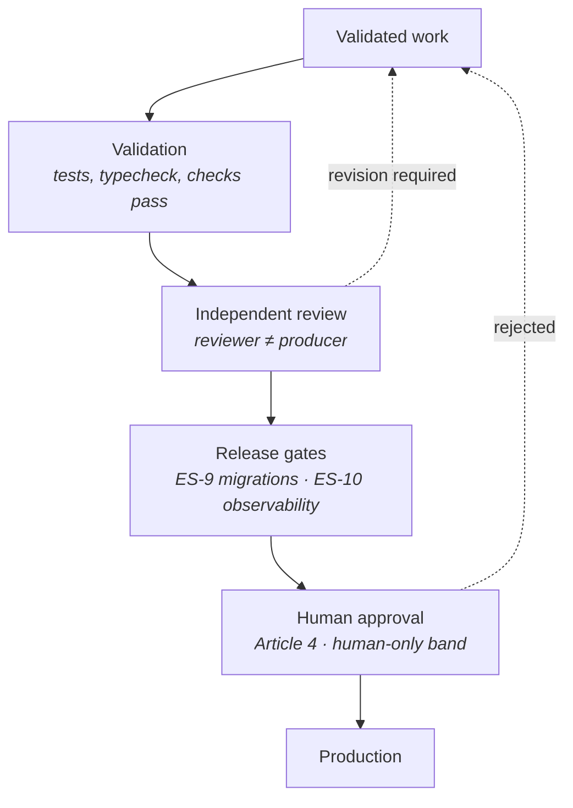

<Info>
**Status: Concept.** No deployment automation exists. This page states the boundary, the gates, and the authority rules that already bind them. It names **no cloud, platform, or vendor**, and does not claim an implemented deployment system — none is specified anywhere in this repository.
</Info>

## Purpose

Deployment is where a specification becomes a running system, and it is the point at which the
question *who is allowed to do this* stops being theoretical.

This page states two things: which deployments DevOS is responsible for, and which gates stand
between validated work and production.

## What DevOS does not deploy

The most important statement on this page is a negative one, and it is already normative:

> **Deployment is performed by the user's own toolchain.**
> — [AI Build Pipeline](/engines/build-pipeline)

The [Build Pipeline](/engines/build-pipeline) is the terminal engine in the chain. It **emits
work**; it does not execute it. Executing build units and writing code are explicit non-goals,
and [Mission](/constitution/mission) separately declines hosting or operating customer systems,
because operational ownership of customer workloads is a distinct business with distinct
liabilities.

| Deployment | Owner |
| --- | --- |
| **A customer's system** | The customer's own toolchain |
| **DevOS itself** | DevOS |

Everything below distinguishes these two, because conflating them would quietly expand DevOS's
scope into the business Mission declined.

## The customer boundary

DevOS's involvement in a customer deployment is bounded and indirect:

```text
Blueprint
  → Build Pipeline emits build units      (DevOS)
  → units export to a repository/tracker  (Repository plugin)
  → the customer's toolchain builds        (not DevOS)
  → the customer's toolchain deploys       (not DevOS)
```

Two capability classes touch this boundary, both through the
[Plugin System](/architecture/plugin-system):

| Class | Serves |
| --- | --- |
| **Repository** | Code hosting, branches, pull requests — where build units export |
| **Deployment provider** | Deployment targets and release operations |

<Note>
The Deployment provider class exists, and that is the extent of what the repository establishes.
No page specifies a deployment orchestration engine, a release pipeline DevOS runs, or an
environment model. **DevOS may be able to reach a deployment target through a plugin; that is not
the same as DevOS operating a deployment system**, and this page does not claim the latter.
</Note>

## Deploying DevOS itself

DevOS is a system, and the same constitution binds it.

| Requirement | Source |
| --- | --- |
| No capability reaches Beta or Production without logs, metrics, and an alert on the failure mode that would harm a user most | ES-10 |
| Every schema migration is reversible, or gated behind an explicit irreversibility acknowledgement recorded in the release record | ES-9 |
| Migrations are tested against production-shaped data volumes before release | ES-9 |
| Documentation accompanies behaviour | ES-12 |
| Status is declared honestly; promotion requires linked evidence | Article 5 |

ES-9 carries a clause worth surfacing, because it is the only place the repository discusses
tenancy and migration together:

> Under a per-tenant schema model, migration tooling MUST handle partial failure across tenants
> without leaving the estate in a mixed, unrecorded state.

That is **conditional**. It anticipates a per-tenant schema model without mandating one — the
tenancy storage strategy remains unspecified, as [Multi-tenancy](/architecture/multi-tenancy)
records. What it does establish unconditionally is that a partial migration leaving an unrecorded
mixed state is a failure mode the tooling must handle rather than a risk it may accept.

### Migration and immutability

Migrations interact with an unusual constraint. Decision records and audit events are immutable,
and **a record written under schema 1.2 must remain readable indefinitely**.

A migration therefore cannot normalise historical immutable records, because those records cannot
be rewritten. Readers handle every schema version ever written — see
[Data model](/architecture/data-model). "Migrate the old rows" is not available for those classes.

## Gates

Four gates stand between work and production. Each is stated elsewhere; this page collects them
in order.



| Gate | Requirement |
| --- | --- |
| **Validation** | Work satisfies its stated checks. Partial success is never reported as success — ES-8 |
| **Independent review** | Review is performed by a party other than the producer. An agent reviewing its own output provides assurance without independence — [Security Reviewer](/agents/security-reviewer) |
| **Release gates** | Migrations reversible or acknowledged (ES-9); observability present (ES-10) |
| **Human approval** | A person accepts the outcome |

A gate that the executing party can satisfy by asserting its own success is not a gate — the rule
[Processes](/library/processes) states, and the reason review is separate from production.

### Feature release eligibility

Where the [Feature Registry](/product/feature-registry) exists, a further distinction applies and
it is deliberately not a deployment concern:

**`IMPLEMENTED` and `AVAILABLE` are distinct.** Implementation means code exists; availability
means every required release gate passed. A feature can be deployed and still release-blocked
because a documentation, visibility, or changelog gate fails.

Deployment does not clear feature gates, and a completed deployment is not a release. Both are
Planned.

## Human authority

Deployment is where the distinction between capability and authority is sharpest, because the
tooling that can deploy can almost always deploy anything.

[Agentic Build Control](/product/agentic-build-control) places these in the band an agent **MUST
NOT** autonomously perform:

- merging to a protected or default branch;
- production deployment;
- destructive data migration;
- secret rotation or disclosure;
- deletion of production data;
- acceptance of a DevOS decision on behalf of a human.

And these in the **review gate**, requiring evaluation and possibly operator approval:

- changing deployment configuration;
- changing data schemas or migrations;
- changing authentication, permissions, security controls, or public APIs;
- pushing a branch or opening a pull request where repository policy requires approval.

Two observations. Every entry in the first list is an action a competent worker could technically
perform — **capability does not confer authority**, as
[Access control](/security/access-control) states. And the last entry of that list is not policy:
it restates AI-2, which is not configurable, not overridable by a confidence threshold, and not
bypassable in an automation context.

<Note>
**An incident does not relax these.** [Incident response](/security/incident-response) states it
directly: an emergency requiring action outside declared authority requires a human who holds
that authority, not a temporary elevation of an agent's.
</Note>

## Rollback

Where a deployed change causes a failure, **reverting precedes fixing**.

This is build-workflow discipline rather than architecture, and it is owned by
[MTTBuild](/library/skills) as a skill: a fix authored during an incident is authored by people
who do not yet know what happened, while reverting restores a known state and preserves the
ability to investigate.

Rollback interacts with ES-9. A reversible migration can be rolled back; one gated behind an
irreversibility acknowledgement cannot, which is precisely why the acknowledgement is recorded in
the release record rather than assumed.

## Frameworks may add gates

A [Framework](/frameworks/overview) may impose deployment obligations the baseline does not —
compliance sign-off, audit evidence, segregation of duties, or record-retention checks.

The composition rule is the one [Processes](/library/processes) already states: **a Framework
adds gates and never removes or weakens a baseline one.** Added gates are attributed to the
Framework that contributed them, and a contributed gate contradicting the baseline names the
conflict rather than resolving it.

[Fintech](/frameworks/fintech) and [Healthcare](/frameworks/healthcare) are the obvious cases.

## Reusable versus operational

| Git-canonical | Operational |
| --- | --- |
| A release [process](/library/processes) with its gates | Release records and their acknowledgements |
| A deployment or migration [skill](/library/skills) | Deployment history and current state |
| A migration-plan [template](/library/templates) | Environment configuration and credentials |
| This baseline | Build Runs, approvals, rollback events |

**The documentation repository is not a deployment mechanism and holds no deployment state.**
Release records, environment configuration, and credentials are operational.

## What this page does not specify

| Not specified | Why |
| --- | --- |
| Cloud, platform, or hosting vendor | None named anywhere in this repository |
| Environment model (dev/staging/production) | Not specified by any page |
| CI/CD system or pipeline definition | Not specified |
| Release cadence or versioning of the deployed product | Not specified |
| Deployment topology, regions, residency | Open in [Multi-tenancy](/architecture/multi-tenancy) and [Data protection](/security/data-protection) |
| Blue/green, canary, or progressive rollout | Not specified |

No implemented automated deployment system is claimed. Where a release record is referenced, it
is because ES-9 requires one — its form is not specified.

## Acceptance criteria

- DevOS executes no build unit and deploys no customer system.
- No agent performs a production deployment, protected-branch merge, or destructive migration.
- Every migration is reversible or carries a recorded irreversibility acknowledgement.
- No capability reaches Beta or Production without logs, metrics, and an alert.
- Review is performed by a party other than the producer.
- A deployment does not mark a feature available; release gates are evaluated separately.
- No Framework weakens a baseline deployment gate.

## Open questions

- What environment model does DevOS itself use, and is it part of the public specification or an
  operational detail?
- Does DevOS record deployments of *customer* systems as artefacts — the traceability direction
  in [Project state](/reference/project-state) implies it eventually might — or does the chain
  end at build units?
- What is the form of the release record ES-9 requires, and where does it live?
- Should deployment through a Deployment provider plugin be available at all in v1, given that
  the pipeline's non-goal is executing work?
- How does an organisation's deployment policy — which branches are protected, which approvals
  are required — reach Build Control's review gate? No page states where that policy is declared.

## Version history

| Version | Date | Change |
| --- | --- | --- |
| 1.0 | 2026-08-24 | Initial page. States the customer boundary, the four gates, human authority, and the release requirements from ES-9 and ES-10. |
