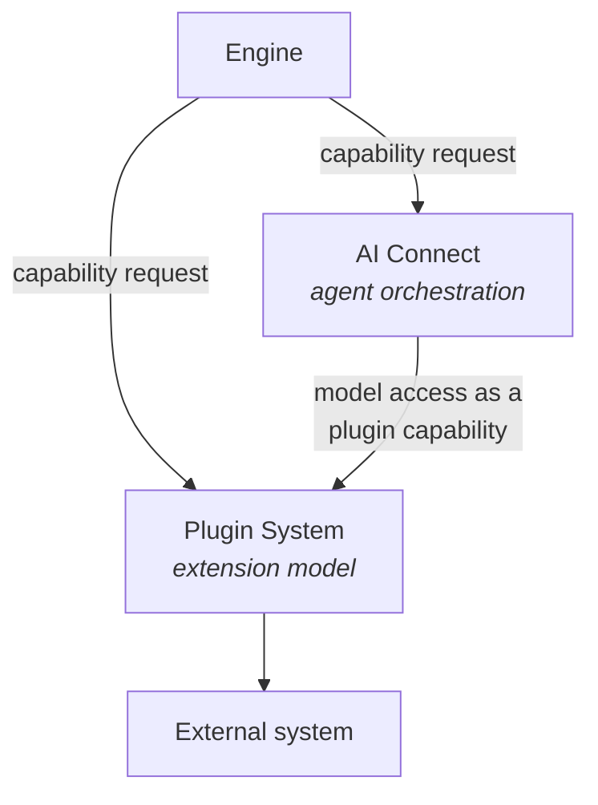

<Info>
**Status: Concept.** No integration is implemented. This page reconciles the two components that already exist — the [Plugin System](/architecture/plugin-system) and [AI Connect](/architecture/ai-connect) — into one model. It introduces **no second integration mechanism** and names **no vendor**, because none is named anywhere in this repository.
</Info>

## Purpose

DevOS reaches outside itself in two apparently different ways: it calls model providers to run
agents, and it calls repositories, deployment targets, databases, and communication platforms to
do everything else.

Those look like two integration stories. They are one, and this page states how they compose —
because a system that grows two integration models grows two credential handlers, two failure
semantics, and two places for a tenant-isolation defect.

## One rule

> **Integrations are plugins.** AI providers, deployment providers, repositories, databases,
> communication platforms, and authentication systems are implemented as plugins, not as
> hardcoded integrations in the core. **A new external system is a new plugin, not a change to
> DevOS.**

That rule is already normative in [System overview](/architecture/system-overview) and the
[Plugin System](/architecture/plugin-system). This page adds no exception to it.

**Everything DevOS does that reaches outside itself goes through a registered, installed
plugin.** There is no second path, and AI Connect is not one.

## Where AI Connect sits

AI Connect is frequently mistaken for a parallel integration layer because it clearly talks to
model providers. It does not talk to them directly.

| | AI Connect | Plugin System |
| --- | --- | --- |
| Orchestrates | Agent execution | Nothing — it resolves capabilities |
| Holds provider credentials | **No** | **Yes**, resolved at call time |
| Reaches external systems | **No** — through a plugin | Yes |
| Consumed by | Engines needing a model contribution | Engines and AI Connect |

AI Connect is a **consumer** of the Plugin System, specifically of the **AI provider** plugin
class. The Plugin System's own dependency table already records this: AI Connect depends on it
for model access.

The distinction in one line: **AI Connect decides which agent and contract version performs
work; the Plugin System decides how the call reaches a provider.** Neither does the other's job.

## The six plugin classes

A plugin declares exactly one class. Classes exist so capabilities are comparable — two AI
provider plugins provide the same capabilities and are interchangeable at the routing layer.

| Class | Serves | Consumed by |
| --- | --- | --- |
| **AI provider** | Model access | [AI Connect](/architecture/ai-connect) |
| **Deployment provider** | Deployment targets and release operations | [Deployment](/architecture/deployment) |
| **Repository** | Code hosting, branches, pull requests | [Build Pipeline](/engines/build-pipeline) export |
| **Database** | External data stores a customer system uses | Blueprint and pipeline context |
| **Communication** | Notification and messaging destinations | Product surface, workflow events |
| **Authentication** | Identity providers for organisation sign-in | [Authentication](/architecture/authentication) |

Six classes, fixed. Whether the set is extensible is an open question below; it is not
extensible today.

## Capabilities, not plugins

Consumers **discover capabilities, not plugins**. An engine requests a capability by name; it
does not know which plugin satisfies it, and neither does AI Connect when it requests model
access.

This indirection is what makes replaceability real rather than aspirational:

- **A provider can be swapped** without touching engine code, because no engine names one.
- **An agent's model can change** without an engine change — it becomes a registry and contract
  event, recorded in a decision record per AI-11.
- **An organisation can install a different plugin** in the same class and keep the same
  capabilities.

Where no registered plugin provides a requested capability, resolution **fails explicitly**. It
MUST NOT substitute a different capability, and a provider failure MUST NOT be silently rerouted
to another provider — either would change the work performed without the requester knowing.

## Registration and installation

The two are separate acts, and the separation is the tenancy pattern:

| Act | Scope | Carries |
| --- | --- | --- |
| **Registration** | Platform-wide, once | Manifest: identity, version, capabilities, permissions, configuration, dependencies |
| **Installation** | Per organisation, many times | That organisation's configuration and credentials |

A plugin is registered once and installed many times. Registration is a platform act;
installation is an organisation act — and the credential belongs to the latter, which is why no
credential exists at registration time.

Configuring an organisation's capability routing and installing plugins are **Admin**
capabilities.

## Trust and credentials

**A plugin is the least trusted component in the architecture.**

| Rule | Source |
| --- | --- |
| Plugin permissions are declared in the manifest, granted at installation, and **enforced outside the plugin** | [Plugin System](/architecture/plugin-system) |
| The Plugin System cannot be what guarantees tenant isolation | [System overview](/architecture/system-overview) |
| Provider credentials are held by the Plugin System and resolved at call time; no engine, agent, artefact, prompt, log, or audit event contains one | ES-7 |
| A plugin attempting a capability it was not granted emits `plugin.permission_violation` — a security event as well as an audit event | [Audit logging](/security/audit-logging) |

The second row is the architectural point. Isolation is enforced in the foundation, beneath the
platform layer, precisely because the component that reaches outside cannot be the component
that guarantees the boundary.

## Failure and degradation

External systems fail, and DevOS states what that must look like:

| Failure | Response |
| --- | --- |
| No registered plugin provides the capability | Explicit failure; MUST NOT substitute a different capability |
| Provider unavailable through its plugin | Explicit failure with cause; MUST NOT silently reroute to another provider |
| Required capability unavailable | Dependent engine operation fails explicitly; **no silent substitution** |
| Optional capability unavailable | **Degraded mode**, surfaced to affected users rather than hidden |

Degraded mode is the only case where DevOS continues without a capability, and it is surfaced
rather than absorbed. Everything else fails explicitly — ES-8.

## What is not an integration

Three things are sometimes filed here and belong elsewhere:

| Not an integration | What it is |
| --- | --- |
| **An agent** | A contracted AI component invoked through AI Connect. It reaches nothing itself |
| **A skill, process, or template** | A [Library asset](/library/asset-standard) — reusable knowledge, not a connection |
| **A build unit** | Work emitted by the [Build Pipeline](/engines/build-pipeline) and performed by the user's own toolchain |

The third matters for scope. The pipeline emits work; it does not execute it. DevOS integrating
with a repository to *export* build units is different from DevOS running a build, and only the
former is specified.

## Reusable versus operational

| Git-canonical | Operational |
| --- | --- |
| Plugin manifest requirements; this baseline | Plugin registrations and installations |
| An integration [skill](/library/skills) or [process](/library/processes) | Per-organisation configuration |
| Capability naming conventions | Credentials, resolved at call time |
| — | Health state, degraded-mode status, call records |

**The documentation repository is not where integration state lives.** Installations,
configuration, credentials, and health are operational.

## No vendors are named

No vendor, product, or service is named as canonical anywhere in this repository, and none is
named here.

This is a deliberate architectural property rather than an editorial choice: the framework
standard prohibits frameworks from naming vendors because a framework describes architecture,
not a stack, and vendor selection is a decision an adopting organisation records in its
[Decision Ledger](/engines/decision-ledger). The same reasoning applies to DevOS's own
integrations — naming one as canonical would make it structural rather than a recorded choice.

## Acceptance criteria

- No external system is reachable from DevOS except through a registered, installed plugin.
- AI Connect holds no provider credentials and constructs no provider call directly.
- No engine names a plugin or a provider; engines request capabilities by name.
- An unavailable capability fails explicitly or degrades visibly; it is never silently
  substituted.
- A plugin's permissions are enforced outside the plugin.
- No credential value appears in any artefact, log, envelope, or audit event.

## Open questions

- Is the six-class set extensible by an organisation, or fixed? Fixed keeps capabilities
  comparable; extensible accommodates systems that fit none of the six.
- Should the public API be a plugin host, so third parties can extend the API surface? Open in
  [System overview](/architecture/system-overview).
- Should framework library storage become a plugin capability, allowing organisation-hosted
  libraries? Open in [System overview](/architecture/system-overview) and
  [Framework Library](/frameworks/overview).
- Where are cost limits enforced for non-AI providers that also bill per call — AI Connect
  handles AI cost, and no page states the equivalent for other classes.

## Version history

| Version | Date | Change |
| --- | --- | --- |
| 1.0 | 2026-08-24 | Initial page. Reconciles the Plugin System and AI Connect into one integration model. |
