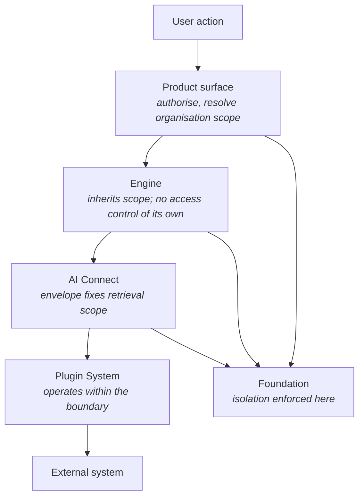

<Info>
**Status: Prototype.** Tenancy and identity are the most mature part of the foundation. The isolation requirements are constitutional and complete; the **storage strategy is not specified** by any page — no tenant database model, partitioning scheme, or row-level policy is named here.
</Info>

## Purpose

Article 7 states tenant isolation absolutely, and ES-2 states how it is achieved. Nearly every
other page inherits from those two. This page collects what the boundary is, what sits inside it,
and what every layer must do to preserve it.

## The organisation is the boundary

The **organisation** is the tenant boundary. It owns projects, members, and billing, and **all
data isolation is enforced here**.

There is exactly one tenant boundary. Projects are not tenants, workspaces are not tenants, and
users are not tenants — a point worth stating because all three are sometimes modelled as though
they were.

| Concept | Is it a boundary? | What it is |
| --- | --- | --- |
| **Organisation** | **Yes** | The tenant boundary. Isolation is enforced here. |
| Project | No | A scope *within* an organisation. Owns one brief, one ledger, zero or more blueprints. |
| Workspace | No | A member's **working context** — a view over what they can already reach |
| User account | No | May hold membership in several organisations, with a different role in each |

### Workspaces are views, not boundaries

There are exactly two workspaces — customer and admin. A workspace determines **what a member
sees and operates**, not what they may reach: reachability is already settled by organisation
scope and role.

Treating a workspace as an isolation boundary would create a second isolation mechanism, and a
second mechanism is a second place for a defect. There is one.

### Users span organisations; authority does not

A user account may belong to several organisations, holding a different role in each. **Roles
never span organisations.**

This is why authentication and authorisation are genuinely separable: recognising a user tells
you nothing about which organisation's data they may reach. Role resolution happens per
organisation, after identity.

## Isolation is structural

> **ES-2.** Every query, job, export, and retrieval MUST be scoped to an organisation before
> execution. Filtering results after retrieval MUST NOT be used as the isolation mechanism. Any
> data access interface that can be called without an organisation scope MUST NOT exist.

Three phrases carry the weight.

**Before execution.** The scope is part of constructing the access, not part of interpreting its
result. A query that runs and is then filtered has already read data it should not have reached.

**MUST NOT be used as the isolation mechanism.** Post-retrieval filtering may exist as a
convenience; it may not be what isolation depends on.

**MUST NOT exist.** The strongest of the three. It is not that an unscoped interface is
forbidden to callers — it is that the interface is not to be built. An access arriving without a
scope is therefore rejected **as a defect, not a permission denial**: a denial implies a
legitimate request lacking rights, while a missing scope indicates a code path ES-2 says should
not exist.

The scope applies to **background jobs, analytics, support tooling, and agent retrieval
equally**. Those four are named explicitly because they are the paths that historically bypass
tenancy: they run without a user in front of them.

## Scope is resolved once and carried

| Layer | Tenancy responsibility |
| --- | --- |
| Product surface | Resolves scope once, before invoking anything |
| Engine layer | **None of its own.** Engines perform no access control; they inherit the surface's authorisation |
| AI Connect | Fixes retrieval scope during envelope assembly, before retrieval runs |
| Plugin System | Operates within the boundary; does not implement one |
| Foundation | **Where isolation is actually enforced** |

**No layer may widen a scope it was given**, and no layer may be invoked without one.

Engines performing no access control reads as an omission and is deliberate: seven
implementations of the same check would be seven places for an isolation defect to appear.

**Isolation is a foundation property.** Neither AI Connect nor the Plugin System implements its
own isolation model — the Plugin System especially cannot, because a plugin is the least trusted
component in the architecture and cannot be what guarantees the boundary it operates inside.

## No cross-organisation permission exists

Invariant 4 in [Permissions](/product/permissions) is the strongest statement in the model:

> Cross-organisation access is not a permission that exists and MUST NOT be implementable as one.

This is stronger than "nobody holds it". A privilege nobody holds can be granted; a privilege
that does not exist cannot. No role elevation produces cross-organisation access, and no Owner,
Admin, or support path constitutes an exception.

Two consequences reach beyond storage:

- **No provider request contains data from more than one organisation** — AI-4. Isolation
  extends past DevOS's own boundary into what is transmitted externally.
- **No agent carries context between invocations for different organisations**, and no agent can
  construct a query spanning organisations.

## Tenancy across the platform

Every component states its own tenancy behaviour. Collected:

| Component | Behaviour |
| --- | --- |
| [AI Connect](/architecture/ai-connect) | Retrieval scope fixed at envelope assembly; execution authority never exceeds the triggering user's; resumption never widens scope |
| [Agents](/agents/overview) | Cannot span organisations, cannot carry context between organisations' invocations — AI-4 |
| [Plugin System](/architecture/plugin-system) | Registration is platform-wide; **installation is per organisation**, with that organisation's configuration and credentials |
| [Framework Library](/frameworks/overview) | Reference frameworks visible to all; adaptations and authored frameworks visible **only to the owning organisation** — Article 7 |
| [Agent registry](/agents/agent-standard) | DevOS agents available to all; an organisation's own agents visible only to it |
| [Agentic Build Control](/product/agentic-build-control) | Build Runs are organisation- and project-scoped — Planned |
| [Feature Registry](/product/feature-registry) | Feature records and entitlements are organisation-scoped — Planned |
| [Audit logging](/security/audit-logging) | Every audit query organisation-scoped before execution; cross-organisation audit access is not a permission |

The Plugin System row is the pattern worth generalising: **platform-wide registration, per-tenant
installation.** The same shape appears in the Framework Library and the agent registry — a
DevOS-provided thing is universal, and an organisation-provided thing is private to it.

### Adaptations carry organisational judgement

A framework adaptation encodes how one organisation builds. It MUST NOT be visible to,
retrievable by, or matched for another — and the framework standard separately prohibits
adaptations from containing client-identifying or project-specific content, because an
adaptation derived from one client's work would otherwise carry their context into another
client's project.

That second prohibition is a confidentiality rule *inside* a tenant, not just between tenants.

## Data model implications

Every tenant-scoped object carries an organisation reference — `organisation_id` is the most
frequently declared field in this repository, and that is not incidental.

| Rule | Consequence |
| --- | --- |
| A tenant-scoped object without an organisation reference is a modelling defect | There is no "global" project, brief, ledger, or Build Run |
| Framework versions carry a **nullable** organisation reference | Null means "DevOS reference, visible to all" — the one correct null |
| Audit events carry organisation | Audit queries are scoped like everything else |

See [Data model](/architecture/data-model).

## Storage strategy is not specified

**No page in this repository specifies how isolation is realised in storage**, and this page does
not choose.

Separate databases per tenant, a shared schema with a tenant column, schema-per-tenant,
row-level policy, or a combination would each satisfy ES-2 if — and only if — no interface exists
that can be called without a scope.

<Note>
The requirement is behavioural and the mechanism is implementation-defined. What ES-2 forbids is
*post-retrieval filtering as the isolation mechanism*; it does not mandate physical separation.
A shared store whose access layer cannot be invoked without a scope conforms; a physically
separated store reachable by an unscoped interface does not.
</Note>

Deployment topology is likewise unspecified — see [Deployment](/architecture/deployment).

## Reusable versus operational

| Git-canonical | Operational |
| --- | --- |
| This baseline; the isolation requirements | Organisations and their memberships |
| DevOS reference frameworks, agent contracts | Organisation adaptations and private agents |
| Skills, processes, templates | Projects, briefs, ledgers, Build Runs |
| Plugin manifest requirements | Plugin installations and their credentials |

Reference material is universal and Git-backed. Everything tenant-specific is operational, and
the documentation repository is not its storage.

## Acceptance criteria

- No data access interface exists that can be called without an organisation scope.
- No query, job, export, analytics path, support tool, or agent retrieval crosses an
  organisation boundary, verified by test.
- No role elevation produces cross-organisation access.
- No layer widens a scope it was given.
- No provider request contains data from more than one organisation.
- A framework adaptation or private agent belonging to one organisation is never retrievable by
  another, verified by test.
- An access arriving without a scope is rejected as a defect, not as a permission denial.

## Open questions

- What storage strategy is adopted, and is it uniform across object classes? Audit events and
  decision records have different immutability needs from projects.
- How is a support or operator path scoped when the operator is not a member of the organisation
  being supported? No page describes one, and ES-2 admits no exception.
- What happens to an organisation's data on deletion, given that decision records and audit
  events are immutable by construction? Open in [Data model](/architecture/data-model).
- Should a workspace ever constrain reachability, or only presentation? It is currently a view;
  making it a constraint would introduce a second mechanism.

## Version history

| Version | Date | Change |
| --- | --- | --- |
| 1.0 | 2026-08-24 | Initial page. States the organisation boundary, structural scoping, and per-component tenancy behaviour. |
