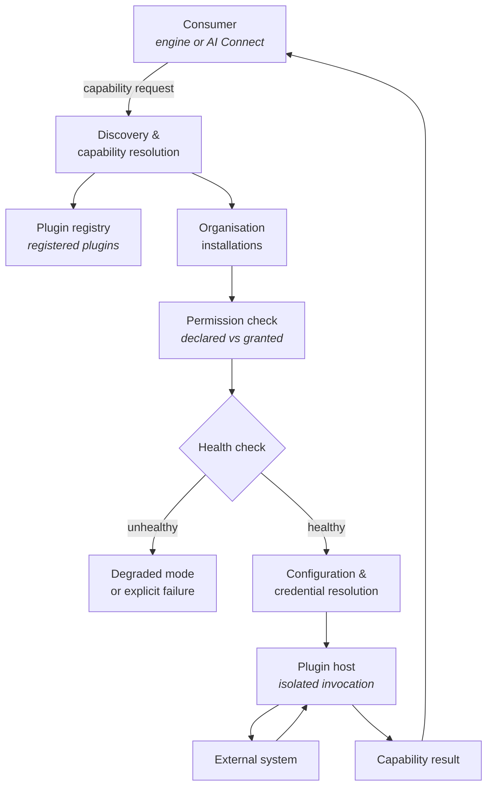
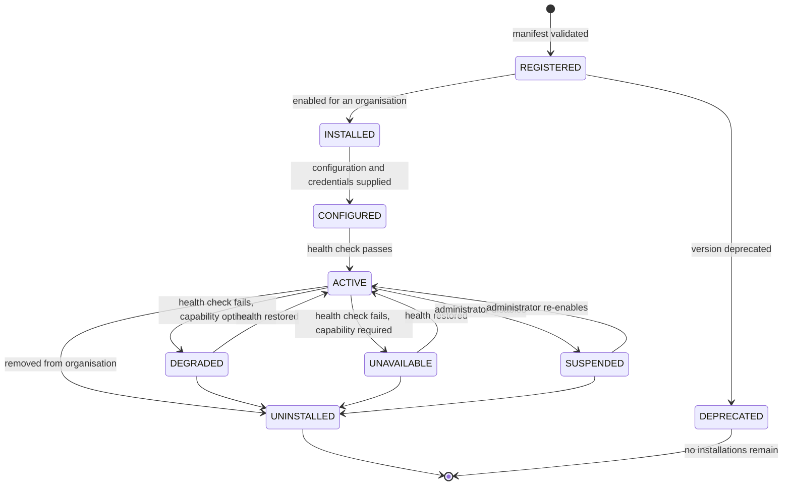

<Info>
**Status: Concept.** No implementation exists. This page defines the concepts, responsibilities,
and boundaries of the Plugin System. It deliberately contains no implementation detail — manifest
schemas, interfaces, and packaging will follow in a separate specification once the concepts are
settled.
</Info>

## Purpose

The Plugin System is the extension model through which DevOS connects to every external system.

The governing rule:

<Note>
**Integrations are plugins.** AI providers, deployment providers, repositories, databases,
communication platforms, and authentication systems are implemented as plugins, not as hardcoded
integrations in the core. Adding an external system is adding a plugin, not changing DevOS.
</Note>

Every external dependency has the same shape: credentials, configuration, health, versioning,
failure semantics. Built one at a time into the core, each becomes a separate place for a
credential-handling defect and a separate failure model to reason about. The Plugin System makes
that shape explicit once.

## Goals

- Provide one model for every external connection DevOS makes.
- Keep credentials out of the core, out of engines, and out of artefacts.
- Allow an organisation to add, replace, or remove a provider without a DevOS change.
- Make plugin failure a bounded, observable condition rather than a core outage.

## Non-goals

- Being an engine. Plugins transform no workflow artefact — see
  [System overview](/architecture/system-overview).
- Guaranteeing tenant isolation. Isolation is a foundation property; plugins operate within it.
  See the security boundary below.
- Extending the product surface or the engine chain. Plugins provide capabilities to DevOS; they
  do not add workflow stages.
- Being a general-purpose runtime for user code.

## Definitions

| Term | Meaning |
| --- | --- |
| **Plugin** | A registered, versioned extension providing one or more capabilities to DevOS. |
| **Plugin class** | The category of external system a plugin serves — AI provider, deployment, repository, database, communication, authentication. |
| **Capability** | A named unit of work a plugin provides. Consumers request capabilities, not plugins. |
| **Manifest** | A plugin's declaration of identity, version, capabilities, permissions, configuration, and dependencies. |
| **Registration** | Making a plugin known to DevOS. Distinct from installation into an organisation. |
| **Installation** | Enabling a registered plugin for a specific organisation, with configuration and credentials. |
| **Plugin host** | The component that loads, isolates, and invokes plugins. |
| **Health** | A plugin installation's current ability to serve its capabilities. |
| **Degraded mode** | Operation with a plugin unavailable, where the dependent capability is optional. |

## Plugin classes

| Class | Serves | Consumed by |
| --- | --- | --- |
| **AI provider** | Model access | [AI Connect](/architecture/ai-connect) |
| **Deployment provider** | Deployment targets and release operations | Build pipeline consumers, [Deployment](/architecture/deployment) |
| **Repository** | Code hosting, branches, pull requests | [AI Build Pipeline](/engines/build-pipeline) export |
| **Database** | External data stores a customer system uses | Blueprint and pipeline context |
| **Communication** | Notification and messaging destinations | Product surface, workflow events |
| **Authentication** | Identity providers for organisation sign-in | [Authentication](/architecture/authentication) |

The classes exist so that capabilities are comparable: two AI provider plugins provide the same
capabilities and are interchangeable at the routing layer. A plugin declares exactly one class.

## Responsibilities

### Registration and discovery

**Registration** makes a plugin known to DevOS, with its manifest validated. **Installation**
enables a registered plugin for one organisation, with that organisation's configuration and
credentials. The two are separate because a plugin is registered once and installed many times,
and because registration is a platform act while installation is an organisation act.

Consumers **discover capabilities, not plugins**. An engine requests a capability by name; the
Plugin System resolves which installed plugin provides it. This indirection is what makes
providers replaceable: swapping one AI provider plugin for another changes no consumer.

Where no installed plugin provides a requested capability, discovery MUST fail explicitly. It
MUST NOT substitute a different capability or a different plugin class.

### Manifests and declared permissions

A plugin's **manifest** declares its identity, version, class, capabilities provided,
permissions required, configuration expected, and dependencies.

Permissions are **declared by the plugin and granted by the organisation**. A plugin MUST NOT
receive a permission it did not declare, and MUST NOT exercise one that was not granted. Grants
are explicit — installation is not blanket consent to everything a manifest requests.

Declared permissions are visible to the administrator granting them, in terms of what the plugin
will be able to reach. A permission model an administrator cannot understand is not a permission
model.

### Configuration and credentials

Configuration and credentials belong to an **installation**, not to a plugin and not to the core.

Credentials are held by the Plugin System and resolved at call time. No engine, agent, artefact,
prompt envelope, result envelope, log, or audit event contains a credential value — ES-7. A
plugin receives the credential it needs at the moment of the call and does not persist it.

This is the main reason the Plugin System exists as a boundary: it is the only place in DevOS
that holds external credentials, so it is the only place that has to get their handling right.

### Health

Every installation has a **health** state. Health is checked before invocation and tracked over
time, because an integration that fails intermittently is a different operational problem from
one that fails outright.

Where a plugin serving an optional capability is unhealthy, DevOS MAY operate in **degraded
mode** with that capability unavailable and the degradation surfaced. Where the capability is
required for the operation in progress, the operation MUST fail explicitly. Per ES-8, DevOS MUST
NOT silently substitute a different plugin or continue as though the capability had succeeded.

Degradation MUST be visible. A user whose notification plugin is failing needs to know their
notifications are not arriving.

### Versioning and dependency management

Plugins are versioned. An installation pins a version, so a plugin update does not change an
organisation's behaviour without an explicit act.

Plugins may declare dependencies on capabilities provided by other plugins. The Plugin System
resolves these at installation, and MUST refuse an installation whose dependencies cannot be
satisfied rather than installing a plugin that will fail at call time.

Dependency cycles MUST be rejected at registration.

Where a plugin version is deprecated, existing installations continue on their pinned version.
Deprecation does not alter behaviour retroactively — the same principle as framework version
pinning in the [Decision Ledger](/engines/decision-ledger).

### Isolation

Plugins are the **least trusted component** in the architecture. The plugin host isolates plugin
execution so that a failing, slow, or hostile plugin cannot compromise DevOS or reach data
outside its grant.

Three limits are absolute:

| Limit | Source |
| --- | --- |
| A plugin operates within one organisation's scope per invocation and cannot widen it | Article 7 |
| A plugin cannot reach data it was not granted access to | Declared-and-granted permissions |
| A plugin cannot accept a decision, alter a ledger record, or write to the audit log | Article 4, AI-2, ES-5 |

The Plugin System does not *implement* tenant isolation — that is a foundation property, enforced
beneath it. Plugins operate within a boundary they cannot influence. This ordering matters: if
isolation depended on plugin cooperation, the least trusted component would be enforcing the most
important guarantee.

## Lifecycle

| State | Capabilities served | Notes |
| --- | --- | --- |
| `REGISTERED` | No | Known to DevOS, not enabled anywhere |
| `INSTALLED` | No | Enabled for an organisation, not yet configured |
| `CONFIGURED` | No | Awaiting first successful health check |
| `ACTIVE` | Yes | Normal operation |
| `DEGRADED` | Partially | Optional capability unavailable, degradation surfaced |
| `UNAVAILABLE` | No | Required capability unavailable; dependent operations fail explicitly |
| `SUSPENDED` | No | Administrator-disabled |
| `UNINSTALLED` | No | Removed; credentials destroyed |
| `DEPRECATED` | Existing installations only | No new installations permitted |

Uninstalling destroys the installation's credentials. It does not alter artefacts produced while
the plugin was active — those retain their attribution, including the plugin and version that
served them.

## Permissions

| Action | Minimum role |
| --- | --- |
| Use a capability indirectly, through an engine action | The role required for that engine action |
| View installed plugins and their health | Admin |
| Install a plugin for an organisation | Admin |
| Grant declared permissions to a plugin | Admin |
| Supply or rotate plugin credentials | Admin |
| Pin or change an installation's plugin version | Admin |
| Suspend or uninstall a plugin | Admin |
| Register a plugin with DevOS | Platform operation, not an organisation role |
| Read plugin attribution on an artefact | Viewer |

Plugin administration is an [admin workspace](/product/admin-workspace) concern. Contributors use
capabilities without knowing which plugin serves them.

## Security considerations

- **Credentials live here and nowhere else.** The Plugin System is the only component holding
  external credentials, resolved at call time and never persisted by the plugin — ES-7.
- **Declared and granted.** A plugin receives only permissions it declared and an administrator
  granted. Installation is not blanket consent.
- **Isolation is beneath, not within.** Tenant isolation is enforced by the foundation. A plugin
  cannot widen its organisation scope because it does not control it — Article 7.
- **Plugins cannot write history.** No plugin may accept a decision, alter a ledger record, or
  write an audit event. Audit events about plugin activity are written by DevOS, not by plugins —
  ES-5.
- **Provider responses are untrusted.** Content returned by a plugin is data, not instruction —
  AI-10. This applies to AI provider responses reaching [AI Connect](/architecture/ai-connect) and
  to any other provider's output.
- **Degradation is visible.** A silently degraded integration is a security problem as well as an
  operational one, because it can mean notifications, audit exports, or authentication checks are
  not happening.
- **Uninstall destroys credentials.** Removal is not merely disabling.

## Failure modes

| Failure | Response |
| --- | --- |
| No installed plugin provides the requested capability | Explicit failure; MUST NOT substitute another capability |
| Manifest invalid at registration | Registration refused; the invalid declarations named |
| Dependency cannot be satisfied at installation | Installation refused; MUST NOT install a plugin that will fail at call time |
| Dependency cycle declared | Rejected at registration |
| Permission exercised that was declared but not granted | Call refused; security event recorded |
| Permission exercised that was never declared | Call refused; security event recorded |
| Health check fails, capability optional | `DEGRADED`; degradation surfaced to affected users |
| Health check fails, capability required | `UNAVAILABLE`; dependent operations fail explicitly |
| Plugin call times out or errors | Bounded failure; MUST NOT silently reroute to another plugin |
| Plugin attempts to reach another organisation's data | Blocked by the foundation; security event recorded |
| Plugin attempts to write an audit event or ledger record | Refused; security event recorded |
| Credential invalid or expired | `UNAVAILABLE` with cause; MUST NOT retry indefinitely |
| Pinned version no longer registered | Installation flagged; MUST NOT auto-upgrade to a newer version |

## Audit events

| Event | Emitted when |
| --- | --- |
| `plugin.registered` | A plugin or version is registered |
| `plugin.installed` | A plugin is installed for an organisation |
| `plugin.permission_granted` | An administrator grants a declared permission |
| `plugin.configured` | Configuration or credentials are supplied or rotated |
| `plugin.health_changed` | An installation changes health state |
| `plugin.suspended` | An installation is suspended or re-enabled |
| `plugin.uninstalled` | An installation is removed and credentials destroyed |
| `plugin.permission_violation` | A plugin attempts an ungranted or undeclared action |
| `plugin.version_changed` | An installation's pinned version changes |

Each records actor, organisation, plugin identity and version, capability where applicable,
outcome, and timestamp. No event contains a credential value. Permission violations are security
events as well as audit events — see [Audit logging](/security/audit-logging).

## Dependencies

| Depends on | Nature |
| --- | --- |
| Foundation: tenancy and identity | Isolation and role resolution the Plugin System operates within |
| [Secrets management](/security/secrets-management) | Credential storage and rotation |
| [Audit logging](/security/audit-logging) | Events about plugin activity, written by DevOS |

**Depended on by:** [AI Connect](/architecture/ai-connect) (model access as an AI provider
capability), [Authentication](/architecture/authentication) (identity providers),
[Deployment](/architecture/deployment), [Integrations](/architecture/integrations), and
[AI Build Pipeline](/engines/build-pipeline) export.

## Acceptance criteria

- No external system is reachable from DevOS except through a registered, installed plugin.
- No credential value appears in an engine, agent, artefact, envelope, log, or audit event.
- A plugin cannot exercise a permission it did not declare and was not granted.
- A plugin cannot widen its organisation scope, verified by test.
- No plugin can accept a decision, alter a ledger record, or write an audit event.
- Capability discovery resolves capabilities, not plugin identities, for consumers.
- An installation whose dependencies cannot be satisfied is refused at installation time.
- Deprecating a version does not alter existing installations.
- A required-capability failure fails the dependent operation explicitly; an optional-capability
  failure degrades visibly.
- Uninstalling destroys credentials without altering artefacts the plugin contributed to.

## Open questions

- Should third parties be able to author plugins, or is registration a DevOS-only operation
  initially? This determines how much isolation hardening is required before the system leaves
  Concept status.
- Should organisations be able to install plugins DevOS has not registered — a private plugin
  path — and what validation would that require?
- Should the Framework Engine's library storage become a plugin capability, allowing
  organisation-hosted framework libraries? Also open in
  [System overview](/architecture/system-overview).
- How should a plugin serving a capability mid-execution be handled when an administrator suspends
  it? Fail in flight, or complete the current call?
- Should plugin classes be extensible, or is the fixed set of six sufficient? A fixed set makes
  capabilities comparable; an extensible set accommodates systems that fit none of the six.
- Where should cost limits be enforced for non-AI plugins that bill per call? Also open in
  [AI Connect](/architecture/ai-connect).

## Version history

| Version | Date | Change |
| --- | --- | --- |
| 1.0 | 2026-07-30 | Initial page. Introduces the Plugin System as a platform-layer concept. |
