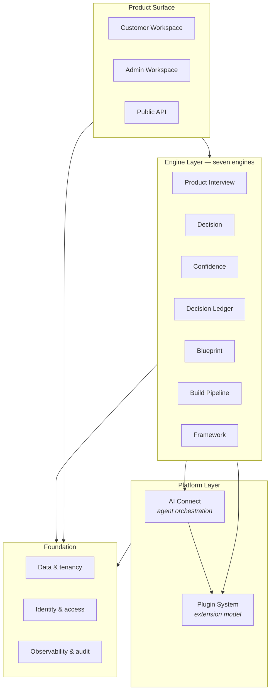
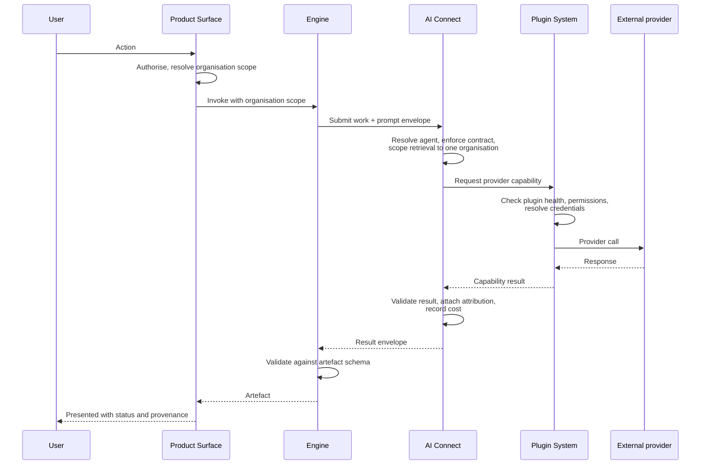

<Info>
**Status: Concept.** This page describes the intended platform architecture. Implemented
components are noted individually; where a layer is unbuilt, this page describes intent, not
current behaviour.
</Info>

## Purpose

This page describes how the DevOS platform is structured: the layers, what each is responsible
for, and the boundaries between them. It is the anchor for the rest of the Architecture section.

DevOS has four layers. Two of them — **AI Connect** and the **Plugin System** — are platform
capabilities rather than parts of the product workflow, and everything DevOS does that reaches
outside itself goes through one of them.

## The four layers

| Layer | Responsibility | Specification |
| --- | --- | --- |
| **Product surface** | What a user operates | [Product overview](/product/overview) |
| **Engine layer** | Transforms one artefact into the next | [Core Engines](/engines/overview) |
| **Platform layer** | Agent orchestration and extension | [AI Connect](/architecture/ai-connect), [Plugin System](/architecture/plugin-system) |
| **Foundation** | Tenancy, identity, observability, audit | [Data model](/architecture/data-model), [Authentication](/architecture/authentication), [Multi-tenancy](/architecture/multi-tenancy), [Observability](/architecture/observability) |

## Why the platform layer exists

Before AI Connect and the Plugin System, DevOS had two structural problems in prospect:

**Every engine would call models directly.** Five of the seven engines invoke AI. Without a
common orchestration layer, each would separately implement agent invocation, retrieval scoping,
attribution, failure handling, and cost accounting — and each would be a separate place for a
tenant-isolation defect to appear. The [AI standards](/constitution/ai-standards) would be
enforced five times, inconsistently.

**Every external system would be a hardcoded integration.** AI providers, deployment targets,
repositories, databases, communication platforms, and authentication systems are all external
dependencies with the same shape: credentials, configuration, health, versioning, failure. Built
one at a time into the core, each would carry its own credential handling and its own failure
semantics.

The platform layer answers both: **one place where DevOS invokes AI, one place where DevOS
reaches anything external.**

## AI Connect

AI Connect is the orchestration layer between DevOS and AI agents. Engines do not call models;
they submit work to AI Connect, which resolves an agent, enforces the agent contract, scopes
retrieval to a single organisation, tracks execution, and returns a result with attribution
attached.

It is responsible for the agent registry, capability routing, prompt envelopes, execution
tracking, resumable sessions, result envelopes, permissions, cost tracking, and multi-agent
workflows.

Critically, AI Connect is the **single enforcement point** for the AI standards. Article 4 and
AI-2 — that no agent may accept a decision — are enforced there rather than trusted to each
engine.

See [AI Connect](/architecture/ai-connect).

## Plugin System

The Plugin System is the extension model for everything DevOS connects to. It defines plugin
lifecycle, registration, permissions, health, configuration, versioning, dependency management,
and discovery.

The governing rule is stated once and applies everywhere:

<Note>
**Integrations are plugins.** AI providers, deployment providers, repositories, databases,
communication platforms, and authentication systems are implemented as plugins, not as hardcoded
integrations in the core. A new external system is a new plugin, not a change to DevOS.
</Note>

See [Plugin System](/architecture/plugin-system).

## What the platform layer is not

Both concepts are frequently mistaken for engines. They are not, and the distinction is load
bearing.

| | Engines | Platform layer |
| --- | --- | --- |
| Transform an artefact into the next | Yes | No |
| Appear in the workflow chain | Yes | No |
| Produce something a user accepts | Yes | No |
| Invoked by engines | No | Yes |

There are still **seven engines**. AI Connect and the Plugin System are platform capabilities
that engines use. Counting them as engines would break the artefact chain described in
[Core Engines Overview](/engines/overview), because neither consumes or produces a workflow
artefact.

## How a request flows

Two properties of this flow are constitutional requirements rather than design preferences:

- The organisation scope is resolved at the surface and carried through every layer. No layer may
  widen it, and no layer may be invoked without it — Article 7 and ES-2.
- Attribution is attached by AI Connect, not by the engine. An engine cannot present generated
  content as user-authored because it never holds unattributed output — AI-3.

## Layer boundaries

| Boundary | Rule |
| --- | --- |
| Surface → Engine | Authorisation and organisation scope resolved before invocation. Engines perform no access control of their own. |
| Engine → AI Connect | Engines submit work; they do not select models, hold credentials, or construct provider calls. |
| Engine → Plugin System | Engines request capabilities by name. They do not know which plugin satisfies a capability. |
| AI Connect → Plugin System | AI Connect obtains model access as a plugin capability. It does not hold provider credentials. |
| Platform → Foundation | Tenancy, identity, and audit are enforced beneath the platform layer, not by it. |

The last row matters most: the Plugin System cannot be the thing that guarantees tenant
isolation, because plugins are the least trusted component in the system. Isolation is enforced
in the foundation, and the Plugin System operates within it.

## Foundation

| Concern | Requirement | Specification |
| --- | --- | --- |
| Tenancy | Every access organisation-scoped before execution, by construction | [Multi-tenancy](/architecture/multi-tenancy) |
| Data | Immutability enforced at the storage layer, not by convention | [Data model](/architecture/data-model) |
| Identity | Roles resolved per organisation; no cross-organisation permission exists | [Authentication](/architecture/authentication) |
| Observability | Structured logs, metrics, alerts before Beta | [Observability](/architecture/observability) |
| Audit | Every mutating operation and every denial recorded, append-only | [Audit logging](/security/audit-logging) |

## Status

| Component | Status |
| --- | --- |
| Engine layer | Prototype to Concept, varying by engine — see [Core Engines](/engines/overview) |
| AI Connect | Concept |
| Plugin System | Concept |
| Data and tenancy | Prototype |
| Identity and access | Prototype |
| Observability and audit | Planned |
| Public API | Concept |

The authoritative capability status table is on the [documentation homepage](/).

## Security considerations

- **Isolation is a foundation property.** Neither AI Connect nor the Plugin System may implement
  its own isolation model; both operate within the boundary the foundation enforces — Article 7.
- **Plugins are untrusted.** A plugin is the least trusted component in the architecture. Plugin
  permissions are declared, granted, and enforced outside the plugin — see
  [Plugin System](/architecture/plugin-system).
- **Credentials never reach engines.** Provider credentials are held by the Plugin System and
  resolved at call time. No engine, agent, artefact, prompt, log, or audit event contains a
  credential value — ES-7.
- **Content crossing a layer is data, not instruction.** Retrieved artefacts and provider
  responses may contain directives; no layer acts on them — AI-10.

## Acceptance criteria

- No engine constructs a provider call or holds a provider credential.
- No engine invokes a model except through AI Connect.
- No external system is reachable except through a registered plugin.
- Organisation scope is resolved once at the surface and is required by every layer beneath it.
- No layer can widen an organisation scope it was given.
- Generated content carries attribution attached by AI Connect before an engine receives it.
- The engine count remains seven; neither platform component appears in the artefact chain.

## Open questions

- Should the Framework Engine's library storage be a plugin capability, allowing organisations to
  host their own framework libraries? This would extend the plugin model into the engine layer.
- Should the public API be a plugin host, so third parties can extend the API surface, or remain a
  fixed surface?
- Where should cost limits be enforced — AI Connect alone, or jointly with the Plugin System for
  non-AI providers that also bill per call?

## Version history

| Version | Date | Change |
| --- | --- | --- |
| 1.0 | 2026-07-30 | Initial page, introducing the platform layer, AI Connect, and the Plugin System. |
