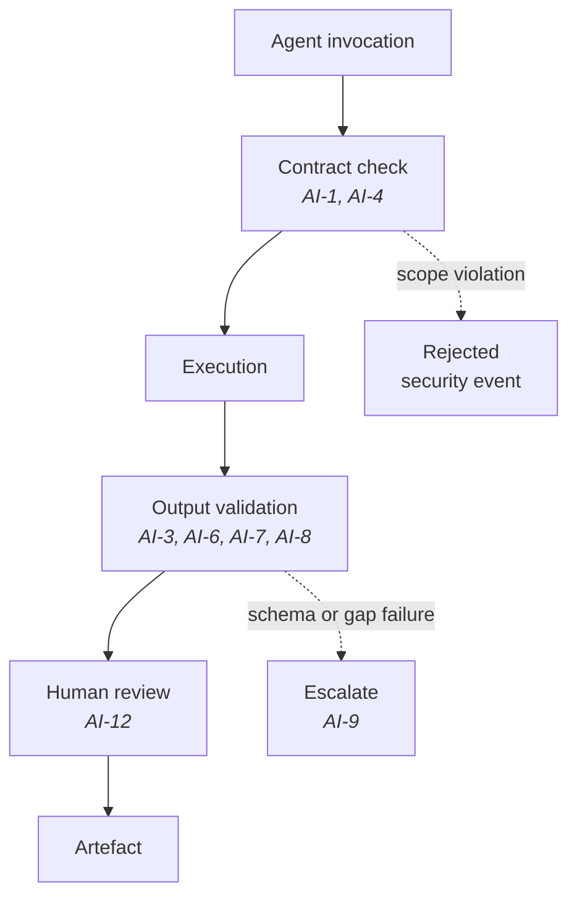

## Purpose

These standards constrain how AI operates inside DevOS: what agents may do, what they must
disclose, and where their authority ends. They derive from
[Principles](/constitution/principles), particularly Articles 1, 4, 8, and 9.

## Scope

Applies to: every AI agent invoked by a DevOS engine, every model call made on a user's
behalf, and every generated artefact. Does not apply to: AI tools a customer chooses to use
on their own code, or the internal behaviour of models we do not control.

## AI-1 — Agents act under a published contract

Every agent **MUST** have a published contract stating its permitted inputs, output schema,
authority limits, escalation path, and failure behaviour.

An agent **MUST NOT** be invoked in production without a contract conforming to
[Agent standard](/agents/agent-standard). An agent **MUST NOT** widen its own scope, invoke
another agent outside its declared composition, or accept input outside its declared input
set.

## AI-2 — Agents never accept decisions

No agent **MAY** convert a recommendation into a decision record, alter an existing record,
or mark an artefact as accepted.

Agents draft, score, summarise, and propose. Acceptance requires an identified human. This
limit **MUST NOT** be configurable, overridable by a confidence threshold, or bypassable in
an automation context.

See Article 4 in [Principles](/constitution/principles).

## AI-3 — Output is attributed

Every generated artefact or artefact fragment **MUST** carry attribution recording:

| Field | Content |
| --- | --- |
| Agent | The agent identity and contract version |
| Model | Provider and model identifier |
| Invocation context | The engine and workflow stage that invoked it |
| Inputs referenced | The artefact versions the agent read |
| Timestamp | When the output was produced |

Generated content **MUST NOT** be presented as user-authored, and user-authored content
**MUST NOT** be presented as generated. Where an artefact mixes both, the boundary **MUST**
be recoverable.

## AI-4 — Retrieval is organisation-scoped before it runs

An agent's retrieval context **MUST** be scoped to a single organisation before retrieval
executes.

Post-retrieval filtering **MUST NOT** be used as the isolation mechanism. An agent **MUST
NOT** be able to construct a query spanning organisations, and **MUST NOT** carry context
between invocations for different organisations.

Model providers **MUST NOT** be sent data from more than one organisation in a single request.

See Article 7 in [Principles](/constitution/principles) and
[Multi-tenancy](/architecture/multi-tenancy).

## AI-5 — Confidence is computed, not asserted

Confidence scores **MUST** be produced by the deterministic scoring model specified in
[Architecture Confidence Engine](/engines/architecture-confidence-engine).

A model **MUST NOT** be asked to state its own confidence as the score of record. A model
**MAY** contribute evidence assessments that the scoring model consumes as inputs, provided
those inputs are recorded alongside the resulting score.

**Rationale.** Self-reported model confidence is not calibrated against outcomes. A score
that cannot be reproduced cannot be audited, and a score that cannot be audited cannot be
calibrated.

## AI-6 — Evidence gaps are named, not smoothed

An agent **MUST NOT** fill a declared unknown with a plausible value.

Where an agent lacks information required to complete its task, it **MUST** emit a named gap
and **MUST NOT** produce a completed artefact as though the gap were closed. Generated text
**MUST NOT** describe a constraint the input did not contain.

## AI-7 — No fabricated specifics

Generated artefacts **MUST NOT** contain invented statistics, benchmark figures, customer
names, testimonials, version numbers, citations, or capability claims.

Where an agent would need a specific it does not have, it **MUST** emit a gap. Fabricated
specifics **MUST** be treated as defects of the same severity as an incorrect calculation,
not as stylistic issues.

## AI-8 — Determinism where structure is at stake

Model output **MUST NOT** determine artefact structure, ledger state transitions, or
compilation ordering.

A model's contribution **MUST** be confined to content within a structure the deterministic
layer has already fixed. Where a model is used in a compilation step, repeated runs **MUST**
produce identical structural output.

See ES-3 in [Engineering standards](/constitution/engineering-standards).

## AI-9 — Failures escalate rather than approximate

When an agent cannot complete its task within its contract, it **MUST** return an explicit
failure with a stated cause and escalate per its contract.

An agent **MUST NOT** return a partial artefact presented as complete, substitute a simpler
task it can accomplish, or retry indefinitely. Partial output **MUST** be marked incomplete
and **MUST NOT** be consumable downstream.

## AI-10 — Prompt inputs are treated as untrusted

Content originating from users, retrieved artefacts, or external sources **MUST** be treated
as data, not as instructions.

An agent **MUST NOT** act on directives embedded in the content it processes. Instructions
that would widen authority, alter output schema, disable a check, or change retrieval scope
**MUST** be ignored and **SHOULD** be recorded as a security event.

See [Access control](/security/access-control).

## AI-11 — Model changes are governed

Changing the model backing an agent **MUST** be recorded in a decision record and reflected
in the agent's contract version.

Where an agent contributes to confidence scoring, a model change **MUST** be accompanied by
a re-check of calibration before the change reaches Production.

## AI-12 — Human review scales with consequence

The review required of agent output **MUST** scale with the consequence of that output being
wrong:

| Agent output | Required review |
| --- | --- |
| Drafted brief section | Contributor review before brief completion |
| Recommendation and evidence assessment | Contributor review at confidence review |
| Decision record draft | Explicit human acceptance — see AI-2 |
| Blueprint content | Contributor review before pipeline compilation |
| Build unit prompt | Review proportionate to the unit's blast radius |
| Security-relevant assessment | Engineering owner review, per [Security reviewer](/agents/security-reviewer) |

## Enforcement

## Acceptance criteria

- No agent runs in production without a published contract.
- No code path lets an agent create or alter an accepted decision record.
- Every generated artefact carries complete AI-3 attribution.
- Retrieval contexts are organisation-scoped before execution, verified by test.
- Confidence scores are reproducible from recorded inputs.
- Agent output containing a fabricated specific is treated as a blocking defect.

## Open questions

- What calibration evidence should AI-11 require before a model change reaches Production?
- Should AI-10 security events block the invocation, or record and continue with the
  directive ignored?
- How should AI-12's "blast radius" for build units be determined — by module criticality, by
  data sensitivity, or both?

## Version history

| Version | Date | Change |
| --- | --- | --- |
| 1.0 | 2026-07-29 | Initial standards ratified. |
