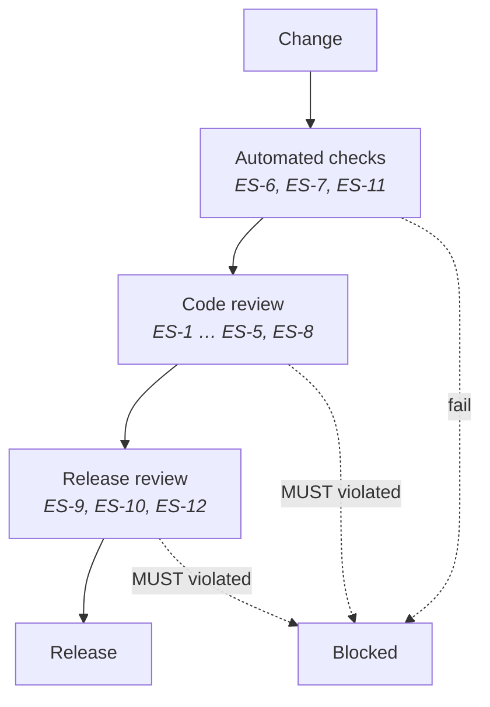

## Purpose

These standards constrain how DevOS is built and operated. They derive from
[Principles](/constitution/principles) and apply to the DevOS platform itself — not to
systems DevOS helps customers design.

## Scope

Applies to: DevOS application code, data stores, infrastructure, deployment pipelines, and
operational practice. Does not apply to: example code in documentation (held to the standard
in [SECURITY.md](https://github.com/MacroTechTitan/devos-docs/blob/main/SECURITY.md)), or
customer implementations.

## ES-1 — Immutability is enforced at the storage layer

Immutability of accepted decision records **MUST** be enforced below the application layer,
not by application convention alone.

Substantive fields of an accepted record **MUST NOT** be updatable. Supersession **MUST** be
implemented as insertion plus a pointer, never as an update. Deletion of an accepted record
**MUST NOT** be reachable from application code.

**Rationale.** An immutability guarantee that depends on every code path remembering it will
eventually be broken by a code path that forgot.

## ES-2 — Tenant scoping is structural

Every query, job, export, and retrieval **MUST** be scoped to an organisation before
execution.

Filtering results after retrieval **MUST NOT** be used as the isolation mechanism. Any data
access interface that can be called without an organisation scope **MUST NOT** exist. This
applies to background jobs, analytics, support tooling, and AI agent retrieval equally.

See [Multi-tenancy](/architecture/multi-tenancy) and Article 7 in
[Principles](/constitution/principles).

## ES-3 — Compilation is deterministic

Artefact compilation — ledger to blueprint, blueprint to build pipeline — **MUST** produce
identical output for identical input.

Compilation **MUST NOT** depend on wall-clock time, random values, or non-deterministic model
output for structural decisions. Where a compilation step uses a model, the model's
contribution **MUST** be confined to content generation within a structure the deterministic
layer fixed.

**Verification.** A compilation run twice against the same ledger version produces
byte-identical structural output.

## ES-4 — State transitions are enumerated

Lifecycle state for projects, decision records, and build units **MUST** be modelled as an
explicit state machine with enumerated states and permitted transitions.

An invalid transition **MUST** be rejected at the storage layer. States **MUST NOT** be
inferred from the presence or absence of other fields.

## ES-5 — Every mutating operation is audited

Every operation that creates, supersedes, or removes data, and every authorisation denial,
**MUST** emit an audit event.

Audit events **MUST** record actor identity, organisation, action, target, outcome, and
timestamp, and **MUST** be append-only. Audit writes **MUST NOT** be conditional on the
success of the operation they describe — a denied action is precisely the event worth
recording.

See [Audit logging](/security/audit-logging).

## ES-6 — Test coverage follows risk, not lines

Testing **MUST** cover, at minimum:

| Area | Required coverage |
| --- | --- |
| Tenant isolation | Every data access path, asserting cross-organisation access fails |
| Record immutability | Every mutation path against accepted records |
| State transitions | Every invalid transition, asserting rejection |
| Compilation determinism | Repeated runs produce identical structural output |
| Permission enforcement | Every role against every capability in the permission matrix |
| Confidence scoring | Score reproducibility for fixed inputs |

A line-coverage target **MUST NOT** be used as a substitute for these. A change that reduces
coverage in any listed area **MUST NOT** merge.

## ES-7 — Secrets are never in source or artefacts

Credentials, tokens, and private keys **MUST NOT** appear in source control, logs, error
messages, audit events, generated artefacts, or agent context.

A committed secret **MUST** be rotated before any other remediation. Removing a secret from a
file without rotating it **MUST NOT** be treated as a fix.

See [Secrets management](/security/secrets-management).

## ES-8 — Failures are explicit

An operation that cannot complete **MUST** fail visibly. Silent degradation, partial success
reported as success, and empty results substituted for errors **MUST NOT** be permitted.

Where a stage produces a partial artefact, the artefact **MUST** be marked incomplete and
**MUST NOT** be consumable downstream.

## ES-9 — Migrations are reversible or gated

Every schema migration **MUST** either be reversible, or be gated behind an explicit
irreversibility acknowledgement recorded in the release record.

Migrations **MUST** be tested against production-shaped data volumes before release. Under a
per-tenant schema model, migration tooling **MUST** handle partial failure across tenants
without leaving the estate in a mixed, unrecorded state.

## ES-10 — Observability precedes release

A capability **MUST NOT** be promoted to Beta or Production without:

- Structured logs sufficient to reconstruct a failed user workflow.
- Metrics for its success rate, latency, and error classes.
- An alert on the failure mode that would harm a user most.

Observability retrofitted after an incident **MUST** be recorded as a defect, not as
improvement work.

See [Observability](/architecture/observability).

## ES-11 — Dependencies are deliberate

Adding a runtime dependency **MUST** be justified in a decision record where the dependency
handles data subject to tenant isolation, authentication, or cryptography.

Dependencies **MUST** be pinned. A dependency without a maintained upstream **SHOULD NOT** be
introduced; where one is, the deviation and its mitigation **MUST** be recorded.

## ES-12 — Documentation accompanies behaviour

A change to observable behaviour **MUST** include the corresponding documentation change in
the same release.

Documentation that contradicts implemented behaviour **MUST** be corrected with the same
urgency as a product defect. See Article 10 in [Principles](/constitution/principles).

## Enforcement

Standards suited to automation are enforced in the pipeline; the rest are enforced at review.
A **MUST** violation blocks merge or release without exception.

## Acceptance criteria

- No application code path can update or delete an accepted decision record.
- No data access interface exists that omits an organisation scope.
- Compilation output is byte-identical for identical input.
- Every role–capability pair in the permission matrix has a test.
- Every mutating operation and every authorisation denial emits an audit event.
- No capability at Beta or above lacks logs, metrics, and an alert.

## Open questions

- Should determinism in ES-3 be verified continuously in CI, or on release only?
- What is the acceptable audit-write failure mode: fail the operation, or accept the
  operation and alert on the audit gap?
- Should ES-11 require a decision record for all dependencies rather than only
  security-relevant ones?

## Version history

| Version | Date | Change |
| --- | --- | --- |
| 1.0 | 2026-07-29 | Initial standards ratified. |
