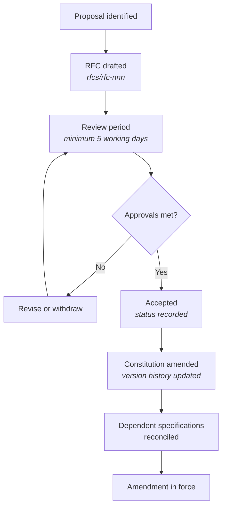

## Purpose

This article defines who may change the Constitution, what process a change follows, and how
disputes about interpretation are settled. It governs the Constitution itself; the process
for ordinary documentation changes is in [Governance](/governance/overview).

## Roles

| Role | Authority |
| --- | --- |
| **Maintainer** | Reviews and approves amendments. Interprets articles in disputed cases. |
| **Product owner** | Accountable for product standards. Required approver for changes to [Product standards](/constitution/product-standards). |
| **Engineering owner** | Accountable for engineering and AI standards. Required approver for changes to [Engineering standards](/constitution/engineering-standards) and [AI standards](/constitution/ai-standards). |
| **Contributor** | May propose any amendment. Cannot approve one. |

Roles are organisational responsibilities, not DevOS product roles. A single person may hold
more than one, but **MUST NOT** satisfy two required approvals on the same amendment.

## Amendment authority

| Change | Required approval |
| --- | --- |
| Editorial clarification with no change of meaning | One maintainer |
| New or amended standard in Product standards | Product owner and one maintainer |
| New or amended standard in Engineering or AI standards | Engineering owner and one maintainer |
| Change to an Article in [Principles](/constitution/principles) | Two maintainers, plus product owner and engineering owner |
| Change to [Mission](/constitution/mission) scope | Two maintainers, plus product owner and engineering owner |
| Removal of an Article | Two maintainers, plus product owner and engineering owner, with a recorded rationale for removal |
| Change to this governance article | Two maintainers, plus product owner and engineering owner |

No amendment may be approved by its own author.

## Amendment process

Every substantive amendment goes through the RFC process.

1. **Draft an RFC.** Use [the RFC template](/rfcs/template). The RFC **MUST** name the
   article affected, the text before and after, the rationale, and the documents that will
   need reconciling.
2. **Review period.** Minimum five working days for standards changes; minimum ten for
   changes to Principles, Mission, or this article. The period exists so that absence is not
   consent.
3. **Approval.** Per the table above. Approvals are recorded in the RFC.
4. **Amend.** The Constitution page is updated and its version history extended in the same
   pull request that records the RFC as accepted.
5. **Reconcile.** Specifications that the amendment invalidates **MUST** be corrected within
   the reconciliation window below.
6. **In force.** The amendment binds from the merge date unless the RFC states a later date.

## Reconciliation

An amendment frequently invalidates existing specifications. Leaving them contradictory is
not permitted.

| Amendment type | Reconciliation window |
| --- | --- |
| Editorial | None required |
| New standard with no existing conflict | 30 days to add compliance evidence |
| Amended standard with existing conflicts | Conflicting pages corrected in the same release |
| Article change or removal | All dependent pages identified in the RFC and corrected in the same release |

An amendment whose conflicts cannot be reconciled in the same release **MUST NOT** merge.
Shipping a Constitution that contradicts its own specifications defeats the precedence rule
in [Constitution: Introduction](/constitution/introduction).

## Interpretation disputes

Where reviewers disagree on whether an article applies:

1. The reviewer citing the article states which article, and how the change violates it.
2. The author either complies, records a permitted deviation where the article is a
   **SHOULD**, or escalates.
3. On escalation, a maintainer who is not party to the dispute rules. The ruling is recorded
   in the pull request.
4. Where a ruling reveals genuine ambiguity in the article, the maintainer **MUST** open a
   clarifying amendment RFC. A ruling that resolves a case without fixing the ambiguity
   leaves the next dispute to be re-argued.

Interpretation rulings are binding on the case at hand but are not precedent until the
article is clarified.

## Emergency amendment

An amendment may bypass the review period only where the current text causes active harm —
for example, a standard that mandates behaviour now known to be unsafe.

An emergency amendment:

- **MUST** be approved by two maintainers.
- **MUST** state the harm being addressed.
- **MUST** be reviewed retrospectively within ten working days through the normal process,
  which may confirm, revise, or reverse it.
- **MUST NOT** be used to expedite an ordinary change on schedule grounds.

## Compliance monitoring

| Check | Cadence | Owner |
| --- | --- | --- |
| Specifications reviewed against current articles | Each release | Maintainers |
| Recorded **SHOULD** deviations reviewed for continued validity | Quarterly | Owners for the relevant area |
| Capability status table audited against implementation | Each release | Product owner |
| Outstanding reconciliation items | Each release | Maintainers |

An expired or unjustified deviation is a defect and is either corrected or re-justified.

## Version history

| Version | Date | Change |
| --- | --- | --- |
| 1.0 | 2026-07-29 | Initial article. |
