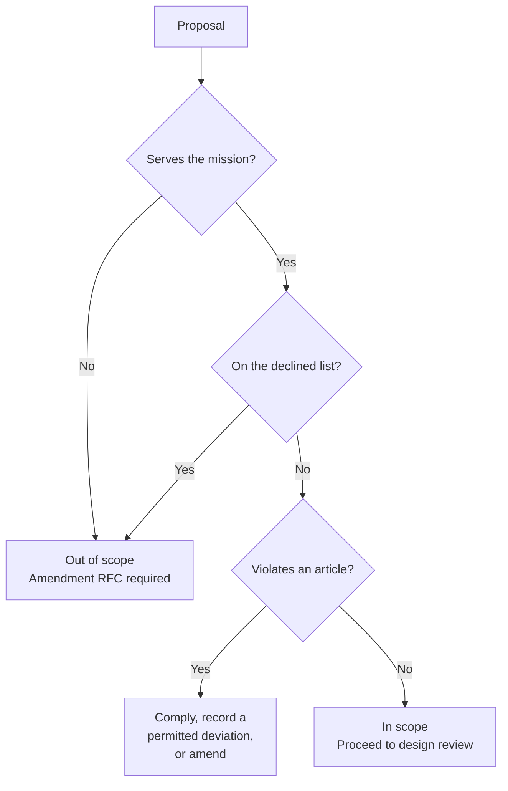

## Purpose

This article states the DevOS mission and the boundaries of its scope. It is the reference
point for scope disputes: a proposal that does not serve the mission is out of scope
regardless of its merit.

## Mission

**DevOS exists to make the design phase of software a repeatable, inspectable process that
produces artefacts a stranger could act on.**

It does this by converting product intent into architecture recommendations with honest
confidence, documented decisions with preserved reasoning, implementation blueprints derived
from those decisions, and structured build pipelines derived from those blueprints.

## The scope DevOS accepts

DevOS is accountable for the interval between intent and implementation:

| In scope | Article |
| --- | --- |
| Converting free-text intent into a structured product brief | [Product Interview Engine](/engines/product-interview-engine) |
| Matching briefs to reference architectures | [Decision Engine](/engines/decision-engine) |
| Scoring recommendations with evidence and named gaps | [Architecture Confidence Engine](/engines/architecture-confidence-engine) |
| Recording decisions immutably with preserved reasoning | [Decision Ledger](/engines/decision-ledger) |
| Compiling decisions into implementation blueprints | [Blueprint Engine](/engines/blueprint-engine) |
| Compiling blueprints into scoped build units | [AI Build Pipeline](/engines/build-pipeline) |
| Maintaining a framework library that names its own failure modes | [Framework Library](/frameworks/overview) |

## The scope DevOS declines

Declining scope is a mission statement, not an admission. Each item below is declined for a
stated reason, and the reason is what makes the decision reviewable.

| Declined | Reason |
| --- | --- |
| Writing and owning application code | The value depends on doing one handoff extremely well. A code-ownership product has different constraints and would dilute both. |
| Issue tracking and sprint management | Build units integrate with trackers. Replacing them adds surface without adding design quality. |
| Hosting or operating customer systems | Operational ownership of customer workloads is a distinct business with distinct liabilities. |
| Unattended end-to-end automation | Human acceptance of decisions is constitutive of the ledger's value. See Article 4 in [Principles](/constitution/principles). |
| General-purpose AI assistance | A general assistant cannot make the guarantees the artefact chain requires. |
| Guaranteeing project outcomes | DevOS makes a wrong design visible earlier. It cannot make one impossible. |

A proposal to take on declined scope requires an amendment RFC, not a product decision.

## Obligations the mission creates

The mission is not only permission to build; it imposes duties.

1. **DevOS MUST NOT present a guess as a finding.** Every recommendation carries its
   confidence, its evidence, and its gaps.
2. **DevOS MUST preserve reasoning, not just outcomes.** A decision record without its
   rejected alternatives fails the mission.
3. **DevOS MUST NOT let a downstream artefact contain a choice no human accepted.**
4. **DevOS MUST state capability status honestly.** Describing unbuilt behaviour in the
   present tense is a defect in the product surface and in the documentation.
5. **DevOS MUST make its own reasoning inspectable.** Where a clever mechanism and an
   auditable one both work, DevOS takes the auditable one.

## How scope disputes are resolved

The test is not whether a proposal is valuable. Many valuable things are out of scope.

## Success and failure

The mission is measurable, and the failure conditions are stated in
[Vision](/introduction/vision). The two that would falsify the mission:

- **Uncalibrated confidence.** If a 0.9 score is wrong as often as a 0.5 score, the scoring
  is theatre. It is removed, not tuned.
- **Unread ledgers.** If decision records are written and never consulted, DevOS has added
  ceremony rather than clarity.

## Version history

| Version | Date | Change |
| --- | --- | --- |
| 1.0 | 2026-07-29 | Initial article. |
