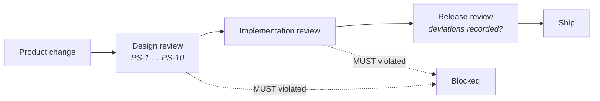

## Purpose

These standards constrain what the DevOS product surface may present to a user and what its
artefacts must contain. They derive from [Principles](/constitution/principles) and are
binding on all product decisions.

## Scope

Applies to: the customer workspace, the admin workspace, every artefact DevOS produces, and
every notification or export. Does not apply to: a customer's own product decisions, or
commercial and marketing material.

## PS-1 — Artefact completeness

Every artefact **MUST** be complete enough to be acted on by someone who was not present
when it was created.

| Artefact | Minimum content |
| --- | --- |
| Product Brief | Users and jobs, functional scope, non-goals, non-functional constraints, compliance obligations, integrations, team and delivery constraints, and every declared unknown |
| Recommendation | Originating framework, matched brief elements, confidence score, supporting evidence, named evidence gaps |
| Decision Record | Context, decision, alternatives considered with rejection reasons, consequences, confidence at acceptance, accepting identity, timestamp |
| Blueprint | Module boundaries, data model, interface contracts, milestones, test strategy, traceability to originating decisions |
| Build Unit | Scope, applicable decisions, interface contracts to honour, explicit exclusions, definition of done |

An artefact missing any minimum element **MUST NOT** be marked complete, and **MUST NOT** be
consumed by a downstream stage.

## PS-2 — Non-goals are first-class

Every Product Brief **MUST** capture what the user is deliberately not building.

Recommendations **MUST** be evaluated against non-goals as well as goals. A recommendation
that provisions for declared non-goals **MUST** be scored down and the reason surfaced.

**Rationale.** Scope stated only positively produces architectures sized for work nobody will
do.

## PS-3 — Unknowns are visible, never defaulted

Where a user answers "I don't know", or declines to answer, the product **MUST** record a
declared unknown.

DevOS **MUST NOT** substitute a default, an inferred value, or a typical value for a declared
unknown without labelling it as such at every point it is displayed or consumed. Declared
unknowns **MUST** propagate forward as named evidence gaps.

## PS-4 — Recommendations are plural

Where a brief admits more than one defensible architecture, the product **MUST** present more
than one recommendation.

The product **MUST NOT** collapse genuine ambiguity into a single answer, and **MUST NOT**
rank a recommendation first on any basis other than its scored evidence.

Where no framework matches, the product **MUST** report no match. It **MUST NOT** synthesise
a framework to avoid an empty result.

## PS-5 — Confidence is always accompanied

A confidence score **MUST NOT** be displayed alone. Every score **MUST** appear with its
supporting evidence and its named evidence gaps in the same view.

Scores **MUST** be expressed on the 0.00–1.00 scale defined in
[Terminology](/introduction/terminology). Presenting a score as a percentage, a grade, or a
traffic light without the underlying value **MUST NOT** be permitted.

## PS-6 — Acceptance is deliberate

Accepting a decision **MUST** require an explicit, individual action by an authorised human.

The product **MUST NOT** provide bulk acceptance of recommendations, **MUST NOT** pre-select
recommendations for acceptance, and **MUST NOT** treat continuation through a workflow as
implicit acceptance.

Rejection **MUST** capture a reason. Deferral **MUST** capture the evidence gap being closed.

**Rationale.** Bulk acceptance produces ledgers full of choices nobody weighed, which is
indistinguishable from having no ledger.

## PS-7 — Status is surfaced in the interface

Every capability in the product surface **MUST** display its status where a user could
otherwise mistake intent for behaviour.

Capabilities at Concept or Planned status **MUST NOT** appear as operable controls. A control
that does nothing, or that produces a placeholder result, **MUST NOT** ship.

## PS-8 — Traceability is user-visible

A user **MUST** be able to answer, from the product surface without assistance:

- Which brief elements produced this recommendation?
- Which evidence produced this confidence score?
- Which decision justifies this blueprint element?
- Which decision superseded this one, and why?
- Who accepted this decision, and when?

## PS-9 — Destructive actions are reversible or confirmed

Any action that removes access, deletes an artefact, or removes a member **MUST** either be
reversible for a stated period, or require confirmation naming the specific object affected.

Deletion of an organisation **MUST** be restricted to the Owner role and **MUST** require
typed confirmation. Immutable records **MUST NOT** be deletable by any role through the
product surface.

## PS-10 — Errors state cause and remedy

Every failure state presented to a user **MUST** state what failed, why, and what the user
can do next.

The product **MUST NOT** present a failure as a generic error where the cause is known, and
**MUST NOT** silently degrade — a stage that cannot complete **MUST** report that it did not
complete.

## Compliance

A reviewer may block a product change by citing a standard. Standards stated with **MUST**
admit no deviation.

## Acceptance criteria

- No artefact marked complete is missing a PS-1 minimum element.
- Every declared unknown resolves to a named evidence gap.
- No code path performs bulk or implicit decision acceptance.
- No Concept or Planned capability is an operable control.
- Every traceability question in PS-8 is answerable from the interface.

## Open questions

- Should PS-4 define a maximum number of recommendations, to prevent choice paralysis?
- Should PS-9's reversibility period be uniform, or vary by object type?
- Does PS-5 permit a compact score display in list views, provided evidence is one
  interaction away?

## Version history

| Version | Date | Change |
| --- | --- | --- |
| 1.0 | 2026-07-29 | Initial standards ratified. |
