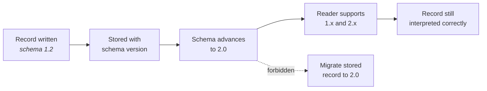

## Purpose

This article defines the versioning scheme for the Constitution, for specification pages, and
for the artefact schemas DevOS produces. Consistent versioning is what lets a decision record
made a year ago still be interpreted correctly.

## Constitution versioning

The Constitution carries a single document version in `MAJOR.MINOR` form.

| Change | Increment |
| --- | --- |
| Editorial clarification, no change of meaning | None; version history note only |
| New standard added | MINOR |
| Existing standard amended without reversing an obligation | MINOR |
| Standard or Article removed | MAJOR |
| Article amended so previously compliant behaviour becomes non-compliant | MAJOR |
| Mission scope changed | MAJOR |

A MAJOR increment signals that existing implementations or specifications may now be
non-compliant. Every MAJOR increment **MUST** name, in its RFC, the pages and behaviours
requiring reconciliation.

**Current Constitution version: 1.0** (ratified 2026-07-29).

## Page versioning

Every normative page carries a version history table with the most recent change last:

```markdown
## Version history

| Version | Date | Change |
| --- | --- | --- |
| 1.0 | 2026-07-29 | Initial page. |
| 1.1 | 2026-08-14 | Added failure state for empty recommendation set. |
| 2.0 | 2026-09-02 | Confidence threshold now blocks acceptance. Breaking. |
```

Rules:

- **MINOR** for added requirements, clarifications, and new sections.
- **MAJOR** for a changed or removed requirement, a changed heading, or a reversal of
  previously documented behaviour.
- Editorial fixes that change no meaning need no version bump, but **SHOULD** be noted where
  a reader might otherwise think content was lost.
- The change description states what changed, not that a change occurred. "Updated content"
  is not an acceptable entry.

### Heading changes are breaking

Headings are part of the retrieval contract for AI agents — see Article 10 in
[Principles](/constitution/principles). Renaming a heading:

- Requires a MAJOR page increment.
- **MUST** be recorded in the version history, naming the old and new heading.
- **SHOULD** be accompanied by an anchor redirect where the old anchor was linked externally.

## Artefact schema versioning

Product briefs, decision records, blueprints, and build units each have a schema version.
Because decision records are immutable, a record written under schema 1.2 must remain
readable indefinitely.

| Change | Increment | Compatibility |
| --- | --- | --- |
| Add an optional field | MINOR | Backward compatible |
| Add a required field with a defined interpretation for absent values | MINOR | Backward compatible |
| Add a required field with no interpretation for absent values | MAJOR | Breaking |
| Remove or rename a field | MAJOR | Breaking |
| Change a field's type or permitted values | MAJOR | Breaking |
| Change the meaning of an existing field | MAJOR | Breaking |

Rules:

1. Every stored artefact **MUST** record the schema version it was written under.
2. Readers **MUST** handle every schema version that exists in storage. Migration of stored
   artefacts to a newer schema **MUST NOT** be used to avoid this, because migrating an
   immutable record would alter it.
3. A MAJOR schema change **MUST** state how artefacts under prior versions are interpreted.
4. Changing the meaning of a field without renaming it **MUST NOT** be permitted at MINOR.
   Silent semantic drift is the failure mode this rule exists to prevent.



## Capability status versus version

Status and version answer different questions and **MUST NOT** be conflated.

| | Answers |
| --- | --- |
| **Status** | How mature is this capability? (Concept … Production) |
| **Version** | Which revision of this document or schema is this? |

A page at version 3.2 may describe a Concept capability. A Production capability may be at
version 1.0. Promoting status is a normative change requiring a version increment; a version
increment does not imply a status change.

## Release versioning

Documentation releases are dated rather than numbered, because the repository publishes
continuously from `main`. Each release records:

- The date and commit range.
- Pages added, changed as normative, and changed as editorial.
- Constitution version, if it changed.
- Artefact schema versions, if any changed.
- Outstanding reconciliation items.

See [Release process](/governance/release-process) and
[Changelog policy](/governance/changelog-policy).

## Acceptance criteria

- Every normative page has a version history table with a specific change description.
- Every stored artefact records its schema version.
- Every MAJOR schema version documents the interpretation of prior-version artefacts.
- No heading rename ships without a MAJOR increment and a version history note.
- The Constitution version on this page matches the highest version recorded across
  Constitution article histories.

## Open questions

- Should the Constitution version be surfaced in the published documentation header, so a
  reader can cite the version they read?
- Should artefact schema versions be published in [API reference](/api-reference/introduction)
  once the API leaves Concept status?
- What is the retention obligation for readers of very old schema versions — indefinite, or
  bounded by a stated support window?

## Version history

| Version | Date | Change |
| --- | --- | --- |
| 1.0 | 2026-07-29 | Initial article. |
