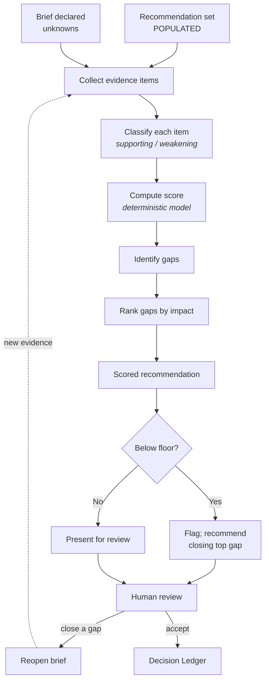
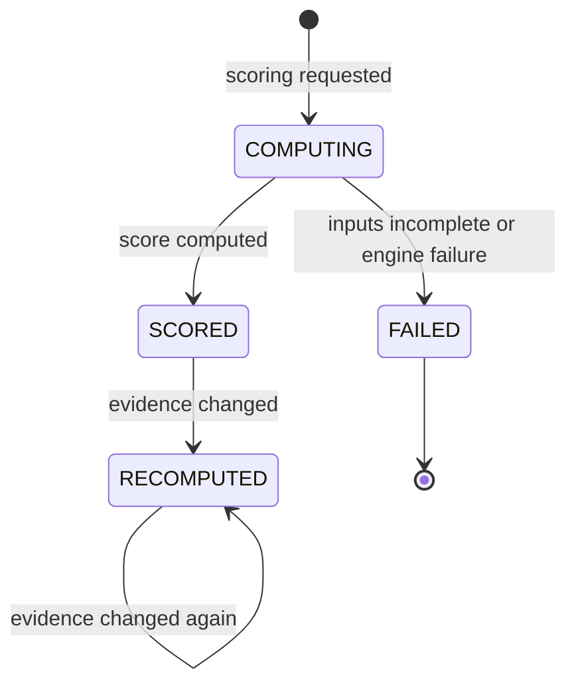

<Info>
**Status: Concept.** No implementation exists. The scoring model and calibration methodology
below are specified but unbuilt, and the shape may change. Confidence display in the product
surface is also Concept — see [Roadmap](/introduction/roadmap).
</Info>

## Purpose

The Architecture Confidence Engine attaches a confidence score to each recommendation, together
with the evidence supporting it and the **evidence gaps** that would move it.

Its purpose is not to rank recommendations. It is to tell the user how much the system actually
knows, and what to go and find out. A recommendation at 0.45 with the gap "expected concurrency
unknown" is more useful than one at 0.9 that reached certainty by guessing.

## Goals

- Produce scores that are calibrated against real outcomes, not merely plausible.
- Name every evidence gap specifically enough that a non-specialist can act on it.
- Make every score reproducible from recorded inputs.
- Rank gaps by impact, so a user closes the one that matters most first.

## Non-goals

- Choosing a recommendation. Selection is a human act.
- Suppressing low-confidence recommendations. A low score is information, not a reason to hide.
- Predicting project success. The score measures evidence quality for an architecture match,
  nothing more.
- Asking a model how confident it is. See FR-1.

## Scope

**In scope:** score computation, evidence classification, gap identification and impact ranking,
recomputation on evidence change, calibration measurement.

**Out of scope:** matching (upstream), acceptance (human), and any judgement about whether the
project itself is a good idea.

## Definitions

| Term | Meaning |
| --- | --- |
| **Confidence score** | A value from 0.00 to 1.00 expressing evidence quality for a recommendation's fit. |
| **Evidence** | A recorded fact from the brief or the match that supports or weakens a recommendation. |
| **Evidence gap** | A specific, named absence of information that would move the score if closed. |
| **Gap impact** | The magnitude by which closing a gap could move the score. |
| **Confidence floor** | An organisation-configured score below which acceptance requires an override. |
| **Calibration** | The measured relationship between score bands and observed reversal rates. |

## Inputs

| Input | Source | Required |
| --- | --- | --- |
| Recommendation set in `POPULATED` state | [Decision Engine](/engines/decision-engine) | Yes |
| Match evidence and unmet conditions | Within the recommendation set | Yes |
| Declared unknowns | The Product Brief | Yes |
| Non-goal conflicts | Within the recommendation set | Yes |
| Confidence floor | Organisation settings | No |
| Scoring model version | Engine configuration | Yes |

This engine reads the brief's declared unknowns directly, which is the one documented exception
to strict forward flow. The exception exists because a gap set assembled only from match evidence
would omit the unknowns the user declared — and those are the gaps the user is best placed to
close. The exception is recorded here and in [Core Engines Overview](/engines/overview).

## Outputs

For each recommendation:

| Element | Content |
| --- | --- |
| Confidence score | 0.00 to 1.00 |
| Score inputs | Every evidence item with its classification and weight, as consumed |
| Supporting evidence | Facts that raised the score, in plain language |
| Weakening evidence | Facts that lowered it, including non-goal conflicts |
| Evidence gaps | Each named, with affected area and impact rank |
| Scoring model version | The version that produced the score |
| Floor status | Whether the score is below the organisation's confidence floor |

Per PS-5, a score MUST NOT be emitted or displayed without its evidence and gaps.

## User experience

The user sees the score, the evidence both ways, and the gaps ranked by impact. Closing a gap and
recomputing moves the score **because the evidence changed** — not because the model was re-run.
That distinction is the point of a deterministic scoring model, and the interface states it.

## Functional requirements

### FR-1 — Scores are computed, never asserted

The confidence score MUST be produced by the deterministic scoring model from recorded inputs.

A model MUST NOT be asked to state its own confidence as the score of record. A model MAY
contribute evidence classifications, provided each classification is recorded as a score input
and is auditable — AI-5.

**Rationale.** Self-reported model confidence is not calibrated against outcomes. A score that
cannot be reproduced cannot be audited, and a score that cannot be audited cannot be calibrated.

### FR-2 — Scores are reproducible

Given identical inputs and scoring model version, the engine MUST produce an identical score.

Every score MUST record the complete input set and weights that produced it, so it can be
recomputed and verified later — ES-3 and Article 9.

### FR-3 — Every declared unknown becomes a named gap

Every declared unknown in the brief that bears on a recommendation MUST appear as a named
evidence gap on that recommendation.

The engine MUST NOT substitute a value for a declared unknown, and MUST NOT omit a gap because it
is small — PS-3 and Article 1.

### FR-4 — Gaps are specific and actionable

A gap MUST name what information is missing, which area it affects, and how it would move the
score.

"Insufficient information" is not a gap. "Expected peak concurrency unknown — affects data
partitioning strategy; closing could move the score by up to 0.15" is. Gaps MUST be phrased so a
non-specialist can act on them, because the founder persona is often the person who must go and
find the answer.

### FR-5 — Gaps are ranked by impact

Gaps MUST be ranked by the magnitude of score movement they could produce.

Where the top-ranked gap could move a score across the confidence floor, the engine MUST surface
that explicitly. A user should not have to compute which question matters most.

### FR-6 — Unmet conditions and non-goal conflicts weaken scores

Framework conditions the brief did not satisfy MUST lower the score, and MUST appear as weakening
evidence.

Non-goal conflicts MUST lower the score, with the conflicting non-goal named — PS-2.

### FR-7 — Low scores are surfaced, not suppressed

The engine MUST NOT withhold, hide, or defer a recommendation because its score is low.

Where every recommendation in a set falls below the floor, the engine MUST report that condition
and surface the gaps ranked across the whole set, so the user can see that the problem is missing
evidence rather than an absent architecture.

### FR-8 — Recomputation on evidence change

When a brief is reopened and new evidence recorded, the engine MUST recompute affected scores and
MUST record both the prior and new score with the evidence delta between them.

Score history MUST be retained. A score that moved is itself evidence about the design process.

### FR-9 — Calibration is measured

The engine's scores MUST be measurable against observed outcomes: the rate at which decisions
accepted in each score band are later superseded.

Per the [Vision](/introduction/vision), if high-confidence recommendations are reversed as often
as low-confidence ones, scoring is removed rather than tuned. This is a stated failure condition,
and this requirement is what makes it testable.

## Data model

| Field | Type | Notes |
| --- | --- | --- |
| `score_id` | Identifier | Immutable |
| `recommendation_id` | Identifier | The recommendation scored |
| `organisation_id` | Identifier | Tenant scope — Article 7 |
| `score` | Decimal (0.00–1.00) | |
| `scoring_model_version` | String | Required for reproducibility |
| `score_inputs` | List | Each: evidence reference, classification, weight, contribution |
| `gaps` | List | Each: identifier, description, affected area, impact magnitude, rank |
| `below_floor` | Boolean | Against the organisation's configured floor |
| `previous_score_id` | Identifier, nullable | Set on recomputation |
| `evidence_delta` | Structured, nullable | What changed since the previous score |
| `computed_at` | Timestamp | |
| `schema_version` | String | Per [Versioning](/constitution/versioning) |

Scores are immutable. Recomputation inserts a new score referencing the previous one, so the
history of what the system believed and when survives.

## States

| State | Presentable to user | Consumable for acceptance |
| --- | --- | --- |
| `COMPUTING` | No | No |
| `SCORED` | Yes | Yes |
| `RECOMPUTED` | Yes — as current, with history | Yes |
| `FAILED` | Yes — as an explicit failure | No |

A recommendation whose score is `FAILED` MUST NOT be presented as unscored and MUST NOT be
acceptable. Per PS-5 there is no path where a recommendation is accepted without a score.

## Permissions

| Action | Minimum role |
| --- | --- |
| Trigger scoring (automatic with recommendation generation) | Contributor |
| Trigger recomputation by recording new evidence | Contributor |
| Read scores, evidence, and gaps | Viewer |
| Read score history | Viewer |
| Configure the confidence floor | Admin |
| Override the floor at acceptance | Contributor — pending the open question below |

Whether Viewers see open gaps or only accepted decisions is an open question in
[Customer workspace](/product/customer-workspace). See [Permissions](/product/permissions).

## Security considerations

- Evidence quotes brief content and inherits the brief's access controls.
- Score inputs MUST be organisation-scoped; a scoring run MUST NOT read evidence from another
  organisation's project — Article 7 and AI-4.
- Calibration measurement aggregates across organisations. It MUST operate on aggregate score
  bands and reversal counts only, and MUST NOT expose or retrieve any single organisation's
  project content. See the open question below.
- Per AI-7, gap descriptions and impact magnitudes MUST NOT contain invented figures. An impact
  magnitude is computed from the scoring model, or the gap is emitted without one.

## Failure modes

| Failure | Detection | Response |
| --- | --- | --- |
| Recommendation set not `POPULATED` | Entry check | Refuse to score; name the set state |
| Declared unknowns unavailable | Entry check | Fail explicitly; a gap set without unknowns is incomplete |
| Evidence classification unavailable (model failure) | Invocation layer | `FAILED`; MUST NOT emit a score from partial inputs |
| Score computed but inputs not fully recorded | Reproducibility check | Reject the score; an unreproducible score is a defect |
| Every recommendation below the floor | Set-level evaluation | Report the condition; rank gaps across the whole set |
| Gap identified with no impact magnitude | Gap assembly | Emit the gap without a magnitude; MUST NOT invent one |
| Scoring model version missing | Entry check | Refuse to run |
| Calibration data insufficient to measure | Calibration run | Report insufficiency; MUST NOT publish a calibration claim |

Per ES-8 and AI-9, the engine MUST NOT emit an approximate score when it cannot compute a real
one. A missing score is recoverable; a fabricated one corrupts the ledger's confidence record
permanently.

## Audit events

| Event | Emitted when |
| --- | --- |
| `confidence.scored` | A score reaches `SCORED` |
| `confidence.gap_identified` | An evidence gap is recorded |
| `confidence.recomputed` | A score is recomputed after an evidence change |

Each event records actor, organisation, project, recommendation, score, scoring model version,
and timestamp. `confidence.recomputed` records the prior score and the evidence delta, so score
movement is auditable.

## Dependencies

| Depends on | Nature |
| --- | --- |
| [Decision Engine](/engines/decision-engine) | Requires a `POPULATED` set with match evidence and unmet conditions |
| [Product Interview Engine](/engines/product-interview-engine) | Reads declared unknowns — the documented forward-flow exception |

**Depended on by:** [Decision Ledger](/engines/decision-ledger) (records the confidence at
acceptance), and the confidence review stage of
[Product workflow](/getting-started/product-workflow).

## Acceptance criteria

- No score is produced by asking a model for its confidence.
- Every score is reproducible from its recorded inputs and model version.
- Every declared unknown bearing on a recommendation appears as a named gap.
- Every gap names missing information, affected area, and score impact where computable.
- Gaps are ranked by impact, and floor-crossing gaps are surfaced explicitly.
- No recommendation is hidden or deferred because its score is low.
- No score is displayed without its evidence and gaps in the same view.
- Recomputation retains prior scores and records the evidence delta.
- A `FAILED` score cannot be accepted.
- Calibration is measurable by score band against supersession rates.

## Open questions

- Should the confidence floor block acceptance outright, or permit a recorded override with
  justification? Also open in [Admin workspace](/product/admin-workspace).
- What weighting scheme should the scoring model use, and should weights be configurable per
  organisation? Configurable weights would make cross-organisation calibration incomparable.
- What project volume is required before calibration can be measured credibly? Also open in
  [Roadmap](/introduction/roadmap).
- Is aggregate cross-organisation calibration measurement compatible with Article 7 as written,
  or does it require an explicit constitutional carve-out for aggregate statistics? This must be
  resolved before the engine leaves Concept status.
- Should score history be visible to Viewers, or only to Contributors?

## Version history

| Version | Date | Change |
| --- | --- | --- |
| 1.0 | 2026-07-30 | Initial page. |
