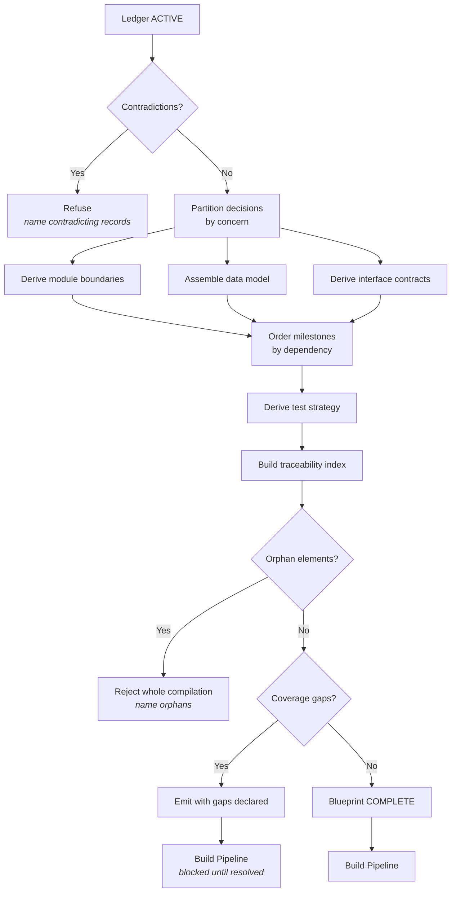
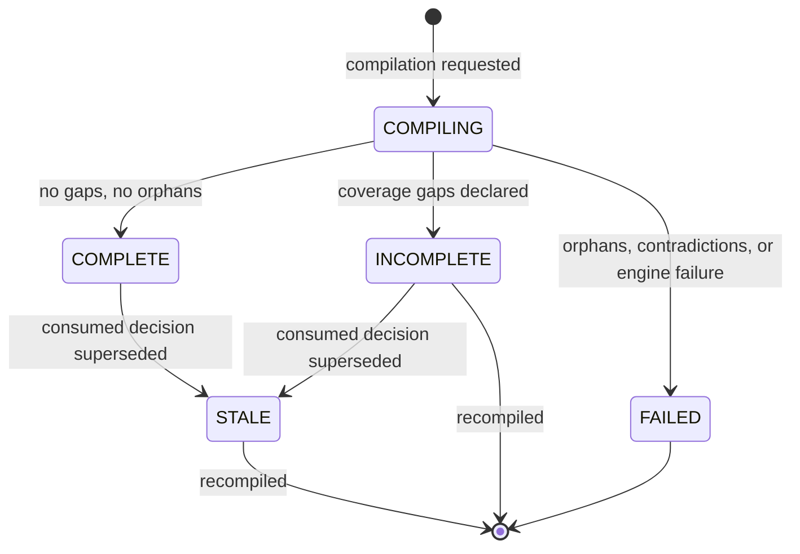

<Info>
**Status: Concept.** No implementation exists. The blueprint schema and ledger-to-blueprint
compilation rules below are specified but unbuilt — see [Roadmap](/introduction/roadmap).
</Info>

## Purpose

The Blueprint Engine compiles a Decision Ledger into an implementation blueprint: module
boundaries, data model, interface contracts, milestones, and test strategy.

Because it compiles from the ledger, a blueprint cannot contain a choice no human accepted. That
constraint is the engine's entire reason for existing — it is what makes the blueprint an
implementation of documented decisions rather than a fresh set of undocumented ones.

## Goals

- Produce a blueprint an implementer can start from without a verbal briefing.
- Guarantee that every blueprint element traces to an accepted decision.
- Compile deterministically, so the same ledger always yields the same structure.
- Surface staleness when the underlying decisions change.

## Non-goals

- Making architecture decisions. Every choice must already exist in the ledger.
- Generating code. That is downstream, via [AI Build Pipeline](/engines/build-pipeline).
- Estimating effort or duration. Milestones express ordering and dependency, not schedule.
- Producing a client-facing document. Presentation is the interface's concern; the blueprint is a
  structured artefact.

## Scope

**In scope:** ledger consumption, module derivation, data model assembly, interface contract
derivation, milestone ordering, test strategy derivation, traceability validation, staleness
detection, versioning.

**Out of scope:** the ledger (upstream), build unit decomposition (downstream), and any decision
not already accepted.

## Definitions

| Term | Meaning |
| --- | --- |
| **Blueprint** | The compiled implementation plan for a project. Versioned; many per project. |
| **Compilation** | Deterministic derivation of a blueprint from a ledger state. |
| **Blueprint element** | A single addressable item: a module, entity, contract, milestone, or test requirement. |
| **Traceability link** | The mapping from a blueprint element to the decision record justifying it. |
| **Coverage gap** | A ledger decision with no corresponding blueprint element. |
| **Orphan element** | A blueprint element with no resolvable originating decision. A defect. |
| **Stale blueprint** | A blueprint whose source ledger has changed since compilation. |

## Inputs

| Input | Source | Required |
| --- | --- | --- |
| Decision Ledger with at least one `ACTIVE` record | [Decision Ledger](/engines/decision-ledger) | Yes |
| Ledger consistency state (no contradictions) | Decision Ledger | Yes |
| Framework versions pinned in records | Within the records | Yes |
| Organisation scope | Session context | Yes |
| Prior blueprint version | Existing project, on recompilation | No |

The engine reads the ledger only. It MUST NOT read the brief, the interview log, or the
recommendation set — the forward-flow rule in [Core Engines Overview](/engines/overview). Where
the blueprint needs information the ledger lacks, the ledger is amended by supersession, not
supplemented here.

## Outputs

A **blueprint** containing:

| Section | Content |
| --- | --- |
| Module boundaries | Each module, its responsibility, and what it must not own |
| Data model | Entities, relationships, ownership, and tenancy scope |
| Interface contracts | Boundaries between modules, and to external systems |
| Milestones | Ordered delivery stages with their dependencies |
| Test strategy | What must be tested, and the coverage each decision requires |
| Traceability index | Every element mapped to its originating decision records |
| Provenance | Ledger version, decision identifiers consumed, engine version, timestamp |

Per PS-1, a blueprint missing any section MUST NOT be marked complete and MUST NOT be consumed
downstream.

## User experience

An implementer reads the blueprint and can answer, for any element, which decision requires it.
That is the test the artefact must pass: a blueprint requiring its author present has failed —
see the solo consultant and implementing engineer personas in [Personas](/product/personas).

## Functional requirements

### FR-1 — Every element traces to a decision

Every blueprint element MUST resolve to at least one `ACTIVE` decision record.

An orphan element is a defect. The engine MUST reject the entire compilation rather than emit a
blueprint containing one, and MUST name the orphans. Partial emission MUST NOT occur — Article 3
and ES-8.

**Rationale.** An orphan element is a decision nobody made, laundered into the plan by
compilation. Emitting it with a warning would make the blueprint's central guarantee advisory.

### FR-2 — Compilation introduces no decisions

The engine MUST NOT introduce a constraint, technology choice, or structural commitment absent
from the ledger.

Where compilation cannot proceed without a decision the ledger lacks, the engine MUST emit a
**coverage gap** naming the missing decision, and MUST NOT choose on the user's behalf — Article 3.

### FR-3 — Compilation is deterministic

The same ledger state and engine version MUST produce byte-identical structural output.

Compilation MUST NOT depend on wall-clock time, random values, or non-deterministic model output
for structure or ordering. A model MAY generate descriptive content within a structure the
deterministic layer has already fixed — ES-3 and AI-8.

### FR-4 — Contradictions block compilation

The engine MUST refuse to compile from a ledger containing contradictory `ACTIVE` records, and
MUST name the contradicting records.

It MUST NOT resolve a contradiction by preferring the newer record. Resolution is supersession, in
the ledger, by a human.

### FR-5 — Coverage gaps are declared

Where an `ACTIVE` decision produces no blueprint element, the engine MUST record a coverage gap.

A blueprint with declared coverage gaps MUST be marked incomplete and MUST NOT compile a build
pipeline. A decision that shaped nothing is either irrelevant or unimplemented, and both warrant
attention.

### FR-6 — Staleness is detected and surfaced

When any `ACTIVE` record consumed by a blueprint is superseded, the blueprint MUST be marked
**stale**, naming the superseding record.

A stale blueprint MUST be retained for audit, MUST NOT be silently recompiled, and MUST NOT compile
a build pipeline. See [Project lifecycle](/product/project-lifecycle).

### FR-7 — Blueprints are versioned and retained

Each compilation produces a new blueprint version. Prior versions MUST be retained with their
traceability indexes intact.

Retention matters because a build pipeline may have been compiled from an earlier version, and the
work done under it must remain explicable.

### FR-8 — Test strategy derives from decisions

The test strategy MUST derive from decision consequences, not from a generic template.

Where a record states a consequence that carries risk — a chosen isolation model, a rejected
alternative that would have prevented a failure class — the test strategy MUST include a
requirement covering it, traceable to that record.

### FR-9 — Tenancy is explicit in the data model

Every entity in the data model MUST declare its tenancy scope.

Where the ledger contains an isolation decision, the data model MUST reflect it structurally, and
the traceability link MUST point at that record — Article 7 and ES-2.

## Data model

| Field | Type | Notes |
| --- | --- | --- |
| `blueprint_id` | Identifier | Immutable |
| `project_id` | Identifier | Many blueprints per project |
| `organisation_id` | Identifier | Tenant scope — Article 7 |
| `version` | Integer | Monotonic per project |
| `ledger_version` | String | The exact ledger state compiled |
| `decisions_consumed` | List of identifiers | Every `ACTIVE` record read |
| `state` | Enum | `COMPILING`, `COMPLETE`, `INCOMPLETE`, `STALE`, `FAILED` |
| `modules` | List | Each: identifier, responsibility, exclusions, traceability links |
| `data_model` | List | Each entity: fields, relationships, tenancy scope, traceability links |
| `interface_contracts` | List | Each: boundary, shape, traceability links |
| `milestones` | Ordered list | Each: scope, dependencies, traceability links |
| `test_strategy` | List | Each requirement with its originating decision |
| `traceability_index` | Map element → decision identifiers | Complete by FR-1 |
| `coverage_gaps` | List | `ACTIVE` decisions with no element |
| `stale_reason` | Structured, nullable | Superseding record identifiers |
| `engine_version` | String | Required for determinism verification |
| `compiled_at` / `compiled_by` | Timestamp / Identity | |
| `schema_version` | String | Per [Versioning](/constitution/versioning) |

## States

| State | Compiles a pipeline | Retained |
| --- | --- | --- |
| `COMPILING` | No | Transient |
| `COMPLETE` | Yes | Yes |
| `INCOMPLETE` | No | Yes |
| `STALE` | No | Yes |
| `FAILED` | No | Yes, with the failure cause |

Recompilation never overwrites. It produces a new version and leaves the prior one in place.

## Permissions

| Action | Minimum role |
| --- | --- |
| Compile a blueprint | Contributor |
| Recompile a blueprint | Contributor |
| Read a blueprint and its traceability index | Viewer |
| Read prior blueprint versions | Viewer |
| Export a blueprint | Contributor |
| Delete a blueprint | No role. Blueprints are retained. |

Invocation is organisation-scoped before execution — ES-2. See
[Permissions](/product/permissions).

## Security considerations

- The blueprint restates decision content and inherits the ledger's access controls.
- Compilation is organisation-scoped; no compilation may read records from another organisation —
  Article 7 and AI-4.
- Per FR-9, tenancy decisions in the ledger must appear structurally in the data model. A blueprint
  that omits a recorded isolation decision is a security defect, not a documentation gap.
- Per AI-7, generated descriptive content MUST NOT contain invented figures, benchmarks, or
  capability claims. Where a specific is unavailable, a coverage gap is emitted.
- Export is permitted within the organisation and audited. Cross-organisation export is not a
  permission that exists.

## Failure modes

| Failure | Detection | Response |
| --- | --- | --- |
| Ledger has no `ACTIVE` records | Entry check | Refuse; nothing to compile |
| Ledger contains contradictory `ACTIVE` records | Consistency check | `FAILED`; contradicting records named |
| Orphan element produced | Traceability validation | `FAILED`; whole compilation rejected, orphans named |
| Coverage gap detected | Coverage validation | `INCOMPLETE`; gaps declared, pipeline blocked |
| Consumed decision superseded after compilation | Supersession hook | `STALE` with superseding records named |
| Model unavailable for descriptive content | Invocation layer | `FAILED`; MUST NOT emit structure with absent content marked complete |
| Model output fails schema validation | Output validation | Bounded retry, then `FAILED` per AI-9 |
| Pinned framework version no longer resolvable | Version resolution | `FAILED`; MUST NOT fall back to the latest version |
| Non-deterministic output detected across runs | Determinism check | Treated as a defect blocking release, not a runtime failure |
| Concurrent compilation on one project | Optimistic concurrency | First commits; second returns the committed version |

Two prohibitions are absolute here: the engine MUST NOT emit a partial blueprint as complete
(ES-8), and MUST NOT resolve a missing decision by choosing one (Article 3).

## Audit events

| Event | Emitted when |
| --- | --- |
| `blueprint.compiled` | A blueprint reaches `COMPLETE` or `INCOMPLETE` |
| `blueprint.compilation_failed` | A compilation reaches `FAILED` |
| `blueprint.marked_stale` | A blueprint transitions to `STALE` |

Each event records actor, organisation, project, blueprint version, ledger version, decisions
consumed, state, and timestamp. `blueprint.compilation_failed` records the failure cause and the
offending elements. `blueprint.marked_stale` records the superseding decision identifiers.

## Dependencies

| Depends on | Nature |
| --- | --- |
| [Decision Ledger](/engines/decision-ledger) | Requires `ACTIVE` records and a consistent ledger |
| Framework Engine | Resolves pinned framework versions — see [Framework Library](/frameworks/overview) |

**Depended on by:** [AI Build Pipeline](/engines/build-pipeline) (requires a `COMPLETE`,
non-stale blueprint).

## Acceptance criteria

- No blueprint is emitted containing an orphan element.
- No blueprint contains a constraint or technology choice absent from the ledger.
- Compilation from an identical ledger and engine version produces byte-identical structural
  output.
- A ledger with contradictory `ACTIVE` records cannot compile.
- Every `ACTIVE` decision producing no element appears as a declared coverage gap.
- Superseding a consumed decision marks the blueprint `STALE` naming the superseding record.
- A `STALE` or `INCOMPLETE` blueprint cannot compile a build pipeline.
- Every entity in the data model declares its tenancy scope.
- Prior blueprint versions are retained with traceability indexes intact.
- Every element is answerable to "which decision requires this?" from the product surface.

## Open questions

- Should coverage gaps block compilation entirely rather than producing an `INCOMPLETE` blueprint?
  The current design lets a user see the gap in context, at the cost of a blueprint that cannot
  proceed.
- How should module boundaries be derived when the ledger's decisions are all technology choices
  and none partition responsibility? The engine has no basis for a boundary the ledger does not
  imply.
- Should milestones express dependency ordering only, or may they carry effort estimates? Estimates
  are currently a non-goal, but implementers ask for them.
- Should a blueprint be recompilable against a superseded ledger state for comparison purposes, or
  only against current state?

## Version history

| Version | Date | Change |
| --- | --- | --- |
| 1.0 | 2026-07-30 | Initial page. |
