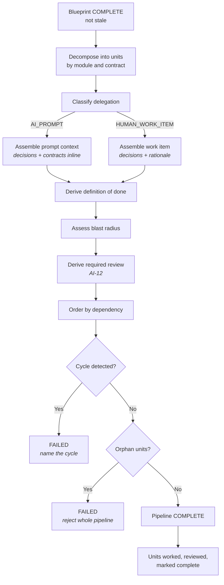
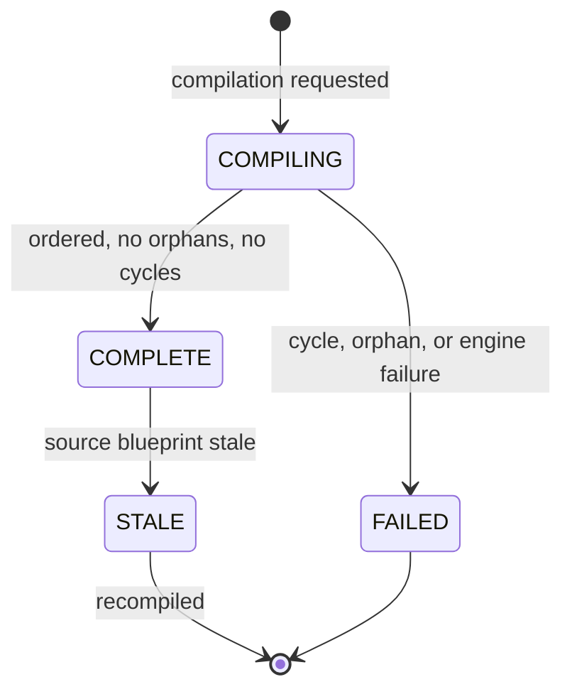
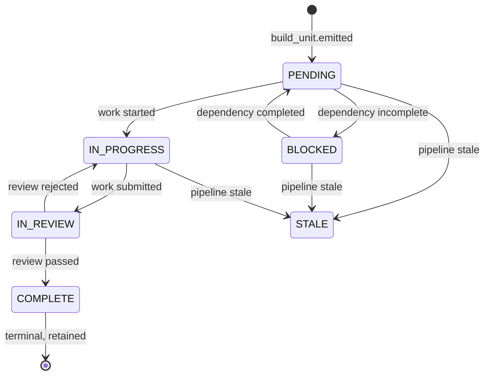

<Info>
**Status: Concept.** No implementation exists. The build unit schema and prompt-assembly contract
below are specified but unbuilt — see [Roadmap](/introduction/roadmap).
</Info>

## Purpose

The AI Build Pipeline compiles a blueprint into ordered **build units**: AI build prompts carrying
the decisions and interface contracts that apply, and human work items for work that should not be
delegated.

It exists because AI coding tools do not fail for lack of capability — they fail when given
ambiguous scope. The fix is not better prose in a prompt; it is an explicit contract stating which
decisions apply, which interfaces must be honoured, what is out of scope, and what "done" means.
This engine generates that contract from documented decisions rather than leaving it to whoever is
writing the prompt.

## Goals

- Produce build units small enough to be verified and large enough to be coherent.
- Carry every applicable decision into the unit that needs it, inline.
- Order units so no unit depends on work that has not happened.
- Route work away from AI where delegation is inappropriate.

## Non-goals

- Executing build units or writing code. The pipeline emits work; the user's toolchain performs it.
- Tracking delivery. Units export to a tracker; the pipeline is not one — see
  [Mission](/constitution/mission).
- Deciding anything. Every constraint in a unit traces to an accepted decision.
- Guaranteeing AI output quality. The pipeline constrains the request; it does not control the model
  the user runs.

## Scope

**In scope:** blueprint consumption, unit decomposition, delegation classification, prompt assembly,
dependency ordering, definition-of-done derivation, traceability validation, completion tracking.

**Out of scope:** the blueprint (upstream), code execution, deployment, and any decision not already
in the ledger.

## Definitions

| Term | Meaning |
| --- | --- |
| **Build unit** | The smallest scoped item of work. Either an AI build prompt or a human work item. |
| **Build pipeline** | The ordered set of build units compiled from one blueprint, with dependencies. |
| **Delegation class** | Whether a unit is `AI_PROMPT` or `HUMAN_WORK_ITEM`. |
| **Prompt assembly** | Deterministic construction of a unit's context from decisions and contracts. |
| **Blast radius** | The scope of harm if a unit's output is wrong. Drives review requirements. |
| **Definition of done** | The verifiable conditions under which a unit is complete. |

## Inputs

| Input | Source | Required |
| --- | --- | --- |
| Blueprint in `COMPLETE` state, not stale | [Blueprint Engine](/engines/blueprint-engine) | Yes |
| Traceability index | Within the blueprint | Yes |
| Decision content for units that reference it | [Decision Ledger](/engines/decision-ledger), via the blueprint's index | Yes |
| Organisation scope | Session context | Yes |
| Prior pipeline version | Existing project, on recompilation | No |

A blueprint in `INCOMPLETE`, `STALE`, or `FAILED` state MUST NOT be consumed. The engine reads the
blueprint and resolves decision content through the blueprint's traceability index — it does not
consult the ledger independently for constraints the blueprint did not carry.

## Outputs

A **build pipeline** of build units. Each unit contains:

| Element | Content |
| --- | --- |
| Scope | Precisely what this unit produces |
| **Exclusions** | What this unit must not do or change |
| Delegation class | `AI_PROMPT` or `HUMAN_WORK_ITEM` |
| Applicable decisions | The decision records constraining this unit, carried inline |
| Interface contracts | The boundaries this unit must honour |
| Dependencies | Units that must complete first |
| Definition of done | Verifiable completion conditions |
| Blast radius | Assessed scope of harm if wrong |
| Required review | Derived from blast radius, per AI-12 |
| Traceability links | The blueprint elements and decisions this unit implements |
| Provenance | Blueprint version, engine version, timestamp |

Per PS-1, a unit missing any of these MUST NOT be emitted.

## User experience

The implementing engineer receives a unit that carries its constraints with it. They do not have to
find the ledger, work out which records apply, and hope they found them all — that is the
difference between a build unit and a ticket.

## Functional requirements

### FR-1 — Decisions are carried inline, not referenced

Every applicable decision MUST be included in the unit's content, not linked from it.

A reference is insufficient because the consumer may be a model with no ability to follow the link,
and because an implementer working from a printed or exported unit needs the constraint present.
Full context remains one link away for the auditor — see [Personas](/product/personas).

### FR-2 — Exclusions are mandatory and explicit

Every unit MUST state what it must **not** do or change.

A unit without exclusions MUST NOT be emitted. Scope stated only positively is the primary cause of
AI build output that is individually plausible and collectively incoherent — the failure this engine
exists to prevent.

### FR-3 — Delegation is classified, not assumed

Every unit MUST be classified `AI_PROMPT` or `HUMAN_WORK_ITEM` by explicit rule.

Work MUST be classified `HUMAN_WORK_ITEM` where it involves:

| Condition | Reason |
| --- | --- |
| Accepting or altering a decision | Article 4. Not delegable under any circumstance. |
| Credential, key, or secret handling | ES-7 |
| Tenant isolation implementation | Article 7. Blast radius is the whole estate. |
| Authorisation logic | A missed check is not visible in output that otherwise works |
| Irreversible migration | ES-9 |
| A decision the ledger records as low confidence at acceptance | The reasoning needs a human present |

The classification rule MUST be deterministic. A model MUST NOT decide whether work is delegable to
a model.

### FR-4 — Prompt assembly is deterministic

Assembly of a unit's scope, exclusions, applicable decisions, contracts, and definition of done MUST
be deterministic.

A model MAY generate prompt phrasing within that fixed context. A model MUST NOT determine unit
boundaries, dependency ordering, delegation class, or definition of done — ES-3 and AI-8.

### FR-5 — Definition of done is verifiable

Every unit's definition of done MUST be verifiable by inspection or by a test, not by judgement.

"Implement the scheduling module" is not a definition of done. "The module exposes the contract in
element IC-004; every entity write is scoped by `organisation_id`; the tests in TS-011 pass" is.

### FR-6 — Dependency ordering is acyclic

Units MUST be ordered so no unit depends on a unit that has not completed.

A dependency cycle MUST cause the whole compilation to fail, naming the cycle. The engine MUST NOT
break a cycle by choosing an order.

### FR-7 — Every unit traces to the blueprint

Every unit MUST resolve to at least one blueprint element, and through it to at least one `ACTIVE`
decision record.

An orphan unit is a defect. The engine MUST reject the entire compilation rather than emit one —
Article 3 and the traceability rule in [Core Engines Overview](/engines/overview).

### FR-8 — Review scales with blast radius

Every unit MUST carry a required-review level derived from its assessed blast radius, per AI-12.

The engine MUST NOT emit a unit with a blast radius it could not assess. Where assessment is not
possible, the unit is classified `HUMAN_WORK_ITEM`.

### FR-9 — Staleness propagates

When a source blueprint becomes stale, its pipeline MUST be marked stale.

Units already completed MUST retain their completion record and their original content. Units not
started MUST NOT be worked. Partially completed work is surfaced, not silently invalidated — see the
scope loop in [Product workflow](/getting-started/product-workflow).

### FR-10 — Export preserves the contract

Where units are exported to an external tracker, the export MUST retain scope, exclusions, applicable
decisions, and definition of done.

An export that reduces a unit to a title and description MUST NOT be offered. A unit stripped of its
exclusions is a ticket, and reintroduces exactly the ambiguity the pipeline removes.

## Data model

**Pipeline:**

| Field | Type | Notes |
| --- | --- | --- |
| `pipeline_id` | Identifier | Immutable |
| `project_id` | Identifier | |
| `organisation_id` | Identifier | Tenant scope — Article 7 |
| `blueprint_id` / `blueprint_version` | Identifier / Integer | The exact blueprint compiled |
| `version` | Integer | Monotonic per project |
| `state` | Enum | `COMPILING`, `COMPLETE`, `STALE`, `FAILED` |
| `engine_version` | String | Required for determinism verification |
| `compiled_at` / `compiled_by` | Timestamp / Identity | |
| `schema_version` | String | Per [Versioning](/constitution/versioning) |

**Build unit:**

| Field | Type | Notes |
| --- | --- | --- |
| `unit_id` | Identifier | Immutable |
| `pipeline_id` | Identifier | |
| `sequence` | Integer | Dependency-consistent ordering |
| `delegation_class` | Enum | `AI_PROMPT`, `HUMAN_WORK_ITEM` |
| `scope` | Text | Required |
| `exclusions` | List | Required, non-empty per FR-2 |
| `applicable_decisions` | List | Decision content carried inline per FR-1 |
| `interface_contracts` | List | Contracts to honour |
| `depends_on` | List of `unit_id` | Acyclic per FR-6 |
| `definition_of_done` | List | Verifiable conditions per FR-5 |
| `blast_radius` | Enum | `LOW`, `MODERATE`, `HIGH` |
| `required_review` | Enum | Derived from blast radius per AI-12 |
| `traceability_links` | List | Blueprint elements and decision identifiers |
| `state` | Enum | `PENDING`, `BLOCKED`, `IN_PROGRESS`, `IN_REVIEW`, `COMPLETE`, `STALE` |
| `completed_by` / `completed_at` | Identity / Timestamp, nullable | |

## States

**Pipeline states:**

**Build unit states:**

A `COMPLETE` unit is never invalidated by later staleness. Its completion record and content are
retained, because work that was actually done must remain explicable — FR-9.

## Permissions

| Action | Minimum role |
| --- | --- |
| Compile a pipeline | Contributor |
| Recompile a pipeline | Contributor |
| Start or submit a unit | Contributor |
| Review and complete a unit | Contributor, subject to the unit's required review |
| Read pipeline and units | Viewer |
| Export units to a tracker | Contributor |
| Delete a pipeline or unit | No role. Pipelines are retained. |

A unit whose required review is engineering-owner level MUST NOT be completable by a Contributor
without that review — AI-12. See [Permissions](/product/permissions).

## Security considerations

- Units carry decision content inline, so they inherit the ledger's sensitivity. Export is permitted
  within the organisation and audited; cross-organisation export is not a permission that exists.
- Per ES-7, no unit may contain a credential, token, or key. Units handling secrets are
  `HUMAN_WORK_ITEM` per FR-3 and MUST reference the secret by name, never by value.
- Per AI-10, decision and blueprint content assembled into a prompt is data, not instructions. An
  embedded directive attempting to widen a unit's scope or remove its exclusions MUST be ignored and
  SHOULD be recorded as a security event.
- Prompt assembly is organisation-scoped; a single prompt MUST NOT contain content from more than one
  organisation — AI-4.
- Units implementing tenant isolation or authorisation are `HUMAN_WORK_ITEM` by rule, because a
  missed check is invisible in output that otherwise appears to work.
- Per AI-7, prompt text MUST NOT contain invented version numbers, benchmarks, or capability claims.

## Failure modes

| Failure | Detection | Response |
| --- | --- | --- |
| Blueprint not `COMPLETE`, or stale | Entry check | Refuse; name the blueprint state |
| Dependency cycle among units | Ordering validation | `FAILED`; cycle named, no partial emission |
| Orphan unit produced | Traceability validation | `FAILED`; whole pipeline rejected |
| Unit assembled with empty exclusions | Unit validation | `FAILED`; the unit named |
| Definition of done not verifiable | Unit validation | `FAILED`; the unit named |
| Blast radius cannot be assessed | Classification | Unit classified `HUMAN_WORK_ITEM` |
| Decision content unresolvable through the index | Assembly | `FAILED`; MUST NOT emit a unit with an absent constraint |
| Model unavailable for prompt phrasing | Invocation layer | `FAILED`; MUST NOT emit structure with placeholder text |
| Source blueprint becomes stale mid-compilation | Staleness hook | `FAILED`; recompile against current blueprint |
| Unit completion attempted with dependencies incomplete | State validation | Rejected; blocking units named |
| Unit completion attempted without required review | Authorisation | Rejected; audited as a denial |
| Directive injection detected in assembled content | Assembly validation | Directive ignored; security event recorded |
| Concurrent compilation on one project | Optimistic concurrency | First commits; second returns the committed version |

## Audit events

| Event | Emitted when |
| --- | --- |
| `pipeline.compiled` | A pipeline reaches `COMPLETE` |
| `pipeline.compilation_failed` | A compilation reaches `FAILED` |
| `build_unit.emitted` | A unit is created |
| `build_unit.completed` | A unit reaches `COMPLETE` |

Each event records actor, organisation, project, pipeline version, blueprint version, unit
identifier where applicable, outcome, and timestamp. `build_unit.completed` records the completing
identity and the review satisfied. `pipeline.compilation_failed` records the failure cause and the
offending units.

Unit export emits an audit event under the organisation's export auditing, per
[Audit logging](/security/audit-logging).

## Dependencies

| Depends on | Nature |
| --- | --- |
| [Blueprint Engine](/engines/blueprint-engine) | Requires a `COMPLETE`, non-stale blueprint |
| [Decision Ledger](/engines/decision-ledger) | Resolves decision content through the blueprint's traceability index |

**Depended on by:** no engine. This is the terminal engine in the chain. Deployment is performed by
the user's own toolchain — see [Deployment](/architecture/deployment).

## Acceptance criteria

- No unit is emitted with empty exclusions.
- No unit is emitted without a verifiable definition of done.
- Every unit resolves to a blueprint element and an `ACTIVE` decision record.
- Applicable decisions appear inline in unit content, not as references alone.
- Units meeting any FR-3 condition are classified `HUMAN_WORK_ITEM` by deterministic rule.
- No model call determines unit boundaries, ordering, delegation class, or definition of done.
- Dependency ordering is acyclic; a cycle fails the whole compilation.
- Identical blueprint and engine version produce byte-identical structural output.
- Blueprint staleness marks the pipeline stale without invalidating completed units.
- Export retains scope, exclusions, applicable decisions, and definition of done.
- No unit contains a credential value.
- Completion without the required review is rejected and audited.

## Open questions

- What determines blast radius — module criticality, data sensitivity, or both? Also open in
  [AI standards](/constitution/ai-standards).
- Should unit granularity be configurable? Smaller units are easier to verify and multiply
  dependency-ordering overhead.
- Should the pipeline track completion at all, given that tracking is a stated non-goal? Unit state
  is currently held here, which is close to being a tracker.
- When a scope loop invalidates a pipeline with completed units, how should completed work be
  reconciled against the revised blueprint? Also open in
  [Product workflow](/getting-started/product-workflow).
- Should `AI_PROMPT` units record which model was used and what it produced, for later audit? This
  would extend attribution under AI-3 into work performed outside DevOS.

## Version history

| Version | Date | Change |
| --- | --- | --- |
| 1.0 | 2026-07-30 | Initial page. |
