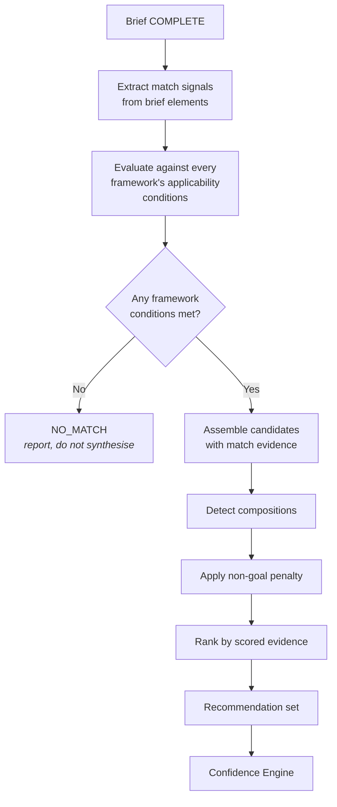
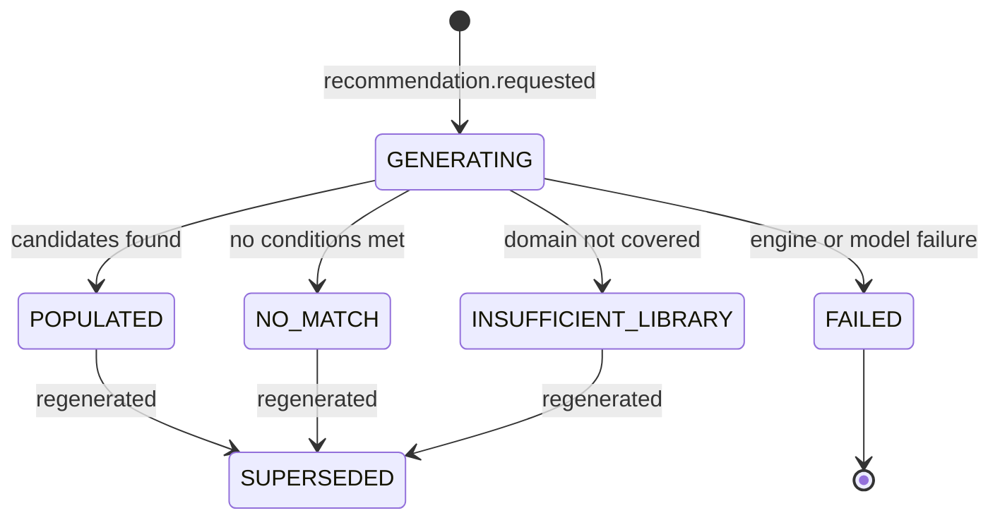

<Info>
**Status: Prototype.** A working internal implementation exists. It runs against a partial
framework library, so match quality is not representative. Deterministic ranking against a fixed
brief corpus is the next milestone — see [Roadmap](/introduction/roadmap).
</Info>

## Purpose

The Decision Engine matches a complete Product Brief against the framework library and produces
a set of candidate architectures. It answers "which reference architectures fit this brief, and
why?" — not "which one should you choose?"

It produces a **set**, not an answer. A brief containing genuine ambiguity must not resolve to
false certainty, and the engine has no basis for breaking a tie the brief itself does not break.

## Goals

- Produce every defensible candidate architecture for a given brief.
- Record which brief elements caused each match, so the reasoning is inspectable.
- Report honestly when nothing matches.
- Score candidates down where they provision for declared non-goals.

## Non-goals

- Choosing a single architecture. Selection is a human act at confidence review.
- Computing confidence scores. That is the
  [Architecture Confidence Engine](/engines/architecture-confidence-engine).
- Synthesising a new framework when none matches. Reporting no match is the correct output.
- Producing implementation detail. That is the [Blueprint Engine](/engines/blueprint-engine).

## Scope

**In scope:** brief-to-framework matching, match evidence recording, candidate assembly,
composition detection, non-goal penalty, ranking by scored evidence, no-match reporting.

**Out of scope:** the brief (upstream), framework authoring and validation (Framework Engine),
confidence computation (downstream), and any decision acceptance.

## Definitions

| Term | Meaning |
| --- | --- |
| **Recommendation** | A candidate architecture with its originating framework and match evidence. Not yet a decision. |
| **Match evidence** | The specific brief elements that caused a framework to match. |
| **Match signal** | A single brief element paired with a framework's applicability condition. |
| **Composition** | A recommendation combining a primary framework with constraints from another. |
| **Non-goal penalty** | A reduction applied where a candidate provisions for declared non-goals. |
| **No-match** | The valid output state when no framework's applicability conditions are met. |

## Inputs

| Input | Source | Required |
| --- | --- | --- |
| Product Brief in `COMPLETE` state | [Product Interview Engine](/engines/product-interview-engine) | Yes |
| Framework library, validated and versioned | Framework Engine | Yes |
| Organisation scope | Session context | Yes |
| Prior recommendation set | Existing project, on regeneration | No |

A brief in `IN_PROGRESS` or `REOPENED` state MUST NOT be consumed. The engine reads the brief,
never the interview question log — the forward-flow rule in
[Core Engines Overview](/engines/overview).

## Outputs

A **recommendation set**, where each recommendation contains:

| Element | Content |
| --- | --- |
| Originating framework | Framework identifier and pinned version |
| Match evidence | The brief elements that matched, each paired with the framework condition it satisfied |
| Non-matching conditions | Framework conditions the brief did not satisfy |
| Composition | Where applicable, the secondary framework and the constraints it contributes |
| Non-goal conflicts | Declared non-goals this candidate would provision for |
| Operational cost profile | What running this architecture requires, in skills and infrastructure |
| Provenance | Brief version, library version, engine version, timestamp |

The set carries a set-level state: `POPULATED`, `NO_MATCH`, or `INSUFFICIENT_LIBRARY`.

Confidence scores are **not** part of this output. They are attached downstream, from this
engine's evidence plus the brief's declared unknowns.

## User experience

The user sees each candidate with the brief elements that produced it, the framework conditions
it failed to satisfy, and what operating it would require. Per PS-4, ordering reflects scored
evidence only — never recency, popularity, or a house preference.

## Functional requirements

### FR-1 — Recommendations are plural

Where more than one framework's applicability conditions are met, the engine MUST return more
than one candidate.

The engine MUST NOT collapse genuine ambiguity into a single recommendation, and MUST NOT
suppress a candidate because another scored higher. Suppression would hide the ambiguity that
the plural output exists to expose — PS-4.

### FR-2 — Match evidence is recorded per signal

Every match MUST record which brief elements satisfied which framework applicability conditions.

A recommendation whose match evidence cannot be resolved to specific brief elements is a
traceability defect and MUST NOT be emitted — the traceability rule in
[Core Engines Overview](/engines/overview).

### FR-3 — Non-matching conditions are recorded

The engine MUST record the framework conditions the brief did **not** satisfy, not only those it
did.

These become inputs to confidence scoring and to the evidence gap set. A candidate that matched
on three conditions and failed two is a different proposition from one that matched three and
failed none.

### FR-4 — No-match is a valid output

Where no framework's applicability conditions are met, the engine MUST return `NO_MATCH` with
the brief elements that prevented every match.

The engine MUST NOT synthesise a framework, MUST NOT return the nearest framework as though it
matched, and MUST NOT return an empty set without explanation — PS-4.

Where the library is too sparse to evaluate the brief's domain at all, the engine MUST return
`INSUFFICIENT_LIBRARY` rather than `NO_MATCH`. These are different problems: one is about the
brief, the other about the library.

### FR-5 — Composition detection

Where a brief matches a primary framework on commercial and operational shape and a second
framework on data-handling or regulatory constraints, the engine MUST emit a composition rather
than two unrelated candidates.

A composition MUST name the primary framework, the secondary framework, and precisely which
constraints the secondary contributes. The composition itself is a choice a human must accept —
it is not resolved by the engine.

### FR-6 — Non-goal penalty

The engine MUST evaluate each candidate against the brief's declared non-goals.

A candidate that provisions for a declared non-goal MUST be scored down and the conflict MUST be
surfaced with the non-goal named — PS-2. An architecture sized for work the user has explicitly
excluded is a worse fit, and the reason must be visible.

### FR-7 — Framework version pinning

Every recommendation MUST reference the framework version it was generated against.

Deprecating or amending a framework MUST NOT alter an existing recommendation or any decision
made from it. See [Framework standard](/frameworks/framework-standard).

### FR-8 — Determinism and model boundary

Match evaluation, candidate assembly, non-goal penalty, and ranking MUST be deterministic. The
same brief and library version MUST produce the same set.

Per AI-8, a model MAY contribute evidence assessments that the deterministic layer consumes as
recorded inputs. A model MUST NOT determine which candidates are emitted, their ordering, or the
set state.

## Data model

| Field | Type | Notes |
| --- | --- | --- |
| `recommendation_set_id` | Identifier | Immutable |
| `project_id` | Identifier | |
| `organisation_id` | Identifier | Tenant scope — Article 7 |
| `brief_id` / `brief_version` | Identifier / String | The exact brief consumed |
| `library_version` | String | Framework library version |
| `state` | Enum | `POPULATED`, `NO_MATCH`, `INSUFFICIENT_LIBRARY` |
| `generated_at` / `generated_by` | Timestamp / Identity | |
| `superseded_by` | Identifier, nullable | Set when regenerated |
| `schema_version` | String | Per [Versioning](/constitution/versioning) |

Each recommendation within the set:

| Field | Type | Notes |
| --- | --- | --- |
| `recommendation_id` | Identifier | Immutable |
| `framework_id` / `framework_version` | Identifier / String | Pinned |
| `composition_framework_id` | Identifier, nullable | Secondary framework |
| `composition_constraints` | List, nullable | Constraints the secondary contributes |
| `match_evidence` | List of signals | Brief element ↔ framework condition pairs |
| `unmet_conditions` | List | Framework conditions the brief did not satisfy |
| `non_goal_conflicts` | List | Declared non-goals this candidate provisions for |
| `operational_profile` | Structured | Skills and infrastructure required |
| `rank` | Integer | Derived from scored evidence only |

Recommendation sets are immutable. Regeneration produces a new set and marks the prior one
superseded, so a decision record can always reference the exact set it was accepted from.

## States

| State | Consumable by Confidence Engine |
| --- | --- |
| `GENERATING` | No |
| `POPULATED` | Yes |
| `NO_MATCH` | No — but is a valid, reportable outcome |
| `INSUFFICIENT_LIBRARY` | No |
| `SUPERSEDED` | No |
| `FAILED` | No |

## Permissions

| Action | Minimum role |
| --- | --- |
| Request recommendations | Contributor |
| Regenerate recommendations | Contributor |
| Read a recommendation set | Viewer |

Invocation is organisation-scoped before execution — ES-2. Framework access is limited to
frameworks available to the organisation: DevOS reference frameworks plus that organisation's own
adaptations and authored frameworks. See [Permissions](/product/permissions).

## Security considerations

- The brief may contain confidential product information. Matching is organisation-scoped, and a
  single model request MUST NOT contain data from more than one organisation — AI-4.
- An organisation's authored frameworks MUST NOT be visible to, or matched for, any other
  organisation — Article 7.
- Match evidence quotes brief content and inherits the brief's access controls.
- Per AI-7, the operational cost profile MUST NOT contain invented benchmark figures. Where a
  specific is unavailable, the engine emits a gap rather than a number.

## Failure modes

| Failure | Detection | Response |
| --- | --- | --- |
| Brief not in `COMPLETE` state | Entry check | Refuse to run; name the brief state |
| Framework library empty or unvalidated | Entry check | `INSUFFICIENT_LIBRARY`; do not proceed |
| No framework conditions met | Match evaluation | `NO_MATCH` with the blocking brief elements |
| Model unavailable for evidence assessment | Invocation layer | Fail explicitly; do not emit candidates with absent evidence |
| Match evidence cannot resolve to brief elements | Traceability validation | Reject the whole set; do not partially emit |
| Composition detected but constraints cannot be enumerated | Composition assembly | Emit as two separate candidates with the ambiguity stated |
| Framework version referenced no longer exists | Version resolution | Fail explicitly; do not fall back to the latest version |
| Concurrent generation requests on one project | Optimistic concurrency | First commits; second returns the committed set |

Per ES-8, a partially assembled set MUST NOT be emitted as complete. Per AI-9, the engine MUST
NOT substitute the nearest framework for a genuine no-match.

## Audit events

| Event | Emitted when |
| --- | --- |
| `recommendation.requested` | Generation or regeneration is requested |
| `recommendation.generated` | A set reaches `POPULATED` |
| `recommendation.no_match` | A set reaches `NO_MATCH` or `INSUFFICIENT_LIBRARY` |

Each event records actor, organisation, project, brief version, library version, set state, and
timestamp. `recommendation.no_match` records the blocking brief elements, because a pattern of
no-matches is the signal that the library needs extending.

## Dependencies

| Depends on | Nature |
| --- | --- |
| [Product Interview Engine](/engines/product-interview-engine) | Requires a `COMPLETE` brief |
| Framework Engine | Requires a validated, versioned library — see [Framework Library](/frameworks/overview) |

**Depended on by:** [Architecture Confidence Engine](/engines/architecture-confidence-engine)
(scores this engine's evidence), [Decision Ledger](/engines/decision-ledger) (records reference
the recommendation and framework version accepted).

## Acceptance criteria

- A brief admitting multiple defensible architectures produces multiple candidates.
- Every match signal resolves to a specific brief element and a specific framework condition.
- Unmet framework conditions are recorded, not only met ones.
- A brief matching nothing produces `NO_MATCH` with blocking elements named, never a
  nearest-match substitute.
- An empty or unvalidated library produces `INSUFFICIENT_LIBRARY`, distinguishable from
  `NO_MATCH`.
- Candidates provisioning for declared non-goals are scored down with the conflict surfaced.
- Every recommendation pins a framework version; deprecation does not alter existing sets.
- Identical brief and library version produce an identical set, verified by repeated runs.
- No set contains a framework belonging to another organisation, verified by test.

## Open questions

- Should the engine cap the number of candidates? PS-4 requires plurality, but an eight-candidate
  set may cause choice paralysis. Also open in
  [Product standards](/constitution/product-standards).
- Should compositions be limited to two frameworks, or can a brief legitimately compose three?
- Should the non-goal penalty be a fixed weight, or proportional to how much of the architecture
  the non-goal provisions for?
- Should this engine and the Confidence Engine be merged? The split keeps scoring auditable
  independently of matching but adds a handoff with no user-visible artefact. Also open in
  [Core Engines Overview](/engines/overview).

## Version history

| Version | Date | Change |
| --- | --- | --- |
| 1.0 | 2026-07-30 | Initial page. |
