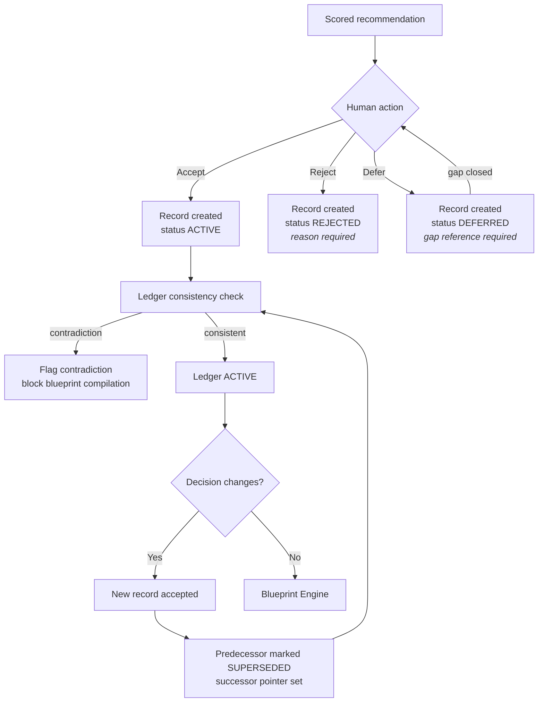
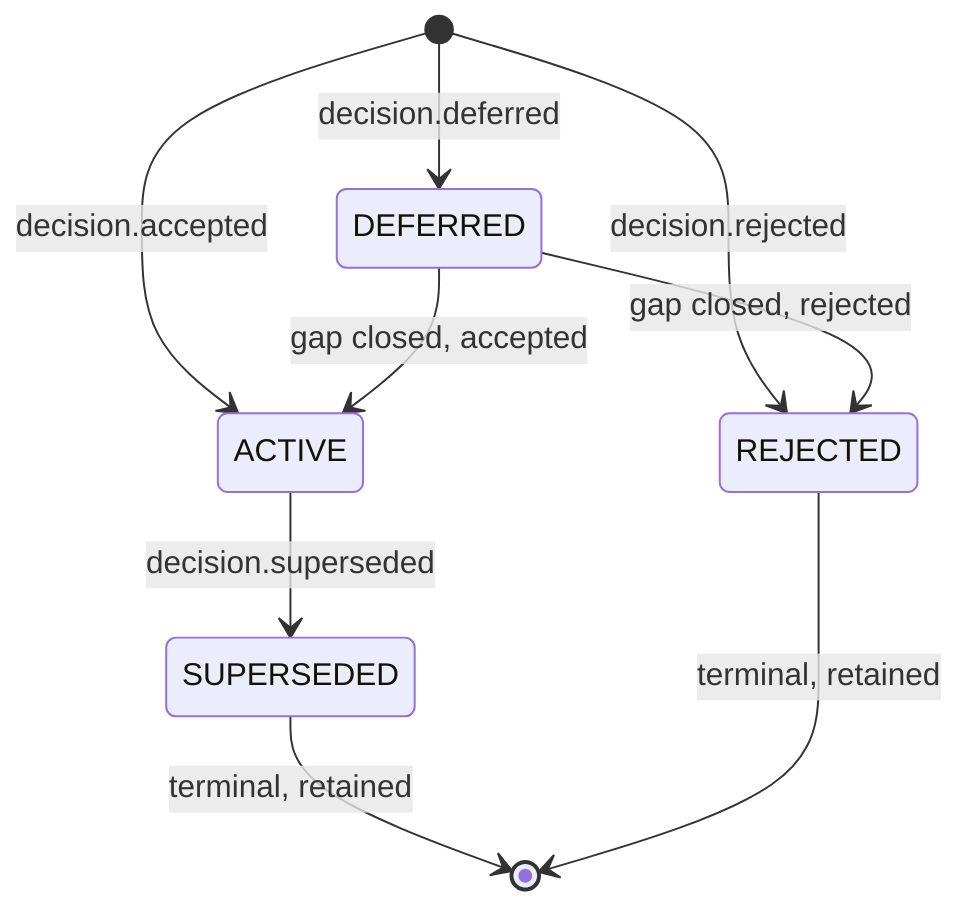

<Info>
**Status: Prototype.** Record creation and acceptance are implemented internally. The full
supersession chain with traceability queries is the next milestone — see
[Roadmap](/introduction/roadmap). Not stable, not supported.
</Info>

## Purpose

The Decision Ledger is the immutable record of every architecture decision accepted on a project,
with the reasoning that produced it. It is the durable output of the DevOS workflow and the single
input to blueprint compilation.

It exists because the reasoning behind a decision is more valuable, and more perishable, than the
decision itself. A ledger that recorded only outcomes would tell you what was chosen; this one
tells you why, what was rejected, and what it cost.

## Goals

- Preserve the reasoning behind every decision, including rejected alternatives.
- Guarantee that no accepted record is ever altered.
- Make a project's architecture legible to someone who was not present.
- Support decision change without erasing decision history.

## Non-goals

- Recommending decisions. That is the [Decision Engine](/engines/decision-engine).
- Scoring decisions. Confidence is computed upstream and recorded here as it stood at acceptance.
- Enforcing decisions in code. The ledger records commitments; it does not police implementations.
- Serving as a general project log. Only accepted, rejected, and deferred architecture decisions
  belong here.

## Scope

**In scope:** record creation on acceptance, rejection and deferral recording, supersession
chains, consistency checking, traceability queries, attribution.

**Out of scope:** matching, scoring, blueprint compilation, and any mutation of an accepted
record — which does not exist by design.

## Definitions

| Term | Meaning |
| --- | --- |
| **Decision record** | The stored form of an accepted decision. Immutable. |
| **Ledger** | The complete, ordered set of records for one project. Exactly one per project. |
| **Acceptance** | The human act of converting a recommendation into a decision record. |
| **Supersession** | Replacing a record with a newer one; the original is retained and marked. |
| **Active decision** | A record not superseded. |
| **Contradiction** | Two active records whose decisions are mutually incompatible. |
| **Attribution** | The identity and timestamp of the human who accepted a record. |

## Inputs

| Input | Source | Required |
| --- | --- | --- |
| Scored recommendation | [Architecture Confidence Engine](/engines/architecture-confidence-engine) | Yes for acceptance |
| Human acceptance action | Contributor via the product surface | Yes — Article 4 |
| Rejection reason | User, at rejection | Yes for rejection |
| Deferral gap reference | User, at deferral | Yes for deferral |
| Supersession rationale | User, at supersession | Yes for supersession |
| Organisation scope | Session context | Yes |

The engine MUST NOT create a record from any input lacking a human acceptance action. There is no
automated path, no confidence threshold, and no automation context that produces an accepted
record — Article 4 in [Principles](/constitution/principles).

## Outputs

A **decision record** containing:

| Element | Content | Required |
| --- | --- | --- |
| Context | Why this decision was needed, drawn from the brief | Yes |
| Decision | What was decided, stated as a commitment | Yes |
| Alternatives considered | Each alternative with its rejection reason | Yes |
| Consequences | What this decision costs and forecloses | Yes |
| Confidence at acceptance | Score, evidence, and open gaps as they stood | Yes |
| Originating recommendation | Recommendation and set identifiers | Yes |
| Framework version | Pinned version the decision was made against | Yes |
| Attribution | Accepting identity and timestamp | Yes |
| Status | `ACTIVE`, `SUPERSEDED`, `REJECTED`, or `DEFERRED` | Yes |
| Supersession pointers | Predecessor and successor references | Where applicable |

Per PS-1, a record missing any required element MUST NOT be created. A record without its
rejected alternatives fails the mission — see [Mission](/constitution/mission).

The canonical format is [Decision record template](/reference/decision-record-template).

## User experience

The ledger is readable two ways, because two personas need different things from it:

| Reading | For |
| --- | --- |
| Chronological narrative — the story of how the architecture came to be | The engineering lead explaining it to a new joiner |
| Queryable record set — filter by status, area, framework, accepter, date | The auditor verifying the process |

## Functional requirements

### FR-1 — Records are immutable

Once created, a record's substantive fields MUST NOT be updatable by any code path.

Immutability MUST be enforced below the application layer, not by application convention — ES-1.
Deletion of an accepted record MUST NOT be reachable from application code, and MUST NOT be
exposed in any interface at any role — PS-9.

### FR-2 — Acceptance requires an identified human

Every record with status `ACTIVE` MUST have exactly one accepting human identity and timestamp.

No confidence score, configuration, threshold, or automation context MAY authorise creation of an
accepted record without one. This limit MUST NOT be configurable — Article 4 and AI-2.

### FR-3 — Change is expressed as supersession

A changed decision MUST be recorded as a new record that supersedes the prior one.

The prior record MUST be retained with its original content intact, marked `SUPERSEDED`, and MUST
carry a pointer to its successor. The successor MUST carry a pointer to its predecessor and a
supersession rationale — Article 2.

Supersession chains MUST be fully traversable in both directions.

### FR-4 — Alternatives and consequences are mandatory

A record MUST contain every alternative considered, each with the reason it was rejected, and MUST
state the consequences of the decision including costs being accepted.

A record whose alternatives list is empty MUST NOT be created. Where a recommendation was the only
candidate, that fact is itself the alternatives content and MUST be recorded as such.

### FR-5 — Confidence is frozen at acceptance

The confidence score, its evidence, and the open gaps MUST be captured as they stood at the moment
of acceptance.

Later recomputation of the recommendation's score MUST NOT alter a record. The record answers
"what did we know when we decided?", which is a different question from "what do we know now?"

### FR-6 — Rejections and deferrals are retained

Rejected recommendations MUST be recorded with their rejection reason. Deferred recommendations
MUST be recorded with the evidence gap being closed.

Neither MUST be deleted when the project moves on. The reasoning in a rejection is what stops the
same argument restarting six months later.

### FR-7 — Consistency checking

The ledger MUST detect contradictions between active records and MUST surface them.

A ledger containing contradictory active decisions MUST block blueprint compilation until resolved
by supersession — it MUST NOT be resolved by silently preferring the newer record.

### FR-8 — Attribution survives departure

Removing a member from an organisation, or reducing their role, MUST NOT alter or anonymise
records they accepted.

Attribution is what makes the ledger worth consulting. See
[Roles and workspaces](/getting-started/roles-and-workspaces).

### FR-9 — Traceability queries

The ledger MUST answer, for any record:

- Which brief elements produced the originating recommendation?
- Which evidence produced its confidence score?
- Which record superseded it, and why?
- Which record did it supersede?
- Which blueprint elements derive from it?
- Who accepted it, and when?

Per PS-8 these MUST be answerable from the product surface without assistance.

### FR-10 — Framework version pinning

Every record MUST pin the framework version it was made against.

Deprecating or amending a framework MUST NOT alter any existing record. A record made against
framework version 1.2 continues to reference 1.2 indefinitely.

## Data model

| Field | Type | Notes |
| --- | --- | --- |
| `decision_id` | Identifier | Immutable |
| `ledger_id` | Identifier | Exactly one ledger per project |
| `project_id` | Identifier | |
| `organisation_id` | Identifier | Tenant scope — Article 7 |
| `sequence` | Integer | Monotonic within the ledger |
| `status` | Enum | `ACTIVE`, `SUPERSEDED`, `REJECTED`, `DEFERRED` |
| `context` | Text | Required |
| `decision` | Text | Required |
| `alternatives` | List | Each: description, rejection reason. Non-empty. |
| `consequences` | List | Required |
| `confidence_at_acceptance` | Structured | Score, evidence, open gaps, scoring model version |
| `recommendation_id` / `recommendation_set_id` | Identifier | Origin |
| `framework_id` / `framework_version` | Identifier / String | Pinned |
| `accepted_by` / `accepted_at` | Identity / Timestamp | Immutable. Required for `ACTIVE`. |
| `rejection_reason` | Text, nullable | Required for `REJECTED` |
| `deferral_gap_id` | Identifier, nullable | Required for `DEFERRED` |
| `supersedes` / `superseded_by` | Identifier, nullable | Chain pointers |
| `supersession_rationale` | Text, nullable | Required where `supersedes` is set |
| `schema_version` | String | Per [Versioning](/constitution/versioning) |

Because records are immutable, a record written under schema 1.2 MUST remain readable
indefinitely. Migrating stored records to a newer schema is forbidden — it would alter an
immutable record. See [Versioning](/constitution/versioning).

## States

| State | Counts toward blueprint | Retained | Mutable |
| --- | --- | --- | --- |
| `ACTIVE` | Yes | Yes | No |
| `SUPERSEDED` | No | Yes | No |
| `REJECTED` | No | Yes | No |
| `DEFERRED` | No | Yes | No |

No state transition deletes a record. `SUPERSEDED` and `REJECTED` are terminal but permanently
retained — the auditor persona depends on this.

Transitions MUST be rejected at the storage layer where invalid, and MUST NOT be inferred from
field presence — ES-4.

## Permissions

| Action | Minimum role |
| --- | --- |
| Accept a decision | Contributor |
| Reject a recommendation | Contributor |
| Defer a recommendation | Contributor |
| Supersede a decision | Contributor |
| Read active records | Viewer |
| Read superseded, rejected, and deferred records | Viewer |
| Run traceability queries | Viewer |
| Delete a record | No role. Not implementable. |

Acceptance is deliberately a Contributor capability: it is design work, not administration. The
consequence is that every Contributor can permanently alter a project's decision history — which
is why Viewer should be preferred where reading suffices. See
[Permissions](/product/permissions) and [Roles and workspaces](/getting-started/roles-and-workspaces).

## Security considerations

- Immutability is enforced at the storage layer, so a compromised or defective application path
  cannot rewrite decision history — ES-1.
- Ledger reads are organisation-scoped before execution; no query may span organisations —
  Article 7 and ES-2.
- Attribution identities are immutable and are not removed when an account is deactivated.
- Agent retrieval over ledger content is organisation-scoped before retrieval, not filtered after
  — AI-4. No agent may create or alter a record — AI-2.
- Denied acceptance attempts are audited as denials, per ES-5. An attempted acceptance by a Viewer
  is precisely the event worth recording.
- Ledger export is permitted within the organisation and audited. Cross-organisation export is not
  a permission that exists.

## Failure modes

| Failure | Detection | Response |
| --- | --- | --- |
| Acceptance attempted without human identity | Record creation validation | Rejected as a defect, not a permission denial |
| Acceptance attempted with an empty alternatives list | Record validation | Rejected; the missing element named |
| Acceptance of a recommendation whose score is `FAILED` | Entry check | Rejected; a record cannot freeze a confidence that was never computed |
| Update attempted on an accepted record | Storage layer | Rejected; no application path exists |
| Supersession without a rationale | Record validation | Rejected |
| Supersession pointing at an already-superseded record | Chain validation | Rejected; the current successor named |
| Contradictory active records | Consistency check | Contradiction flagged; blueprint compilation blocked |
| Concurrent acceptance of the same recommendation | Optimistic concurrency | First commits; second reports the existing record with a link |
| Ledger read without an organisation scope | Storage layer | Rejected as a defect |
| Audit write fails on acceptance | Audit layer | Open question — see below |

## Audit events

| Event | Emitted when |
| --- | --- |
| `decision.accepted` | A record reaches `ACTIVE` |
| `decision.rejected` | A record is created as `REJECTED` |
| `decision.deferred` | A record is created as `DEFERRED` |
| `decision.superseded` | A record transitions to `SUPERSEDED` |

Each event records actor, organisation, project, ledger, decision, confidence at acceptance,
outcome, and timestamp. `decision.superseded` records both the superseded and superseding record
identifiers.

Denials emit the corresponding event with a denial outcome. The audit log is append-only and no
role can edit or delete an event — see [Audit logging](/security/audit-logging).

## Dependencies

| Depends on | Nature |
| --- | --- |
| [Architecture Confidence Engine](/engines/architecture-confidence-engine) | Requires a `SCORED` recommendation to freeze confidence at acceptance |
| [Decision Engine](/engines/decision-engine) | Records reference the originating recommendation and set |
| Framework Engine | Pins the framework version — see [Framework Library](/frameworks/overview) |
| Human acceptance | Article 4. Not a system dependency but a hard precondition. |

**Depended on by:** [Blueprint Engine](/engines/blueprint-engine) (requires a ledger with no
contradictory active records), and the auditor and engineering lead personas directly.

## Acceptance criteria

- No application code path can update or delete an accepted record — verified by test against
  every mutation path.
- Every `ACTIVE` record has exactly one accepting human identity and timestamp.
- No record is created with an empty alternatives list.
- Supersession chains are complete and traversable in both directions.
- A superseded record retains its original content byte-for-byte.
- Confidence at acceptance does not change when the recommendation's score is later recomputed.
- Removing a member does not alter records they accepted.
- Contradictory active records block blueprint compilation.
- Every traceability question in FR-9 is answerable from the product surface.
- No ledger query executes without an organisation scope.
- Every acceptance, rejection, deferral, supersession, and denial emits an audit event.

## Open questions

- What should happen when an audit write fails during acceptance — fail the acceptance, or complete
  it and alert on the audit gap? Also open in
  [Engineering standards](/constitution/engineering-standards) and
  [Admin workspace](/product/admin-workspace).
- Should contradiction detection be automatic, or require a human to confirm that two records
  genuinely conflict? Automatic detection risks false positives that block compilation.
- Should the ledger support decision records not originating from a recommendation — a decision made
  entirely outside DevOS but recorded for completeness? Currently every record requires an
  originating recommendation.
- Should export be separately gated from read? Exporting a full ledger is a materially different
  act from reading one record. Also open in [Permissions](/product/permissions).

## Version history

| Version | Date | Change |
| --- | --- | --- |
| 1.0 | 2026-07-30 | Initial page. |
