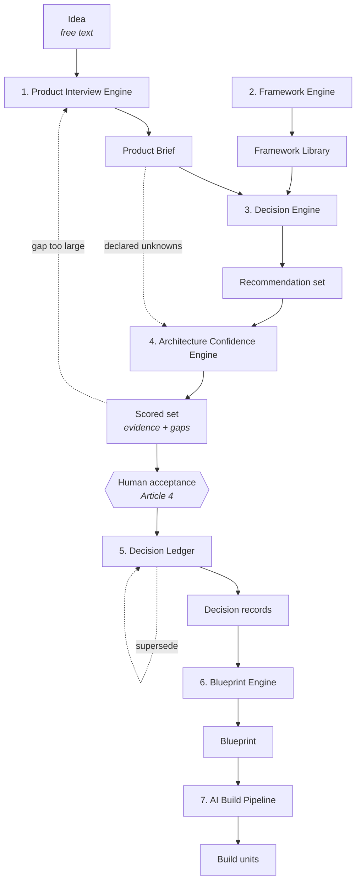
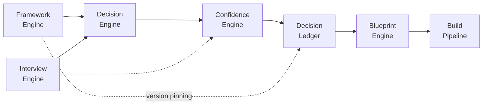

## Purpose

DevOS is built from seven engines. Each transforms one artefact into the next, under a
documented contract. This page names them, states what each consumes and produces, and defines
the rules that govern the handoffs between them.

An **engine** is a named DevOS component that transforms one artefact into the next. Engines
are not services, layers, or modules — the term describes a transformation contract, not a
deployment unit.

<Note>
Engines sit on the **platform layer**: [AI Connect](/architecture/ai-connect) and the
[Plugin System](/architecture/plugin-system). Neither is an engine — neither consumes nor produces
a workflow artefact — but no engine reaches a model or an external system except through them. See
[System overview](/architecture/system-overview).
</Note>

## The seven engines

| # | Engine | Consumes | Produces | Status |
| --- | --- | --- | --- | --- |
| 1 | [Product Interview Engine](/engines/product-interview-engine) | Idea (free text) | Product Brief | Prototype |
| 2 | Framework Engine | Framework definitions | Validated, queryable framework library | Planned |
| 3 | [Decision Engine](/engines/decision-engine) | Product Brief + framework library | Recommendation set | Prototype |
| 4 | [Architecture Confidence Engine](/engines/architecture-confidence-engine) | Recommendation set | Scored set with evidence and gaps | Concept |
| 5 | [Decision Ledger](/engines/decision-ledger) | Accepted recommendations | Decision records | Prototype |
| 6 | [Blueprint Engine](/engines/blueprint-engine) | Decision Ledger | Blueprint | Concept |
| 7 | [AI Build Pipeline](/engines/build-pipeline) | Blueprint | Ordered build units | Concept |

<Note>
The **Framework Engine** is engine 2 and is the one engine with no page in this section. It maintains,
validates, and serves the framework library rather than transforming a project artefact, so its
specification lives with the library it governs: see
[Framework Library](/frameworks/overview) and
[Framework standard](/frameworks/framework-standard). It is listed here because the Decision
Engine cannot function without it.
</Note>

## Engine relationships

The only path from a scored recommendation to a decision record passes through human
acceptance. No engine may bypass it — Article 4 in [Principles](/constitution/principles).

## Handoff contract

Four rules govern every engine boundary. They are what make the chain auditable.

1. **Forward flow only.** An engine reads only the artefact immediately upstream, plus the
   framework library where its contract permits. The Blueprint Engine reads the ledger, not the
   interview transcript.
2. **No invented constraints.** An engine MUST NOT introduce a requirement absent from its
   input. Where a downstream engine needs information its input lacks, the upstream artefact is
   amended through its own process.
3. **Declared unknowns propagate.** An unknown declared in the interview MUST reach the
   confidence review as a named evidence gap. No engine may substitute a default silently —
   PS-3.
4. **Traceability is preserved.** Every element an engine produces resolves to a specific
   element of its input. An output element with no resolvable origin is a defect, not a
   warning.

See [Product workflow](/getting-started/product-workflow) for the same chain described from the
user's perspective.

## Determinism boundary

Engines 5, 6, and 7 are deterministic in structure. Engines 1, 3, and 4 use models within a
fixed structure.

| Engine | Deterministic | Model contribution |
| --- | --- | --- |
| 1. Product Interview | Question sequencing rules, brief schema | Question phrasing, answer extraction |
| 2. Framework Engine | Validation, indexing, retrieval | None |
| 3. Decision Engine | Match ranking, candidate assembly | Evidence assessment inputs |
| 4. Confidence Engine | Score computation from recorded inputs | Evidence assessment inputs |
| 5. Decision Ledger | Entirely deterministic | None. Record drafting only, before acceptance. |
| 6. Blueprint Engine | Structure, ordering, traceability | Content within fixed structure |
| 7. Build Pipeline | Unit decomposition, dependency ordering | Prompt text within fixed scope |

Per ES-3 and AI-8, model output MUST NOT determine artefact structure, ledger state
transitions, or compilation ordering. A compilation run twice on the same input produces
byte-identical structural output.

Every model contribution in the table above is obtained through
[AI Connect](/architecture/ai-connect). An engine submits a capability request and receives a
result envelope with attribution already attached; it does not select a model, hold a provider
credential, or construct a provider call. Two engines invoke no agent at all: the Framework
Engine and the Decision Ledger.

## Dependencies

The five engines that invoke agents — all except the Framework Engine and the Decision Ledger —
additionally depend on [AI Connect](/architecture/ai-connect) for agent execution, and through it
on the [Plugin System](/architecture/plugin-system) for provider access. These are platform
dependencies rather than artefact dependencies, so they do not appear in the chain above.

| Engine | Hard dependencies | Notes |
| --- | --- | --- |
| 1. Product Interview | None | Entry point |
| 2. Framework Engine | None | Independent of any project |
| 3. Decision Engine | 1, 2 | Cannot run without a complete brief and a populated library |
| 4. Confidence Engine | 3, and 1 for declared unknowns | Scores are meaningless without the gap set |
| 5. Decision Ledger | 4, human acceptance | Pins the framework version a decision was made against |
| 6. Blueprint Engine | 5 | Requires a ledger with no contradictory active decisions |
| 7. Build Pipeline | 6 | Requires a non-stale blueprint |

The dashed edge from the Framework Engine to the Decision Ledger is version pinning: a decision
record references the framework version it was made against, so deprecating a framework never
alters a decision already made.

## Permissions

Engines are invoked through the product surface and inherit its authorisation. No engine
performs its own access control.

| Engine invocation | Minimum role |
| --- | --- |
| Run interview, complete or reopen a brief | Contributor |
| Generate or regenerate recommendations | Contributor |
| Request confidence scoring | Contributor (automatic with recommendation generation) |
| Accept, reject, defer, supersede | Contributor |
| Compile blueprint | Contributor |
| Compile build pipeline | Contributor |
| Publish, adapt, or deprecate a framework | Admin |
| Read any engine output | Viewer |

Every invocation is organisation-scoped before execution, per ES-2. An engine has no interface
that can be called without an organisation scope, and this applies to background invocations
and agent retrieval equally.

See [Permissions](/product/permissions).

## Audit events

Every engine emits audit events for the operations it performs. Names are stable and form part
of the audit contract.

| Engine | Events |
| --- | --- |
| 1. Product Interview | `interview.started`, `interview.answered`, `interview.unknown_declared`, `interview.abandoned`, `brief.completed`, `brief.reopened` |
| 2. Framework Engine | `framework.published`, `framework.deprecated`, `framework.validation_failed` |
| 3. Decision Engine | `recommendation.requested`, `recommendation.generated`, `recommendation.no_match` |
| 4. Confidence Engine | `confidence.scored`, `confidence.gap_identified`, `confidence.recomputed` |
| 5. Decision Ledger | `decision.accepted`, `decision.rejected`, `decision.deferred`, `decision.superseded` |
| 6. Blueprint Engine | `blueprint.compiled`, `blueprint.compilation_failed`, `blueprint.marked_stale` |
| 7. Build Pipeline | `pipeline.compiled`, `pipeline.compilation_failed`, `build_unit.emitted`, `build_unit.completed` |

Every event records actor, organisation, action, target, outcome, and timestamp. Denied
invocations emit an event with a denial outcome — a refused acceptance attempt is precisely the
event worth recording. See [Audit logging](/security/audit-logging).

## Failure modes

Failure modes shared across engines. Engine-specific modes are on each engine's page.

| Failure | Detection | Response |
| --- | --- | --- |
| Input artefact incomplete | Schema and completeness check at entry | Refuse to run; name the missing elements |
| Input artefact marked stale | Staleness flag at entry | Refuse to run; name the invalidating change |
| Traceability check fails on output | Post-generation validation | Reject the whole output; do not partially apply |
| Model unavailable or times out | AI Connect | Explicit failure with cause; no approximated substitute |
| Model returns output failing schema validation | AI Connect result validation | Escalate per AI-9; retry bounded, then fail |
| Required plugin capability unavailable | Plugin System health check | Dependent engine operation fails explicitly; no silent substitution |
| Organisation scope absent | Storage layer | Reject the call as a defect, not a permission denial |
| Concurrent invocation on the same project | Optimistic concurrency check | First commits; second reports current state |

Two prohibitions apply to every engine, from ES-8 and AI-9:

- An engine MUST NOT report partial success as success.
- An engine MUST NOT substitute a simpler task it can complete for the one it cannot.

## Acceptance criteria

- No engine produces an output element without a resolvable input origin.
- Every declared unknown from engine 1 reaches engine 4 as a named gap.
- Engines 5, 6, and 7 produce byte-identical structural output for identical input.
- No code path allows an engine to create or alter an accepted decision record.
- Every engine invocation and every denial emits an audit event from the catalogue above.
- No engine interface can be invoked without an organisation scope, verified by test.

## Open questions

- Should the Framework Engine gain a page in this section once it leaves Planned status, or
  remain documented with the Framework Library?
- Should engines 3 and 4 be a single engine? They are separated because scoring must be
  auditable independently of matching, but the boundary adds a handoff with no user-visible
  artefact between them.
- Should engine invocation carry a budget or timeout policy per organisation, and if so does it
  belong in engine contracts or in organisation settings?

## Version history

| Version | Date | Change |
| --- | --- | --- |
| 1.0 | 2026-07-30 | Initial page. |
| 1.1 | 2026-07-30 | Placed engines on the platform layer. Model contribution now obtained through AI Connect; provider access through the Plugin System. Added platform dependencies and plugin failure mode. |
| 1.2 | 2026-07-31 | Corrected the Framework Engine note, which called it "the seventh engine" while the table above numbers it 2. It is engine 2 and the one engine with no page in this section. |
