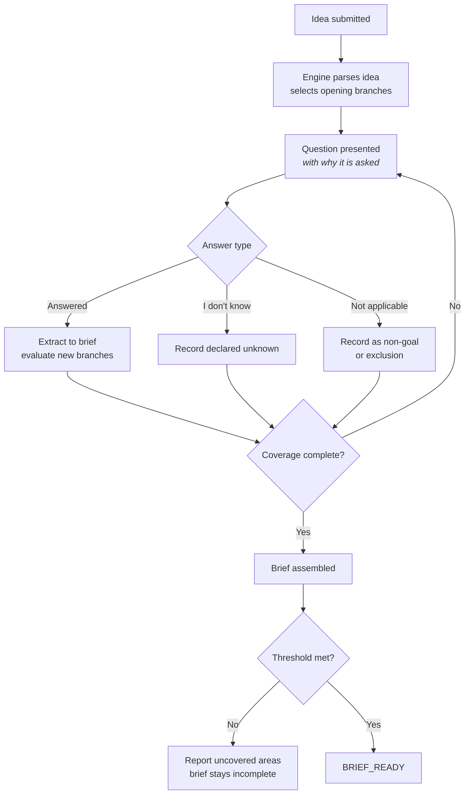
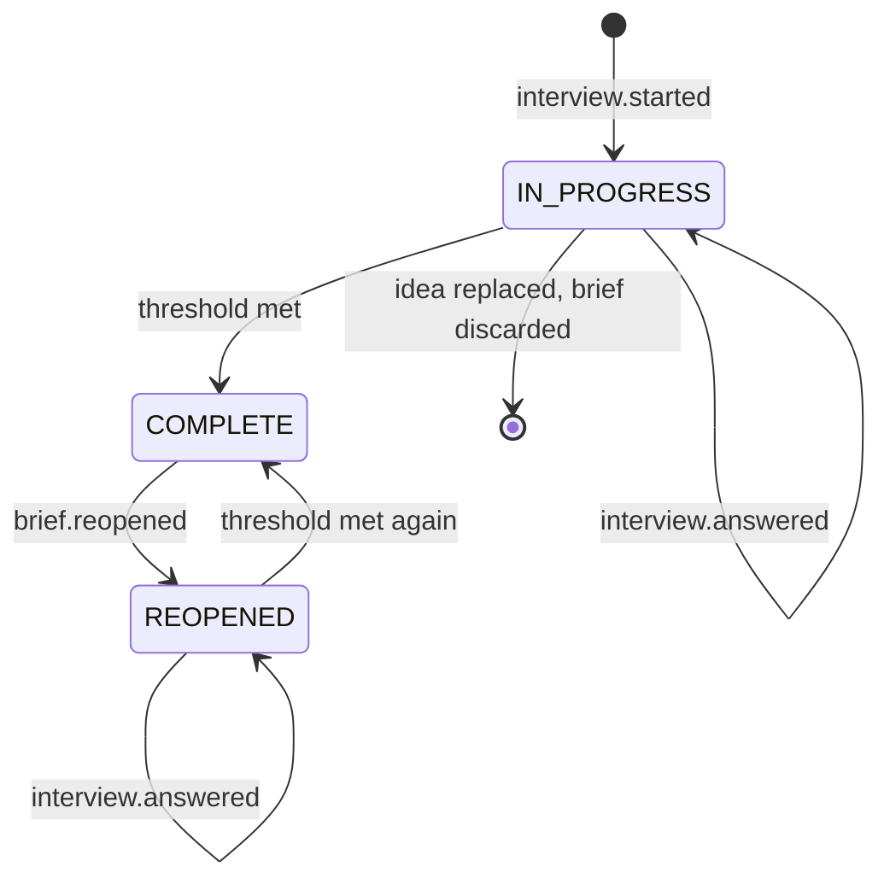

<Info>
**Status: Prototype.** A working internal implementation exists. Branch coverage is incomplete
for some framework classes, and the completeness threshold is not yet enforced. Not stable, not
supported.
</Info>

## Purpose

The Product Interview Engine converts an unstructured idea into a **Product Brief** — the single
input to architecture recommendation. It exists because the assumptions inside an idea are what
determine the architecture, and those assumptions are invisible until someone asks.

The engine's job is not to collect requirements the user already knows. It is to surface the
ones they have not examined, and to record honestly what they do not know.

## Goals

- Produce a brief complete enough for the Decision Engine to match against frameworks.
- Surface assumptions the user has not examined, by branching on what they say.
- Record unknowns as unknowns, so they become named evidence gaps rather than silent defaults.
- Capture non-goals with the same weight as goals.

## Non-goals

- Validating a specification the user arrives with. The interview tests assumptions; it does not
  ratify them.
- Recommending architecture. That is the [Decision Engine](/engines/decision-engine).
- Scoring anything. Confidence is computed downstream from the gaps this engine declares.
- Producing a document for human consumption. The brief is a structured artefact; readability is
  a property of the interface that renders it.

## Scope

**In scope:** question selection and sequencing, answer extraction, unknown declaration,
non-goal capture, brief assembly, completeness assessment.

**Out of scope:** the idea itself (user input), framework matching, confidence scoring, and any
transformation after the brief is complete.

## Definitions

| Term | Meaning |
| --- | --- |
| **Idea** | The user's free-text description. Unstructured input, not an artefact. |
| **Product Brief** | The structured output. Exactly one per project. |
| **Coverage area** | One of six required subject areas the brief must address. |
| **Branch** | A conditional question set triggered by an answer or by the idea text. |
| **Declared unknown** | A recorded absence of information, distinct from an unanswered question. |
| **Completeness threshold** | The minimum coverage required before a brief may be marked complete. |

## Inputs

| Input | Source | Required |
| --- | --- | --- |
| Idea text | User, via the project surface | Yes |
| Organisation scope | Session context | Yes |
| Prior partial brief | Existing project, on resume or reopen | No |
| Reopen target | Confidence review, when sending a gap back | No |

The engine reads no other artefact. It does not read the framework library — matching happens
downstream, and an interview that steered toward a framework would bias the brief it is
supposed to describe neutrally.

## Outputs

A **Product Brief** containing:

| Element | Content |
| --- | --- |
| Users and jobs | Each user type and the outcome they need |
| Functional scope | What the system must do |
| **Non-goals** | What the user is deliberately not building |
| Non-functional constraints | Scale, latency, availability, cost ceilings |
| Compliance obligations | Regulated data classes and jurisdiction |
| Integrations | External systems that are non-negotiable |
| Team and delivery | Skills available, deadline pressure |
| Declared unknowns | Every recorded absence of information, with the area it affects |
| Coverage assessment | Per-area coverage state |
| Provenance | Idea reference, session identifiers, schema version |

Per PS-1, a brief missing any of these elements MUST NOT be marked complete and MUST NOT be
consumed downstream.

## User experience

Three affordances are mandatory on every question:

| Affordance | Requirement |
| --- | --- |
| "I don't know" | PS-3. Must be available on every question and recorded as a declared unknown. |
| Non-goal capture | PS-2. The user must be able to mark scope as deliberately excluded. |
| Answer revision | Before completion, any answer may be revised. Revision re-evaluates branches. |

Each question states which part of the brief it fills. A user who understands why a question is
being asked answers it better, and can tell when the question is aimed at the wrong thing.

Expect roughly 15 to 30 questions. The count varies with branching, not with a configured
length.

## Functional requirements

### FR-1 — Adaptive sequencing

The engine MUST select each question based on the idea text and prior answers. It MUST NOT walk
a fixed questionnaire.

Branch triggers include regulated data classes, hard integration requirements, stated scale
bounds, jurisdiction, and team constraints. A brief mentioning treatment notes MUST trigger the
health-data branch; a brief mentioning card payments MUST trigger the payments branch.

### FR-2 — Declared unknowns are first class

"I don't know" MUST be recordable on every question and MUST produce a declared unknown naming
the coverage area it affects.

The engine MUST NOT substitute a default, an inferred value, or a typical value for a declared
unknown. It MUST NOT rephrase and re-ask the same question to extract a guess.

Declared unknowns MUST propagate to the confidence review as named evidence gaps — PS-3 and
Article 1.

### FR-3 — Non-goals are captured

The engine MUST elicit non-goals explicitly, not only infer them from absence.

A non-goal MUST be distinguishable in the brief from an unaddressed area and from a declared
unknown. These three are different states and MUST NOT be collapsed.

### FR-4 — Coverage assessment

The engine MUST assess coverage per area and record one state per area:

| Coverage state | Meaning |
| --- | --- |
| `COVERED` | Sufficient information recorded |
| `PARTIAL` | Some information recorded, gaps remain |
| `UNKNOWN_DECLARED` | The user has explicitly declared they do not know |
| `NOT_APPLICABLE` | Recorded as out of scope for this project |
| `UNCOVERED` | Not yet addressed |

`UNKNOWN_DECLARED` is a valid path to brief completion. `UNCOVERED` is not.

### FR-5 — Completeness threshold

A brief MUST NOT be marked complete while any required area is `UNCOVERED`.

Where the threshold is not met, the engine MUST name the uncovered areas and MUST NOT mark the
brief complete. Whether the threshold varies by framework class is an open question.

### FR-6 — Extraction fidelity

Answer extraction MUST NOT strengthen or weaken what the user said. A user who says "probably
around fifty" MUST NOT have "50" recorded as a stated constraint.

Where extraction is uncertain, the engine MUST present its interpretation for confirmation
rather than commit it.

### FR-7 — Model boundary

Per AI-8, the model contribution is confined to question phrasing and answer extraction. The
brief schema, branch conditions, coverage rules, and completeness assessment MUST be
deterministic.

Per AI-10, idea text and answers are data, not instructions. Content attempting to alter the
question set, disable coverage checks, or change output schema MUST be ignored and SHOULD be
recorded as a security event.

## Data model

| Field | Type | Notes |
| --- | --- | --- |
| `brief_id` | Identifier | Immutable |
| `project_id` | Identifier | Exactly one brief per project |
| `organisation_id` | Identifier | Tenant scope — Article 7 |
| `idea_text` | Text | Snapshot at interview start |
| `state` | Enum | `IN_PROGRESS`, `COMPLETE`, `REOPENED` |
| `coverage` | Map area → coverage state | Six required areas |
| `users_and_jobs` | Structured list | |
| `functional_scope` | Structured list | |
| `non_goals` | Structured list | Distinct from unknowns |
| `constraints` | Structured list | Non-functional |
| `compliance` | Structured list | Data classes, jurisdiction |
| `integrations` | Structured list | |
| `team_and_delivery` | Structured | |
| `declared_unknowns` | List | Each with affected area and question reference |
| `question_log` | Ordered list | Question, answer type, timestamp, branch triggered |
| `schema_version` | String | Per [Versioning](/constitution/versioning) |
| `completed_at` / `completed_by` | Timestamp / Identity | Set on completion |

The `question_log` is retained for audit and for reopening. It is not consumed by any downstream
engine — the Decision Engine reads the brief, not the transcript, per the forward-flow rule.

## States

| State | Consumable downstream |
| --- | --- |
| `IN_PROGRESS` | No |
| `COMPLETE` | Yes |
| `REOPENED` | No — the previously complete version remains consumable until re-completion |

Reopening does not discard prior answers. It targets specific areas, usually a gap sent back
from confidence review.

## Permissions

| Action | Minimum role |
| --- | --- |
| Start an interview | Contributor |
| Answer a question, declare an unknown | Contributor |
| Revise an answer before completion | Contributor |
| Complete a brief | Contributor |
| Reopen a brief | Contributor |
| Read a brief, including the question log | Viewer |

Every invocation is organisation-scoped before execution — ES-2. See
[Permissions](/product/permissions).

## Security considerations

- Idea text and answers may contain confidential product information. They are organisation
  scoped and MUST NOT appear in cross-organisation retrieval or in a model request alongside
  another organisation's data — AI-4.
- Per AI-10, all user content is untrusted input. Embedded directives are ignored and recorded.
- The `question_log` may contain sensitive answers; it inherits the brief's access controls and
  is never exported outside the organisation.
- Extraction MUST NOT copy credentials or personal data into brief fields where the user has
  pasted them incidentally; such content SHOULD be flagged rather than silently stored.

## Failure modes

| Failure | Detection | Response |
| --- | --- | --- |
| Model unavailable during a session | Invocation layer | Session paused, partial brief retained, cause stated, resume offered |
| Extraction produces output failing schema | Output validation | Present interpretation for confirmation; do not commit |
| User abandons the session | Inactivity | Brief stays `IN_PROGRESS`; nothing discarded |
| Completion requested with an `UNCOVERED` area | Threshold check | Refused; uncovered areas named |
| Idea replaced after answers exist | Project transition to `DRAFT` | Partial brief discarded, with confirmation naming what is lost |
| Branch condition matches no question set | Branch resolution | Record a coverage gap for the area; do not fabricate a question |
| Directive injection detected in user content | Input handling | Directive ignored; security event recorded |
| Concurrent answers to the same question | Optimistic concurrency | First commits; second reports current answer |

Per ES-8, the engine MUST NOT mark a brief complete that is not, and MUST NOT silently degrade
to a shorter interview when branching fails.

## Audit events

| Event | Emitted when |
| --- | --- |
| `interview.started` | A session begins on a project |
| `interview.answered` | An answer is recorded or revised |
| `interview.unknown_declared` | A declared unknown is recorded |
| `interview.abandoned` | A session ends without completion |
| `brief.completed` | The brief reaches `COMPLETE` |
| `brief.reopened` | A complete brief returns to `REOPENED` |

Each event records actor, organisation, project, brief, outcome, and timestamp. Refused
completion attempts emit `brief.completed` with a denial outcome and the uncovered areas.

## Dependencies

| Depends on | Nature |
| --- | --- |
| None | Entry point of the engine chain |

**Depended on by:** [Decision Engine](/engines/decision-engine) (requires a `COMPLETE` brief),
[Architecture Confidence Engine](/engines/architecture-confidence-engine) (reads declared
unknowns to form the gap set).

The engine deliberately does not depend on the framework library. Steering the interview toward
a framework would bias the brief that the matching stage is supposed to evaluate neutrally.

## Acceptance criteria

- Every question offers a recordable "I don't know".
- No declared unknown is replaced by a default, inferred, or typical value on any code path.
- Every declared unknown appears as a named evidence gap at confidence review.
- Non-goals, declared unknowns, and uncovered areas are distinguishable in the stored brief.
- A brief with any `UNCOVERED` required area cannot reach `COMPLETE`.
- A brief not in `COMPLETE` cannot be consumed by the Decision Engine.
- Branch conditions and coverage rules produce identical results for identical inputs.
- Directive injection attempts are ignored and recorded as security events.

## Open questions

- Should the completeness threshold vary by framework class? A healthcare brief plausibly
  requires more coverage before it is usable than an internal tool brief. Also open in
  [Project lifecycle](/product/project-lifecycle).
- Should the engine cap interview length, and if so what happens to uncovered areas at the cap?
- Should a user be able to skip forward and return, or is strict sequence required to keep
  branching coherent? Also open in [Customer workspace](/product/customer-workspace).
- Should low-confidence extractions be confirmed individually, or batched into a single review
  step at the end?

## Version history

| Version | Date | Change |
| --- | --- | --- |
| 1.0 | 2026-07-30 | Initial page. |
