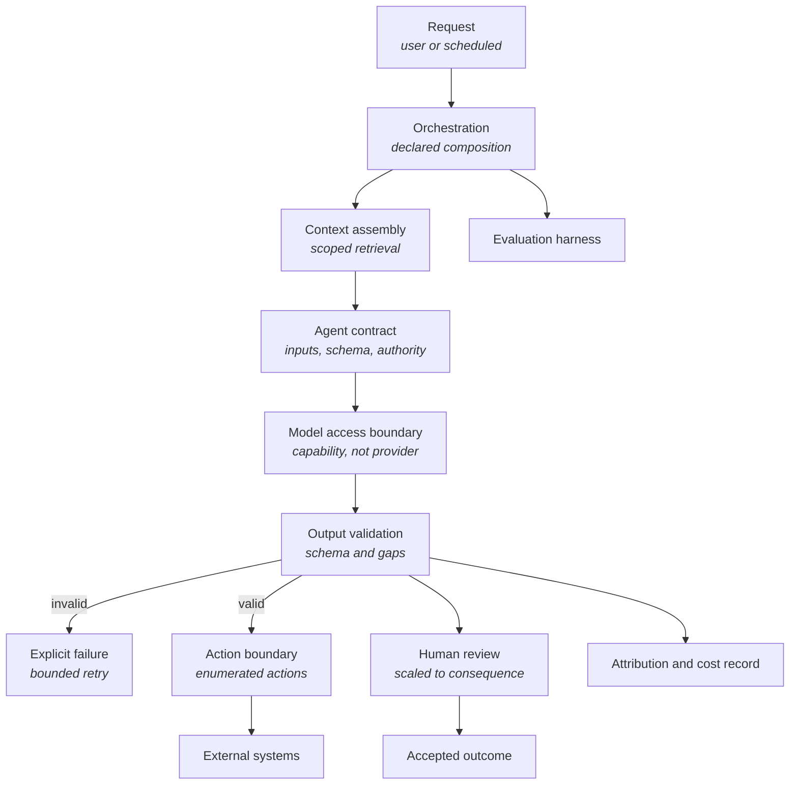

<Info>
**Status: Planned.** This framework is authored to the
[Framework standard](/frameworks/framework-standard) but is not yet published into the validated
library, and MUST NOT be matched against a brief until it is — Article 5. See
[Framework Library](/frameworks/overview).
</Info>

## Identity

| Field | Value |
| --- | --- |
| Framework ID | `devos.ai-agent` |
| Framework class | Systems whose principal work is performed by models under contract |
| Composition role | `shape` |
| Version | 1.0 |
| Status | Planned |
| Derived from | None — DevOS reference framework |

## Purpose

The AI Agent framework describes a system whose principal work — not an assisting feature — is
performed by agents: AI components operating under published contracts, each performing a bounded
task with declared inputs, output schema, and authority limits.

It exists because the failure modes of this class are not the failure modes of conventional
systems. Correctness is distributional rather than binary, cost and latency vary per request, and
the component most likely to exceed its authority is the one hardest to constrain by review.

<Note>
**Terminology.** "Agent" here carries its DevOS meaning — an AI component operating under a
published contract to perform a bounded task — applied to the system being designed. DevOS's own
agents are invoked through [AI Connect](/architecture/ai-connect) and specified in
[AI Agents](/agents/overview); the agents this framework describes belong to the adopting
organisation's system. The [AI standards](/constitution/ai-standards) bind DevOS, not systems
DevOS helps design, but the discipline they encode is the reason this framework's shape looks the
way it does.
</Note>

## Applicability conditions

| Brief element | Condition | Weight | Rationale |
| --- | --- | --- | --- |
| Functional scope | The brief states that the system's principal work is performed by models rather than by deterministic rules | `strong` | This is what distinguishes the class from a system with a model-backed feature |
| Functional scope | The brief describes multi-step work in which the system selects the steps rather than following a fixed sequence | `strong` | Step selection is what makes authority limits and evaluation structural rather than optional |
| Integrations | The brief names external systems the system must act on, not only read from | `strong` | Acting on external systems is where authority limits become load-bearing |
| Users and jobs | The brief names outcomes that require human review before they take effect | `supporting` | Review placement shapes the whole execution model |
| Non-functional constraints | The brief states tolerance for variable per-request latency or cost | `supporting` | Variable cost and latency are inherent here and must be accepted in the brief, not discovered later |
| Compliance obligations | The brief names obligations attaching to automated decisions, or to data leaving the organisation for processing | `supporting` | These obligations constrain where model execution may happen at all |

## When not to use this

| Condition | Fits better |
| --- | --- |
| Model use is a feature inside a subscription product, and the product would still exist without it | [SaaS](/frameworks/saas) |
| Model assistance supports an organisation's own staff in their existing workflow | [Internal Tool](/frameworks/internal-tool) |
| The task has a computable correct answer and the brief tolerates no distributional error | No framework — the work is deterministic and should not be delegated to a model |
| The system intermediates between parties, with models used to match them | [Marketplace](/frameworks/marketplace) |
| The primary surface is an installed client and model execution must happen on the device without connectivity | [Mobile](/frameworks/mobile) or [Desktop](/frameworks/desktop), which name on-device execution as an open decision |
| The brief requires that no data leaves the organisation and no model may be self-hosted | No framework in the library covers this |

A brief whose accuracy requirement cannot be met distributionally should produce `NO_MATCH`. This
framework MUST NOT be recommended as an approximation of a deterministic requirement — PS-4.

## Failure modes

Ordered by what breaks earliest.

| What breaks | Under what pressure | Early signal | Usual remedy |
| --- | --- | --- | --- |
| Agent authority | Feature growth, where an agent is given one more action because it is already in the loop | An agent whose actions can no longer be listed in one table | A published contract per agent, with the action set enumerated and enforced outside the model |
| Quality visibility | Any change: to a prompt, a model version, or the retrieval corpus | Quality assessed by trying a few examples by hand | An evaluation set that runs on every change, with results recorded against the change |
| Context assembly | Corpus growth and heterogeneity | Failures traced to what was retrieved rather than to how it was processed | Retrieval scoped and ranked deliberately, and treated as the primary quality lever it usually is |
| Cost per outcome | Growth in usage and in step count per request | Cost that grows faster than volume, with no per-outcome figure available | Cost recorded per execution and attributed to the outcome, so a change's cost is visible with its quality |
| Handling of untrusted content | Any content the system did not author entering the context | Content that contains instructions being processed as though it were only data | Treat retrieved and user-supplied content as data, never as instruction — the same failure DevOS addresses in AI-10 |
| Human review | Volume growth, once review is the throughput limit | Reviewers approving at a rate that implies they are not reading | Review scaled to consequence rather than applied uniformly, so scarce attention reaches what matters |
| Structural stability of output | Model or prompt change | Downstream code breaking on output shape rather than on output content | Output schema validated at the boundary, with structure fixed outside the model |
| Provider dependency | Model deprecation, price change, or availability incident | A single provider identifier appearing throughout the codebase | One model access boundary, with the provider requested by capability rather than by name |

## Abandonment conditions

| Condition | Response |
| --- | --- |
| The work turns out to be deterministic once understood | Replace the agent with the rule. A model performing a computable task is cost and variance for nothing |
| Review cost exceeds the work the system saves | The system is a review-generating machine. Abandon or narrow it to the subset where output is accepted without line-by-line review |
| The required accuracy cannot be evidenced by evaluation, and the consequence of error is material | Abandon rather than tune. This mirrors the stated failure condition DevOS holds itself to in [Vision](/introduction/vision) |
| Obligations prohibit the data reaching any model the organisation can operate | The shape is not available. No framework in the library covers the alternative |
| The system's value has become the surrounding product rather than the agent work | Migrate to [SaaS](/frameworks/saas) or [Internal Tool](/frameworks/internal-tool), with the agents as components |

## Architecture shape

| Component | Responsibility | Property it exists to provide |
| --- | --- | --- |
| Orchestration | Composing agent executions into one piece of work, declared in advance | The composition is inspectable before it runs rather than emergent from model choices |
| Context assembly | Retrieving and scoping what an agent may see | Retrieval scope is a property of the system, not something an agent can widen |
| Agent contract | Declared inputs, output schema, authority limits, escalation path | An agent's authority is bounded by something outside the model |
| Model access boundary | One place that reaches a model, requested by capability rather than by provider name | Providers are replaceable, and cost and attribution are captured once |
| Output validation | Schema validation and gap detection before output is used | Invalid output fails explicitly instead of propagating |
| Action boundary | The enumerated set of external actions available, with authorisation per action | The blast radius of a wrong decision is bounded by construction |
| Human review | Review placed where consequence warrants it | Attention is spent proportionately rather than uniformly |
| Attribution and cost record | Which agent, which model, which inputs, what it cost | A result can be explained and priced after the fact |
| Evaluation harness | A held set of cases run against every change | Quality change is measured rather than felt |

The shape's load-bearing property is that authority lives outside the model. Every constraint that
matters — what may be retrieved, what may be acted on, what output is valid — is enforced by
components the model cannot influence.

## Data and compliance profile

| Element | Content |
| --- | --- |
| Data classes | Input content, retrieved corpus content, assembled context, model output, attribution and cost records, evaluation cases, audit events. Any of these may contain personal or confidential data drawn from the sources the system reads |
| Isolation boundary | The organisation or the end customer, depending on who the system serves. The boundary MUST be applied before retrieval executes, not by filtering results afterwards — the same construction DevOS requires of itself in ES-2 |
| Retention and deletion | Context and output retention is a deliberate choice with a cost: retaining supports debugging, evaluation, and attribution, while retaining reproduces the source data's obligations in a second place. Deletion must reach evaluation sets and cached context, which are the two places it is usually forgotten |
| Regulatory obligations commonly attaching | General data protection regimes covering processed personal data; obligations attaching to automated decision-making where a decision affects a person; contractual restrictions on sending data to a third-party processor |

Whether a specific regime applies depends on jurisdiction, on what is processed, and on what
effect the output has. This framework MUST NOT assert that a regime applies to every adopter —
FS-7.

## Operational cost profile

| Element | Content |
| --- | --- |
| Skills | Evaluation design and interpretation; retrieval and context engineering; contract and schema design; cost attribution; incident response for quality regressions rather than outages; handling of untrusted content |
| Infrastructure | Model access; a retrieval corpus and index; execution and step state; evaluation execution; cost and attribution storage; secret storage; metrics, logs, and alerting on quality as well as availability |
| Operational load | Quality regressions arriving without a deployment, because a provider changed something; cost variance per request; evaluation maintenance as behaviour changes; review capacity that scales with volume rather than with code |
| Smallest viable team | A team that can hold evaluation as a standing obligation, not as a launch task. Where evaluation is nobody's job, quality is unmeasured within one release cycle, and the framework's principal control is absent |

Costs are stated in skills and infrastructure rather than currency, per FS-8. Per-request model
cost is real and material here, but any figure this framework stated would be invented for a
project it has not seen — AI-7.

## Composition

| Composes with | Role | Constraints it contributes | Conflicts it introduces |
| --- | --- | --- | --- |
| [Fintech](/frameworks/fintech) | `constraint` | Authorisation of value movement, ledger integrity, record retention, human authorisation of financial actions | Agent action autonomy conflicts directly with the requirement that value movement is authorised by an identified human |
| [Healthcare](/frameworks/healthcare) | `constraint` | Clinical data handling, access justification, minimum-necessary retrieval, consent and lawful basis | Broad retrieval for context quality conflicts with minimum-necessary access; automated output conflicts with clinical accountability |

Both conflicts are sharper in this framework than in any other shape, because the component under
constraint is the one that decides. They are named, not resolved — resolution is a decision a
human accepts, per Article 4.

This framework MUST NOT compose with another `shape` framework. A brief matching this and
[SaaS](/frameworks/saas) produces two recommendations, not a composition — PS-4.

## Implied decisions

| Decision | Why this framework does not make it |
| --- | --- |
| Where human review sits, and for which outcomes | Depends on consequence, which the brief describes and the framework cannot assume. The lower-risk starting point is review before any external action takes effect, stated as a starting point rather than a recommendation |
| Whether models are accessed from an external provider or operated by the organisation | Depends on obligations and on the skills the brief records |
| Retrieval strategy and corpus scope | Depends on the corpus, which the framework has not seen |
| Whether execution state is durable and resumable, or requests are re-run on failure | Depends on step count and on the cost of repeating work |
| Retention of context and output | A trade between debuggability and obligation, made per adopter |
| How agents are composed: fixed sequence, declared composition, or model-selected steps | The framework requires the composition be declared in advance; how far to constrain it beyond that is open |
| Evaluation content and its acceptance thresholds | Specific to the work; a general threshold would be invented |
| Failure behaviour when a model is unavailable: fail, queue, or degrade to a narrower capability | Depends on whether partial service is useful, which is a product decision |

Each is recorded in the adopting organisation's ledger. A blueprint element implementing one
without a recorded decision is an unattributed element — Article 3.

## Evidence and gaps

**Basis.** Derived from the shape DevOS uses for its own agent execution — contracts, capability
routing, envelopes, and validation, described in [AI Connect](/architecture/ai-connect) — and from
first principles about bounded authority: that a component whose output is distributional must be
constrained by components whose behaviour is not.

**Gaps.**

- No guidance on evaluation set size or composition. Any figure would be invented, and the honest
  position is that the adopter must derive it from their own error consequence.
- The framework does not state when model-selected step composition is acceptable rather than a
  fixed sequence. This is the framework's largest open area, and it is contested below.
- No content on on-device or edge model execution, which changes the shape substantially. A brief
  requiring it is currently underserved.
- Cost attribution is required but no method is given for attributing a multi-step execution's
  cost to a business outcome.
- Calibration of confidence in agent output is not addressed here. DevOS's own approach is in
  [Architecture Confidence Engine](/engines/architecture-confidence-engine), and whether it
  generalises is unevidenced.

**Contested points.**

- Whether agents should select their own steps. Doing so is what makes the class useful for open
  ended work, and is simultaneously the source of its worst failure mode.
- Whether human review should be a gate before action or an audit after it. The gate costs
  throughput; the audit accepts that some wrong actions will take effect.

## Version history

| Version | Date | Change |
| --- | --- | --- |
| 1.0 | 2026-07-31 | Initial framework, authored to the framework standard. |
