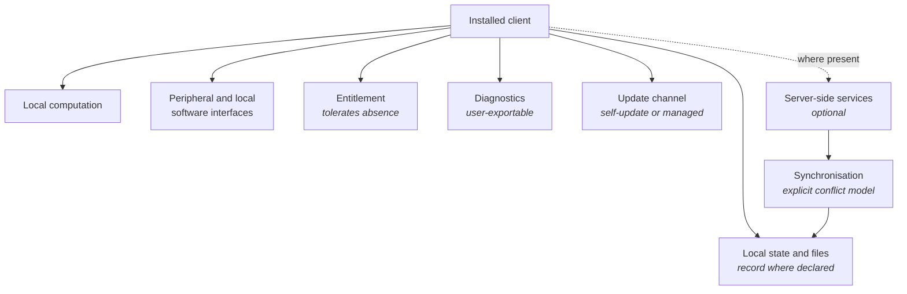

<Info>
**Status: Planned.** This framework is authored to the
[Framework standard](/frameworks/framework-standard) but is not yet published into the validated
library, and MUST NOT be matched against a brief until it is — Article 5. See
[Framework Library](/frameworks/overview).
</Info>

## Identity

| Field | Value |
| --- | --- |
| Framework ID | `devos.desktop` |
| Framework class | Systems whose primary surface is an installed desktop client |
| Composition role | `shape` |
| Version | 1.0 |
| Status | Planned |
| Derived from | None — DevOS reference framework |

## Purpose

The Desktop framework describes a system whose primary surface is an installed client on a
workstation, where the workstation's own resources — local files, local computation, attached
hardware, and other locally installed software — are part of the architecture rather than
incidental to it.

It exists because this class trades a property every hosted shape depends on. The operator cannot
observe the running environment, cannot standardise it, and frequently cannot update it: in a
managed estate, the organisation that owns the workstation decides when the software changes.

## Applicability conditions

| Brief element | Condition | Weight | Rationale |
| --- | --- | --- | --- |
| Functional scope | The brief states the primary surface is a client installed on a workstation | `strong` | An installed workstation client is what introduces environment heterogeneity and update latency |
| Non-functional constraints | The brief requires local computation, direct local file access, or attached hardware | `strong` | These are the requirements a hosted surface cannot satisfy, and the reason to accept this shape's costs |
| Compliance obligations | The brief states that working data must remain on the workstation or within the organisation's network | `strong` | A data-residency requirement at this granularity forces local processing |
| Integrations | The brief names locally installed software the system must interoperate with | `supporting` | Local interoperation is a common driver, and it couples the system to environments the operator does not control |
| Users and jobs | The brief describes sustained sessions in a professional workflow rather than brief interactions | `supporting` | Session length shapes state handling, recovery, and resource use |
| Team and delivery | The brief accepts distribution by managed deployment or self-update rather than by continuous release | `supporting` | Update latency is inherent here and must be accepted in the brief, not discovered later |

## When not to use this

| Condition | Fits better |
| --- | --- |
| A browser-reachable surface would satisfy the brief, with no local file, hardware, or computation requirement | [SaaS](/frameworks/saas) or [Internal Tool](/frameworks/internal-tool) |
| The installed client would only present a hosted surface | [SaaS](/frameworks/saas) — an installed wrapper adds this framework's costs and none of its benefits |
| The primary device is a personal mobile device | [Mobile](/frameworks/mobile) |
| The brief requires a defect fix to reach every user promptly, and the estate is centrally managed by customers | No framework — the customer controls update timing, and this shape cannot commit to it |
| The system's principal work is performed by models, with the workstation as one surface | [AI Agent](/frameworks/ai-agent) |
| The workload is heavy computation the workstation cannot hold, with the client as a control surface | [SaaS](/frameworks/saas), with the computation server-side |

## Failure modes

Ordered by what breaks earliest.

| What breaks | Under what pressure | Early signal | Usual remedy |
| --- | --- | --- | --- |
| Environment assumptions | Any real deployment, across operating system versions, security software, drivers, and locale | Defects reproducible only on a user's machine | A narrow, stated support matrix, and diagnostics that describe the environment without needing access to it |
| Update reach | Managed estates that decide when software changes | A supported version list that keeps growing | Versions that interoperate across a stated range, because the operator does not control upgrade timing |
| Local state integrity | Crashes, power loss, and files opened by other software | Corrupted local state after abnormal termination | Write patterns that are atomic from the user's perspective, and recovery that does not depend on the last shutdown being clean |
| Support diagnosis | Growth in user count on machines the operator cannot see | Support conversations that begin by asking users to describe their environment | Structured diagnostics the user can export, with consent, rather than reconstruction over correspondence |
| Local data protection | Shared workstations, backup software, and device loss | Working data readable by anything running as the user | Protection proportionate to the data class, and an explicit position on what backup software will capture |
| Peripheral and local interoperation | Vendor updates to hardware, drivers, or the software being interoperated with | Breakage arriving without a release of this system | An interface the system owns for each local dependency, so breakage is contained and diagnosable |
| Performance expectations | User hardware the operator did not choose | Complaints concentrated on older machines against an unstated minimum | A stated minimum specification, and degradation that is graceful rather than sudden |
| Entitlement and licensing | Offline or intermittently connected use | Users blocked from working when a check cannot reach the network | An entitlement model that tolerates absence for a stated period and fails to a stated state |

## Abandonment conditions

| Condition | Response |
| --- | --- |
| The local computation, file, or hardware requirement is withdrawn | Migrate the surface to [SaaS](/frameworks/saas). Carrying installation, update, and environment costs for no local benefit is unjustified |
| The cost of environment heterogeneity exceeds the value of local execution | Move the work server-side and reduce the client to a control surface, which is a different shape |
| Obligations prohibit the data class resting on workstations | The shape's premise is unavailable |
| The customer estate blocks updates for long enough that unsupported versions dominate the installed base | The operator has lost the ability to ship fixes, and continuing accumulates liability |

## Architecture shape

| Component | Responsibility | Property it exists to provide |
| --- | --- | --- |
| Local state and files | Holding the working data, and declaring whether it or a server is the record | "Which copy is authoritative" has a stated answer rather than an assumed one |
| Local computation | The work that must happen on the workstation | The requirement that justified this shape is actually served |
| Peripheral and local software interfaces | One owned interface per local dependency | Breakage from a vendor's update is contained and diagnosable |
| Entitlement | Establishing what the user may run, tolerating absence of connectivity | Work is not blocked by a network condition the user cannot fix |
| Diagnostics | Structured, exportable description of the environment and failure | Support does not depend on access to a machine the operator cannot see |
| Update channel | Delivering versions by self-update or by managed packaging | The operator's update expectations match who actually controls the estate |
| Server-side services | Where the system has them: shared state, collaboration, or licensing | The client's independence is a stated boundary rather than an accident |
| Synchronisation | Reconciling local and server state under an explicit conflict model | Divergence is resolved by a stated rule, as in [Mobile](/frameworks/mobile) |

The shape's load-bearing property is that the environment is unknown and unowned. Every component
here exists to keep an unobservable, unstandardised, operator-uncontrolled machine supportable.

## Data and compliance profile

| Element | Content |
| --- | --- |
| Data classes | Working data in local files and local state, credentials and entitlement material, diagnostic and crash payloads which may contain user content, and any server-side data where server-side services exist |
| Isolation boundary | The workstation and its user account. Where the workstation is shared, the user account is the boundary and the architecture must not assume single-occupancy |
| Retention and deletion | Local files persist independently of the software, including in the organisation's backups. Deletion within the application does not reach those copies, and the framework's honest position is that it cannot |
| Regulatory obligations commonly attaching | General data protection regimes covering personal data held locally; sector obligations attaching to the working data; the customer organisation's own endpoint and data-handling policy, which functions as a constraint even where it is not regulation |

Whether a specific regime applies depends on jurisdiction and on the data handled. This framework
MUST NOT assert that a regime applies to every adopter — FS-7.

## Operational cost profile

| Element | Content |
| --- | --- |
| Skills | Client engineering per supported operating system; packaging, signing, and update distribution; local state durability; support engineering for environments the operator cannot observe; interoperation with local software and hardware |
| Infrastructure | Build and packaging per platform; signing material and its custody; an update distribution channel; diagnostics collection where consented; entitlement services where licensing is enforced |
| Operational load | A support matrix that grows with every release and every operating system version; defects reproducible only in environments the operator must recreate; vendor updates arriving outside the operator's release cycle; long-lived versions requiring interoperability |
| Smallest viable team | A team that can carry each supported platform's packaging and support alongside the product work. Support for an unobservable estate is the load most often underestimated, and it grows with installed versions rather than with users |

Costs are stated in skills and infrastructure rather than currency, per FS-8.

## Composition

| Composes with | Role | Constraints it contributes | Conflicts it introduces |
| --- | --- | --- | --- |
| [Fintech](/frameworks/fintech) | `constraint` | Ledger integrity, authorisation of value movement, record retention, segregation of duties | Locally held records conflict with retention and reconciliation obligations the operator must be able to satisfy centrally |
| [Healthcare](/frameworks/healthcare) | `constraint` | Clinical data handling, access justification, consent and lawful basis, protection at rest | Working data resting in local files conflicts with access justification and with deletion obligations that local backups defeat |

Both conflicts arise from the same property: the local file is convenient for the user and
unreachable for the operator. They are named, not resolved — Article 4.

This framework MUST NOT compose with another `shape` framework.

## Implied decisions

| Decision | Why this framework does not make it |
| --- | --- |
| Whether local files or a server hold the record | Depends on whether collaboration and central obligations exist. Where any server-side service exists, declaring the server authoritative for shared data is the common starting point, stated as a starting point rather than a recommendation |
| The supported operating system and version matrix | A commercial decision about reachable users versus support cost |
| Update mechanism: self-update, managed packaging, or both | Depends on whether customers manage their estates, which the brief records |
| Entitlement behaviour when connectivity is absent, and for how long | Trades revenue protection against blocking legitimate work |
| Whether diagnostics may include user content, and whether collection is opt-in | An obligation-bearing choice made per adopter |
| Minimum hardware specification, and behaviour below it | Depends on the user population the brief describes |
| Whether the system supports shared workstations | Changes the state and credential model materially, and is frequently assumed rather than decided |
| Custody of signing material | A security decision with operational consequences, owned by the adopting organisation |

Each is recorded in the adopting organisation's ledger. A blueprint element implementing one
without a recorded decision is an unattributed element — Article 3.

## Evidence and gaps

**Basis.** Derived from the common shape of installed workstation software with local resource
requirements, and from first principles about unowned environments: that software the operator can
neither observe nor update is supported by what it can export and by how narrowly its assumptions
are stated.

**Gaps.**

- No content on air-gapped operation, which several briefs in regulated sectors will require. It
  changes entitlement, update, and diagnostics simultaneously and warrants its own treatment.
- The framework offers no method for choosing a support matrix, because the input is the adopter's
  user population rather than anything the framework knows.
- Local state durability is named as a failure mode but the framework does not describe an
  adequate write pattern, which is platform-specific and would require naming platforms — FS-6.
- No characterisation of how much of an installed base typically lags on old versions, which would
  make the update-reach failure mode quantitative rather than qualitative.

**Contested points.**

- Whether a desktop client should ever be built where a browser-reachable surface is technically
  possible. Practitioners disagree, and the disagreement is usually about workflow integration
  rather than capability.
- Whether to support shared workstations by default. Supporting them constrains the credential
  model everywhere; not supporting them excludes user populations that predictably exist in
  clinical, retail, and manufacturing settings.

## Version history

| Version | Date | Change |
| --- | --- | --- |
| 1.0 | 2026-07-31 | Initial framework, authored to the framework standard. |
