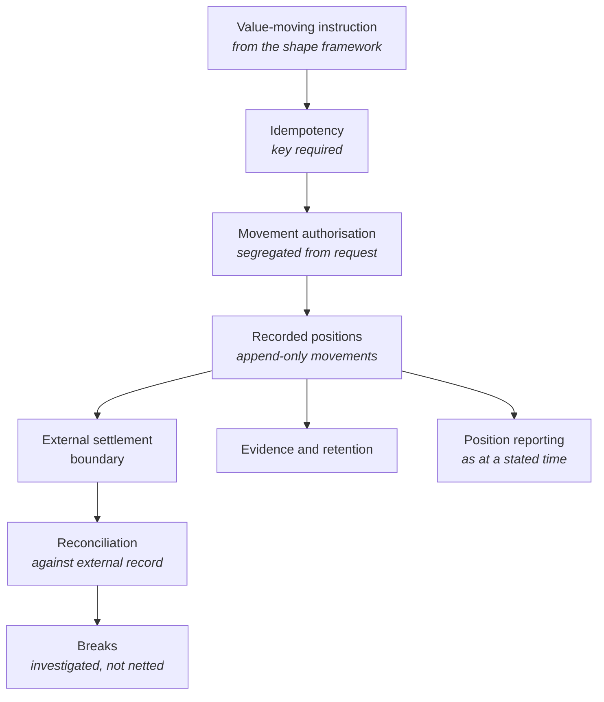

<Info>
**Status: Planned.** This framework is authored to the
[Framework standard](/frameworks/framework-standard) but is not yet published into the validated
library, and MUST NOT be matched against a brief until it is — Article 5. See
[Framework Library](/frameworks/overview).
</Info>

## Identity

| Field | Value |
| --- | --- |
| Framework ID | `devos.fintech` |
| Framework class | Systems holding, moving, or reconciling money |
| Composition role | `constraint` |
| Version | 1.0 |
| Status | Planned |
| Derived from | None — DevOS reference framework |

## Purpose

The Fintech framework is a **constraint framework**. It does not describe a system shape; it
describes the obligations, components, and prohibitions that attach to a system once money is
held, moved, or reconciled, and it is composed onto a shape framework such as
[SaaS](/frameworks/saas) or [Marketplace](/frameworks/marketplace).

It exists because money changes what a defect means. In most systems an inconsistency is a bug to
fix; here it is a discrepancy someone is accountable for, which must be detectable, explainable,
and correctable without editing history.

<Note>
A constraint framework MAY be recommended alone where a brief's obligations dominate its shape,
and the [Decision Engine](/engines/decision-engine) will emit it as a candidate. The usual correct
answer is a composition: a shape framework operated under these constraints.
</Note>

## Applicability conditions

| Brief element | Condition | Weight | Rationale |
| --- | --- | --- | --- |
| Functional scope | The brief states that value moves between parties through the system, or that the system holds funds belonging to someone else | `strong` | Holding or moving others' money is what attaches this framework's obligations |
| Functional scope | The brief describes recording balances or positions, or reconciling against an external financial system | `strong` | A recorded position is the component this framework exists to require |
| Compliance obligations | The brief names financial regulation, payment obligations, or financial record retention | `strong` | An obligation stated in the brief is direct evidence the framework applies |
| Integrations | The brief names a payment, banking, or settlement system as non-negotiable | `supporting` | An external money boundary implies reconciliation and settlement handling |
| Non-functional constraints | The brief states that a discrepancy must be detectable and explainable after the fact | `supporting` | This is the property the framework's ledger and reconciliation components provide |
| Users and jobs | The brief names a role accountable for financial control or approval | `supporting` | Segregation of duties needs a role to segregate to |

## When not to use this

| Condition | Fits better |
| --- | --- |
| The system displays financial information but never holds or moves value | The shape framework alone. Adding this framework's obligations to a reporting surface is cost without benefit |
| Payment is handled entirely by an external system, value never rests with the operator, and no reconciliation obligation is stated | The shape framework alone, with the money boundary named as an external dependency |
| The system records the organisation's own expenditure for its own purposes, with no external party's funds involved | [Internal Tool](/frameworks/internal-tool) with its audit requirements, not this framework |
| The system custodies digital assets or issues instruments | No framework in the library covers custody or issuance |
| The system makes automated credit or lending decisions | Partially covered — the ledger and reconciliation constraints apply, decisioning obligations are a gap |

The last two rows are gaps in the library. A brief describing custody or issuance should surface
the gap rather than receive this framework as an approximation — PS-4 and AI-6.

## Failure modes

Ordered by what breaks earliest.

| What breaks | Under what pressure | Early signal | Usual remedy |
| --- | --- | --- | --- |
| Balance correctness | Concurrency, retries, and partial failures | Balances computed differently in two places, or derived on read | One recorded position per party, written as movements, never derived by summing at read time |
| Idempotency of value movement | Network retries, client retries, and job re-execution | The same instruction producing two movements | An idempotency key carried by every value-moving instruction and enforced at the ledger |
| Reconciliation | Deferral, because nothing appears wrong yet | A reconciliation run that has never completed cleanly, tolerated as normal | Reconciliation from the first movement, with breaks investigated rather than accumulated |
| Reversal modelling | Refunds, chargebacks, and corrections | Corrections applied by editing a prior record | Reversals recorded as new movements referencing the original, with history intact — the same principle as supersession in [Decision Ledger](/engines/decision-ledger) |
| Rounding and currency handling | Splits, fees, percentages, and multi-currency | Totals that differ by small amounts depending on the calculation path | A stated rounding rule applied in one place, and money represented in minor units rather than in fractions |
| Authorisation of movement | Feature growth, where an automated path gains the ability to move value | Value-moving capability reachable from a path no human approves | Authorisation held outside the requesting component, with segregation of duties preserved |
| Settlement timing | Cut-offs, weekends, and provider windows | Reports that disagree depending on the hour they were run | Explicit position dating, distinguishing when a movement was instructed, settled, and recognised |
| Evidence retention | Investigation or audit, often years later | Evidence needed to explain a movement no longer available | Retention decided against obligation rather than against storage convenience |

## Abandonment conditions

| Condition | Response |
| --- | --- |
| The system stops holding or moving value | The constraint no longer composes, but retention obligations for records already created survive the change |
| Obligations require a regulatory authorisation the operator will not hold | Route value through an authorised third party so it never rests with the operator, reducing the constraint. If that is not possible, the system cannot be built as briefed |
| Discrepancies cannot be explained from the record | The ledger has failed at its only job. Rebuilding the position model is the remedy; continuing while adding features is not |
| A regulator reclassifies the operator's activity | Re-examine the composition entirely; the obligations that attach may exceed this framework's content |

## Architecture shape

A constraint framework adds components to a shape framework rather than replacing them. The
components below are what this framework requires the composition to contain.

| Component | Responsibility | Property it exists to provide |
| --- | --- | --- |
| Idempotency | Rejecting duplicate instructions by key | A retry cannot move value twice |
| Movement authorisation | Deciding whether a movement may occur, separately from the component requesting it | The requester cannot authorise itself |
| Recorded positions | Append-only movements from which balances are read, never recomputed on the fly | Every balance is explainable as a sequence of movements |
| External settlement boundary | The point at which value leaves the operator's record for an external system | Where the operator's accountability begins and ends is explicit |
| Reconciliation | Comparing the internal record against the external one on a stated cadence | Discrepancies are found by the operator rather than by the counterparty |
| Breaks handling | Investigation of differences, without netting them away | A discrepancy is a question with an answer, not a rounding adjustment |
| Evidence and retention | Holding what is needed to explain a movement for as long as obligations require | The record survives long enough to answer questions that arrive late |
| Position reporting | Reporting positions as at a stated time | Two reports of the same period agree |

The framework's load-bearing property is that the position is recorded rather than derived. Every
other constraint here depends on it: authorisation, reconciliation, reversal, and reporting all
operate on the movement record.

## Data and compliance profile

| Element | Content |
| --- | --- |
| Data classes | Movement and position records, party identity and verification evidence, references to payment instruments held by external systems, settlement and reconciliation records, evidence supporting investigations, audit events |
| Isolation boundary | Inherited from the shape framework it composes with. This framework does not relax it: an organisation-scoped shape stays organisation-scoped, and reconciliation processes are scoped like any other access path |
| Retention and deletion | Financial records typically carry retention obligations measured in years, and those obligations override erasure requests for the records themselves. The architecture must separate party identity data from movement records so identity can be minimised while the movement record survives |
| Regulatory obligations commonly attaching | Financial record retention; anti-money-laundering and counter-fraud regimes; client-money safeguarding rules where funds are held on behalf of others; payment scheme rules, which are contractual but function as constraints; tax reporting obligations |

Which regime applies depends on jurisdiction, on the activity performed, and on whether value
rests with the operator. This framework MUST NOT assert that a regime applies to every adopter,
and MUST NOT be read as advice that a specific obligation is or is not triggered — FS-7.

## Operational cost profile

| Element | Content |
| --- | --- |
| Skills | Ledger and position modelling; reconciliation and breaks investigation; financial control practice; regulatory interpretation, usually from outside the engineering team; incident handling where the incident is a discrepancy rather than an outage |
| Infrastructure | Append-only storage for movements; scheduled reconciliation execution; evidence storage with long retention; secret storage for settlement credentials; reporting that can reproduce a position as at a past time |
| Operational load | Reconciliation on a stated cadence, with breaks investigated rather than deferred; periodic audit and reporting; provider and scheme changes arriving on their timetable; investigation requests that arrive long after the event |
| Smallest viable team | A team that can staff financial control separately from the ability to move value. Where the same person can instruct and approve a movement, segregation of duties is absent regardless of what the software supports |

Costs are stated in skills and infrastructure rather than currency, per FS-8. This framework
concerns money but MUST NOT state monetary figures for its own operation — they would be invented
for a project it has not seen, AI-7.

## Composition

This framework contributes constraints to a shape framework. It contributes no system shape of
its own.

| Composes with | Constraints contributed | Conflicts introduced |
| --- | --- | --- |
| [SaaS](/frameworks/saas) | Recorded positions, movement authorisation, idempotency, reconciliation, financial record retention | Retention conflicts with per-organisation deletion on termination |
| [Marketplace](/frameworks/marketplace) | All of the above, plus multi-party settlement and split handling | Held balances conflict with the pass-through assumption; retention conflicts with participant erasure |
| [AI Agent](/frameworks/ai-agent) | All of the above, plus human authorisation of value-moving actions | Agent autonomy conflicts directly with authorisation by an identified human |
| [Internal Tool](/frameworks/internal-tool) | All of the above, plus segregation of duties | Segregation conflicts with a small team where one person builds, approves, and operates |
| [Mobile](/frameworks/mobile) | All of the above, plus stronger authentication for value-moving actions | Offline operation conflicts with authorisation checked against authoritative state |
| [Desktop](/frameworks/desktop) | All of the above, plus custody of local records | Locally held records conflict with central retention and reconciliation |

Conflicts are named, not resolved. Resolution is a decision a human accepts at confidence review —
Article 4.

Whether this framework may compose with [Healthcare](/frameworks/healthcare) on one brief — a
system that both moves money and handles clinical data — is an open question in
[Framework Library](/frameworks/overview).

## Implied decisions

| Decision | Why this framework does not make it |
| --- | --- |
| Whether value ever rests with the operator | The determining decision for the whole composition, made per jurisdiction and per commercial model. The lower-obligation starting point is pass-through, stated as a starting point rather than a recommendation |
| Ledger granularity: per party, per party per currency, or per party per product | Depends on reporting obligations and on product shape |
| Reconciliation cadence and the tolerance for open breaks | Depends on obligations and volume; any figure this framework stated would be invented |
| How reversals are represented, and whether partial reversals are supported | Depends on the product's commercial rules |
| Rounding rule and currency representation | Must be stated once and applied everywhere; which rule is a decision |
| Who authorises value movement, and above what threshold a second approver is required | An organisational control decision |
| Retention periods per record class | Determined by the obligations that actually apply to the adopter |
| Which regulated activities are performed and which are delegated to an authorised third party | Commercial, legal, and architectural at once |

Each is recorded in the adopting organisation's ledger. A blueprint element implementing one
without a recorded decision is an unattributed element — Article 3.

## Evidence and gaps

**Basis.** Derived from the common shape of systems recording and reconciling value, and from
first principles about accountability: that a discrepancy must be explainable from the record, and
that a record which can be edited cannot explain anything.

**Gaps.**

- No jurisdiction-specific obligations are stated, deliberately. The framework names obligation
  categories; which apply is determined by the brief and by advice this framework cannot give.
- Custody of digital assets and instrument issuance are not covered.
- Automated credit and lending decisions are not covered, though the ledger constraints apply.
- No reconciliation cadence or break-tolerance figures. Both would be invented — AI-7.
- Multi-currency handling is named as a failure mode but the framework does not describe an
  adequate representation for it beyond minor units and a single rounding rule.

**Contested points.**

- Whether reconciliation should be continuous or periodic. Continuous finds discrepancies sooner;
  periodic against a settled external record is what the external systems' own cadence usually
  permits.
- Whether one ledger should serve all products or each product should hold its own. A single
  ledger reconciles trivially and constrains product teams; separate ledgers do the reverse.

## Version history

| Version | Date | Change |
| --- | --- | --- |
| 1.0 | 2026-07-31 | Initial framework, authored to the framework standard. |
