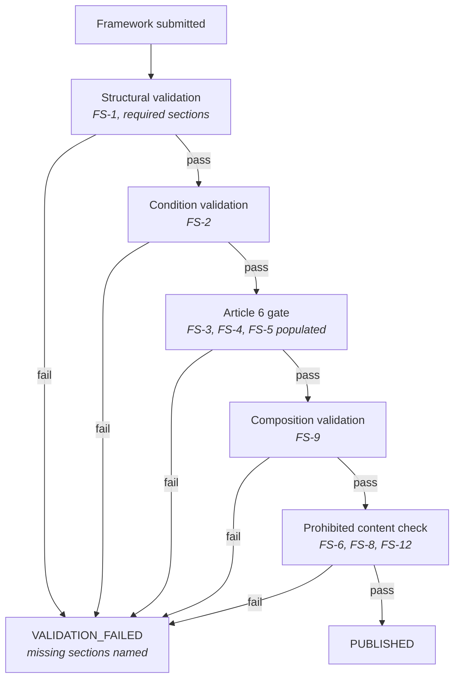

<Info>
**Status: Planned.** This standard is normative now and binding on every framework authored for
the library. Automated conformance checking by the Framework Engine is Planned — until it exists,
conformance is checked at review. See [Framework Library](/frameworks/overview).
</Info>

## Purpose

This standard defines what a framework MUST contain, how its applicability conditions MUST be
expressed, and what blocks its publication. It exists because a framework is not prose: the
[Decision Engine](/engines/decision-engine) matches against its conditions, the
[Architecture Confidence Engine](/engines/architecture-confidence-engine) scores against its
unmet conditions, and a [decision record](/engines/decision-ledger) pins its version. A framework
that cannot be read structurally cannot be matched, scored, or pinned.

Requirement keywords follow RFC 2119 — see [Terminology](/introduction/terminology).

## Scope

Applies to: every framework in the library, including DevOS reference frameworks, organisation
adaptations, and organisation-authored frameworks.

Does not apply to: blueprints, which describe one project's implementation rather than a class of
system, or to the [Reference](/reference/framework-template) document template, which is the
authoring aid for this standard rather than the standard itself.

## Required sections

Every framework MUST contain these sections, with these headings, in this order. Headings are
part of the retrieval contract — Article 10 in [Principles](/constitution/principles) — so a
framework using different headings fails validation even where the content is present.

| # | Section | Requirement |
| --- | --- | --- |
| 1 | Identity | MUST |
| 2 | Purpose | MUST |
| 3 | Applicability conditions | MUST |
| 4 | When not to use this | MUST — Article 6 |
| 5 | Failure modes | MUST — Article 6 |
| 6 | Abandonment conditions | MUST — Article 6 |
| 7 | Architecture shape | MUST |
| 8 | Data and compliance profile | MUST |
| 9 | Operational cost profile | MUST |
| 10 | Composition | MUST |
| 11 | Implied decisions | MUST |
| 12 | Evidence and gaps | MUST |
| 13 | Version history | MUST |

A framework missing any section, or containing a section with no content, MUST NOT be published.
An empty section is a validation failure, not a warning: a "When not to use this" heading above
nothing is precisely the omission Article 6 exists to prevent.

## FS-1 — Identity is declared

Every framework **MUST** declare its identity in a single table:

| Field | Content |
| --- | --- |
| Framework ID | Stable identifier. Never reused after deprecation. |
| Framework class | The class of system this framework describes. Exactly one. |
| Composition role | `shape` or `constraint`. Exactly one. |
| Version | `MAJOR.MINOR`. |
| Status | Exactly one status from [Status definitions](/reference/status-definitions). |
| Derived from | For an adaptation, the reference framework and version it was derived from. Otherwise none. |

The framework ID **MUST NOT** change across versions, because pinned references resolve on it.
The composition role **MUST NOT** change without a MAJOR increment, because it determines what
the framework may compose with.

## FS-2 — Applicability conditions are evaluable

Every framework **MUST** declare at least one applicability condition. Each condition **MUST**
name the brief element it evaluates and the state of that element that satisfies it.

| Element | Requirement |
| --- | --- |
| Brief element | **MUST** name an element that exists in the Product Brief — see [Product Interview Engine](/engines/product-interview-engine) |
| Condition | **MUST** be evaluable against that element without interpretation |
| Weight | `strong` or `supporting`. A framework **MUST** declare at least one `strong` condition. |
| Rationale | Why this condition indicates the framework applies |

Conditions **MUST NOT** be expressed as prose a reader must interpret. "Suits growing companies"
is not a condition; "the brief declares more than one paying organisation using one deployment"
is. The difference is whether the Decision Engine can evaluate it and record which brief element
satisfied it — FR-2 in [Decision Engine](/engines/decision-engine).

A condition referencing a brief element that does not exist **MUST** fail validation. This is what
keeps the library and the brief schema from drifting apart.

## FS-3 — Non-applicability is stated

Every framework **MUST** state the conditions under which it is the wrong choice, in a section
headed "When not to use this".

Each entry **MUST** name the condition and the framework that is more likely to fit instead, or
state that no framework in the library covers it. "No framework covers this" is an acceptable and
useful entry — it is how the library records its own gaps.

A framework **MUST NOT** satisfy this section with hedged strengths. "Less suitable at very large
scale" is not a non-applicability condition; "the brief declares a hard requirement for
sub-second responses under sustained global load" is.

## FS-4 — Failure modes are named

Every framework **MUST** state what breaks first under stress, in order of what breaks earliest.

Each failure mode **MUST** state:

| Element | Content |
| --- | --- |
| What breaks | The component or property that fails |
| Under what pressure | The load, scale, team, or regulatory pressure that causes it |
| Early signal | What is observable before the failure becomes acute |
| Usual remedy | What is normally done about it, or that the remedy is a rearchitecture |

A framework **MUST NOT** state failure modes generically. "Can become complex" applies to every
architecture and discriminates between none.

## FS-5 — Abandonment conditions are stated

Every framework **MUST** state the conditions under which a project should stop using it and
adopt a different architecture.

An abandonment condition differs from a failure mode: a failure mode is what breaks and is
usually remediable within the architecture, while an abandonment condition is the point at which
remediation is no longer the right response. A framework whose abandonment conditions duplicate
its failure modes has not distinguished the two, and **MUST NOT** be published.

Where abandonment implies a migration, the framework **SHOULD** name the framework usually
migrated to.

## FS-6 — Architecture shape is described without vendors

Every framework **MUST** describe the shape of the system: its principal components, the
boundaries between them, the data it holds, and the properties the shape exists to provide.

A framework **MUST NOT** name a vendor, product, hosting platform, library, or language version.
Vendor selection is a decision the adopting organisation makes and records in its own ledger; a
framework that pre-empts it removes a decision the organisation is accountable for and makes the
framework wrong the moment the market moves.

Where a shape depends on a category of technology, the framework **MUST** name the category and
the property required of it — "a store providing transactional consistency across the
organisation boundary", not a product name.

## FS-7 — Data and compliance profile is explicit

Every framework **MUST** state the data classes the architecture holds, the isolation boundary it
assumes, and the regulatory obligations that commonly attach to it.

| Element | Requirement |
| --- | --- |
| Data classes | **MUST** name what the system holds, including any regulated class |
| Isolation boundary | **MUST** state what separates one customer's data from another's |
| Retention and deletion | **MUST** state what the architecture assumes about both |
| Regulatory obligations | **MUST** name obligations that commonly attach, and **MUST NOT** assert that a regime applies to every adopter |

A framework **MUST NOT** present compliance advice as settled for a specific project. Obligations
depend on jurisdiction and processing, which live in the brief. Where a framework cannot state an
obligation without knowing the brief, it **MUST** record that as an evidence gap under FS-12
rather than assume.

## FS-8 — Operational cost profile is stated in skills and infrastructure

Every framework **MUST** state what running the architecture requires, expressed as skills and
infrastructure rather than currency.

| Element | Requirement |
| --- | --- |
| Skills | The capabilities a team **MUST** have to operate it |
| Infrastructure | The categories of infrastructure it requires |
| Operational load | What must be watched, patched, and responded to |
| Smallest viable team | The team size below which the architecture is not operable |

Costs **MUST NOT** be expressed as monetary figures or as benchmark numbers. A currency figure
would be invented for a project the framework has not seen, and AI-7 treats an invented specific
as a defect of the same severity as an incorrect calculation.

The Decision Engine surfaces this profile on every recommendation, so a candidate a team cannot
operate is visible as such before acceptance.

## FS-9 — Composition is declared

Every framework **MUST** declare what it composes with.

| Composition role | Requirement |
| --- | --- |
| `shape` | **MUST** name the `constraint` frameworks it is commonly operated under, and the conflicts each introduces |
| `constraint` | **MUST** name the `shape` frameworks it composes with, and **MUST** enumerate the constraints it contributes |

A composition **MUST** be between one `shape` framework and one `constraint` framework. Two
`shape` frameworks **MUST NOT** declare a composition with each other: a brief matching both is a
brief with two candidate shapes, which is a plurality the user resolves at confidence review, not
a composition.

Where a contributed constraint contradicts the primary framework's shape, the framework **MUST**
name the conflict. It **MUST NOT** resolve it — resolution is a decision, and a decision requires
a human — Article 4.

## FS-10 — Implied decisions are listed, not made

Every framework **MUST** list the decisions a project adopting it still has to make.

A framework narrows the decision space; it does not empty it. Listing what remains open is what
stops an adopting team from believing a choice was made for them, and it gives the
[Blueprint Engine](/engines/blueprint-engine) a check: a blueprint compiled from a ledger that
left an implied decision unrecorded is a blueprint with an unattributed element.

Each implied decision **MUST** name what must be decided and why the framework does not decide
it. Where the framework has a common answer, it **MAY** state it as a starting point, and **MUST**
mark it as such rather than as a recommendation.

## FS-11 — Status is declared honestly

Every framework **MUST** declare exactly one status, and **MUST NOT** describe an unpublished
framework as available for matching — Article 5.

A framework at Concept or Planned status **MUST NOT** be matchable, and **MUST NOT** appear in a
recommendation set. Promotion to a status at which it is matchable requires publication through
the Framework Engine's publication gate.

## FS-12 — Evidence and gaps are recorded

Every framework **MUST** record what its content rests on and what it does not know.

| Element | Requirement |
| --- | --- |
| Basis | What the framework is derived from: prior systems, published practice, or stated first principles |
| Gaps | What the framework cannot state, named as gaps |
| Contested points | Where competent practitioners disagree, stated as disagreement rather than resolved |

A framework **MUST NOT** contain invented statistics, benchmark figures, adoption numbers,
customer names, or citations — AI-7. Where a specific would be needed, the framework records a
gap. Article 1 applies to frameworks as much as to recommendations: a framework that conceals
what it does not know is worse than one that hedges.

Gaps recorded here are not the same as a project's evidence gaps. A framework gap is a limit of
the reference architecture; an evidence gap is a limit of what a brief recorded. Both reach the
confidence review, and both **MUST** be distinguishable there.

## FS-13 — Versioning and pinning

Every framework **MUST** carry a version history, and every published version **MUST** remain
resolvable while any decision record pins it.

| Change | Increment |
| --- | --- |
| Editorial clarification, no change of meaning | None |
| Added failure mode, implied decision, or gap | MINOR |
| Added applicability condition | MINOR |
| Changed, narrowed, or removed applicability condition | MAJOR |
| Changed composition role, class, or framework ID | MAJOR — ID changes are prohibited |
| Changed or removed abandonment condition | MAJOR |
| Status promotion or demotion | MINOR, with the evidence linked |

Deprecating or amending a framework **MUST NOT** alter an existing recommendation, decision
record, or blueprint — FR-7 in [Decision Engine](/engines/decision-engine) and FR-10 in
[Decision Ledger](/engines/decision-ledger).

## Publication gate

The gate is a refusal, not a warning. An author cannot publish past it, and no role can override
it — Article 6 admits no deviation. The gate emits `framework.validation_failed` with the unmet
standard sections named, so the author is told what to fix rather than that something is wrong —
PS-10.

## Conformance checking

| Check | Automatable | Enforced by |
| --- | --- | --- |
| Required sections present and non-empty | Yes | Framework Engine |
| Identity table complete and well-formed | Yes | Framework Engine |
| At least one applicability condition, at least one `strong` | Yes | Framework Engine |
| Every condition resolves to an existing brief element | Yes | Framework Engine |
| Composition pairs one `shape` with one `constraint` | Yes | Framework Engine |
| Vendor and product names absent | Partially | Framework Engine, then review |
| Monetary figures absent from the cost profile | Partially | Framework Engine, then review |
| Failure modes discriminate rather than generalise | No | Review |
| Abandonment conditions distinct from failure modes | No | Review |
| Implied decisions genuinely open | No | Review |

Checks that cannot be automated are review obligations, not optional. A framework passing every
automated check and failing a review obligation **MUST NOT** be published.

## Acceptance criteria

- No framework publishes with a missing or empty required section.
- No framework publishes without at least one `strong` applicability condition.
- No applicability condition references a brief element that does not exist.
- No framework publishes with a vendor, product, or hosting platform named in its architecture
  shape.
- No cost profile contains a monetary figure or a benchmark number.
- No composition pairs two `shape` frameworks.
- Every framework's abandonment conditions are distinct from its failure modes, verified at
  review.
- Every validation refusal names the unmet sections.

## Open questions

- Should `strong` and `supporting` be the only condition weights, or does matching need a third
  for conditions that disqualify rather than support? A disqualifying condition is currently
  expressed under "When not to use this", where the Decision Engine does not evaluate it.
- Should FS-6's vendor prohibition extend to categories that effectively name one vendor? Some
  infrastructure categories currently have a single serious implementation.
- Should adaptations be permitted to weaken a reference framework's conditions, or only to add?
  Weakening allows an organisation to make a framework match briefs it should not.
- Should the standard require a worked example brief that the framework matches, as a regression
  fixture for the Decision Engine's determinism check?
- Should FS-12 gaps be machine-readable, so the Confidence Engine can distinguish framework gaps
  from brief gaps automatically rather than by convention?

## Version history

| Version | Date | Change |
| --- | --- | --- |
| 1.0 | 2026-07-31 | Initial standard. Defines FS-1 to FS-13, the required section set, and the publication gate. |
