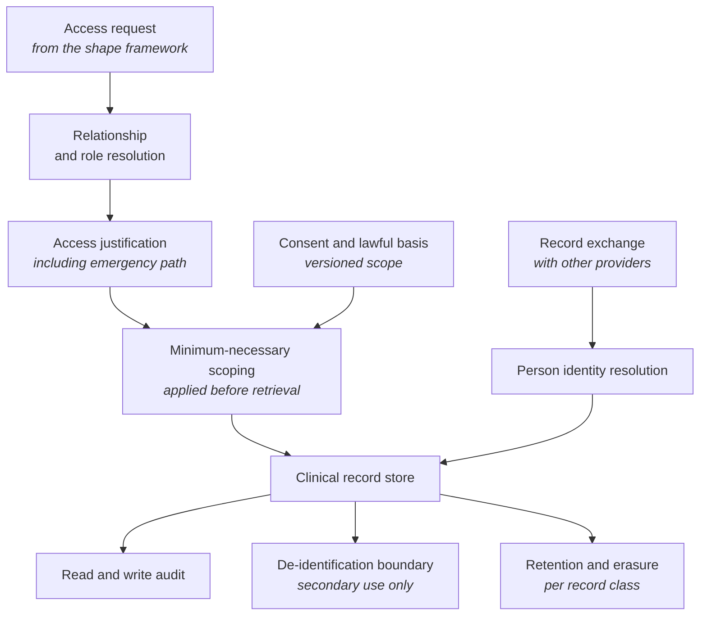

<Info>
**Status: Planned.** This framework is authored to the
[Framework standard](/frameworks/framework-standard) but is not yet published into the validated
library, and MUST NOT be matched against a brief until it is — Article 5. See
[Framework Library](/frameworks/overview).
</Info>

## Identity

| Field | Value |
| --- | --- |
| Framework ID | `devos.healthcare` |
| Framework class | Systems handling health records and clinical data |
| Composition role | `constraint` |
| Version | 1.0 |
| Status | Planned |
| Derived from | None — DevOS reference framework |

## Purpose

The Healthcare framework is a **constraint framework**. It does not describe a system shape; it
describes the obligations, components, and prohibitions that attach once a system holds clinical
data about identifiable people, and it is composed onto a shape framework such as
[SaaS](/frameworks/saas) or [Internal Tool](/frameworks/internal-tool).

It exists because clinical data inverts a default most architectures carry. Elsewhere, access
within a boundary is permitted unless restricted; here, access is restricted unless justified, and
the justification is part of the record. A system that cannot say why someone saw a record has not
met the obligation, however well it controls who could.

<Note>
A constraint framework MAY be recommended alone where a brief's obligations dominate its shape.
The usual correct answer is a composition — the pattern shown in
[Create your first project](/getting-started/create-first-project), where a multi-clinic brief
produces a SaaS candidate, a Healthcare candidate, and the composition of the two.
</Note>

## Applicability conditions

| Brief element | Condition | Weight | Rationale |
| --- | --- | --- | --- |
| Compliance obligations | The brief states that the system holds health records, treatment notes, or other clinical data about identifiable people | `strong` | Clinical data about identifiable people is what attaches this framework's obligations |
| Compliance obligations | The brief names a health-sector regime, professional confidentiality obligation, or clinical safety requirement | `strong` | An obligation stated in the brief is direct evidence the framework applies |
| Functional scope | The brief describes recording, transmitting, or supporting decisions about a person's care | `strong` | Participation in care attaches clinical safety obligations beyond data protection |
| Users and jobs | The brief names clinical or care roles whose access to a record depends on their relationship to the person | `supporting` | Relationship-dependent access is the access model this framework requires |
| Non-functional constraints | The brief states that data must remain within a stated jurisdiction | `supporting` | Residency is common in this class and constrains the shape framework's deployment model |
| Integrations | The brief names exchange of records with other care providers as required | `supporting` | Record exchange introduces mapping, identity, and consent obligations at the boundary |

## When not to use this

| Condition | Fits better |
| --- | --- |
| The system holds appointment and administrative data with no clinical content | The shape framework alone, under general data protection obligations |
| The system holds wellbeing or fitness data that the brief does not identify as clinical | The shape framework alone — though see the gap below, because some regimes treat health-adjacent data as sensitive regardless |
| The system holds only data that is de-identified before it arrives, and cannot re-identify it | Partially covered — the isolation and retention constraints relax, but re-identification risk is a gap this framework does not treat adequately |
| The system serves clinicians but holds no patient-identifiable data, such as a rota or a training tool | [Internal Tool](/frameworks/internal-tool) alone |
| The system is a regulated medical device or delivers automated diagnosis | No framework in the library covers device regulation |

The last row is a significant gap. A brief describing diagnostic automation should surface it
rather than receive this framework as an approximation — PS-4 and AI-6.

## Failure modes

Ordered by what breaks earliest.

| What breaks | Under what pressure | Early signal | Usual remedy |
| --- | --- | --- | --- |
| Access justification | Operational urgency, where restriction impedes care | Access granted to every clinician in an organisation because relationship-based access was too slow to build | Relationship-derived access with an emergency path that is available, recorded, and reviewed rather than absent |
| Audit of reads | Volume, since reads vastly outnumber writes | An audit log that records changes but not who read a record | Read audit from the start, because it is the evidence the obligation actually asks for |
| Person identity resolution | Multiple sources, name changes, and record exchange | Duplicate records for one person, or records merged in error | Deliberate identity resolution with reversible merges; a wrongly merged clinical record is a safety incident, not a data quality issue |
| Consent and lawful basis | Secondary uses arriving after launch | Consent recorded as a flag, with no record of what was consented to, when, or under which basis | Consent recorded as a versioned statement of scope, evaluated at the point of use |
| Retention against erasure | An erasure request meeting a retention schedule | No stated position, decided under time pressure per request | Separation of identity data from clinical records, and a stated position per record class |
| De-identification for secondary use | Analytics and research demand | Data described as anonymous that a small combination of fields re-identifies | Treat de-identified extracts as a boundary with its own controls, and assess re-identification rather than assert its absence |
| Clinical safety of derived output | Any automated summarisation, ranking, or alerting | Derived output presented alongside recorded fact with no distinction | Clear provenance for anything derived, and a governance route for changes that affect care |
| Residency and processing location | Growth, or a supplier's own architecture | Processing that crosses a boundary the brief stated, discovered during assessment | Residency treated as an architectural constraint from the start, since it is expensive to retrofit |

## Abandonment conditions

| Condition | Response |
| --- | --- |
| The system no longer holds identifiable clinical data | The constraint no longer composes, but retention obligations for records already held survive the change |
| Residency or isolation obligations cannot be met by the composed shape | Change the shape — commonly to a deployment per care organisation — rather than weaken the constraint |
| The system's outputs become clinical decision support the operator cannot govern | The obligations exceed this framework. Device and clinical safety regimes apply, and no framework in the library covers them |
| Access justification is routinely bypassed in practice | The control is nominal. Rebuilding the access model is the remedy; continuing to add features on top of it accumulates liability |

## Architecture shape

A constraint framework adds components to a shape framework rather than replacing them. The
components below are what this framework requires the composition to contain.

| Component | Responsibility | Property it exists to provide |
| --- | --- | --- |
| Relationship and role resolution | Establishing why this person may see this record | Access is derived from a care relationship rather than from organisational membership |
| Access justification | Recording the basis for access, including an emergency path | Urgent access is available and accounted for, rather than absent and therefore worked around |
| Minimum-necessary scoping | Narrowing retrieval before it executes | The scope is a property of the system, not a matter of what the user chooses to open |
| Consent and lawful basis | A versioned record of what was agreed, when, and for what | Consent is evaluable at the point of use rather than asserted once |
| Person identity resolution | Establishing that two records concern the same person | Merges are deliberate and reversible, because a wrong merge is a safety incident |
| Read and write audit | Append-only record of who saw and changed what | The obligation to explain access is met with evidence |
| De-identification boundary | Producing extracts for secondary use, with re-identification assessed | Secondary use is a controlled boundary rather than a copy |
| Retention and erasure | Applying a stated position per record class | Erasure requests meet a decided answer rather than an improvised one |
| Record exchange | Mapping records to and from other providers | Mapping error is contained in one component, where it can be tested |

The framework's load-bearing property is that access is justified rather than merely permitted.
Every component here supports either establishing that justification or evidencing it afterwards.

## Data and compliance profile

| Element | Content |
| --- | --- |
| Data classes | Clinical records and treatment notes, person identifiers and demographics, consent records, care relationship data, access and audit records, de-identified extracts, correspondence with other care providers |
| Isolation boundary | The care-providing organisation, and within it the care relationship. This is stricter than the shape framework's default: membership of the organisation is not sufficient basis for access to a record |
| Retention and deletion | Clinical records commonly carry long, class-specific retention schedules that constrain erasure. Identity data and clinical content must be separable so identity can be minimised where a record itself must be retained |
| Regulatory obligations commonly attaching | General data protection regimes, under their provisions for special-category data; professional and statutory confidentiality obligations; sector records-retention schedules; clinical safety obligations where the system participates in care; residency requirements imposed by contract or by regime |

Which regime applies depends on jurisdiction, on the care setting, and on the system's role in
care. This framework MUST NOT assert that a regime applies to every adopter, and MUST NOT be read
as advice that a specific obligation is or is not triggered — FS-7.

## Operational cost profile

| Element | Content |
| --- | --- |
| Skills | Information governance; clinical safety practice, including hazard assessment for changes that affect care; identity resolution; record exchange and terminology mapping; access modelling under justification requirements |
| Infrastructure | Storage for clinical records within the required residency boundary; append-only audit storage sized for read volume; a consent store; de-identification processing; secret storage; metrics, logs, and alerting |
| Operational load | Access reviews and investigation of unusual access; assessments before changes affecting personal data; retention schedule application; identity merge and unmerge handling; record exchange breakage; audit and inspection response |
| Smallest viable team | A team with named information governance accountability alongside engineering, and a route to clinical accountability for anything affecting care. Where governance is a periodic review rather than a standing role, this framework's controls degrade between reviews |

Costs are stated in skills and infrastructure rather than currency, per FS-8.

## Composition

This framework contributes constraints to a shape framework. It contributes no system shape of
its own.

| Composes with | Constraints contributed | Conflicts introduced |
| --- | --- | --- |
| [SaaS](/frameworks/saas) | Justified access, read audit, consent and lawful basis, minimum-necessary scoping, residency, retention schedules | Residency conflicts with a single shared deployment; access justification conflicts with unqualified operator access |
| [Marketplace](/frameworks/marketplace) | All of the above, applied where the exchanged service is care | Counterparty disclosure conflicts with minimum-necessary access |
| [AI Agent](/frameworks/ai-agent) | All of the above, plus provenance for derived output | Broad retrieval for context quality conflicts with minimum-necessary access; automated output conflicts with clinical accountability |
| [Internal Tool](/frameworks/internal-tool) | All of the above, plus stricter audit | Minimum-necessary access conflicts with broad internal visibility, this class's default posture |
| [Mobile](/frameworks/mobile) | All of the above, plus protection of clinical data at rest on the device | Clinical data on a personal device conflicts with deletion obligations the device may not honour promptly |
| [Desktop](/frameworks/desktop) | All of the above, plus custody of locally held records | Working data in local files conflicts with access justification and with erasure that local backups defeat |

Conflicts are named, not resolved. Resolution is a decision a human accepts at confidence review —
Article 4.

Whether this framework may compose with [Fintech](/frameworks/fintech) on one brief is an open
question in [Framework Library](/frameworks/overview).

## Implied decisions

| Decision | Why this framework does not make it |
| --- | --- |
| How a care relationship is established, and what ends it | Depends on the care setting, which the brief describes and the framework cannot assume |
| Emergency access policy: what it permits, who reviews it, and how quickly | An organisational control decision with direct care consequences. Having an available, recorded emergency path is the common starting point, stated as a starting point rather than a recommendation |
| Consent model, including whether consent or another lawful basis governs each use | A legal determination made per adopter and jurisdiction |
| Residency boundary, and whether processing may cross it even transiently | Depends on obligations and contractual commitments |
| Retention schedule per record class | Set by the applicable schedule, not by the framework |
| Whether secondary use of de-identified data exists at all, and who may authorise it | A governance decision with reputational and legal weight |
| Depth of read audit: every access, or accesses meeting stated criteria | Trades evidential completeness against storage and review capacity |
| Whether the system provides clinical decision support, which changes the obligations entirely | Determines whether this framework is sufficient or whether the brief exceeds the library |

Each is recorded in the adopting organisation's ledger. A blueprint element implementing one
without a recorded decision is an unattributed element — Article 3.

## Evidence and gaps

**Basis.** Derived from the common shape of systems holding identifiable clinical data, and from
first principles about justified access: that an obligation to explain why a record was seen
requires the reason to be captured when it is seen, and that a control which impedes urgent care
will be bypassed rather than followed.

**Gaps.**

- Device regulation and clinical decision support are not covered. This is the framework's largest
  gap and the one most likely to be encountered.
- Re-identification risk in de-identified extracts is named but not treated. Assessing it properly
  requires methods this framework does not contain.
- No jurisdiction-specific retention schedules or regime names are stated, deliberately. Which
  apply is determined by the brief and by advice this framework cannot give.
- Health-adjacent data — wellbeing, fitness, lifestyle — is excluded by the applicability
  conditions, but some regimes treat it as sensitive. The boundary is unclear and the framework
  does not resolve it.
- No content on research data governance, which has its own consent and approval structures.

**Contested points.**

- Whether emergency access should be freely available and reviewed afterwards, or gated at the
  moment of access. Gating protects the record; availability protects the patient, and the
  disagreement is genuine rather than a matter of rigour.
- Whether every read should be audited. Complete read audit is the evidential ideal and produces a
  volume that is rarely reviewed, which is its own form of control failure.

## Version history

| Version | Date | Change |
| --- | --- | --- |
| 1.0 | 2026-07-31 | Initial framework, authored to the framework standard. |
