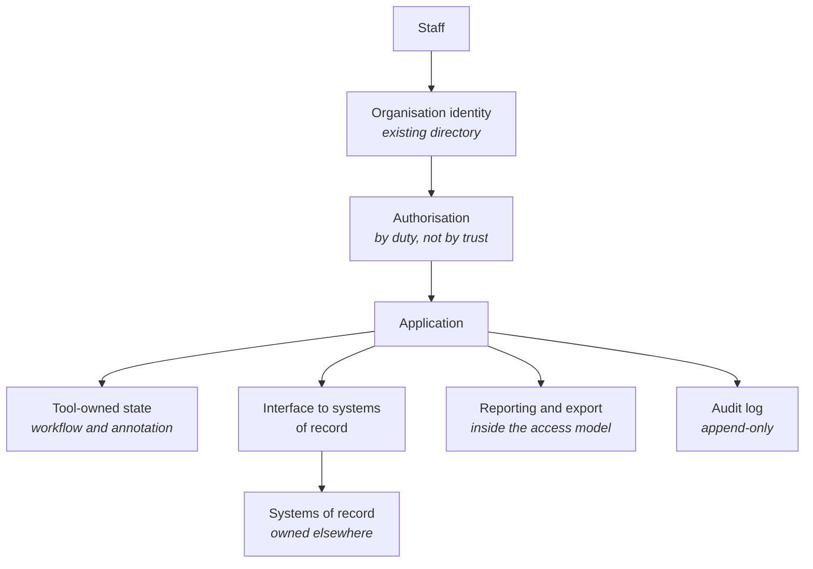

<Info>
**Status: Planned.** This framework is authored to the
[Framework standard](/frameworks/framework-standard) but is not yet published into the validated
library, and MUST NOT be matched against a brief until it is — Article 5. See
[Framework Library](/frameworks/overview).
</Info>

## Identity

| Field | Value |
| --- | --- |
| Framework ID | `devos.internal-tool` |
| Framework class | Systems serving one organisation's own staff |
| Composition role | `shape` |
| Version | 1.0 |
| Status | Planned |
| Derived from | None — DevOS reference framework |

## Purpose

The Internal Tool framework describes a system whose users are the commissioning organisation's
own staff, supporting a process that organisation already runs.

It exists because this class is systematically under-designed. There is one organisation, so
isolation appears unnecessary; users are colleagues, so access control appears unnecessary; the
tool starts as an improvement on a spreadsheet, so operational ownership appears unnecessary. Each
of those is true at the start and false by the second year, and the framework's purpose is to name
which of them to design for anyway.

## Applicability conditions

| Brief element | Condition | Weight | Rationale |
| --- | --- | --- | --- |
| Users and jobs | The brief names only members of the commissioning organisation as users | `strong` | A single-organisation user population is what distinguishes this class from a product |
| Functional scope | The brief describes supporting a process the organisation already runs, rather than a product it sells | `strong` | The process exists, so the tool inherits its constraints rather than defining them |
| Integrations | The brief names internal systems of record the tool must read from or write to | `strong` | Coupling to existing systems is the defining architectural constraint here |
| Compliance obligations | The brief states that access must be limited by role, department, or duty rather than granted to all staff | `supporting` | Internal does not mean unrestricted, and the brief saying so changes the access model |
| Non-functional constraints | The brief states availability expectations aligned to working hours rather than continuous | `supporting` | Working-hours availability materially reduces the operational shape |
| Team and delivery | The brief states a small team or a short delivery window | `supporting` | This class is commonly delivered under exactly that pressure, and the framework is sized for it |

## When not to use this

| Condition | Fits better |
| --- | --- |
| Users include people outside the commissioning organisation, including customers or contractors of other organisations | [SaaS](/frameworks/saas) |
| The tool is intended to be sold to other organisations, now or later | [SaaS](/frameworks/saas) — retrofitting an isolation boundary means moving data |
| The system intermediates between independent parties who transact | [Marketplace](/frameworks/marketplace) |
| The system's principal work is performed by models rather than by staff using it | [AI Agent](/frameworks/ai-agent) |
| Staff use it away from connectivity, on devices they carry | [Mobile](/frameworks/mobile) |
| The system will become the organisation's system of record for a regulated data class | Compose with a constraint framework, or reconsider whether this shape is adequate |

The second row is the most consequential. A brief that says "internal for now, product later"
matches this framework on its stated users and [SaaS](/frameworks/saas) on its stated intent; that
is a genuine plurality and MUST be presented as two candidates rather than resolved — PS-4.

## Failure modes

Ordered by what breaks earliest.

| What breaks | Under what pressure | Early signal | Usual remedy |
| --- | --- | --- | --- |
| Ownership | The original author changing team or leaving | No named owner, and changes waiting on one person's availability | An owning team from the outset, or an explicit decision to accept the tool's end of life with its author |
| Access control | Growth in staff count, and the arrival of contractors, temporary staff, and auditors | Access granted by adding everyone to one group | Access by duty rather than by trust, applied while the population is still small enough to model |
| The boundary of the record | Convenience, as staff start correcting data in the tool rather than in the system of record | The tool's copy being more current than the source | Decide explicitly whether the tool is a view or a record, and make writes flow to the owner of the data |
| Integration coupling | Source systems changing their schemas or their access model | Breakage on upgrades of systems the tool reads | An interface the tool owns, mapping source shape to its own, so upstream change is contained |
| Exports | Reporting demand the tool does not serve | Spreadsheets circulating with extracts of the tool's data | A reporting path inside the access model, because the export is going to exist either way |
| Audit of privileged action | The first dispute about what someone did | An administrative action with no record of who took it | Audit of mutating operations from the start, which is far cheaper than reconstructing it later |
| Availability expectations | The process becoming dependent on the tool | Staff unable to work when the tool is down, against a brief that assumed working-hours tolerance | Re-scope the availability commitment deliberately, rather than absorbing it informally |

## Abandonment conditions

| Condition | Response |
| --- | --- |
| Users outside the organisation must be served | Migrate to [SaaS](/frameworks/saas). Adding an isolation boundary later means moving data, and the migration is easier before the data exists |
| The tool has become the system of record for a regulated data class | Compose with the applicable constraint framework and re-examine retention, audit, and access. Continuing without doing so is an obligation the architecture does not meet |
| The process the tool supports has been replaced | Retire the tool with the process. Internal tools outliving their process become undocumented dependencies |
| The organisation intends to sell it | Rebuild to [SaaS](/frameworks/saas). Retrofitting isolation onto a single-organisation shape reliably costs more than it appears to |

## Architecture shape

| Component | Responsibility | Property it exists to provide |
| --- | --- | --- |
| Organisation identity | Authentication through the directory the organisation already runs | Joiners and leavers are handled by a process that already exists and is already audited |
| Authorisation | Deciding what a member may do, by duty | Access survives reorganisation, because duty outlives an org chart |
| Tool-owned state | The workflow state and annotation the tool genuinely owns | The boundary between what the tool owns and what it displays is explicit |
| Interface to systems of record | A mapping the tool owns, between source shape and its own | Upstream schema change is contained in one component |
| Reporting and export | A path to data for reporting that stays inside the access model | The export exists deliberately rather than as circulated spreadsheets |
| Audit log | Append-only record of mutating operations and privileged actions | "Who changed this" is answerable at the moment it is first asked |

The shape's load-bearing property is the explicit boundary between what the tool owns and what it
borrows. Where that boundary is unstated, the tool becomes an unacknowledged system of record,
which is this class's most common and most expensive failure.

## Data and compliance profile

| Element | Content |
| --- | --- |
| Data classes | Staff identity and role data, process and workflow state, copies or references to data owned by systems of record, exports, audit events. The regulated classes are usually inherited from the systems of record, not created here |
| Isolation boundary | Duty within one organisation. There is no cross-organisation boundary, which is precisely why access control is under-designed in this class |
| Retention and deletion | Governed by the owning system for borrowed data, and by the organisation's own policy for tool-owned state. Copies and exports are where retention obligations are most often missed |
| Regulatory obligations commonly attaching | Employment and personal data obligations covering staff data; any obligation inherited with data drawn from a system of record; internal control obligations where the process is financially or operationally material |

Obligations attach through the data the tool borrows more often than through the tool itself. This
framework MUST NOT assert that a regime applies to every adopter — FS-7.

## Operational cost profile

| Element | Content |
| --- | --- |
| Skills | Integration with existing internal systems; access modelling; the organisation's own identity and deployment practice. Deep specialist skill is rarely required, and the framework is deliberately sized for a small team |
| Infrastructure | A transactional store; the organisation's existing identity; scheduled or background execution where the tool synchronises; audit storage; logs and basic alerting |
| Operational load | Low while the source systems are stable, and concentrated at their upgrades. The recurring load is access review and joiner-leaver handling rather than scale |
| Smallest viable team | One engineer can build and run it. The framework's real minimum is an owning team rather than an owning individual: this class's earliest failure is ownership, not load |

Costs are stated in skills and infrastructure rather than currency, per FS-8.

## Composition

| Composes with | Role | Constraints it contributes | Conflicts it introduces |
| --- | --- | --- | --- |
| [Fintech](/frameworks/fintech) | `constraint` | Segregation of duties, authorisation of value movement, record retention, reconciliation | Segregation of duties conflicts with a small team where the same person builds, approves, and operates |
| [Healthcare](/frameworks/healthcare) | `constraint` | Access justification, minimum-necessary access, consent and lawful basis, stricter audit | Minimum-necessary access conflicts with broad internal visibility, which is this class's default posture |

Both conflicts arise from the same root: internal tools default to trust, and constraint
frameworks default to demonstrable restriction. The conflicts are named, not resolved — Article 4.

This framework MUST NOT compose with another `shape` framework.

## Implied decisions

| Decision | Why this framework does not make it |
| --- | --- |
| Whether the tool holds its own copy of data or reads through to the system of record | Depends on the source system's availability and query surface. The lower-coupling starting point is reading through and owning only workflow state, stated as a starting point rather than a recommendation |
| The access model: by role, by department, by duty, or by explicit grant | Depends on how the organisation actually divides work |
| Who owns the tool after delivery, and what response is committed | Organisational, and the single most consequential decision in this class |
| Whether audit covers reads as well as writes | Depends on the sensitivity of borrowed data |
| Retention of tool-owned state and of exports | Depends on the organisation's policy and on the data borrowed |
| Availability commitment, once the process depends on the tool | A commitment the organisation makes, not one the architecture sets |
| Whether the tool is permitted to write to systems of record | A governance decision owned by those systems' owners |
| The intended end of life | Rarely decided, and its absence is why retired processes leave running tools |

Each is recorded in the adopting organisation's ledger. A blueprint element implementing one
without a recorded decision is an unattributed element — Article 3.

## Evidence and gaps

**Basis.** Derived from the common shape of staff-facing systems built alongside existing systems
of record, and from first principles about ownership: that a system's cost is dominated by who
maintains it, and that internal systems are commissioned without answering that question.

**Gaps.**

- The framework states no threshold at which an internal tool should be rebuilt as a product.
  "Before there is data to move" is the honest guidance, and it is not a threshold.
- No content on internal tools that must operate across legal entities within one group, where the
  isolation question returns without the product shape.
- The reporting path is named as a failure mode but the framework does not describe an adequate
  one, because the adequate shape depends on the organisation's existing analytics practice.
- No characterisation of how often source-system upgrades break integrations, which would make the
  operational load statement quantitative rather than qualitative.

**Contested points.**

- Whether an internal tool should hold its own copy of source data. Copying is faster to build and
  more resilient to source outages; reading through avoids the divergence that becomes this
  class's defining failure.
- Whether to design access control before it is needed. Doing so is unpopular at commissioning
  time and cheap relative to retrofitting it under audit pressure.

## Version history

| Version | Date | Change |
| --- | --- | --- |
| 1.0 | 2026-07-31 | Initial framework, authored to the framework standard. |
