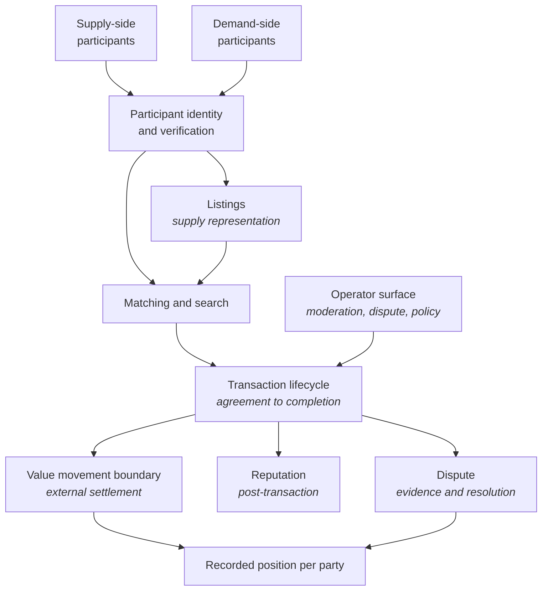

<Info>
**Status: Planned.** This framework is authored to the
[Framework standard](/frameworks/framework-standard) but is not yet published into the validated
library, and MUST NOT be matched against a brief until it is — Article 5. See
[Framework Library](/frameworks/overview).
</Info>

## Identity

| Field | Value |
| --- | --- |
| Framework ID | `devos.marketplace` |
| Framework class | Multi-sided systems intermediating between parties |
| Composition role | `shape` |
| Version | 1.0 |
| Status | Planned |
| Derived from | None — DevOS reference framework |

## Purpose

The Marketplace framework describes a system whose principal job is to intermediate between
independent parties who transact with each other, where the operator does not own what is being
exchanged.

It exists because intermediation changes the architecture at its root. The operator is not the
counterparty, so trust, dispute, verification, and money movement are first-class components
rather than features — and the system's viability depends on a property no component controls:
that both sides are present at the same time.

## Applicability conditions

| Brief element | Condition | Weight | Rationale |
| --- | --- | --- | --- |
| Users and jobs | The brief names at least two independent user types who transact with each other rather than with the operator | `strong` | Intermediation between parties is what distinguishes this class |
| Functional scope | The brief states that the operator does not own the goods, services, or capacity being exchanged | `strong` | Ownership determines whether the operator is a party or an intermediary, which changes liability and settlement |
| Functional scope | The brief describes matching supply to demand as a core job rather than an incidental listing feature | `strong` | Matching is the load-bearing component of this shape |
| Compliance obligations | The brief states that value moves between parties through the system | `supporting` | Money movement between parties commonly attaches regulatory obligations and drives composition |
| Functional scope | The brief describes a need to assess or display trust between parties who have not met | `supporting` | Reputation and verification are structural here, not decorative |
| Integrations | The brief names an external payment or settlement system as non-negotiable | `supporting` | The money boundary is usually external, and its placement shapes the transaction lifecycle |

## When not to use this

| Condition | Fits better |
| --- | --- |
| The operator owns what is being sold or supplied | [SaaS](/frameworks/saas), or no framework where the system is primarily commerce for a single seller |
| Only one side is independent — many buyers, one supplier who is the operator | [SaaS](/frameworks/saas) |
| The parties are all members of one organisation, matching internal supply to internal demand | [Internal Tool](/frameworks/internal-tool) |
| Participants publish and consume content without transacting with each other | No framework in the library covers this |
| The primary surface is an installed client that must work without connectivity | [Mobile](/frameworks/mobile) |
| The intermediation itself is performed by models, and the system's principal work is model execution | [AI Agent](/frameworks/ai-agent) |

A brief describing a content platform with no transaction between parties should produce
`NO_MATCH` rather than a marketplace recommendation. The absence is a gap in the library — PS-4.

## Failure modes

Ordered by what breaks earliest.

| What breaks | Under what pressure | Early signal | Usual remedy |
| --- | --- | --- | --- |
| Liquidity balance between the two sides | Growth on one side only, or geographic and category fragmentation | Search returning few or no results for common queries in a segment | Constrain the served segment until both sides are present in it, rather than broadening supply |
| Trust and fraud controls | Growth in participant count, and the arrival of participants whose intent is fraud | Disputes concentrated on newly registered participants | Verification proportionate to transaction consequence, applied at registration and at value thresholds |
| Disintermediation | Repeat transactions between the same two parties | Conversations moving off-platform before the transaction completes | Value the platform provides after matching — settlement, dispute, guarantees — rather than blocking contact |
| Dispute handling | Transaction volume growth | Dispute resolution time growing faster than volume | Evidence captured structurally at transaction time, so resolution is not reconstruction |
| Settlement and payout correctness | Refunds, partial fulfilment, and multi-party splits | Manual corrections to payouts | A recorded position per party that reconciles, rather than balances derived on read |
| Matching relevance | Catalogue growth and heterogeneity | Participants using filters to undo the matching | Matching over attributes the parties actually decide on, revisited as the catalogue changes |
| Operator neutrality | Commercial pressure to promote favoured supply | Ranking rules that cannot be explained to a participant | Ranking a participant can be told the basis of, whatever that basis is |

## Abandonment conditions

| Condition | Response |
| --- | --- |
| The operator begins owning inventory or employing the supply side | The operator is now a party, not an intermediary. Migrate to [SaaS](/frameworks/saas) or a commerce shape the library does not currently cover |
| One side collapses to a single participant, or to participants the operator controls | The intermediation is nominal. Migrate to [SaaS](/frameworks/saas) |
| A regulator reclassifies the operator as principal to the transaction, or as holding funds in a regulated capacity | The obligations exceed what an intermediation shape assumes. Compose with [Fintech](/frameworks/fintech), or restructure so that value never rests with the operator |
| Transactions move off-platform at a rate that leaves the system a directory | The system is no longer intermediating. This is a product failure the architecture cannot remedy |

## Architecture shape

| Component | Responsibility | Property it exists to provide |
| --- | --- | --- |
| Participant identity and verification | Who each party is, and how strongly that is established | Verification depth can vary with transaction consequence rather than being uniform |
| Listings | How supply is represented, priced, and made discoverable | Supply is data the matching component can evaluate, not free text |
| Matching and search | Bringing demand to the supply that fits it | The system's core job is performed by a component that can be measured and changed |
| Transaction lifecycle | The states a transaction moves through from agreement to completion | Every subsequent component — settlement, dispute, reputation — attaches to a state, not to an inference |
| Value movement boundary | Where money enters, rests, and leaves | Whether the operator holds funds is an explicit boundary rather than an emergent property |
| Recorded position per party | What each party is owed or owes, as a recorded value | Payouts reconcile, rather than being derived differently in each place that needs them |
| Reputation | Signals earned through completed transactions | Trust between strangers rests on the transaction record rather than on assertion |
| Dispute | Evidence capture and resolution against a transaction | Resolution is reading a record, not reconstructing events from support conversations |
| Operator surface | Moderation, dispute adjudication, policy enforcement | Intervention is an audited, bounded act rather than a database edit |

The shape's load-bearing property is that the transaction is a first-class record with an
explicit lifecycle. Reputation, dispute, and settlement all attach to it; where the transaction is
implicit, each of those becomes a reconstruction.

## Data and compliance profile

| Element | Content |
| --- | --- |
| Data classes | Participant identity and verification evidence, listings, transaction records, reputation signals, dispute evidence and correspondence, references to payment instruments held by an external settlement system, operational telemetry, audit events |
| Isolation boundary | The participant, with a deliberate and enumerated set of disclosures between counterparties. Unlike a single-organisation shape, this system exists to share specific data across the boundary, so what is disclosed must be listed rather than assumed |
| Retention and deletion | Participant erasure requests conflict with transaction and dispute records the counterparty and the operator have obligations to retain. The architecture must separate identity data from transaction records so one can be removed while the other survives |
| Regulatory obligations commonly attaching | General data protection regimes covering both sides' personal data; obligations attaching to holding or transmitting funds; sector obligations attaching to what is being exchanged |

Whether a specific regime applies depends on jurisdiction, on what is exchanged, and on whether
the operator holds funds. This framework MUST NOT assert that a regime applies to every adopter —
FS-7.

## Operational cost profile

| Element | Content |
| --- | --- |
| Skills | Transaction lifecycle modelling; settlement and reconciliation; trust, fraud, and abuse handling; search and matching; policy design and enforcement; operational dispute handling |
| Infrastructure | A transactional store; search or matching infrastructure; background execution for settlement and notification; identity and verification; secret storage; append-only audit storage; metrics, logs, and alerting |
| Operational load | Continuous dispute and moderation work that does not reduce with automation as fast as transaction volume grows; fraud response; reconciliation of settlement differences; policy changes affecting live transactions |
| Smallest viable team | A team that can hold engineering and continuous operational adjudication at the same time. The adjudication load is the part most often underestimated: it starts at the first transaction, not at scale |

Costs are stated in skills and infrastructure rather than currency, per FS-8.

## Composition

| Composes with | Role | Constraints it contributes | Conflicts it introduces |
| --- | --- | --- | --- |
| [Fintech](/frameworks/fintech) | `constraint` | Ledger integrity for held balances, authorisation of value movement, reconciliation obligations, financial record retention | Financial record retention conflicts with participant erasure; holding balances conflicts with the assumption that value passes straight through |
| [Healthcare](/frameworks/healthcare) | `constraint` | Clinical data handling where the exchanged service is care, access justification, consent and lawful basis | Counterparty disclosure conflicts with minimum-necessary access to clinical data |

The healthcare composition arises where the marketplace intermediates care rather than goods.
Both conflicts are named, not resolved — resolution is a decision a human accepts, per Article 4.

This framework MUST NOT compose with another `shape` framework. A brief matching this and
[SaaS](/frameworks/saas) produces two recommendations, not a composition — PS-4.

## Implied decisions

| Decision | Why this framework does not make it |
| --- | --- |
| Whether the operator is principal or agent to the transaction | A legal and commercial determination with architectural consequences, made per jurisdiction and per adopter |
| Whether value ever rests with the operator, or passes straight through to the supply side | Determines whether the framework composes with [Fintech](/frameworks/fintech) at all. The lower-obligation starting point is pass-through, stated here as a starting point rather than a recommendation |
| Verification depth per side, and the thresholds at which it increases | Depends on transaction consequence and on the fraud the adopter actually faces |
| Matching model: participant-driven search, operator-driven allocation, or both | Depends on whether supply is substitutable, which the brief describes and the framework cannot assume |
| Reputation model, and whether it is symmetric between the sides | A product choice with strong effects on participant behaviour |
| Fee model and where fees are computed in the transaction lifecycle | Commercial, and it constrains settlement |
| Who adjudicates disputes, and whether the operator's decision is final | A policy decision that determines the operator surface's authority |
| Whether counterparties exchange direct contact details, and at what lifecycle state | Trades disintermediation risk against transaction friction |

Each is recorded in the adopting organisation's ledger. A blueprint element implementing one
without a recorded decision is an unattributed element — Article 3.

## Evidence and gaps

**Basis.** Derived from the common shape of multi-sided transactional systems and from first
principles about intermediation: that the operator's non-ownership makes trust, dispute, and
settlement structural, and that a system depending on both sides being present has a failure mode
no component can remedy.

**Gaps.**

- The framework states no threshold at which verification should deepen. That threshold is
  specific to the fraud an adopter faces, and no general figure exists that is not invented.
- Liquidity is named as the earliest failure mode, but the framework offers no way to assess
  whether a brief's segment is narrow enough. This is the framework's largest gap.
- No content on multi-currency or cross-border settlement, which changes both the money boundary
  and the obligations.
- Dispute volume relative to transaction volume is not characterised, so the operational cost
  profile states the load qualitatively only.

**Contested points.**

- Whether preventing off-platform contact is a legitimate design goal or an admission that the
  platform adds no post-match value. Practitioners disagree, and the answer plausibly differs by
  transaction frequency.
- Whether reputation should be symmetric. Symmetry is fairer between parties; asymmetry reflects
  that the sides usually bear different risk.

## Version history

| Version | Date | Change |
| --- | --- | --- |
| 1.0 | 2026-07-31 | Initial framework, authored to the framework standard. |
