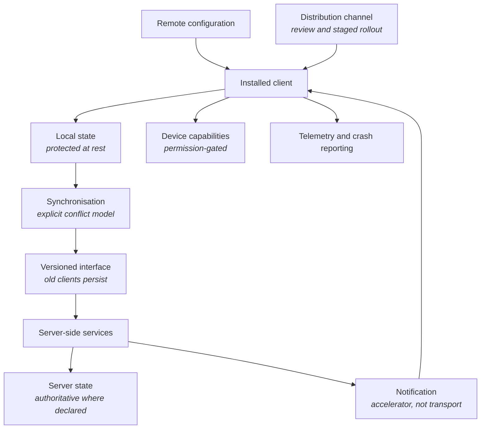

<Info>
**Status: Planned.** This framework is authored to the
[Framework standard](/frameworks/framework-standard) but is not yet published into the validated
library, and MUST NOT be matched against a brief until it is — Article 5. See
[Framework Library](/frameworks/overview).
</Info>

## Identity

| Field | Value |
| --- | --- |
| Framework ID | `devos.mobile` |
| Framework class | Systems whose primary surface is an installed mobile client |
| Composition role | `shape` |
| Version | 1.0 |
| Status | Planned |
| Derived from | None — DevOS reference framework |

## Purpose

The Mobile framework describes a system whose primary surface is an installed client on a personal
mobile device, where the device is expected to hold state and remain useful without connectivity.

It exists because two constraints reshape everything else in this class: released software cannot
be recalled, and the device is not a display. Users run versions the operator did not choose, on
devices the operator does not control, holding data the operator is still accountable for.

## Applicability conditions

| Brief element | Condition | Weight | Rationale |
| --- | --- | --- | --- |
| Functional scope | The brief states the primary surface is an installed client on a personal mobile device | `strong` | An installed client is what introduces version fragmentation and on-device state |
| Non-functional constraints | The brief states the system must remain usable while connectivity is absent or intermittent | `strong` | Offline capability is the constraint that forces local state and synchronisation into the architecture |
| Integrations | The brief names device capabilities — location, camera, sensors, biometrics, or notifications — as required rather than convenient | `strong` | Required device capabilities cannot be satisfied by a browser-reachable surface |
| Users and jobs | The brief describes use away from a desk, in motion, or in the field | `supporting` | Context of use drives interaction and network assumptions |
| Compliance obligations | The brief states that data will rest on the device | `supporting` | On-device data extends the obligation boundary to hardware the operator does not control |
| Team and delivery | The brief accepts release through a platform distribution channel with a review step | `supporting` | Release latency is inherent to this class and must be accepted in the brief, not discovered later |

## When not to use this

| Condition | Fits better |
| --- | --- |
| A browser-reachable surface would satisfy the brief, and no device capability is required | [SaaS](/frameworks/saas) or [Internal Tool](/frameworks/internal-tool) |
| The client is installed but the device is a workstation | [Desktop](/frameworks/desktop) |
| Connectivity is always present and the client holds no state between sessions | [SaaS](/frameworks/saas), with a thin client surface |
| The devices are operator-controlled fixed hardware rather than users' personal devices | No framework in the library covers managed-device estates |
| The system's principal work is performed by models, with the client as one surface among several | [AI Agent](/frameworks/ai-agent) |
| The brief requires a defect fix to reach every user within hours | No framework — this class cannot commit to that, and saying so is the correct answer |

The last row is a genuine incompatibility rather than a preference. A brief with that requirement
should produce `NO_MATCH` on this framework rather than a recommendation that quietly assumes it
away — PS-4.

## Failure modes

Ordered by what breaks earliest.

| What breaks | Under what pressure | Early signal | Usual remedy |
| --- | --- | --- | --- |
| Synchronisation correctness | Genuine offline use, where two devices change the same thing | Conflicts resolved by whichever write arrived last, silently | A conflict model chosen deliberately per data type, with conflicts surfaced where they cannot be merged |
| Backward compatibility of the interface | Any release, once users are on versions the operator did not choose | Server changes that require a client version to already be installed | Interface versioning that assumes old clients persist indefinitely, because they do |
| Defect response time | The first defect that matters | A fix that is ready but cannot reach users for days | Remote configuration for behaviour that must change quickly, decided before it is needed |
| On-device data protection | Device loss, theft, or resale | Local state readable outside the application's protection | Protection of local state proportionate to its class, and a remote revocation path |
| Background execution assumptions | Platform policy, battery optimisation, and the user's own settings | Work that only completes while the application is open | Treat background execution as best-effort and make the foreground path complete |
| Notification dependency | Delivery being unreliable by design | Workflows that stall when a notification is not delivered | Notification as an accelerator, never as the transport of record |
| Version fragmentation | Time | A support matrix that grows every release | A stated minimum supported version and a forced-upgrade policy, decided before it is urgent |
| Permission denial | Users declining capability access | Flows that dead-end when a capability is refused | A degraded path for every capability the user may decline |

## Abandonment conditions

| Condition | Response |
| --- | --- |
| The offline requirement is withdrawn, and no device capability remains necessary | Migrate the surface to [SaaS](/frameworks/saas). Maintaining installed clients for no offline or device benefit is cost without return |
| Obligations prohibit the data class resting on personal devices | Either stop storing it locally, which usually removes the offline capability, or abandon the shape |
| The brief's defect response commitment tightens beyond what release review permits | The shape cannot meet it. Remote configuration narrows the gap but does not close it |
| Device capability access is withdrawn by platform policy and the system depends on it | The dependency is not recoverable within this shape |

## Architecture shape

| Component | Responsibility | Property it exists to provide |
| --- | --- | --- |
| Local state | Holding what the client needs to work offline, protected at rest | Usefulness without connectivity, without exposing data on a lost device |
| Device capabilities | Permission-gated access to sensors, camera, location, biometrics | Capability access is a user grant that can be refused and withdrawn |
| Synchronisation | Reconciling local and server state under an explicit conflict model | Divergence is resolved by a stated rule rather than by arrival order |
| Versioned interface | Serving client versions the operator did not choose | Old clients keep working, because they will exist regardless |
| Server state | The authoritative record where the system declares one | "Which copy is right" has an answer per data type |
| Notification | Prompting attention | Workflows do not depend on delivery that is not guaranteed |
| Remote configuration | Changing behaviour without a release | Response to defects is not bounded by review latency |
| Telemetry and crash reporting | Observing a fleet the operator cannot inspect | Failures on devices the operator will never see are still visible |
| Distribution channel | Release, review, and staged rollout | Blast radius of a bad release is bounded by rollout rather than by hope |

The shape's load-bearing property is that the client is a peer holding state, not a view. Every
component here exists because state lives somewhere the operator cannot reach, update, or recall.

## Data and compliance profile

| Element | Content |
| --- | --- |
| Data classes | Account and session material held on the device, cached business data, capability-derived data such as location or images, device and telemetry identifiers, crash payloads which may contain user content |
| Isolation boundary | The user and the device. Where the system also serves organisations, the organisation boundary applies server-side and the device holds only what its user is entitled to |
| Retention and deletion | Deletion must reach the device, which may be offline or never seen again. The architecture needs a revocation path that makes local data unusable without requiring the device to cooperate promptly |
| Regulatory obligations commonly attaching | General data protection regimes covering personal data; obligations attaching to location and biometric data specifically, which are commonly treated as sensitive; platform policy obligations, which are contractual rather than regulatory but function as constraints |

Whether a specific regime applies depends on jurisdiction and on the capabilities used. This
framework MUST NOT assert that a regime applies to every adopter — FS-7.

## Operational cost profile

| Element | Content |
| --- | --- |
| Skills | Client engineering per platform; synchronisation and conflict modelling; interface versioning discipline; release management through review channels; fleet observability |
| Infrastructure | Server-side services and state; a versioned interface surface; notification delivery; remote configuration; crash and telemetry collection; distribution and staged rollout |
| Operational load | A permanently widening support matrix; release cycles bounded by review; defect response constrained by installed versions; capability and policy changes arriving from platforms on their schedule rather than the operator's |
| Smallest viable team | A team that can carry each supported platform's client alongside the server side. Where one platform's client is nobody's responsibility, its version drift becomes the support matrix's worst entry within a year |

Costs are stated in skills and infrastructure rather than currency, per FS-8.

## Composition

| Composes with | Role | Constraints it contributes | Conflicts it introduces |
| --- | --- | --- | --- |
| [Fintech](/frameworks/fintech) | `constraint` | Authorisation of value movement, ledger integrity, record retention, stronger authentication for value-moving actions | Offline operation conflicts with authorisation that must be checked against authoritative state before value moves |
| [Healthcare](/frameworks/healthcare) | `constraint` | Clinical data handling, access justification, consent and lawful basis, stricter protection at rest | Holding clinical data on a personal device conflicts with minimum-necessary access and with deletion obligations the device may not honour promptly |

Both conflicts have the same root: offline capability requires data to rest where the operator
cannot reach it. They are named, not resolved — Article 4.

This framework MUST NOT compose with another `shape` framework. A brief matching this and
[Desktop](/frameworks/desktop) produces two candidates, not a composition — PS-4.

## Implied decisions

| Decision | Why this framework does not make it |
| --- | --- |
| The conflict model per data type: server authoritative, client authoritative, merge, or surfaced conflict | Depends on whether concurrent edits are plausible and what a wrong merge costs. The lowest-risk starting point is server authoritative with surfaced conflicts, stated as a starting point rather than a recommendation |
| Which data may rest on the device, and which must not | Depends on data class and obligations |
| One shared client implementation or one per platform | Depends on capability depth required and on the skills the brief records |
| Minimum supported platform versions, and the forced-upgrade policy | A commercial decision about reachable users versus support cost |
| Session lifetime and re-authentication triggers on a personal device | Trades security against usability in a way that varies by data class |
| What must be available offline, expressed as a scope rather than as everything | Everything-offline is rarely required and is the most expensive reading of the constraint |
| Whether telemetry and crash payloads may contain user content | An obligation-bearing choice made per adopter |
| Rollout strategy and the criteria for halting a release | Depends on the operator's tolerance for a defective version reaching users |

Each is recorded in the adopting organisation's ledger. A blueprint element implementing one
without a recorded decision is an unattributed element — Article 3.

## Evidence and gaps

**Basis.** Derived from the common shape of installed mobile clients with offline requirements,
and from first principles about released software: that a version the operator cannot recall
constrains every interface and every fix, and that state on hardware the operator does not control
extends obligations to it.

**Gaps.**

- No content on managed-device estates, where the operator controls the hardware and several of
  this framework's constraints do not apply. A brief describing one is currently underserved.
- The framework states no guidance on how much should be available offline, because the answer is
  specific to the work and any general answer would be invented.
- Conflict resolution is required to be explicit but the framework offers no selection method
  beyond the data-type distinction.
- No characterisation of release review latency, which is a platform property that changes and
  which this framework MUST NOT state as a figure — AI-7.

**Contested points.**

- Whether one shared client implementation or one per platform is the better default. The trade is
  between capability depth and duplicated effort, and it moves with what the platforms expose.
- Whether offline capability should be designed in from the start or added when demonstrated to be
  necessary. Adding it later means changing the state model, which is close to a rewrite of the
  client.

## Version history

| Version | Date | Change |
| --- | --- | --- |
| 1.0 | 2026-07-31 | Initial framework, authored to the framework standard. |
