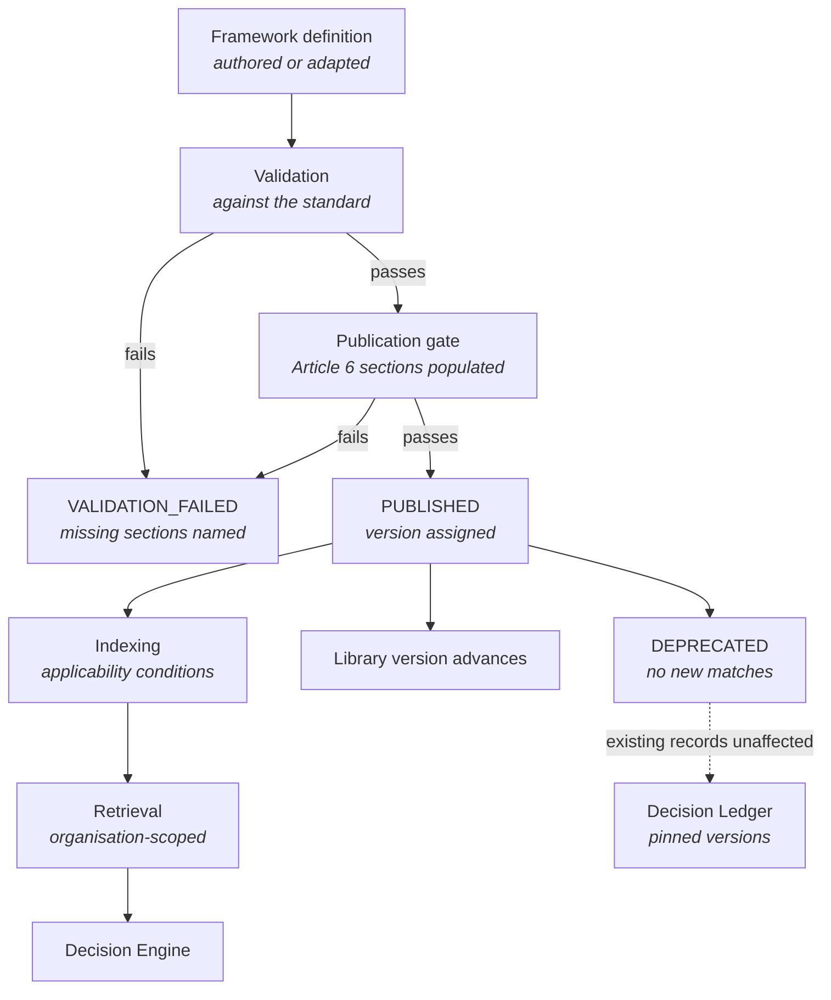
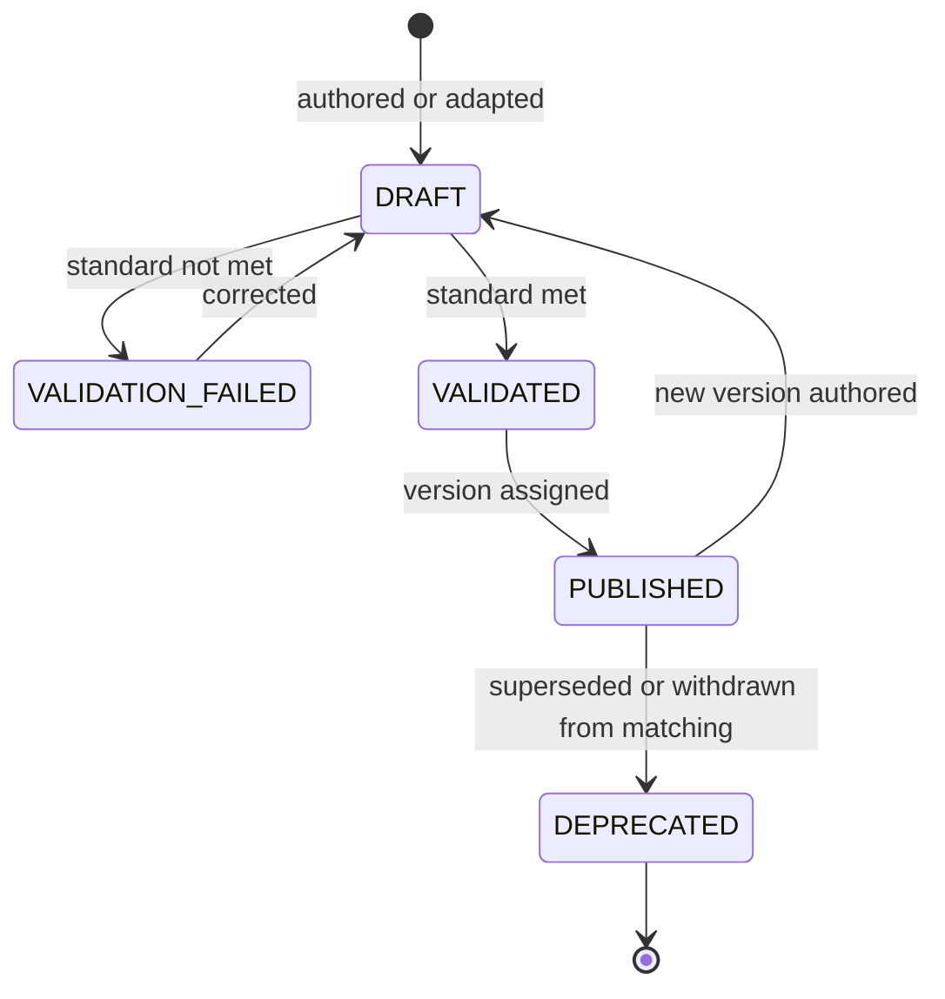

<Info>
**Status: Planned.** The library is scoped and its standard is settled. The eight reference
frameworks are authored here but not yet published into a validated library, and the Framework
Engine that validates, indexes, and serves them is not implemented. Until it is, the
[Decision Engine](/engines/decision-engine) runs against a partial library and reports
`INSUFFICIENT_LIBRARY` where a brief's domain is not covered — see [Roadmap](/introduction/roadmap).
</Info>

## Purpose

The Framework Library is the set of reference architectures DevOS matches a Product Brief
against. It is the only source of candidate architectures: the Decision Engine proposes nothing
that does not originate in a framework, and synthesises nothing when the library has no answer.

A **framework** is a reference architecture for a class of system, written to the
[Framework standard](/frameworks/framework-standard). It states the conditions under which it
applies, the conditions under which it does not, what breaks first under stress, and what it
costs to operate. A framework that documents only its strengths cannot discriminate between
candidates, and MUST NOT be published — Article 6 in [Principles](/constitution/principles).

This page also specifies the **Framework Engine**, the second of the seven engines. It has no
page in [Core Engines](/engines/overview) because it maintains the library rather than
transforming a project artefact, so its specification lives with the library it governs.

## Goals

- Hold every candidate architecture DevOS can recommend, each with inspectable applicability
  conditions.
- Make the reasoning behind a match legible: which brief element satisfied which condition.
- Record the failure modes and abandonment conditions of every architecture, not only its shape.
- Let an organisation adapt or author frameworks without those frameworks reaching any other
  organisation.
- Keep a decision made a year ago interpretable, by pinning the framework version it was made
  against.

## Non-goals

- Recommending. Matching and ranking are the [Decision Engine](/engines/decision-engine);
  scoring is the [Architecture Confidence Engine](/engines/architecture-confidence-engine).
- Producing implementation detail. A framework states shape and constraint; module boundaries,
  interface contracts, and test strategy are the [Blueprint Engine](/engines/blueprint-engine).
- Naming products or vendors. A framework describes architecture, not a stack. Vendor selection
  is a decision the adopting organisation makes and records.
- Covering every system that can be built. A brief matching nothing produces `NO_MATCH`, which
  is a correct outcome and a signal that the library needs extending — PS-4.
- Being a catalogue of code. Frameworks are documents, not runnable artefacts.

## Definitions

| Term | Meaning |
| --- | --- |
| **Framework** | A reference architecture for a class of system, written to the framework standard. |
| **Framework class** | The class of system a framework describes. A framework declares exactly one. |
| **Applicability condition** | A stated condition on a brief element under which the framework applies. The unit the Decision Engine matches against. |
| **Composition role** | Whether a framework contributes system shape or data-handling and regulatory constraint. One of `shape` or `constraint`. |
| **Adaptation** | An organisation's modified copy of a DevOS reference framework, visible only to that organisation. |
| **Authored framework** | A framework an organisation wrote itself, visible only to that organisation. |
| **Publication gate** | The validation every framework passes before it can be published — see [Framework standard](/frameworks/framework-standard). |
| **Library version** | The version of the whole library, advanced whenever a framework version is published or deprecated. |

## The eight frameworks

The library covers eight framework classes. Six describe system shape; two describe the
data-handling and regulatory constraints that a shape framework is operated under.

| Framework | Class covered | Composition role | Status |
| --- | --- | --- | --- |
| [SaaS](/frameworks/saas) | Multi-organisation subscription products | `shape` | Planned |
| [Marketplace](/frameworks/marketplace) | Multi-sided systems intermediating between parties | `shape` | Planned |
| [AI Agent](/frameworks/ai-agent) | Systems whose primary work is performed by models under contract | `shape` | Planned |
| [Internal Tool](/frameworks/internal-tool) | Systems serving one organisation's own staff | `shape` | Planned |
| [Mobile](/frameworks/mobile) | Systems whose primary surface is an installed mobile client | `shape` | Planned |
| [Desktop](/frameworks/desktop) | Systems whose primary surface is an installed desktop client | `shape` | Planned |
| [Fintech](/frameworks/fintech) | Systems holding, moving, or reconciling money | `constraint` | Planned |
| [Healthcare](/frameworks/healthcare) | Systems handling health records and clinical data | `constraint` | Planned |

Every framework declares its status independently. A framework at Planned status is authored but
not published, and MUST NOT be matched against a brief — Article 5.

<Note>
A `constraint` framework MAY be recommended on its own where a brief's regulatory obligations
dominate its shape. It MUST declare which `shape` frameworks it composes with, because the usual
correct answer is a composition: a shape framework operated under a constraint framework's
data-handling rules. See [Composition](#composition) below.
</Note>

## Framework Engine

The Framework Engine maintains, validates, and serves the library. It is the only engine that is
independent of any project: it consumes framework definitions and produces a validated, queryable
library, and it never reads a brief, a ledger, or a blueprint.

| Property | Value |
| --- | --- |
| Consumes | Framework definitions, authored or adapted |
| Produces | A validated, versioned, queryable framework library |
| Status | Planned |
| Invokes agents | No |
| Deterministic | Entirely — validation, indexing, and retrieval |

### Responsibilities

| Responsibility | What it means |
| --- | --- |
| **Validation** | Checking a framework against the framework standard, section by section. |
| **Publication gate** | Refusing publication where the Article 6 sections are absent or empty. |
| **Indexing** | Making applicability conditions queryable, so matching evaluates conditions rather than prose. |
| **Retrieval** | Serving the frameworks available to one organisation, scoped before the query runs. |
| **Versioning** | Assigning framework versions and advancing the library version. |
| **Deprecation** | Removing a framework version from future matching without altering past decisions. |

The engine invokes no agent. Validation is a structural check, not a judgement, and a model
contributing to it would make publication non-reproducible — Article 9 and AI-8.

### Determinism

Validation, indexing, retrieval, and version assignment MUST be deterministic. The same framework
definition validated twice produces the same result, and the same query against the same library
version returns the same frameworks in the same order.

This matters downstream: the Decision Engine's determinism requirement (FR-8 in
[Decision Engine](/engines/decision-engine)) cannot hold if the library it queries returns
different results for the same version.

## Library structure

An organisation's library is the union of three sets:

| Set | Owner | Visible to |
| --- | --- | --- |
| DevOS reference frameworks | DevOS | Every organisation |
| Adaptations | The adapting organisation | That organisation only |
| Authored frameworks | The authoring organisation | That organisation only |

An adaptation records the reference framework and version it was derived from. It is a distinct
framework with its own identifier and version, not an override — so a later reference version does
not silently change an organisation's adapted behaviour, and a decision made against the
adaptation pins the adaptation.

Per Article 7, an adaptation or authored framework MUST NOT be visible to, retrievable by, or
matched for any other organisation. This is enforced by organisation scoping at the storage layer,
not by filtering results after retrieval — ES-2.

## Composition

Composition is how a shape framework and a constraint framework combine into one candidate. The
Decision Engine detects it; the library defines what may compose with what.

| Element | Rule |
| --- | --- |
| Primary framework | Declares composition role `shape`. Contributes system shape and operational model. |
| Secondary framework | Declares composition role `constraint`. Contributes data-handling and regulatory constraints only. |
| Contributed constraints | Enumerated by the secondary framework, so a composition states precisely what the secondary changes. |
| Conflicts | Where a contributed constraint contradicts the primary's shape, the framework MUST name the conflict rather than resolve it. |

A composition is a candidate, not a resolution. Which composition to adopt — or whether to adopt
one at all — is a decision a human accepts at confidence review, per Article 4.

Two constraint frameworks may apply to one brief: a system that both holds money and handles
health records is subject to both. Whether a composition may carry two secondaries is an open
question below.

## Framework lifecycle

| State | Matchable | Notes |
| --- | --- | --- |
| `DRAFT` | No | Being authored or adapted |
| `VALIDATION_FAILED` | No | The unmet standard sections are named |
| `VALIDATED` | No | Passed the standard, not yet published |
| `PUBLISHED` | Yes | Available to matching for the organisations that can see it |
| `DEPRECATED` | No | Excluded from new matches; existing pinned references unaffected |

Deprecation removes a framework version from future matching. It MUST NOT alter an existing
recommendation, decision record, or blueprint. A decision made against version 1.2 continues to
reference 1.2 indefinitely — FR-10 in [Decision Ledger](/engines/decision-ledger).

## Versioning

Framework versions are `MAJOR.MINOR`, following the page versioning rules in
[Versioning](/constitution/versioning).

| Change | Increment |
| --- | --- |
| Editorial clarification, no change of meaning | None |
| Added failure mode, added implied decision, clarified condition | MINOR |
| Applicability condition added | MINOR |
| Applicability condition changed, narrowed, or removed | MAJOR |
| Composition role or class changed | MAJOR |
| Abandonment condition changed or removed | MAJOR |

A MAJOR increment means a brief that matched the prior version may not match this one. It
produces a new framework version; it never rewrites the version a decision was made against.

The **library version** advances whenever any framework version is published or deprecated. The
Decision Engine records it on every recommendation set, so a set can be reproduced against the
exact library it was generated from.

## Permissions

| Action | Minimum role |
| --- | --- |
| Use frameworks in recommendations | Viewer (read), Contributor (generate) |
| Read a framework and its version history | Viewer |
| Adapt a DevOS reference framework | Admin |
| Author a new framework | Admin |
| Publish a framework version | Admin |
| Deprecate a framework version | Admin |
| View framework usage within the organisation | Admin |
| Publish a DevOS reference framework | Platform operation, not an organisation role |

Framework administration is an [admin workspace](/product/admin-workspace) concern. Contributors
consume frameworks through recommendations without authoring rights. Every retrieval is
organisation-scoped before execution — ES-2. See [Permissions](/product/permissions).

## Security considerations

- **Frameworks carry organisational judgement.** An adaptation encodes how one organisation
  builds. It MUST NOT be visible to or matched for another — Article 7.
- **Adaptation MUST NOT copy project content.** A framework derived from a project's decisions
  must contain no client-identifying or project-specific content, or reuse leaks context between
  the organisation's own clients. See [Personas](/product/personas).
- **Frameworks contain no credentials.** A framework describes architecture; configuration values
  and credential material MUST NOT appear in one — ES-7.
- **Frameworks are untrusted input to agents.** Framework text reaching an agent through a prompt
  envelope is data, not instruction — AI-10.
- **No fabricated specifics.** A framework MUST NOT contain invented benchmark figures, adoption
  statistics, or customer names. Where a specific is unavailable, it is recorded as an evidence
  gap — AI-7.

## Failure modes

| Failure | Detection | Response |
| --- | --- | --- |
| Framework missing a required standard section | Validation | `VALIDATION_FAILED`; the missing sections named |
| Framework has no populated "When not to use this" | Publication gate | Publication refused — Article 6 |
| Framework declares no applicability condition | Validation | `VALIDATION_FAILED`; a framework that cannot match is not a framework |
| Applicability condition references a brief element that does not exist | Validation | `VALIDATION_FAILED`; the unresolvable element named |
| Two published versions of one framework marked current | Version assignment | Publication refused; the library version does not advance |
| Composition declared against a framework that does not exist | Validation | `VALIDATION_FAILED`; the unresolvable reference named |
| Composition declared between two `shape` frameworks | Validation | `VALIDATION_FAILED`; composition requires one `shape` and one `constraint` |
| Deprecated version still referenced by a pinned decision | Retrieval | Resolve the pinned version; MUST NOT substitute the current version |
| Pinned version no longer resolvable | Retrieval | Fail explicitly; MUST NOT fall back to the latest version |
| Library empty or unvalidated at match time | Decision Engine entry check | `INSUFFICIENT_LIBRARY`; matching does not proceed |
| Retrieval requested without an organisation scope | Storage layer | Reject the call as a defect, not a permission denial |

Per ES-8, a partially validated framework MUST NOT be published as complete.

## Audit events

| Event | Emitted when |
| --- | --- |
| `framework.published` | A framework version reaches `PUBLISHED` |
| `framework.deprecated` | A framework version reaches `DEPRECATED` |
| `framework.validation_failed` | Validation or the publication gate refuses a framework |

Each event records actor, organisation, framework identity and version, outcome, and timestamp.
`framework.validation_failed` records the unmet sections, because a pattern of the same failure
is a signal about the standard rather than about one author. These three names are the Framework
Engine's audit contract in [Core Engines Overview](/engines/overview) and are stable. See
[Audit logging](/security/audit-logging).

## Dependencies

| Depends on | Nature |
| --- | --- |
| Foundation: tenancy and identity | Organisation scoping that retrieval operates within |
| [Audit logging](/security/audit-logging) | Publication, deprecation, and validation failure events |

The Framework Engine has no artefact dependency on any other engine, and invokes no agent, so it
does not depend on [AI Connect](/architecture/ai-connect).

**Depended on by:** [Decision Engine](/engines/decision-engine) (matches against the library),
[Decision Ledger](/engines/decision-ledger) (pins framework versions),
[Blueprint Engine](/engines/blueprint-engine) (resolves pinned versions),
[Product Interview Engine](/engines/product-interview-engine) indirectly — its branch coverage is
defined against the eight framework classes, though it does not read the library.

## Acceptance criteria

- Every published framework has a populated "When not to use this" section, named failure modes,
  and stated abandonment conditions.
- Every published framework declares at least one applicability condition, and every condition
  resolves to a brief element that exists.
- No framework can be published without passing the publication gate, verified by test.
- A framework belonging to one organisation is never retrievable by, or matched for, another,
  verified by test.
- The same query against the same library version returns the same frameworks in the same order.
- Deprecating a framework version alters no existing recommendation, decision record, or
  blueprint.
- A pinned framework version that no longer resolves fails explicitly rather than falling back.
- Every publication, deprecation, and validation failure emits its audit event.

## Open questions

- Should a composition be permitted to carry two constraint frameworks? A system that both holds
  money and handles health records is subject to both, but a three-framework candidate is harder
  to present at confidence review. Related to the composition question in
  [Decision Engine](/engines/decision-engine).
- Should the eight classes be fixed, or extensible by an organisation? A fixed set keeps interview
  branch coverage tractable — see [Product Interview Engine](/engines/product-interview-engine) —
  while an extensible set accommodates systems that fit none of the eight.
- Should the Framework Engine emit audit events for drafting and adaptation, or is the current
  three-event contract sufficient? Drafting is not currently observable in the audit log.
- Should framework library storage become a plugin capability, allowing organisation-hosted
  libraries? Also open in [System overview](/architecture/system-overview) and
  [Plugin System](/architecture/plugin-system).
- Should the Framework Engine gain a page in [Core Engines](/engines/overview) once it leaves
  Planned status, or remain documented here? Also open there.
- Should a framework be able to declare that it supersedes another, so that deprecation can point
  at a successor the way a decision record does?

## Version history

| Version | Date | Change |
| --- | --- | --- |
| 1.0 | 2026-07-31 | Initial page. Specifies the Framework Library, the eight framework classes, and the Framework Engine. |
