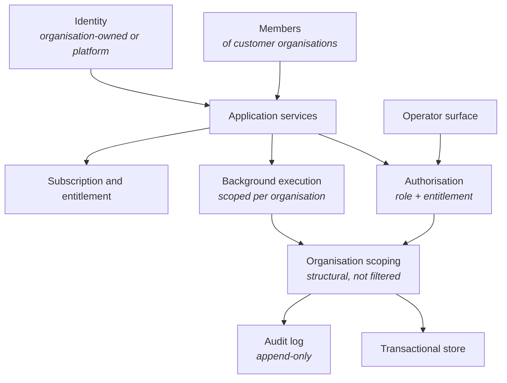

<Info>
**Status: Planned.** This framework is authored to the
[Framework standard](/frameworks/framework-standard) but is not yet published into the validated
library, and MUST NOT be matched against a brief until it is — Article 5. See
[Framework Library](/frameworks/overview).
</Info>

## Identity

| Field | Value |
| --- | --- |
| Framework ID | `devos.saas` |
| Framework class | Multi-organisation subscription products |
| Composition role | `shape` |
| Version | 1.0 |
| Status | Planned |
| Derived from | None — DevOS reference framework |

## Purpose

The SaaS framework describes a system that serves many customer organisations from one
deployment, on a recurring commercial relationship, with each organisation's data separated from
every other's.

It exists because that separation is the property most often assumed and least often designed.
Almost every other property of a subscription product can be changed later; the isolation
boundary cannot, because changing it means moving every customer's data.

## Applicability conditions

| Brief element | Condition | Weight | Rationale |
| --- | --- | --- | --- |
| Users and jobs | The brief names more than one independent customer organisation served by the same deployment | `strong` | This is what makes the system multi-organisation rather than a single deployment per customer |
| Functional scope | The brief describes recurring access to a shared service rather than a one-off delivery | `strong` | A recurring relationship is what makes subscription mechanics and continuous operation necessary |
| Compliance obligations | The brief states that one customer's data must not be reachable by another | `strong` | The isolation boundary is the framework's load-bearing property |
| Non-functional constraints | The brief states availability expectations that are continuous rather than scheduled | `supporting` | Continuous availability drives the release and migration model |
| Team and delivery | The brief states a team that will operate the system after release rather than hand it over | `supporting` | The framework assumes an operating team, not a delivery-and-exit engagement |
| Integrations | The brief names an external identity provider for customer sign-in | `supporting` | Organisation-owned identity is common in this class and shapes the membership model |

## When not to use this

| Condition | Fits better |
| --- | --- |
| The brief names exactly one organisation, whose own staff are the only users | [Internal Tool](/frameworks/internal-tool) |
| The system's primary job is intermediating between two independent parties who transact with each other | [Marketplace](/frameworks/marketplace) |
| The primary surface is an installed client that must work without connectivity | [Mobile](/frameworks/mobile) or [Desktop](/frameworks/desktop) |
| The system's principal work is performed by models under contract, and the subscription is incidental | [AI Agent](/frameworks/ai-agent) |
| The brief requires a separate deployment per customer, on customer-controlled infrastructure | No framework in the library covers this |
| The engagement is a one-off delivery with no ongoing operating relationship | No framework in the library covers this |

The last two are gaps in the library, not defects in the brief. A brief requiring per-customer
deployment should produce `NO_MATCH` rather than a SaaS recommendation with the isolation
requirement quietly reinterpreted.

## Failure modes

Ordered by what breaks earliest.

| What breaks | Under what pressure | Early signal | Usual remedy |
| --- | --- | --- | --- |
| The organisation scope on a data access path | Feature velocity, especially on reporting, export, and background work | A query, job, or export written without an organisation parameter passes review | Make the scope structural rather than conventional, so an unscoped access path cannot be expressed |
| Support and operations access | Incident pressure, where an operator needs to see a customer's data to help them | Support tooling that reads across organisations "read-only" | An access path that is scoped and audited like any other, per [Access control](/security/access-control) |
| One customer's load degrading another's service | Uneven customer size, batch jobs, or a single large customer | Latency correlated with one organisation's activity | Per-organisation limits on the shared resources, then isolation of the contended resource |
| Per-customer customisation | Sales pressure to win a large customer | Conditional behaviour keyed on a customer identifier | Configuration within one shape, or a decision to accept a fork and its cost |
| Entitlement drift from access control | Plan and pricing changes after launch | Two places answer "may this member do this" and disagree | One authorisation decision point, with entitlement as an input to it |
| Schema migration across the estate | Growth in customer count and data volume | Migrations that must run per organisation and cannot complete in a release window | Migrations designed for partial completion across the estate, per ES-9 |
| Aggregate reporting | Commercial demand for cross-customer analytics | Analytics that read across the isolation boundary because the boundary is inconvenient | An aggregate path that never returns customer-identifying data, or no such path |

## Abandonment conditions

| Condition | Response |
| --- | --- |
| A customer contractually requires their data on infrastructure they control | Per-customer deployment. The shared-deployment shape cannot satisfy it, and no framework in the library covers the alternative |
| A regulator requires physical separation rather than logical isolation for a customer class | Split that class onto its own deployment; the remaining customers may stay on this framework |
| Customisation has forked behaviour per customer to the point that releases are per customer | The system has become several products. Abandon the shared shape rather than continue absorbing the divergence |
| The system's value has moved to intermediation between the customer organisations themselves | Migrate to [Marketplace](/frameworks/marketplace) |

These differ from the failure modes above: a failure mode is remediable within this shape, an
abandonment condition is the point at which remediation is no longer the right response.

## Architecture shape

| Component | Responsibility | Property it exists to provide |
| --- | --- | --- |
| Identity and membership | Who a person is, and which organisations they belong to with which role | A person may hold different roles in different organisations without ambiguity |
| Authorisation | One decision point answering whether an actor may perform an action | Entitlement and role cannot disagree, because one place answers |
| Organisation scoping | Applying the organisation boundary before a query executes | Isolation by construction rather than by post-retrieval filtering |
| Transactional store | Durable state with consistency across the organisation boundary | A partially applied change cannot leave one organisation's data inconsistent |
| Background execution | Work that runs outside a request, carrying an organisation scope | Background work cannot become the unscoped path |
| Subscription and entitlement | What an organisation has bought and what that permits | Commercial state is an input to authorisation, not a parallel authority |
| Audit log | Append-only record of mutating operations and denials | The isolation guarantee is observable rather than asserted |
| Operator surface | Platform staff operations, scoped and audited | Support access is a normal access path, not an exception to the model |

The shape's load-bearing property is that the organisation boundary is enforced beneath the
application, so no application code path can express an unscoped access. Every other property
here can be changed after launch; this one cannot be added later without moving data.

## Data and compliance profile

| Element | Content |
| --- | --- |
| Data classes | Customer business data, member identity and contact data, authentication material, commercial and subscription data, operational telemetry, audit events |
| Isolation boundary | The customer organisation. Every stored record resolves to exactly one |
| Retention and deletion | Per organisation, including on termination. Deletion must reach backups, derived stores, and search indexes, and must not delete audit events within their own retention |
| Regulatory obligations commonly attaching | General data protection regimes covering personal data of members and end users, and any regime attaching to the customer's own sector |

Whether a specific regime applies depends on jurisdiction and processing, both of which live in
the brief. This framework MUST NOT assert that a regime applies to every adopter — FS-7.

Where the brief names regulated financial or health data, this framework alone is insufficient
and composes with a constraint framework. See [Composition](#composition).

## Operational cost profile

| Element | Content |
| --- | --- |
| Skills | Data modelling under a hard isolation boundary; zero-downtime schema migration; authorisation design; incident response with customer-visible impact; subscription and entitlement mechanics |
| Infrastructure | A transactional store; background execution; identity; secret storage; append-only audit storage; metrics, logs, and alerting |
| Operational load | Continuous availability expectations; migrations across a growing estate; per-organisation support and incident communication; credential rotation; capacity contention between customers |
| Smallest viable team | A team that can hold continuous availability and still release. Below that, the framework's release and migration model is not operable, and the cost surfaces as deferred migrations rather than as missed features |

Costs are stated in skills and infrastructure rather than currency, per FS-8. A monetary figure
would be invented for a project this framework has not seen — AI-7.

## Composition

| Composes with | Role | Constraints it contributes | Conflicts it introduces |
| --- | --- | --- | --- |
| [Fintech](/frameworks/fintech) | `constraint` | Ledger integrity, reconciliation, authorisation of value movement, retention of financial records | Financial record retention conflicts with per-organisation deletion on termination |
| [Healthcare](/frameworks/healthcare) | `constraint` | Clinical data handling, access justification, consent and lawful basis, stricter isolation and residency | Residency requirements conflict with a single shared deployment; access justification conflicts with unqualified operator access |

Both conflicts are named, not resolved. Resolving one is a decision a human accepts at confidence
review — Article 4. The composition shown in
[Create your first project](/getting-started/create-first-project) is exactly this shape: a SaaS
primary with a healthcare constraint applied.

This framework MUST NOT compose with another `shape` framework. A brief matching this and
[Marketplace](/frameworks/marketplace) is a brief with two candidate shapes, presented as two
recommendations — PS-4.

## Implied decisions

| Decision | Why this framework does not make it |
| --- | --- |
| Isolation mechanism: shared store with structural scoping, store-per-organisation, or a mix | The correct answer depends on customer count, regulatory obligations, and migration tolerance, none of which the framework knows. A common starting point is structural scoping in a shared store, stated here as a starting point rather than a recommendation |
| Identity model: organisation-owned accounts, personal accounts joining organisations, or federated identity per organisation | Determined by the buyer's own identity practice, which is a brief element |
| Where entitlement is enforced | The framework requires one decision point; which layer holds it depends on the deployment shape |
| Data residency | Depends on jurisdiction and customer commitments |
| Release and migration model | Depends on availability commitments and estate size |
| Support access model, including whether operators may read customer data at all | A commercial and regulatory choice, not an architectural one |
| Deletion depth on termination, including derived stores and backups | Depends on retention obligations that vary by adopter |
| Whether cross-customer aggregate analytics exists, and what it may return | A boundary decision with commercial pressure behind it; it must be recorded, not assumed |

Each is a decision the adopting organisation records in its own ledger. A blueprint element
implementing one of these without a recorded decision is an unattributed element — Article 3.

## Evidence and gaps

**Basis.** Derived from the common shape of multi-organisation subscription systems and from
stated first principles about isolation: that a boundary enforced beneath the application cannot
be forgotten by an application path, and that a boundary added after launch requires moving data.

**Gaps.**

- No calibration data yet on which isolation mechanism correlates with fewer isolation defects at
  a given customer count. The choice is currently presented as an implied decision without
  supporting evidence.
- The framework does not state at what customer count per-organisation stores become preferable.
  It cannot without evidence it does not have.
- Migration cost from structural scoping to store-per-organisation is not characterised.
- No content on multi-region operation. A brief with residency obligations across regions is
  currently underserved by this framework.

**Contested points.**

- Whether a shared store with structural scoping or a store per organisation is the safer default.
  Competent practitioners disagree, and the disagreement is about failure consequence rather than
  failure likelihood.
- Whether operator access to customer data should exist at all, or whether support should be
  conducted entirely through customer-initiated sessions.

## Version history

| Version | Date | Change |
| --- | --- | --- |
| 1.0 | 2026-07-31 | Initial framework, authored to the framework standard. |
