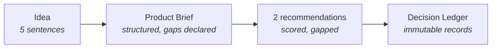

<Info>
**Status: Prototype.** This example reflects the currently implemented path: interview,
recommendations, and ledger. Blueprint and build pipeline stages are Concept and are not
covered here.
</Info>

## Purpose

The [Quickstart](/getting-started/quickstart) describes the steps. This page works a single
example through them so you can see what good input and output actually look like — including
where the example produces a low confidence score and what to do about it.

## The example

A physiotherapy clinic scheduling tool. It is a useful example because it triggers three
distinct interview branches: regulated health data, an external SMS integration, and a
small-team delivery constraint.

## Step 1 — Create the project

In your customer workspace, create a project. You need a **Contributor** or **Owner** role;
a Viewer can read but not accept decisions. See
[Roles and workspaces](/getting-started/roles-and-workspaces).

Give the project a name that will still make sense to someone else in six months.
`clinic-scheduling` is better than `new-app`.

## Step 2 — Describe the idea

```text
A scheduling tool for independent physiotherapy clinics. Clinic staff book
appointments, patients confirm by SMS, and clinicians see a daily list with
treatment notes attached to each patient. Target customers are small clinics
with two to fifteen staff, UK-based. We are not building billing or insurance
claims in the first version.
```

What makes this a good idea statement:

- It names the users (clinic staff, patients, clinicians) and what each does.
- It names the data (treatment notes) without pretending it is ordinary data.
- It gives a scale bound (two to fifteen staff) and a jurisdiction (UK).
- It states a non-goal (no billing or claims).

## Step 3 — Complete the interview

The interview branches on that text. Below are representative exchanges — abbreviated, and
illustrative of the shape rather than a transcript of a specific run.

### Users and jobs

> **Which user needs the system most urgently, and what happens today if they don't get it?**
>
> Clinic reception staff. Today they use a paper diary and a phone. Double bookings and
> no-shows are the recurring cost.

This answer is useful because it identifies the primary job (eliminate double bookings and
reduce no-shows) rather than the feature (a calendar).

### Compliance

> **Treatment notes are health records. Are you the data controller, and which jurisdiction
> governs the data?**
>
> Yes, the clinic is the controller and we are the processor. UK GDPR.

> **Will clinical data be accessible to anyone outside the clinic that recorded it?**
>
> No. Strict isolation per clinic.

That second answer is load-bearing. It later drives a hard tenancy decision rather than a
preference.

### Non-functional constraints

> **Peak concurrent users at launch, and at twelve months?**
>
> I don't know.

**This is the correct answer if it is the true one.** The brief records it as a declared
unknown, and it becomes an evidence gap at the confidence review stage. Guessing "about 50"
would produce a confident recommendation resting on a number you invented.

### Integrations

> **Is SMS confirmation a hard requirement, and do you have a provider constraint?**
>
> Hard requirement. No provider preference, but delivery to UK mobile numbers must be
> reliable and auditable.

### Team and delivery

> **How many engineers, and what do they already know?**
>
> Two. Both TypeScript, one has Postgres experience. Nobody knows Kubernetes.

> **Is there a deadline that outranks technical preference?**
>
> Yes. A pilot clinic in four months.

The last two answers constrain the architecture more than any stated preference would. A
recommendation that requires operational expertise the team does not have is a bad
recommendation regardless of its technical merit.

## Step 4 — Review the brief

The interview produces a **Product Brief**. Read it before continuing. Check three things:

1. **Are the non-goals present?** Billing and insurance claims should appear as explicit
   non-goals, not as absences.
2. **Are the unknowns recorded as unknowns?** The concurrency answer should appear as a
   declared unknown, not as a default value.
3. **Is any constraint stated more strongly than you meant it?** Correcting this now costs
   nothing. Correcting it after acceptance requires supersession.

## Step 5 — Review recommendations

DevOS matches the brief against the [Framework Library](/frameworks/overview). This brief
matches two framework classes, which is why you get candidates rather than an answer:

| Recommendation | Derived from | Why it matched |
| --- | --- | --- |
| A | [SaaS](/frameworks/saas) | Multi-clinic tenancy, subscription shape, small teams |
| B | [Healthcare](/frameworks/healthcare) | Health records, UK GDPR, strict per-clinic isolation |

Neither is wrong. The healthcare framework constrains data handling more tightly; the SaaS
framework fits the commercial and operational shape better. In practice the resolution is a
SaaS architecture with the healthcare framework's data-handling constraints applied — and
that composition is itself a decision to record.

### Reading a confidence score

Each recommendation arrives with a score, its evidence, and its gaps:

```text
Recommendation B — Healthcare framework
Confidence: 0.61

Evidence for:
  - Regulated data class explicitly confirmed (health records, UK GDPR)
  - Controller/processor relationship stated
  - Per-tenant isolation stated as a hard requirement

Evidence gaps:
  - Peak concurrency unknown (declared) — affects data partitioning strategy
  - No stated retention or deletion obligation for treatment notes
  - Audit granularity for clinical record access not specified
```

Read the gaps first. Two of these three are answerable in an afternoon by asking the pilot
clinic. Closing them and re-running is almost always better than accepting at 0.61.

See [Architecture Confidence Engine](/engines/architecture-confidence-engine).

## Step 6 — Close a gap and re-run

Suppose you ask the pilot clinic and learn: 15 concurrent users at launch, 200 at twelve
months; treatment notes retained seven years then deleted; every access to a clinical record
must be attributable to a named user.

Return to the interview, supply those three answers, and re-run. The gaps close, and the
score moves because the evidence changed — not because the model was re-rolled. That
distinction is the point of the scoring model.

## Step 7 — Accept decisions

Work through each recommendation and Accept, Reject, or Defer it. A decision record from this
example would look like:

```text
DR-004  Per-clinic data isolation at the database schema level
Status:      Accepted
Confidence:  0.88 at acceptance
Context:     Treatment notes are UK GDPR health records. The clinic is
             controller, DevOS-built system is processor. Cross-clinic
             access is prohibited by the brief.
Decision:    Isolate clinic data in separate Postgres schemas within a
             shared instance, with connection-level tenant scoping.
Alternatives considered:
  - Row-level security in shared tables — rejected: a single missed
    predicate exposes cross-clinic clinical data.
  - Database per clinic — rejected: two engineers, no Kubernetes
    experience, four-month pilot deadline. Operationally unaffordable.
Consequences:
  - Schema migrations must run per tenant; migration tooling required
    before the second clinic onboards.
  - Cross-clinic reporting becomes materially harder. Accepted; not a
    first-version requirement.
```

Note what makes this record useful: the rejected alternatives carry their reasons, and the
consequences include the cost being accepted. Six months later, someone asking "why not
row-level security?" gets an answer.

See [Decision Ledger](/engines/decision-ledger).

## What you have at the end



A structured brief, a scored recommendation set with its reasoning, and a ledger that
explains the architecture and what was rejected. That ledger is the input to blueprint
compilation once the Blueprint Engine moves beyond Concept status.

## Next steps

<CardGroup cols={2}>
  <Card title="Product workflow" icon="diagram-project" href="/getting-started/product-workflow">
    The handoff rules that govern each stage transition.
  </Card>
  <Card title="Decision Ledger" icon="scroll" href="/engines/decision-ledger">
    Record structure, supersession, and traceability.
  </Card>
  <Card title="Framework Library" icon="layer-group" href="/frameworks/overview">
    The reference architectures recommendations are drawn from.
  </Card>
  <Card title="Decision record template" icon="file-lines" href="/reference/decision-record-template">
    The canonical record format.
  </Card>
</CardGroup>

## Version history

| Version | Date | Change |
| --- | --- | --- |
| 1.0 | 2026-07-29 | Initial page. |
