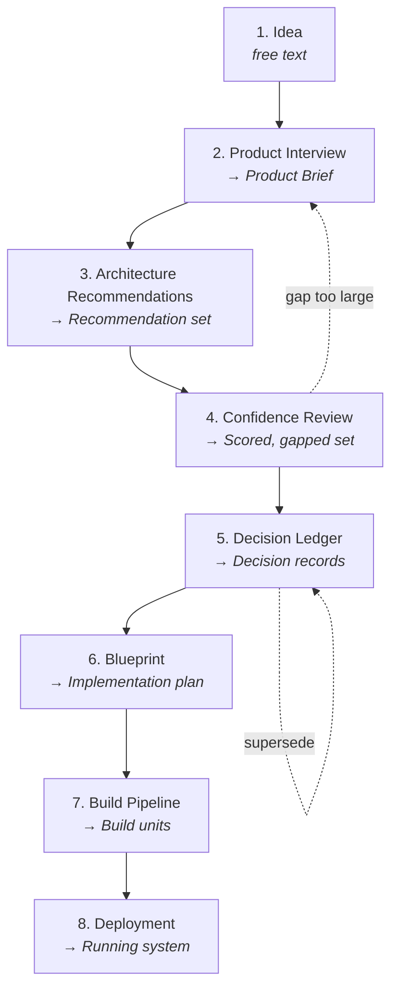

## Purpose

This page specifies the eight-stage DevOS workflow: what each stage consumes, what it
produces, who is accountable, and the rules that govern the handoff between stages.

## The workflow

## Stage summary

| # | Stage | Input | Output | Owner | Status |
| --- | --- | --- | --- | --- | --- |
| 1 | Idea | — | Free-text description | User | Prototype |
| 2 | Product Interview | Idea | Product Brief | Product Interview Engine | Prototype |
| 3 | Architecture Recommendations | Product Brief | Recommendation set | Decision Engine | Prototype |
| 4 | Confidence Review | Recommendation set | Scored set with evidence gaps | Architecture Confidence Engine + user | Concept (engine) |
| 5 | Decision Ledger | Accepted recommendations | Decision records | Decision Ledger | Prototype |
| 6 | Blueprint | Decision Ledger | Blueprint | Blueprint Engine | Concept |
| 7 | Build Pipeline | Blueprint | Build units | Build Pipeline | Concept |
| 8 | Deployment | Build units | Running system | User's own toolchain | Out of scope |

DevOS does not perform stage 8. It specifies the operational readiness expectations that
stage 8 should satisfy.

## Handoff rules

Four rules govern every transition. They are what make the workflow auditable.

1. **Forward flow only.** A stage reads only the artefact immediately upstream. Stage 6 reads
   the ledger, not the interview transcript.
2. **No invented constraints.** A stage MUST NOT introduce a requirement absent from its
   input. If the blueprint needs a constraint the ledger lacks, the ledger is wrong and must
   be amended by supersession.
3. **Human acceptance at stage 5.** Only a human converts a recommendation into a decision.
   No confidence score authorises automatic acceptance.
4. **Traceability is preserved.** Every element of a downstream artefact resolves to a
   specific upstream element. A build unit with no originating decision is a defect.

## Stage 1 — Idea

**Input:** none. **Output:** free-text description.

The user describes what they intend to build in plain language. Two to five sentences is
typical. The idea is not an artefact and is not consumed after stage 2, but it is retained
for audit.

Hedged or deliberately vague input produces a worse interview than honest uncertainty,
because the interview branches on the text it is given.

## Stage 2 — Product Interview

**Input:** idea. **Output:** Product Brief.

An adaptive question sequence covering six areas: users and jobs, functional scope,
non-functional constraints, compliance, integrations, and team and delivery. The interview
branches on answers rather than walking a fixed questionnaire.

Two properties are required of the output:

- **Unknowns are recorded as unknowns.** "I don't know" is a first-class answer that becomes
  a declared evidence gap. The engine MUST NOT substitute a default value silently.
- **Non-goals are captured.** What the user is deliberately not building is part of the
  brief.

The brief is the sole input to stage 3. Reviewing it before proceeding is the cheapest
correction point in the workflow.

See [Product Interview Engine](/engines/product-interview-engine).

## Stage 3 — Architecture Recommendations

**Input:** Product Brief. **Output:** recommendation set.

The brief is matched against the [Framework Library](/frameworks/overview). The engine
produces a **set** of candidates, not a single answer, because a brief containing real
ambiguity should not resolve to false certainty.

Each recommendation records the framework it derives from and the brief elements that caused
the match.

See [Decision Engine](/engines/decision-engine).

## Stage 4 — Confidence Review

**Input:** recommendation set. **Output:** scored set with evidence and gaps.

Each recommendation receives a confidence score from 0.00 to 1.00, the evidence supporting
it, and the evidence gaps that would move it. The user then marks each recommendation:

| Action | Effect |
| --- | --- |
| Accept | Proceeds to stage 5 as a decision record |
| Reject | Recorded with reasoning; not carried forward |
| Defer | Held pending closure of a named evidence gap |

When a gap is large enough to undermine the whole recommendation set, the correct move is to
return to stage 2 and answer the underlying question — the dashed feedback edge in the
diagram above.

See [Architecture Confidence Engine](/engines/architecture-confidence-engine).

## Stage 5 — Decision Ledger

**Input:** accepted recommendations. **Output:** decision records.

Each acceptance produces an immutable record containing context, the decision, alternatives
considered, consequences, and the confidence at the time of acceptance.

Records are never edited. A changed decision is expressed as a new record that supersedes
the old one, with the original retained and marked. This is the self-loop in the diagram.

The ledger is the durable output of the currently implemented workflow.

See [Decision Ledger](/engines/decision-ledger).

## Stage 6 — Blueprint

**Input:** Decision Ledger. **Output:** blueprint.

<Info>**Status: Concept.** Specified, not implemented.</Info>

The ledger compiles into an implementation plan: module boundaries, data model, interface
contracts, milestones, and test strategy. Compilation is deterministic — the same ledger
produces the same blueprint.

Because the blueprint derives from the ledger, it cannot contain a choice no human accepted.

See [Blueprint Engine](/engines/blueprint-engine).

## Stage 7 — Build Pipeline

**Input:** blueprint. **Output:** ordered build units.

<Info>**Status: Concept.** Specified, not implemented.</Info>

The blueprint compiles into build units — AI build prompts carrying the applicable decisions
and interface contracts, and human work items for work that should not be delegated — with
their dependency ordering.

See [AI Build Pipeline](/engines/build-pipeline).

## Stage 8 — Deployment

**Input:** build units. **Output:** running system.

Deployment is performed by the user's own toolchain. DevOS specifies the operational
readiness expectations that a deployed system should meet — observability, access control,
and release practice — in [Architecture](/architecture/deployment) and
[Security](/security/overview).

## Iteration

The workflow is not a single pass. Three loops are normal and expected:

| Loop | Trigger | Path |
| --- | --- | --- |
| Interview loop | An evidence gap undermines the recommendation set | Stage 4 → stage 2 |
| Supersession loop | A decision is invalidated by new information | Stage 5 → stage 5 |
| Scope loop | The build reveals a missing requirement | Stage 7 → stage 2, then forward |

What is **not** permitted is patching a downstream artefact directly. Editing a blueprint to
fix a wrong decision breaks traceability and leaves the ledger lying about the project.

## Failure states

| Failure | Detection | Response |
| --- | --- | --- |
| Brief incomplete beyond a usable threshold | Interview completeness check at stage 2 exit | Block progression; name the missing areas |
| No framework matches the brief | Empty recommendation set at stage 3 | Report no match; do not synthesise a framework |
| All recommendations below confidence threshold | Stage 4 scoring | Surface gaps; recommend returning to stage 2 |
| Ledger contains contradictory active decisions | Ledger consistency check | Block blueprint compilation until resolved by supersession |
| Blueprint element with no originating decision | Traceability check at stage 6 | Reject the compilation as a defect |

## Acceptance criteria

- Every artefact identifies the artefact it was derived from.
- Every decision record has exactly one accepting human identity and timestamp.
- No blueprint element exists without a resolvable originating decision.
- Unknowns declared in the interview appear as evidence gaps at stage 4.
- Superseded decisions remain retrievable, with a pointer to their successor.

## Open questions

- What completeness threshold should block progression from stage 2, and should it vary by
  framework class?
- Should stage 4 permit accepting a recommendation below a configured confidence floor with
  a recorded override, or block it outright?
- How should a scope loop from stage 7 reconcile with build units already completed?

## Version history

| Version | Date | Change |
| --- | --- | --- |
| 1.0 | 2026-07-29 | Initial page. |
