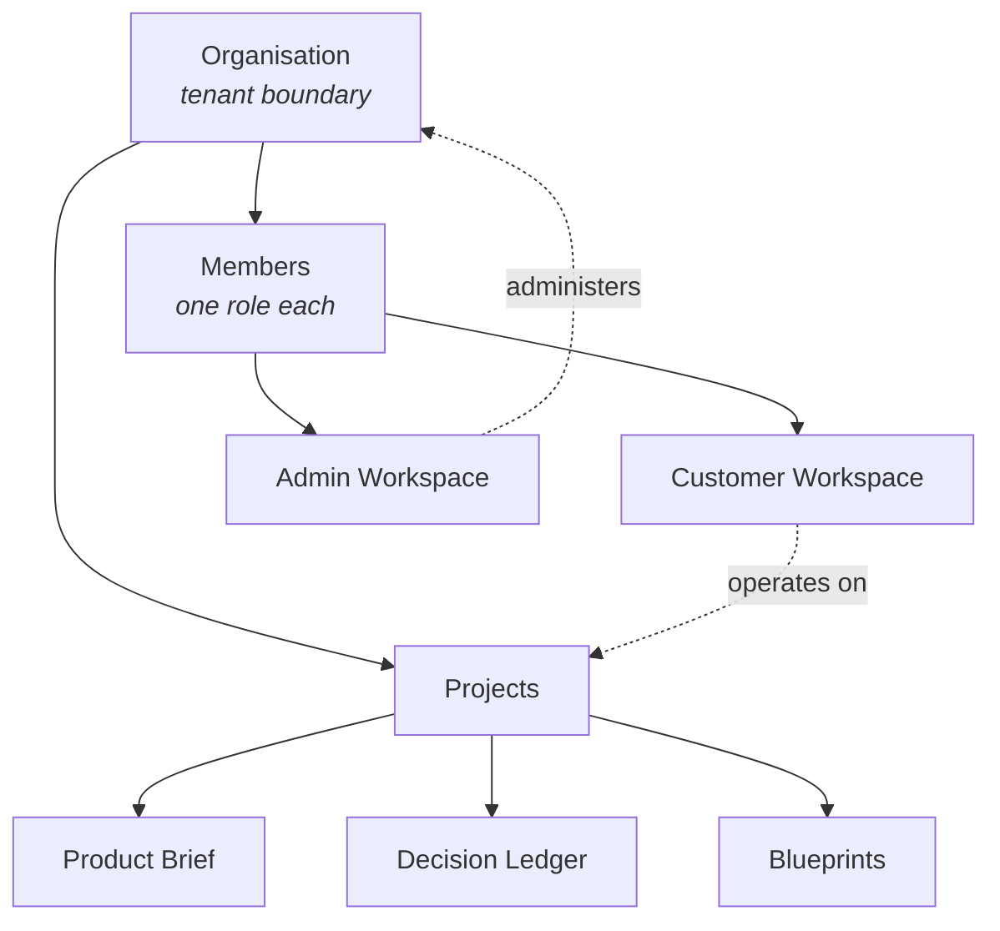

## Purpose

This page explains how DevOS organises people and access: the organisation boundary, the two
workspace types, and the four roles. It is the practical guide; the normative permission
matrix is in [Permissions](/product/permissions).

## The structure

### Organisation

The **organisation** is the tenant boundary. It owns projects, members, and billing. All
data isolation is enforced here: no query, export, or agent retrieval crosses an
organisation boundary.

A user account may belong to several organisations, holding a different role in each. Roles
never span organisations.

See [Multi-tenancy](/architecture/multi-tenancy).

### Workspaces

A **workspace** is a member's working context. There are exactly two:

| Workspace | Purpose | Who uses it |
| --- | --- | --- |
| [Customer workspace](/product/customer-workspace) | Create and run projects: interview, recommendations, confidence review, ledger, blueprints | All roles, with differing capability |
| [Admin workspace](/product/admin-workspace) | Administer the organisation: members, roles, frameworks, API access, audit log | Owner and Admin only |

The split exists so that day-to-day project work is never one misclick away from an
administrative change.

<Info>
**Status:** Customer workspace is Prototype. Admin workspace is Concept — the model below is
specified but not implemented.
</Info>

## Roles

DevOS defines four roles. A member holds exactly one role per organisation.

| Role | Intent |
| --- | --- |
| **Owner** | Accountable for the organisation. Full capability including billing and deletion. |
| **Admin** | Administers members, frameworks, and settings. Cannot delete the organisation or change billing. |
| **Contributor** | Does the design work: runs interviews, reviews recommendations, accepts decisions. |
| **Viewer** | Reads projects and ledgers. Changes nothing. |

### What each role can do

| Capability | Owner | Admin | Contributor | Viewer |
| --- | --- | --- | --- | --- |
| View projects, briefs, ledgers | Yes | Yes | Yes | Yes |
| Create a project | Yes | Yes | Yes | No |
| Run a product interview | Yes | Yes | Yes | No |
| Request recommendations | Yes | Yes | Yes | No |
| **Accept a decision into the ledger** | Yes | Yes | Yes | No |
| Supersede a decision | Yes | Yes | Yes | No |
| Delete a project | Yes | Yes | No | No |
| Invite and remove members | Yes | Yes | No | No |
| Change a member's role | Yes | Yes | No | No |
| Author or edit frameworks | Yes | Yes | No | No |
| View audit log | Yes | Yes | No | No |
| Manage API credentials | Yes | Yes | No | No |
| Manage billing | Yes | No | No | No |
| Delete the organisation | Yes | No | No | No |

Two properties are deliberate:

- **Contributors accept decisions.** Acceptance is design work, not administration. Making
  it an admin capability would either bottleneck design or push administrators into
  technical judgement they are not accountable for.
- **Only an Owner can delete the organisation or change billing.** These are irreversible or
  financial, and are held at the accountable role.

The authoritative matrix, including API scopes and edge cases, is in
[Permissions](/product/permissions).

## Choosing a role

| Situation | Role |
| --- | --- |
| You founded the organisation or hold budget for it | Owner |
| You manage who has access, and maintain the framework library | Admin |
| You are designing systems — running interviews, weighing recommendations | Contributor |
| You need to read a ledger to understand a decision, but not change it | Viewer |
| An external reviewer or auditor needs read access | Viewer |
| An engineer implementing from a blueprint, not making design decisions | Viewer |

Prefer Viewer where read access is sufficient. Every Contributor can permanently alter a
project's decision history.

## Role assignment rules

1. Every organisation MUST have at least one Owner. The last Owner cannot be demoted or
   removed; transfer ownership first.
2. A role change takes effect immediately and is recorded in the audit log.
3. A member cannot change their own role. An Owner can change any role; an Admin can change
   Contributor and Viewer roles only.
4. Invitations carry the intended role and expire if unaccepted. An expired invitation grants
   nothing.
5. Removing a member revokes access immediately but does not remove their name from decision
   records they accepted. Records are immutable — attribution survives departure.

That last rule matters: a ledger that anonymised departed staff would lose the
accountability that makes it worth reading.

## Attribution and immutability

Decision records name the human who accepted them, with a timestamp. This is why:

- Accepting a decision is a personal act, not a system output.
- Six months later, "who decided this and on what evidence?" has an answer.
- Deactivating an account never rewrites history.

See [Decision Ledger](/engines/decision-ledger) and [Audit logging](/security/audit-logging).

## Failure states

| Situation | Behaviour |
| --- | --- |
| Viewer attempts to accept a decision | Rejected; recorded as a denied authorisation event |
| Last Owner attempts to demote themselves | Blocked with an explanation; ownership transfer required first |
| Admin attempts to change an Owner's role | Blocked |
| Member removed mid-interview | Session ends; the partial brief is retained on the project |
| Member's role reduced during an active session | New permissions apply on the next action, not retroactively |

## Open questions

- Should a project-scoped role exist, so a Contributor can be limited to specific projects
  rather than the whole organisation?
- Should framework authoring be separable from member administration? They are unrelated
  skills currently bundled into Admin.
- Should a time-bounded Viewer role exist for external auditors, expiring automatically?

## Next steps

<CardGroup cols={2}>
  <Card title="Permissions" icon="lock" href="/product/permissions">
    The normative permission matrix and enforcement points.
  </Card>
  <Card title="Customer workspace" icon="briefcase" href="/product/customer-workspace">
    Where project work happens.
  </Card>
  <Card title="Admin workspace" icon="gear" href="/product/admin-workspace">
    Organisation administration.
  </Card>
  <Card title="Multi-tenancy" icon="building" href="/architecture/multi-tenancy">
    How the organisation boundary is enforced.
  </Card>
</CardGroup>

## Version history

| Version | Date | Change |
| --- | --- | --- |
| 1.0 | 2026-07-29 | Initial page. |
