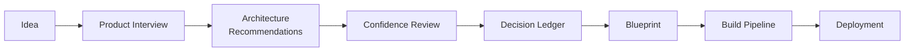

# DevOS Documentation

**The operating system for designing, documenting, and building software.**

DevOS converts product intent into architecture recommendations, documented decisions,
implementation blueprints, and structured build pipelines. It is designed for the moment
between "we have an idea" and "we are writing code" — the interval where most software
projects accumulate the ambiguity that later becomes rework.

<Note>
DevOS documentation contains both public product guidance and internal engineering
specifications. Document status labels indicate whether a capability is conceptual,
planned, in beta, or operational.
</Note>

## The DevOS workflow

Every DevOS project moves through the same eight stages. Each stage produces a durable
artefact that the next stage consumes, so nothing is re-derived from memory.

<Steps>
  <Step title="Idea">
    A short natural-language description of what you are building and who it is for.
  </Step>
  <Step title="Product Interview">
    A guided, adaptive interview that turns the idea into a structured product brief:
    users, jobs, constraints, compliance obligations, and scale expectations.
  </Step>
  <Step title="Architecture Recommendations">
    Candidate architectures drawn from the framework library, matched against the brief.
  </Step>
  <Step title="Confidence Review">
    Each recommendation carries a confidence score with an explicit rationale and the
    evidence gaps that would raise or lower it.
  </Step>
  <Step title="Decision Ledger">
    Accepted decisions are recorded as immutable, versioned records with context,
    alternatives considered, and consequences.
  </Step>
  <Step title="Blueprint">
    A structured implementation plan derived from the ledger: modules, data model,
    interfaces, milestones, and test strategy.
  </Step>
  <Step title="Build Pipeline">
    The blueprint is compiled into ordered, scoped AI build prompts and human work items.
  </Step>
  <Step title="Deployment">
    Release, observability, and operational readiness expectations for the built system.
  </Step>
</Steps>

## Start here

<CardGroup cols={2}>
  <Card title="Getting Started" icon="rocket" href="/getting-started/quickstart">
    Run your first product interview and create a project end to end.
  </Card>
  <Card title="Constitution" icon="scale-balanced" href="/constitution/introduction">
    The non-negotiable principles and standards that govern DevOS.
  </Card>
  <Card title="Core Engines" icon="gears" href="/engines/overview">
    The seven engines that move a project from intent to build pipeline.
  </Card>
  <Card title="Framework Library" icon="layer-group" href="/frameworks/overview">
    Reference architectures for SaaS, marketplace, AI agent, fintech, and more.
  </Card>
  <Card title="Architecture" icon="sitemap" href="/architecture/system-overview">
    The platform layers, AI Connect, the Plugin System, and how DevOS is deployed.
  </Card>
  <Card title="Security" icon="shield-halved" href="/security/overview">
    Access control, data protection, secrets, auditing, and incident response.
  </Card>
  <Card title="AI Agents" icon="robot" href="/agents/overview">
    The agent contract, and the specialised agents that operate inside DevOS.
  </Card>
  <Card title="RFCs" icon="file-lines" href="/rfcs/index">
    Design proposals under review, and the record of decisions already made.
  </Card>
</CardGroup>

## How this documentation is organised

| Section | Audience | Purpose |
| --- | --- | --- |
| Introduction, Getting Started | Public | What DevOS is and how to use it |
| Constitution, Governance | Public and internal | Principles, standards, and change control |
| Product, Core Engines, Frameworks | Internal, published | Product and engine specifications |
| Architecture, Security | Internal | Platform design and controls |
| Design System, AI Agents | Internal | Interface and agent contracts |
| API Reference | Public, planned | Programmatic surface for DevOS data |
| RFCs, Reference | Public and internal | Proposals, templates, and definitions |

Every page carries a status label. If you are evaluating DevOS, read the status before
you read the capability description — see [Status definitions](/reference/status-definitions).

## Current status

DevOS is in active development. The documented engines are at differing maturity levels:

| Capability | Status |
| --- | --- |
| Product Interview Engine | Prototype |
| Decision Engine | Prototype |
| Architecture Confidence Engine | Concept |
| Decision Ledger | Prototype |
| Blueprint Engine | Concept |
| AI Build Pipeline | Concept |
| Framework Library | Planned |
| AI Connect | Concept |
| Plugin System | Concept |
| Public API | Concept |

This table is the single source of truth for capability maturity. Individual pages repeat
their own status but must not contradict this table.
