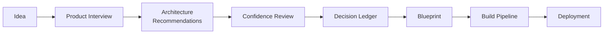

## Purpose

DevOS is the operating system for building software. It occupies the interval between
"we have an idea" and "we are writing code" — the phase where most projects accumulate the
unexamined assumptions that later surface as rework.

DevOS takes a natural-language description of what someone is building and produces four
durable artefacts:

1. A **structured product brief** derived from a guided interview.
2. **Architecture recommendations** with explicit confidence scores and rationale.
3. A **Decision Ledger** of accepted technical decisions, with alternatives and consequences.
4. An **implementation blueprint** that compiles into ordered AI build prompts and human
   work items.

## The problem

Software projects rarely fail because a framework was chosen badly. They fail because the
choice was never recorded, the reasoning was never written down, and the constraint that
made the choice correct was forgotten three months later.

Four failure patterns recur:

| Pattern | What happens |
| --- | --- |
| Undocumented intent | The product brief lives in someone's head. Every implementer reconstructs a slightly different version of it. |
| Unscored recommendations | Architecture advice arrives with the same apparent authority whether it rests on strong evidence or a guess. |
| Lost decisions | The choice is made in a meeting or a chat thread and never becomes a durable record. |
| Unstructured AI use | AI coding tools are given prompts without the constraints, decisions, and interfaces that would make their output coherent. |

DevOS treats each of these as a systems problem with a documented artefact as the fix, not
as a discipline problem to be solved by asking people to try harder.

## How DevOS works

Each stage consumes the previous stage's artefact. Nothing is re-derived from memory, and
no stage is permitted to invent a constraint that the brief does not contain.

### 1. Product Interview

An adaptive interview converts a free-text idea into a structured brief: users and their
jobs, functional scope, non-functional constraints, compliance obligations, integration
requirements, and scale expectations. The interview branches on answers rather than walking
a fixed questionnaire, and it records what the user did **not** know as explicitly as what
they did. See [Product Interview Engine](/engines/product-interview-engine).

### 2. Architecture recommendations

The brief is matched against the [Framework Library](/frameworks/overview) — reference
architectures for SaaS, marketplace, AI agent, internal tool, mobile, desktop, fintech, and
healthcare systems. The Decision Engine produces candidate architectures rather than a
single answer, because a brief with genuine ambiguity should not yield false certainty.
See [Decision Engine](/engines/decision-engine).

### 3. Confidence review

Every recommendation carries a confidence score, the evidence behind it, and — critically —
the evidence gaps that would move the score. A low-confidence recommendation is not
suppressed; it is labelled, with the missing information named so the user can supply it.
See [Architecture Confidence Engine](/engines/architecture-confidence-engine).

### 4. Decision Ledger

Accepted decisions become immutable, versioned records: context, decision, alternatives
considered, consequences, and the confidence at the time of acceptance. Decisions are
superseded, never edited. See [Decision Ledger](/engines/decision-ledger).

### 5. Blueprint

The ledger compiles into an implementation blueprint: module boundaries, data model,
interface contracts, milestones, and test strategy. The blueprint is derived from
decisions, so a blueprint cannot contain a choice that no one made.
See [Blueprint Engine](/engines/blueprint-engine).

### 6. Build pipeline

The blueprint compiles further into ordered, scoped build units — AI prompts carrying the
relevant decisions and interface contracts, plus human work items for the parts that should
not be delegated. See [AI Build Pipeline](/engines/build-pipeline).

## What DevOS is not

- **Not a code generator.** DevOS produces the specifications and prompts that code
  generation needs. It does not aim to be the thing that writes your application.
- **Not a project management tool.** It produces work items; it does not replace your
  tracker, sprint process, or roadmap tool.
- **Not an oracle.** Recommendations are scored precisely so that users can see where the
  system is guessing.
- **Not a substitute for engineering judgement.** A decision is only in the ledger because
  a human accepted it.

## Current status

DevOS is in active development. Maturity varies by component:

| Component | Status |
| --- | --- |
| Product Interview Engine | Prototype |
| Decision Engine | Prototype |
| Architecture Confidence Engine | Concept |
| Decision Ledger | Prototype |
| Blueprint Engine | Concept |
| AI Build Pipeline | Concept |
| Framework Library | Planned |
| AI Connect | Concept |
| Plugin System | Concept |
| Public API | Concept |

The authoritative version of this table is on the [documentation homepage](/). Where a page
describes a Concept or Planned capability, it describes intent, not current behaviour.
See [Status definitions](/reference/status-definitions).

## Where to go next

<CardGroup cols={2}>
  <Card title="Vision" icon="telescope" href="/introduction/vision">
    What DevOS is aiming at, and what success looks like.
  </Card>
  <Card title="Philosophy" icon="compass" href="/introduction/philosophy">
    The design convictions behind the product.
  </Card>
  <Card title="Terminology" icon="book" href="/introduction/terminology">
    The vocabulary used consistently across this documentation.
  </Card>
  <Card title="Quickstart" icon="rocket" href="/getting-started/quickstart">
    Run a product interview and produce your first blueprint.
  </Card>
</CardGroup>

## Version history

| Version | Date | Change |
| --- | --- | --- |
| 1.0 | 2026-07-29 | Initial page. |
