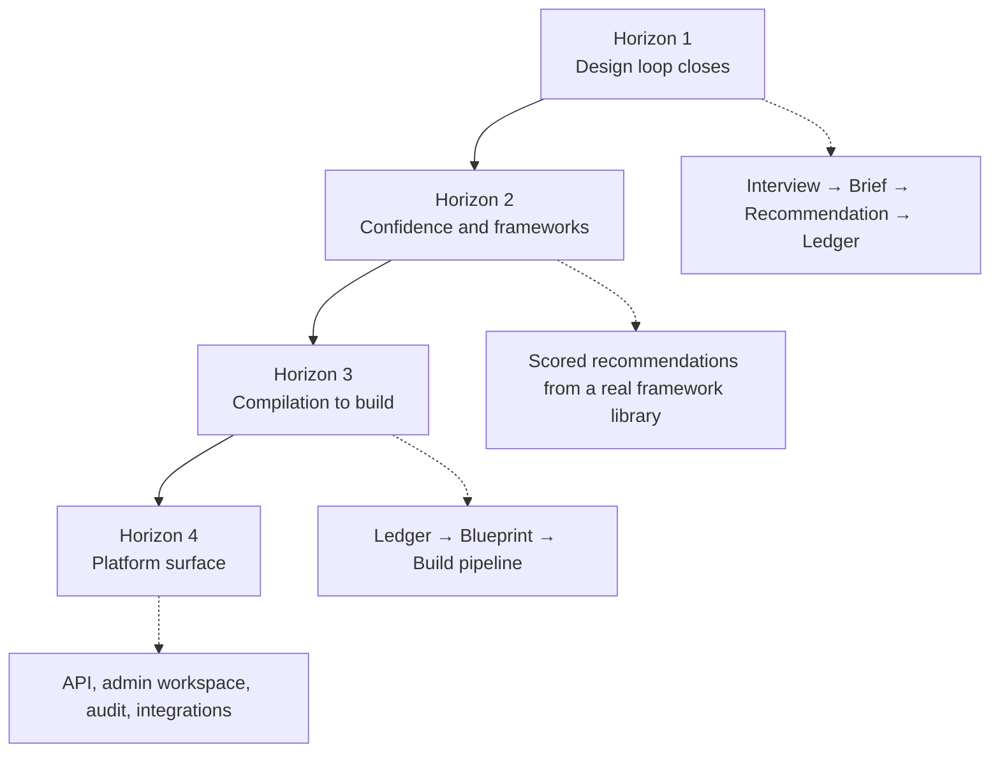

## Purpose

This page records the sequence in which DevOS capabilities are being built and the criteria
that move each one to its next status. It is a planning document, not a commitment of dates.

<Note>
No statement on this page is a delivery commitment. Dated targets are internal planning
horizons and change as evidence arrives. Status labels are the reliable signal — see
[Status definitions](/reference/status-definitions).
</Note>

## Current status

| Capability | Status | Next milestone |
| --- | --- | --- |
| Product Interview Engine | Prototype | Interview completeness scoring; branch coverage for all eight framework classes |
| Decision Engine | Prototype | Deterministic recommendation ranking against a fixed brief corpus |
| Decision Ledger | Prototype | Immutable supersession chain with full traceability queries |
| Architecture Confidence Engine | Concept | Scoring model specification and calibration methodology |
| Blueprint Engine | Concept | Blueprint schema and ledger-to-blueprint compilation rules |
| AI Build Pipeline | Concept | Build unit schema and prompt-assembly contract |
| Framework Library | Planned | Eight reference frameworks authored to the framework standard |
| Customer Workspace | Prototype | Project lifecycle UI covering interview through ledger |
| Admin Workspace | Concept | Framework authoring and organisation administration |
| Public API | Concept | Read surface for projects, decisions, and blueprints |
| Audit Logging | Planned | Append-only event log across all mutating operations |

The authoritative capability status table is on the [documentation homepage](/). This page
adds sequencing; it must not contradict that table.

## Sequencing

The order below reflects dependency, not preference. Each horizon depends on the artefacts
produced by the one before it.

### Horizon 1 — Close the design loop

Get a single project from idea to accepted decisions without manual intervention.

- Product Interview Engine handles branching and records unknowns explicitly.
- Decision Engine produces multiple candidate recommendations, not one.
- Decision Ledger enforces immutability and supersession.
- Customer workspace exposes the full path in the interface.

**Exit criteria:** an internal user takes three unrelated ideas from free text to an
accepted ledger with no engineer intervention, and the ledger explains each architecture
accurately when re-read a month later.

### Horizon 2 — Confidence and frameworks

Make recommendations trustworthy by grounding them in real reference architectures and
scoring them honestly.

- Framework Library: all eight frameworks authored to the framework standard, each naming
  its failure modes.
- Architecture Confidence Engine: scoring model, evidence model, and gap identification.
- Calibration methodology established, with a baseline measurement recorded.

**Exit criteria:** confidence scores are measurably calibrated — high-confidence
recommendations are reversed less often than low-confidence ones across a real project set.
If calibration cannot be demonstrated, scoring is removed rather than tuned. This is a
stated failure condition in the [Vision](/introduction/vision).

### Horizon 3 — Compilation to build

Turn accepted decisions into work.

- Blueprint schema, and deterministic ledger-to-blueprint compilation.
- Build unit schema, dependency ordering, and prompt-assembly contract.
- Traceability from any build unit back to the decision that justifies it.

**Exit criteria:** an implementer starts work from a blueprint without a verbal briefing,
and every build unit resolves to a decision record.

### Horizon 4 — Platform surface

Make DevOS usable by organisations rather than individuals.

- Admin workspace: framework authoring, organisation and member administration.
- Public API: read surface for projects, decisions, and blueprints.
- Audit logging across all mutating operations.
- Integrations with issue trackers and code hosts.

**Exit criteria:** an organisation administers its own members, frameworks, and API access
without operator involvement, and every mutating action appears in the audit log.

## Deliberately deferred

Recording what we are not doing is as useful as recording what we are.

| Deferred | Reason |
| --- | --- |
| Code generation and repository ownership | DevOS produces specifications and prompts; owning the code is a different product. |
| Issue tracking and sprint management | We integrate with trackers rather than replacing them. |
| Unattended end-to-end automation | Human acceptance of decisions is a design conviction, not a limitation. See [Philosophy](/introduction/philosophy). |
| Real-time multi-user editing of briefs | Valuable, but not on the path to closing the design loop. |
| Self-hosted deployment | Requires an operational maturity the platform does not yet have. |
| On-premise or air-gapped operation | Depends on self-hosted deployment. |

## How this page changes

Roadmap changes are normative and follow the governance process. A capability's status may
only be promoted with linked evidence — a demo, a test run, or a release note. See
[Proposal process](/governance/proposal-process) and
[Documentation lifecycle](/governance/documentation-lifecycle).

## Open questions

- What project volume is required before confidence calibration can be measured credibly?
- Should the Framework Library be authored entirely in Horizon 2, or should two frameworks
  land earlier to validate the framework standard against real briefs?
- Does the public API belong in Horizon 3 rather than Horizon 4, given that blueprint
  consumers are likely to want programmatic access first?

## Version history

| Version | Date | Change |
| --- | --- | --- |
| 1.0 | 2026-07-29 | Initial page. |
