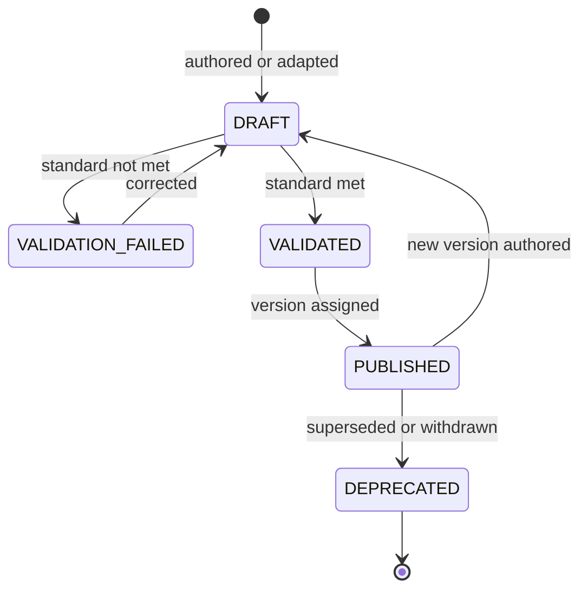

<Info>
**Status: Planned.** This standard is settled in shape and unimplemented in practice. No asset in this repository is yet published against it, and no validation enforces it. It is written first deliberately — the [Framework Library](/frameworks/overview) demonstrates that authoring assets before their standard exists produces assets that cannot be validated.
</Info>

## Purpose

The [DevOS Library](/library/overview) holds several asset classes —
[skills](/library/skills), [processes](/library/processes),
[templates](/library/templates), standards, checklists, policies, prompts, agent
definitions, and validation packs. This page states what they have in common.

A reusable asset is not merely a file someone found useful twice. It is
identified, versioned, reviewed, and published, so that a decision made against
it a year ago remains interpretable today.

## Why a standard comes first

The [Framework Library](/frameworks/overview) already learned this. Frameworks
are governed by a [framework standard](/frameworks/framework-standard) with a
publication gate that refuses a framework whose failure modes and abandonment
conditions are unstated — because a framework documenting only its strengths
cannot discriminate between candidates.

The same failure applies to every asset class. A skill that never says when it
does not apply will be applied where it does not belong. A process with no
stated exit conditions will be started and never closed.

The standard is therefore what makes an asset **falsifiable**: it must contain
the parts that could show it to be the wrong choice.

## Required properties

Every Library asset, regardless of class, declares:

| Property | Requirement |
| --- | --- |
| **Identifier** | Stable and unique. Never reused, never renamed in place. |
| **Class** | Exactly one. An asset that is both a skill and a process is two assets. |
| **Version** | `MAJOR.MINOR`, following [Versioning](/constitution/versioning). |
| **Status** | From the shared vocabulary — Concept, Planned, Prototype, Beta, Operational. |
| **Purpose** | What class of work it serves. |
| **Applicability** | The conditions under which it applies. |
| **Non-applicability** | The conditions under which it does not. **Required, and may not be empty.** |
| **Failure modes** | How it goes wrong, and the response to each. |
| **Owner** | The layer that owns it, per [Artefact ownership](/library/ownership). |
| **References** | The DevOS specifications it defers to, by link rather than by restatement. |

Two of these carry the weight.

**Non-applicability may not be empty.** An asset that claims to apply everywhere
provides no information: selecting it is not a choice. This mirrors Article 6 in
[Principles](/constitution/principles) and the framework publication gate.

**References, not restatements.** An asset that copies an architectural rule
into its own text has created a second source of truth for that rule. When the
original changes, the copy silently becomes wrong, and nothing detects it. Assets
link; they do not duplicate.

## Lifecycle



| State | Selectable | Notes |
| --- | --- | --- |
| `DRAFT` | No | Being authored or adapted |
| `VALIDATION_FAILED` | No | The unmet requirements are named |
| `VALIDATED` | No | Passed the standard, not yet published |
| `PUBLISHED` | Yes | Available for selection and execution |
| `DEPRECATED` | No | Excluded from new selection; existing pinned references unaffected |

This is deliberately the same lifecycle the Framework Library uses. One lifecycle
across every asset class means one mental model, one set of states in the future
UI, and one deprecation story.

## The publication gate

An asset MUST NOT be published when:

- a required property above is absent or empty;
- its non-applicability section is missing;
- it declares more than one class;
- it restates a DevOS specification instead of referencing it;
- it contains credential values, environment-specific endpoints, or
  organisation-identifying content;
- it embeds project-specific content that leaks context between clients.

Publication refusal names the unmet requirements. A pattern of the same refusal
across many authors is a signal about the standard, not about the authors.

## Versioning

| Change | Increment |
| --- | --- |
| Editorial clarification, no change of meaning | None |
| Added failure mode, clarified condition, added evidence requirement | MINOR |
| Applicability condition added | MINOR |
| Applicability condition changed, narrowed, or removed | MAJOR |
| Class or ownership changed | MAJOR |
| A gate, stop-and-ask condition, or required evidence removed | MAJOR |

The last row is the one that matters operationally. Removing a safety condition
is never a patch, however small the diff — it changes what running the asset
guarantees.

### Pinning

Every run records the **version** of each asset it applied. Resolution is against
the pinned version, and a pinned version that no longer resolves fails
explicitly rather than falling back to the current one.

This is the rule the [Decision Ledger](/engines/decision-ledger) already applies
to Frameworks, and the reason it exists is the same: deprecating an asset must
never alter the meaning of a record already made against it. A run that followed
version 1.2 followed 1.2 permanently, and remains interpretable when re-read.

Silently substituting the latest version would make historical runs describe work
that never happened.

## Scope and visibility

Following the model the Framework Library already established:

| Set | Owner | Visible to |
| --- | --- | --- |
| DevOS reference assets | DevOS | Everyone, publicly, in Git |
| Organisation adaptations | The adapting organisation | That organisation only |
| Organisation-authored assets | The authoring organisation | That organisation only |

An adaptation records the reference asset and version it derived from. It is a
**distinct asset with its own identifier**, not an override of the original — so
a later reference version never silently changes an organisation's adapted
behaviour.

An adaptation MUST NOT contain client-identifying or project-specific content.
An asset derived from one client's work that carries their context into another
client's project is a confidentiality failure, not a reuse win.

## Contribution and promotion

Two routes bring an asset into the Library.

**Contribution** — authored directly against this standard, proposed as a pull
request, reviewed under [governance](/constitution/governance), published with a
version.

**Promotion** — an override or a project-local practice that proved general:

```text
Project override or local practice
  → observed to apply beyond one project
  → generalised: project specifics removed
  → proposed as a Library asset
  → reviewed under governance
  → published with a version
```

The generalisation step is where promotion usually fails. A practice that works
because of one project's particular constraints is not reusable knowledge, and
publishing it as though it were spreads a local accident. The
non-applicability requirement is the check: if an author cannot say where the
asset does not apply, the practice has not been generalised yet.

## Git and the UI

Reusable assets are authored, reviewed, and versioned **in Git**. The DevOS UI
browses, selects, installs, and executes the same assets — it does not maintain a
parallel set.

Both consumption paths are first-class:

```text
GitHub user   → read, copy, fork, propose changes
DevOS user    → browse, select, add to project, execute
```

Any UI action that authors or edits a reusable asset produces a Git change. The
full argument, and what it buys, is in
[Git as canonical source](/library/ownership#git-as-canonical-source).

## What this standard does not cover

- **The file format of each asset class.** Skills, processes, and templates have
  different shapes; the format lives with each class once settled.
- **Selection and ranking.** Which asset applies to a given piece of work is a
  matching concern, not a property of the asset.
- **Execution.** Delivering an asset to an agent belongs to
  [AI Connect](/architecture/ai-connect).
- **Storage layout.** Which directories hold which classes is a repository
  convention that follows the first assets, not one that should precede them.

## Open questions

- Should an asset declare that it supersedes another, so deprecation can point at
  a successor the way a decision record does?
- Is one lifecycle right for every class? A template is instantiated and
  abandoned rather than executed, so `DEPRECATED` means something weaker for it
  than for a skill.
- Should validation against this standard be automated in CI, and if so, does an
  asset failing the gate block the documentation build or merely report?
- Who may publish a DevOS reference asset? Framework publication is already a
  platform operation rather than an organisation role; assets are presumably the
  same, but community contribution complicates it.
- Do assets need a usage signal — how often selected, how often overridden — to
  identify ones that are consistently wrong in practice?

## Version history

| Version | Date | Change |
| --- | --- | --- |
| 0.1 | 2026-08-21 | Initial page. Defines required properties, lifecycle, publication gate, versioning and pinning, scope, and the contribution/promotion routes. |
