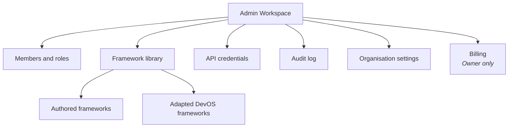

<Info>
**Status: Concept.** The admin workspace is specified but not implemented. Audit log viewing
is Planned. This page describes intended behaviour.
</Info>

## Purpose

The admin workspace is where an organisation is administered: who belongs to it, what they can
do, which frameworks are available, which credentials exist, and what has happened.

It is separate from the [customer workspace](/product/customer-workspace) so that changing who
has access is never adjacent to routine project work.

## Goals

- Give administrators a single place to manage access, frameworks, and credentials.
- Make every administrative action auditable and attributable.
- Enforce the framework standard at authoring time rather than trusting authors.

## Non-goals

- Project work. Interviews, recommendations, and acceptance happen in the customer workspace.
- Cross-organisation administration. No view spans organisations — Article 7.
- Billing beyond the Owner-only surface described below.

## Structure

## Views

### Members and roles

Lists members with role, join date, last activity, and pending invitations.

Actions: invite, change role, remove, resend or revoke an invitation.

Enforced rules:

1. An organisation MUST always have at least one Owner. The last Owner cannot be demoted or
   removed; ownership must be transferred first.
2. A member cannot change their own role.
3. An Admin may set Contributor and Viewer roles only. Owner and Admin roles are set by an
   Owner.
4. Role changes take effect immediately and are audited.
5. Removing a member revokes access immediately but does not remove their attribution from
   decision records they accepted — records are immutable.

That last rule is the one administrators most often expect to work differently. Attribution
surviving departure is what makes the ledger worth reading.

### Framework library

Lists frameworks available to the organisation: the DevOS reference frameworks, organisation
adaptations of them, and frameworks authored in-house.

Actions: adapt a DevOS framework, author a new one, publish, deprecate, view usage.

Authoring enforces [Framework standard](/frameworks/framework-standard). Per Article 6 in
[Principles](/constitution/principles), a framework MUST NOT be published without:

- A populated "When not to use this" section.
- Named failure modes describing what breaks first under stress.
- Stated abandonment conditions.

This is a publication gate, not a warning. A framework that lists only strengths cannot
discriminate between candidates, which is the only reason a framework exists.

Deprecating a framework does not alter decisions already made from it. Existing decision
records continue to reference the framework version they were made against.

### API credentials

<Info>**Status: Concept.** The public API is Concept status — see [API reference](/api-reference/introduction).</Info>

Lists credentials with scope, creation date, last use, and expiry.

Actions: create, revoke, rotate.

Rules:

- Credential values are shown once at creation and never retrievable afterwards.
- Every credential is organisation-scoped and cannot be granted cross-organisation access.
- Credentials carry a scope no broader than the creating member's role.
- Revocation is immediate.
- Creation, rotation, and revocation are audited.

See [API authentication](/api-reference/authentication) and
[Secrets management](/security/secrets-management).

### Audit log

<Info>**Status: Planned.**</Info>

An append-only record of every mutating operation and every authorisation denial in the
organisation, per ES-5.

Each event records actor, organisation, action, target, outcome, and timestamp. The view
supports filtering by actor, action type, target, outcome, and date range, and export within
the organisation boundary.

The log is read-only in every role. No interface path deletes or edits an audit event.

See [Audit logging](/security/audit-logging).

### Organisation settings

Organisation name, default project settings, and retention configuration.

The confidence floor — the score below which acceptance requires an explicit override — is
configured here. Whether the floor blocks acceptance outright or permits a recorded override
is an open question; see below.

### Billing

Owner only. Not accessible to Admin, by design: billing is financial accountability, held at
the accountable role.

## Permissions

| Action | Owner | Admin | Contributor | Viewer |
| --- | --- | --- | --- | --- |
| Access admin workspace | Yes | Yes | No | No |
| View members | Yes | Yes | No | No |
| Invite or remove members | Yes | Yes | No | No |
| Set Contributor or Viewer role | Yes | Yes | No | No |
| Set Owner or Admin role | Yes | No | No | No |
| Transfer ownership | Yes | No | No | No |
| Author or adapt frameworks | Yes | Yes | No | No |
| Deprecate a framework | Yes | Yes | No | No |
| Manage API credentials | Yes | Yes | No | No |
| View and export audit log | Yes | Yes | No | No |
| Change organisation settings | Yes | Yes | No | No |
| Manage billing | Yes | No | No | No |
| Delete organisation | Yes | No | No | No |

The normative matrix is [Permissions](/product/permissions).

## Data model

| Entity | Key fields |
| --- | --- |
| `organisation` | `organisation_id`, `name`, `settings`, `created_at`, `owner_count` |
| `membership` | `membership_id`, `organisation_id`, `user_id`, `role`, `joined_at`, `removed_at` |
| `invitation` | `invitation_id`, `organisation_id`, `email`, `role`, `expires_at`, `accepted_at` |
| `framework_version` | `framework_id`, `version`, `organisation_id` (null for DevOS reference), `status`, `published_at` |
| `api_credential` | `credential_id`, `organisation_id`, `scope`, `created_by`, `last_used_at`, `revoked_at` |
| `audit_event` | `event_id`, `organisation_id`, `actor_id`, `action`, `target`, `outcome`, `occurred_at` |

See [Data model](/architecture/data-model).

## Security considerations

- Every view is organisation-scoped before query execution — ES-2.
- Privilege escalation paths are closed explicitly: an Admin cannot grant Owner, and no member
  can change their own role.
- Credential values are never logged, never included in audit events, and never retrievable
  after creation — ES-7.
- Audit writes are not conditional on the success of the operation they describe. A denied
  role change is precisely the event worth recording.
- Organisation deletion requires typed confirmation naming the organisation, per PS-9.

## Failure states

| Failure | Behaviour |
| --- | --- |
| Last Owner attempts demotion or self-removal | Blocked; ownership transfer required, stated in the message |
| Admin attempts to grant Owner or Admin | Blocked; audited as a denial |
| Member attempts to change their own role | Blocked; audited as a denial |
| Framework publication without failure modes | Blocked; the missing sections named |
| Invitation accepted after expiry | Rejected; grants nothing; audited |
| Credential created with a scope exceeding the creator's role | Rejected with the maximum permitted scope stated |
| Audit log write fails | Open question — see below |
| Member removed while holding an active interview session | Session ends; partial brief retained on the project |

## Acceptance criteria

- No organisation can reach zero Owners through any interface path.
- No member can elevate their own role.
- No framework publishes without a populated "When not to use this" section and named failure
  modes.
- Credential values are unrecoverable after creation.
- Every administrative action and every denial appears in the audit log.
- No admin view returns data outside the member's organisation, verified by test.
- Contributors and Viewers cannot reach the admin workspace by any route.

## Open questions

- Should framework authoring be separable from member administration? They are unrelated skills
  currently bundled into the Admin role.
- Should the confidence floor block acceptance outright, or permit a recorded override with
  justification? The second is more usable; the first is harder to erode.
- What should happen when an audit write fails — fail the operation, or complete it and alert
  on the audit gap? Also open in
  [Engineering standards](/constitution/engineering-standards).
- Should a time-bounded external auditor role exist, expiring automatically?

## Version history

| Version | Date | Change |
| --- | --- | --- |
| 1.0 | 2026-07-29 | Initial page. |
