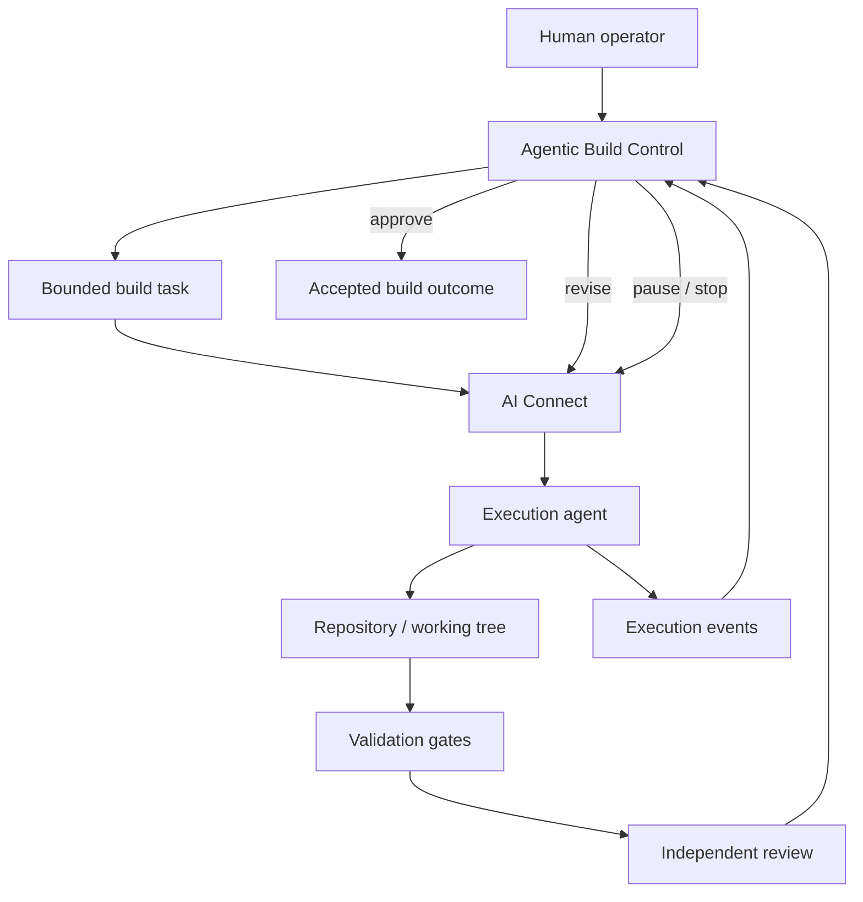
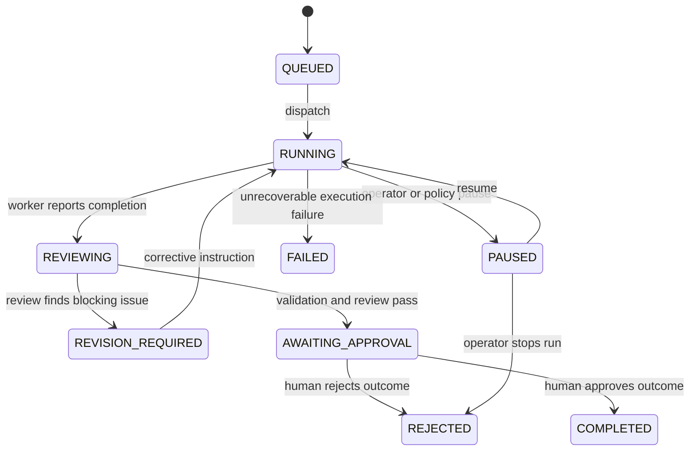

<Info>
**Status: Planned.** Agentic Build Control is the first proposed executable DevOS product capability built on top of the existing engine chain and AI Connect. It is **not** an eighth Core Engine. This specification defines the product contract for the first vertical slice; implementation status must be recorded separately.
</Info>

## Purpose

Agentic Build Control lets a person delegate bounded software-development work to an execution agent while DevOS keeps control of scope, state, policy, validation, review, and approval.

The user should be able to describe a build task, start an agent run, monitor what the agent is doing, inspect the resulting changes and validation, receive independent review, intervene when necessary, and approve the final repository action without supervising every terminal command.

The core product promise is:

> **You decide what. DevOS controls how agentic work is executed, reviewed, and accepted.**

Agentic Build Control does not compete with coding agents. Coding agents are replaceable workers. DevOS is the control plane above them.

## Goals

- Make long-running agent work observable without requiring the user to watch a terminal continuously.
- Keep a durable record of task scope, execution events, files changed, validation, review findings, approvals, and outcome.
- Separate the agent that performs work from the system that decides whether the work may continue or be accepted.
- Preserve DevOS architecture and governance while supporting replaceable execution agents.
- Give the user a small number of meaningful controls: pause, resume, redirect, reject, approve, and inspect.
- Provide a vertical slice that DevOS can use to help build DevOS itself.

## Non-goals

- Becoming a new Core Engine. The canonical engine count remains seven.
- Replacing [AI Connect](/architecture/ai-connect). AI Connect owns agent execution, routing, envelopes, lifecycle, attribution, and cost.
- Allowing an agent to accept a DevOS decision, alter a Decision Ledger record, or approve its own work.
- Building a general-purpose IDE.
- Hiding source-control state, validation failures, or reviewer objections from the user.
- Automatically merging to a protected branch or deploying to production in the first version.
- Requiring one named AI vendor or coding agent.

## Product boundary

Agentic Build Control is a **product capability** spanning the Product surface and Platform layer.



The feature does not change the engine artefact chain. Where a task originates from the [AI Build Pipeline](/engines/build-pipeline), Agentic Build Control supervises execution of the build unit after the pipeline has produced it.

## Relationship to AI Connect

[AI Connect](/architecture/ai-connect) remains the execution authority boundary.

Agentic Build Control consumes AI Connect execution state and presents it in a user-operable form. It does not create a second routing or agent lifecycle system.

AI Connect is responsible for:

- capability routing;
- prompt envelopes;
- authority and organisation scope;
- execution sessions and resumption;
- result envelopes and attribution;
- cost recording;
- declared multi-agent compositions.

Agentic Build Control is responsible for:

- the operator-facing build session;
- task scope and acceptance criteria;
- visible execution timeline;
- repository-change summary;
- validation and review status;
- intervention controls;
- human approval gates;
- final build outcome and traceability.

## Core objects

The first vertical slice introduces the following **product-level concepts**. These names do not amend the repository's foundation data model; the canonical data-model specification remains unwritten.

| Concept | Purpose |
| --- | --- |
| **Build task** | The bounded unit of software work delegated for execution. |
| **Build run** | The operator-facing instance of executing one build task. |
| **Execution event** | A timestamped observation emitted while the worker acts. |
| **Validation result** | The outcome of a declared check such as tests, type checks, lint, or documentation validation. |
| **Review finding** | A reviewer judgement requiring no action, revision, or stop. |
| **Approval request** | A gated action that requires a human decision. |
| **Build outcome** | The terminal record describing what changed, what passed, what remains unresolved, and what repository action was accepted. |

A Build run MAY correspond to one or more AI Connect execution sessions, but the two concepts are not interchangeable: execution sessions belong to AI Connect; Build runs belong to the user-facing supervision workflow.

## First vertical slice

The first useful version deliberately supports one operator, one project repository, and one active execution worker at a time.

### Required flow

```text
Create task
→ inspect scope
→ dispatch worker
→ stream execution events
→ capture repository changes
→ run declared validation
→ independent review
→ revise or approve
→ record outcome
```

The first version MUST support:

1. A task title, goal, acceptance criteria, out-of-scope list, and stop-and-ask conditions.
2. Dispatch to one configured execution worker through the chosen implementation adapter.
3. A stable `build_run_id` visible throughout the run.
4. A live or near-live event timeline.
5. Run states visible to the user.
6. A summary of files changed and repository diff statistics.
7. Captured validation output.
8. An independent review result distinct from the execution worker's own completion claim.
9. User controls to pause, stop, send a corrective instruction, approve, or reject.
10. A terminal build summary containing outcome, validation, review, repository state, and attribution.

## Build run lifecycle

The product-facing lifecycle is intentionally smaller than the internal AI Connect execution lifecycle.



Required public states:

- `QUEUED`
- `RUNNING`
- `PAUSED`
- `REVIEWING`
- `REVISION_REQUIRED`
- `AWAITING_APPROVAL`
- `COMPLETED`
- `FAILED`
- `REJECTED`

Implementation adapters MAY expose more detailed internal states, but the product surface SHOULD normalize them into this lifecycle.

## Execution events

The user should not need raw terminal output to understand a run, but raw logs may remain available for diagnosis.

Every meaningful event SHOULD include:

- build run identifier;
- timestamp;
- event type;
- worker identity and version where known;
- concise human-readable summary;
- affected file or command where applicable;
- severity;
- whether user action is required.

Useful event classes include:

- run started;
- plan or step changed;
- command started / completed;
- file created / modified / deleted;
- validation started / passed / failed;
- worker blocked;
- policy gate triggered;
- review started / finding emitted;
- corrective instruction sent;
- approval requested;
- run completed / failed / rejected.

The timeline MUST distinguish observed facts from model-generated summaries.

## Supervision policy

The first version uses three authority bands.

### Automatic

Actions that may proceed without operator approval when permitted by the task scope:

- read repository files;
- search the repository;
- modify files inside the task boundary;
- run non-destructive tests, type checks, linters, and documentation checks;
- retry a failed validation after a scoped correction;
- produce a proposed commit or patch.

### Review gate

Actions that MUST pause for policy/reviewer evaluation and MAY require operator approval:

- adding or changing dependencies;
- changing data schemas or migrations;
- changing authentication, permissions, security controls, deployment configuration, or public APIs;
- materially widening task scope;
- modifying protected architectural or governance documents;
- pushing a branch or opening a pull request where repository policy requires explicit approval.

### Human only

The first version MUST NOT autonomously perform:

- merging to a protected/default branch;
- production deployment;
- destructive data migration;
- secret rotation or disclosure;
- billing or access-policy changes;
- deletion of production data;
- acceptance of a DevOS decision on behalf of a human.

## Independent review

A worker's claim that a task is complete is evidence, not acceptance.

Before a run reaches `AWAITING_APPROVAL`, an independent review must evaluate at minimum:

- task-scope adherence;
- acceptance criteria;
- repository diff;
- validation results;
- architecture and policy constraints supplied with the task;
- unresolved failures or uncertainty.

The reviewer returns one of:

- `PASS` — no blocking finding;
- `REVISION_REQUIRED` — correction is required and may be sent back to the worker;
- `STOP` — the run should not continue without human intervention.

Review findings MUST be stored separately from worker output and attributed to the reviewer that produced them.

## Operator experience

The primary Build Control screen should answer five questions without opening raw logs:

1. **What is being built?**
2. **What is the worker doing now?**
3. **What changed?**
4. **Did validation and independent review pass?**
5. **Does the operator need to act?**

A minimum run view contains:

- project and task;
- worker;
- current state;
- current activity;
- event timeline;
- files changed / diff summary;
- validation summary;
- review findings;
- approvals required;
- elapsed time and cost where available;
- Pause, Stop, Send instruction, Inspect diff, Approve, and Reject controls as applicable.

## Dogfooding DevOS

The first proving project SHOULD be DevOS itself.

A DevOS documentation or implementation task can be executed through Agentic Build Control, producing a public or internal build record such as:

```text
Project: DevOS
Task: Write authentication architecture specification
Worker: configured execution agent
Supervisor: independent reviewer
Validation: repository-defined checks
Human approval: required
Outcome: accepted / rejected
```

Dogfooding is not a waiver of governance. DevOS building DevOS must satisfy the same scope, validation, review, and approval requirements as any other project.

## Safety and repository integrity

- A run MUST know the repository and branch/worktree it is operating on before execution starts.
- The worker MUST NOT silently switch repositories or branches.
- The system MUST preserve unrelated uncommitted work.
- Destructive resets and force pushes are forbidden by default.
- A task boundary MUST be available to the reviewer so scope creep can be detected.
- Raw credentials and secret values MUST NOT be stored in event logs, review payloads, or summaries.
- A failed validation MUST remain visible even if a later retry passes.
- Human rejection is terminal for that run; continuing requires a new or explicitly resumed run.

## Acceptance criteria — first feature

The feature is usable when a person can:

1. Select one project repository.
2. Create one bounded build task.
3. Start one execution worker.
4. Watch normalized activity without monitoring the worker terminal directly.
5. Pause or stop the worker.
6. Send a corrective instruction into the same build run.
7. See files changed and validation output.
8. Receive a separate reviewer verdict.
9. Approve or reject the proposed outcome.
10. Reopen the completed run and reconstruct what happened from its recorded timeline.

A demo is successful when DevOS uses this workflow to complete a real DevOS task with the operator monitoring rather than manually driving each execution step.

## Evolution

After the single-worker vertical slice proves the supervision model, later increments may add:

- multiple execution-worker adapters;
- intelligent capability routing;
- parallel work on isolated branches/worktrees;
- dependency-aware task graphs;
- cross-agent review compositions;
- richer cost and performance reporting;
- project memory and downstream traceability;
- deployment approvals and operational feedback.

These are future increments, not requirements for the first release.

## Open questions

- Should the first implementation call the feature **Agentic Build Control**, **Build Control**, or another product name?
- Does one Build run always own one branch/worktree, or can a run operate on an already-created task branch?
- Which repository actions require an explicit human click versus an organisation policy rule?
- What minimum event granularity is useful without recreating a terminal transcript?
- Which validations are declared by the project, and which are imposed globally by DevOS?
- How should independent reviewer identity and model/version be surfaced without coupling the product to one provider?
- When should a revision remain part of the same Build run versus create a successor run?

## Version history

| Version | Date | Change |
| --- | --- | --- |
| 0.1 | 2026-08-16 | Initial Planned specification for the single-worker Agentic Build Control vertical slice. |
