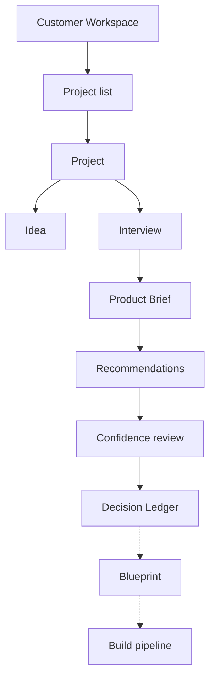

<Info>
**Status: Prototype.** Project management, interview, recommendation review, and ledger views
are implemented internally. Confidence display, blueprint view, and build pipeline view are
Concept.
</Info>

## Purpose

The customer workspace is where members do design work. It contains projects and everything
a project owns. It contains no administrative capability — that is deliberate, so routine
work is never one action away from changing who has access.

## Goals

- Move a project from idea to accepted decisions without leaving the workspace.
- Make the reasoning behind every artefact visible at the point of use.
- Make it impossible to accept a decision accidentally.

## Non-goals

- Member, role, or credential administration. That is the
  [admin workspace](/product/admin-workspace).
- Framework authoring. Frameworks are consumed here, edited there.
- Issue tracking. Build units export to a tracker rather than becoming one.

## Structure

Dashed edges are Concept status.

## Views

### Project list

Every project in the organisation the member can see, with its
[lifecycle state](/product/project-lifecycle), the count of accepted decisions, and whether
its blueprint is stale.

The list shows state rather than progress percentage. A project at `LEDGER_ACTIVE` with four
decisions is not "60% done" — there is no denominator, and inventing one would be a fabricated
specific.

### Project overview

The single-project view. Shows current state, the brief summary, open evidence gaps, recent
ledger activity, and the permitted next actions for the member's role.

Actions unavailable in the current state are absent, not shown-and-disabled, per PS-7.

### Interview

The adaptive question sequence. Each question shows why it is being asked — which part of the
brief it fills — because a user who understands the question answers it better.

Three affordances are mandatory:

| Affordance | Reason |
| --- | --- |
| "I don't know" on every question | PS-3. A declared unknown must be recordable, not worked around. |
| Non-goal capture | PS-2. What is not being built constrains the architecture. |
| Answer revision before completion | Correction here is free; after acceptance it needs supersession. |

### Brief review

The structured brief before recommendations are generated. Declared unknowns are shown as
declared unknowns — never as blanks, and never filled with typical values.

This is the cheapest correction point in the workflow, and the view says so.

### Recommendations

The candidate architecture set. Each shows its originating framework, the brief elements that
matched, its confidence score, its evidence, and its named gaps.

Per PS-4, the set is plural where the brief admits more than one defensible architecture, and
ordering reflects scored evidence only. Where nothing matches, the view reports no match.

### Confidence review

Where a member works through recommendations and marks each Accept, Reject, or Defer.

Constraints from PS-5 and PS-6:

- A score never appears without its evidence and gaps in the same view.
- No bulk accept. No pre-selection. Continuing through the workflow is not acceptance.
- Rejection captures a reason. Deferral captures the gap being closed.

### Decision Ledger

The project's decision history: active decisions, superseded decisions with their successors,
and rejected recommendations with their reasons.

Readable two ways — as a chronological narrative, and as a queryable record set. The
engineering lead persona needs the first; the auditor needs the second.

### Blueprint and build pipeline

<Info>**Status: Concept.** Specified, not operable.</Info>

The blueprint view will show module boundaries, data model, interface contracts, milestones,
and test strategy, with each element resolving to its originating decision. The pipeline view
will show ordered build units with their dependencies and definitions of done.

## Permissions

| Action | Owner | Admin | Contributor | Viewer |
| --- | --- | --- | --- | --- |
| View project list and all project views | Yes | Yes | Yes | Yes |
| Create project | Yes | Yes | Yes | No |
| Submit idea, run interview | Yes | Yes | Yes | No |
| Generate or regenerate recommendations | Yes | Yes | Yes | No |
| Accept, reject, or defer | Yes | Yes | Yes | No |
| Supersede a decision | Yes | Yes | Yes | No |
| Compile blueprint or pipeline | Yes | Yes | Yes | No |
| Archive or restore project | Yes | Yes | No | No |
| Delete project | Yes | Yes | No | No |

Every action is scoped to the member's organisation. No view can surface data from another
organisation — Article 7 in [Principles](/constitution/principles).

## Security considerations

- All queries are organisation-scoped before execution, not filtered after — ES-2.
- Accepting a decision writes an immutable record naming the accepting member; the identity
  cannot be altered later.
- Denied actions are audited as denials, per ES-5, because an attempted acceptance by a Viewer
  is worth recording.
- Export is permitted within the organisation and audited. Cross-organisation export is not a
  permission that exists.

## Failure states

| Failure | User-visible behaviour |
| --- | --- |
| Interview cannot continue (engine unavailable) | Session paused, partial brief retained, cause stated, resume offered |
| Recommendation generation returns no match | "No framework matches this brief", with the elements that prevented a match |
| All recommendations below the confidence floor | Set shown with gaps ranked by impact, and returning to the interview recommended |
| Blueprint compilation fails traceability | Named offending element; compilation not partially applied |
| Concurrent acceptance of the same recommendation | First commits; second reports the decision already exists, with a link |
| Member's role reduced mid-session | Next action reflects new permissions; completed actions stand |

Per PS-10, each of these states what failed, why, and what to do next.

## Acceptance criteria

- Every question in the interview offers a recordable "I don't know".
- No view displays a confidence score without evidence and gaps.
- No interface path performs bulk or implicit acceptance.
- Concept-status capabilities are absent from the interface, not present and inert.
- Every traceability question in PS-8 is answerable from these views.
- No administrative capability is reachable from the customer workspace.

## Open questions

- Should the project list expose an aggregate confidence figure across a ledger? It would be
  convenient and risks becoming a fabricated progress metric.
- Should the interview allow a member to skip forward and return, or enforce sequence to keep
  branching coherent?
- Should Viewers see open evidence gaps, or only accepted decisions?

## Version history

| Version | Date | Change |
| --- | --- | --- |
| 1.0 | 2026-07-29 | Initial page. |
