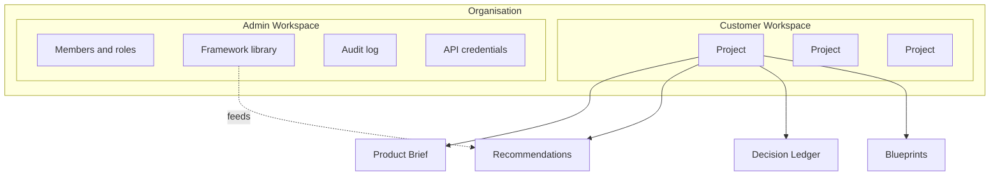

## Purpose

This page describes the DevOS product surface — the parts a user sees and operates — and how
they relate to the engines beneath. [Introduction: Overview](/introduction/overview) explains
what DevOS is; this section specifies what the product does.

## Product shape

Everything a user does happens inside an **organisation**, the tenant boundary. Within it,
work happens in one of two workspaces, and design work is organised into **projects**.

## The three product objects

| Object | Cardinality | Owns |
| --- | --- | --- |
| **Organisation** | The tenant boundary | Projects, members, frameworks, credentials, audit log |
| **Project** | Many per organisation | Exactly one brief, exactly one ledger, zero or more blueprints |
| **Member** | Many per organisation | A single role; attribution on decisions they accepted |

A project is the unit of design work. It represents one thing being built — not one feature,
and not one company. The one-brief-one-ledger constraint is deliberate: a project with two
briefs is two projects, and merging them would break the traceability guarantee in Article 3
of [Principles](/constitution/principles).

## What a user does

| Activity | Where | Engine behind it |
| --- | --- | --- |
| Describe an idea, answer interview questions | Customer workspace | [Product Interview Engine](/engines/product-interview-engine) |
| Review candidate architectures | Customer workspace | [Decision Engine](/engines/decision-engine) |
| Examine confidence scores and evidence gaps | Customer workspace | [Architecture Confidence Engine](/engines/architecture-confidence-engine) |
| Accept, reject, or defer recommendations | Customer workspace | [Decision Ledger](/engines/decision-ledger) |
| Read the decision history of a project | Customer workspace | [Decision Ledger](/engines/decision-ledger) |
| Generate and read a blueprint | Customer workspace | [Blueprint Engine](/engines/blueprint-engine) |
| Work through build units | Customer workspace | [AI Build Pipeline](/engines/build-pipeline) |
| Invite members, set roles | Admin workspace | — |
| Author or adapt frameworks | Admin workspace | [Framework Library](/frameworks/overview) |
| Review the audit log | Admin workspace | [Audit logging](/security/audit-logging) |
| Manage API credentials | Admin workspace | [API authentication](/api-reference/authentication) |

## Status of the product surface

| Surface | Status |
| --- | --- |
| Project creation and management | Prototype |
| Product interview | Prototype |
| Recommendation review | Prototype |
| Confidence display | Concept |
| Decision Ledger view and acceptance | Prototype |
| Blueprint view | Concept |
| Build pipeline view | Concept |
| Member and role administration | Concept |
| Framework authoring | Concept |
| Audit log view | Planned |
| API credential management | Concept |

The authoritative capability table is on the [documentation homepage](/). Per PS-7 in
[Product standards](/constitution/product-standards), a Concept or Planned capability does
not appear as an operable control in the interface.

## What the product does not do

| Not in the product | Where it happens instead |
| --- | --- |
| Writing application code | The user's own toolchain, guided by build units |
| Hosting or running the built system | The user's own infrastructure |
| Issue tracking and sprint management | The user's tracker; build units are designed to export |
| Deployment | The user's pipeline; DevOS specifies readiness expectations |
| Accepting decisions automatically | Nowhere. Acceptance requires a human — Article 4 |

## Product principles in practice

Three constitutional requirements shape the surface more than any other:

**Recommendations are plural (PS-4).** The interface presents a set of candidates, never a
single answer, whenever the brief admits more than one defensible architecture. Where no
framework matches, the product says so rather than inventing one.

**Confidence never appears alone (PS-5).** A score is always displayed with its evidence and
its named gaps in the same view. There is no summary badge that hides the reasoning.

**Acceptance is individual and deliberate (PS-6).** There is no bulk accept, no pre-selected
recommendation, and no path where continuing through the workflow implies acceptance.

## Sections in this area

<CardGroup cols={2}>
  <Card title="Personas" icon="users" href="/product/personas">
    Who DevOS is for, and what each user needs from it.
  </Card>
  <Card title="Project lifecycle" icon="arrows-spin" href="/product/project-lifecycle">
    Project states, transitions, and what each permits.
  </Card>
  <Card title="Customer workspace" icon="briefcase" href="/product/customer-workspace">
    Where design work happens.
  </Card>
  <Card title="Admin workspace" icon="gear" href="/product/admin-workspace">
    Organisation administration.
  </Card>
  <Card title="Permissions" icon="lock" href="/product/permissions">
    The normative permission matrix.
  </Card>
  <Card title="Core engines" icon="gears" href="/engines/overview">
    The machinery beneath the surface.
  </Card>
</CardGroup>

## Version history

| Version | Date | Change |
| --- | --- | --- |
| 1.0 | 2026-07-29 | Initial page. |
