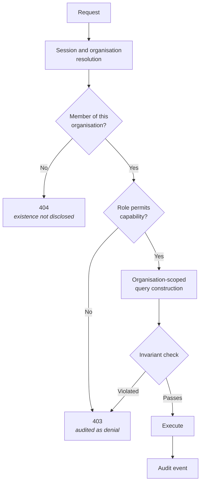

## Purpose

This page is the normative source for DevOS permissions. Where any other page's permission
table conflicts with this one, this page governs and the other is a defect.

## Scope

Covers: the four organisation roles, every capability they gate, API credential scopes, and
the enforcement points. Does not cover: model-level data isolation, which is
[Multi-tenancy](/architecture/multi-tenancy), or authentication, which is
[Authentication](/architecture/authentication).

## Definitions

| Term | Meaning |
| --- | --- |
| **Role** | A named permission set. A member holds exactly one role per organisation. |
| **Capability** | A single gated action. |
| **Scope** | The organisation a permission applies within. Permissions never span organisations. |
| **Credential scope** | The subset of a role's read capabilities granted to an API credential. |

## Roles

| Role | Intent |
| --- | --- |
| **Owner** | Accountable for the organisation. Full capability, including billing and deletion. |
| **Admin** | Administers members, frameworks, credentials, settings. No billing, no organisation deletion. |
| **Contributor** | Performs design work, including accepting decisions. |
| **Viewer** | Reads. Changes nothing. |

Roles are strictly ordered in capability: Owner ⊇ Admin ⊇ Contributor ⊇ Viewer, with two
deliberate exceptions noted after the matrix.

## The permission matrix

### Projects and design work

| Capability | Owner | Admin | Contributor | Viewer |
| --- | --- | --- | --- | --- |
| View projects, briefs, ledgers, blueprints | Yes | Yes | Yes | Yes |
| Create project | Yes | Yes | Yes | No |
| Edit project name | Yes | Yes | Yes | No |
| Submit or replace idea | Yes | Yes | Yes | No |
| Run product interview | Yes | Yes | Yes | No |
| Generate or regenerate recommendations | Yes | Yes | Yes | No |
| **Accept a decision** | Yes | Yes | Yes | No |
| Reject or defer a recommendation | Yes | Yes | Yes | No |
| **Supersede a decision** | Yes | Yes | Yes | No |
| Compile blueprint | Yes | Yes | Yes | No |
| Compile build pipeline | Yes | Yes | Yes | No |
| Export project artefacts | Yes | Yes | Yes | No |
| Archive or restore project | Yes | Yes | No | No |
| Delete project | Yes | Yes | No | No |

### Organisation administration

| Capability | Owner | Admin | Contributor | Viewer |
| --- | --- | --- | --- | --- |
| Access admin workspace | Yes | Yes | No | No |
| View members and invitations | Yes | Yes | No | No |
| Invite member | Yes | Yes | No | No |
| Remove member | Yes | Yes | No | No |
| Set Contributor or Viewer role | Yes | Yes | No | No |
| Set Admin role | Yes | No | No | No |
| Set Owner role / transfer ownership | Yes | No | No | No |
| Change organisation settings | Yes | Yes | No | No |
| Manage billing | Yes | No | No | No |
| Delete organisation | Yes | No | No | No |

### Frameworks, credentials, audit

| Capability | Owner | Admin | Contributor | Viewer |
| --- | --- | --- | --- | --- |
| Use frameworks in recommendations | Yes | Yes | Yes | Yes (read) |
| Author or adapt a framework | Yes | Yes | No | No |
| Publish a framework | Yes | Yes | No | No |
| Deprecate a framework | Yes | Yes | No | No |
| Create API credential | Yes | Yes | No | No |
| Revoke or rotate API credential | Yes | Yes | No | No |
| View audit log | Yes | Yes | No | No |
| Export audit log | Yes | Yes | No | No |

## The two deliberate exceptions

**1. Contributors accept decisions; that is not an administrative act.**

Acceptance is design work. Restricting it to Admin would either bottleneck design behind
administrators or push administrators into technical judgement they are not accountable for.
The consequence is that every Contributor can permanently alter a project's decision history —
which is why the role should be granted deliberately and Viewer preferred where reading
suffices.

**2. Admins cannot manage billing, though Owners can do everything Admins can.**

Billing is financial accountability, held at the accountable role. This is the one capability
where Admin is not a strict subset of what an organisation might expect an administrator to
hold.

## Invariants

These MUST hold under every code path. They are the rules an attacker or a bug would try to
break.

1. **At least one Owner.** No path may reduce an organisation to zero Owners. The last Owner
   cannot self-demote or self-remove; ownership must be transferred first.
2. **No self-elevation.** A member cannot change their own role, in any direction.
3. **No lateral escalation.** An Admin cannot grant Admin or Owner.
4. **No cross-organisation permission.** Cross-organisation access is not a permission that
   exists and MUST NOT be implementable as one — Article 7.
5. **Credential scope ≤ creator's role.** A credential cannot exceed the capabilities of the
   member who created it, and cannot include write capabilities while the API is read-only.
6. **Immutable attribution.** Removing a member or reducing their role never alters decision
   records they accepted.
7. **Denials are audited.** Every refused authorisation emits an audit event — ES-5.

## Enforcement

Enforcement happens at three layers. The interface layer is a convenience, not a control.

| Layer | Responsibility |
| --- | --- |
| Interface | Hides unavailable actions. Never the security boundary. |
| Application | Resolves role, checks capability, enforces invariants, emits audit events. |
| Storage | Organisation scoping by construction; rejects unscoped access and invalid transitions. |

Non-membership returns 404 rather than 403, so an unauthorised caller cannot enumerate
organisations or projects by observing which requests are forbidden versus absent.

## API credential scopes

<Info>**Status: Concept.** The public API is Concept status.</Info>

| Scope | Grants |
| --- | --- |
| `projects:read` | Read projects and their state |
| `briefs:read` | Read product briefs |
| `decisions:read` | Read decision records including superseded ones |
| `blueprints:read` | Read blueprints and build units |
| `frameworks:read` | Read frameworks available to the organisation |

Write scopes are not defined. The API surface is read-only in its current specification;
introducing a write scope requires an RFC, because it would create a path to decision
acceptance without a human act — Article 4.

See [API authentication](/api-reference/authentication).

## Failure states

| Situation | Response | Audited |
| --- | --- | --- |
| Viewer attempts to accept a decision | 403 with the required role stated | Yes, as denial |
| Non-member requests a project | 404 | Yes, as denial |
| Last Owner attempts self-demotion | 409 with transfer instruction | Yes |
| Admin attempts to grant Owner | 403 | Yes, as denial |
| Member attempts to change own role | 403 | Yes, as denial |
| Credential used after revocation | 401 | Yes, as denial |
| Credential scope exceeds creator's role at creation | 400 with maximum permitted scope | Yes |
| Role reduced during an active session | Next action evaluated under the new role | Yes, on the role change |

Role changes take effect on the next authorisation check, not retroactively. Actions already
completed stand, with their original attribution.

## Acceptance criteria

- Every role–capability pair in this matrix has a test asserting the documented outcome —
  ES-6.
- Every invariant above has a test attempting to violate it.
- No storage-layer interface can be called without an organisation scope.
- Non-membership returns 404, verified by test.
- Every denial emits an audit event.
- No credential can be created with a scope exceeding its creator's role.

## Open questions

- Should project-scoped roles exist, limiting a Contributor to named projects rather than the
  whole organisation? The current model gives every Contributor write access to every project.
- Should a separate framework-author role exist, unbundling framework authoring from member
  administration?
- Should a time-bounded Viewer role exist for external auditors, expiring automatically?
- Should export be separately gated? It is currently implied by read plus Contributor, but
  exporting a full ledger is a materially different act from reading one record.

## Version history

| Version | Date | Change |
| --- | --- | --- |
| 1.0 | 2026-07-29 | Initial page. |
