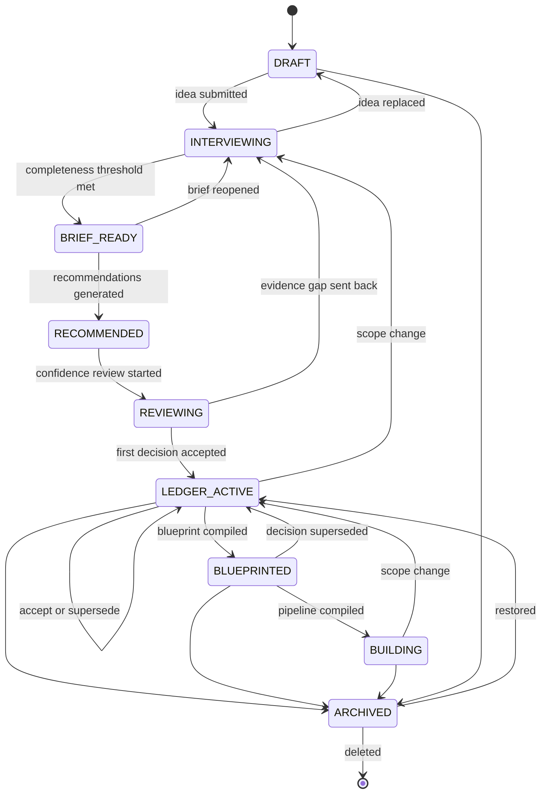

<Info>
**Status: Prototype.** States through `LEDGER_ACTIVE` are implemented. `BLUEPRINTED` and
`BUILDING` depend on Concept-status engines and are specified but not operable.
</Info>

## Purpose

This page specifies the project lifecycle as an explicit state machine: the states a project
may occupy, the transitions permitted between them, and what each state allows. Required by
ES-4 in [Engineering standards](/constitution/engineering-standards).

## States

| State | Meaning |
| --- | --- |
| `DRAFT` | Project created. No idea submitted, or the idea is being replaced. |
| `INTERVIEWING` | Product interview in progress. Brief incomplete. |
| `BRIEF_READY` | Brief meets the completeness threshold. No recommendations yet. |
| `RECOMMENDED` | Recommendation set generated. Not yet reviewed. |
| `REVIEWING` | Confidence review in progress. No decision accepted yet. |
| `LEDGER_ACTIVE` | At least one decision accepted. The steady state of a live project. |
| `BLUEPRINTED` | A blueprint has been compiled from the current ledger. |
| `BUILDING` | A build pipeline has been compiled from the blueprint. |
| `ARCHIVED` | Read-only. Retained with all records intact. |

## What each state permits

| State | Edit idea | Run interview | Generate recs | Accept decisions | Compile blueprint | Read |
| --- | --- | --- | --- | --- | --- | --- |
| `DRAFT` | Yes | — | No | No | No | Yes |
| `INTERVIEWING` | No | Yes | No | No | No | Yes |
| `BRIEF_READY` | No | Reopen | Yes | No | No | Yes |
| `RECOMMENDED` | No | Reopen | Regenerate | No | No | Yes |
| `REVIEWING` | No | Send back | Regenerate | Yes | No | Yes |
| `LEDGER_ACTIVE` | No | Reopen | Regenerate | Yes | Yes | Yes |
| `BLUEPRINTED` | No | Reopen | Regenerate | Yes | Recompile | Yes |
| `BUILDING` | No | Reopen | Regenerate | Yes | Recompile | Yes |
| `ARCHIVED` | No | No | No | No | No | Yes |

The idea is editable only in `DRAFT`. Once the interview has branched on it, changing it
would invalidate the brief silently — so replacing an idea returns the project to `DRAFT` and
discards the partial brief.

## Transition rules

1. **Every transition is recorded.** Actor, timestamp, from-state, and to-state, per ES-5.
2. **Invalid transitions are rejected at the storage layer**, not by interface omission.
3. **No transition destroys a record.** Returning to `INTERVIEWING` from `LEDGER_ACTIVE`
   retains every accepted decision. The ledger is append-only regardless of project state.
4. **`BRIEF_READY` requires the completeness threshold.** A project MUST NOT leave
   `INTERVIEWING` with an incomplete brief — PS-1.
5. **`LEDGER_ACTIVE` is entered by acceptance only.** The first accepted decision moves the
   project; no other action does.
6. **`ARCHIVED` is reversible.** Restoring returns the project to `LEDGER_ACTIVE` if it has
   decisions, or to its prior state if not.

## Backward transitions

Moving backward is normal, not exceptional. Three cases:

| Case | Transition | Effect |
| --- | --- | --- |
| An evidence gap undermines the recommendation set | `REVIEWING` → `INTERVIEWING` | Brief reopened for the specific gap. Accepted decisions retained. |
| Project scope changes materially | `LEDGER_ACTIVE`/`BLUEPRINTED`/`BUILDING` → `INTERVIEWING` | Brief reopened. Existing decisions may need supersession; the ledger flags those now inconsistent with the revised brief. |
| The idea itself was wrong | Any → `DRAFT` | Only permitted where no decision has been accepted. Otherwise archive and start a new project. |

That last restriction matters: a project with accepted decisions and a replaced idea would
have a ledger that no longer describes anything. Archiving preserves the record honestly.

## Blueprint staleness

A blueprint is compiled from a specific ledger state. When a decision is superseded
afterwards, the blueprint becomes stale.

- The project returns to `LEDGER_ACTIVE` on supersession.
- The existing blueprint is retained and marked **stale**, naming the superseding decision.
- A stale blueprint MUST NOT be consumed to compile a build pipeline.
- Recompiling produces a new blueprint version; the stale one is retained for audit.

Staleness is surfaced rather than resolved silently, because an implementer working from a
stale blueprint needs to know that.

## Data model

| Field | Type | Notes |
| --- | --- | --- |
| `project_id` | Identifier | Immutable |
| `organisation_id` | Identifier | Immutable. Tenant scope — Article 7. |
| `name` | String | Mutable |
| `state` | Enum | One of the nine states above |
| `idea_text` | Text | Mutable in `DRAFT` only |
| `brief_id` | Identifier, nullable | Exactly one brief per project |
| `ledger_id` | Identifier, nullable | Exactly one ledger per project |
| `current_blueprint_id` | Identifier, nullable | Latest compiled blueprint |
| `created_at` / `created_by` | Timestamp / Identity | Immutable |
| `state_changed_at` / `state_changed_by` | Timestamp / Identity | Updated on transition |
| `archived_at` | Timestamp, nullable | Set on archive, cleared on restore |
| `schema_version` | String | Per [Versioning](/constitution/versioning) |

See [Data model](/architecture/data-model) for relationships.

## Permissions

| Transition | Minimum role |
| --- | --- |
| Create project (`→ DRAFT`) | Contributor |
| Submit idea, run interview | Contributor |
| Generate or regenerate recommendations | Contributor |
| Accept, reject, defer, supersede | Contributor |
| Compile blueprint or pipeline | Contributor |
| Archive or restore | Admin |
| Delete | Admin (Owner for the last project in an organisation) |
| Read any state | Viewer |

See [Permissions](/product/permissions).

## Failure states

| Failure | Behaviour |
| --- | --- |
| Transition requested from an invalid source state | Rejected with the current state named; audited as a denial |
| Interview abandoned mid-session | Project remains `INTERVIEWING` with the partial brief retained |
| Recommendation generation returns no match | Project stays `BRIEF_READY`; no-match reported, no framework synthesised |
| Blueprint compilation fails a traceability check | Project stays `LEDGER_ACTIVE`; the offending element is named |
| Ledger contains contradictory active decisions | Blueprint compilation blocked until resolved by supersession |
| Concurrent transitions on the same project | First commits; second rejected with the current state |

## Acceptance criteria

- No project occupies a state outside the enumerated nine.
- No invalid transition succeeds, verified by a test per invalid pair.
- No transition deletes or modifies an accepted decision record.
- Every transition emits an audit event with actor and both states.
- A supersession after blueprint compilation marks the blueprint stale.
- A stale blueprint cannot compile a build pipeline.

## Open questions

- Should the completeness threshold for `BRIEF_READY` vary by framework class? A healthcare
  brief plausibly requires more before it is usable than an internal tool brief.
- Should `ARCHIVED` projects expire into deletion after a retention period, or persist
  indefinitely?
- Should `BUILDING` track per-build-unit progress, or remain a single project-level state with
  progress held on the units?

## Version history

| Version | Date | Change |
| --- | --- | --- |
| 1.0 | 2026-07-29 | Initial page. |
