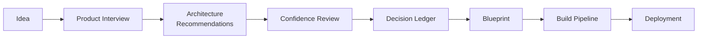

<Info>
**Status: Reference checkpoint.** This page records project state at a deliberate pause in
development. It is descriptive, not normative: it summarises and links to the canonical
specifications rather than restating or extending them. Where this page and a specification
disagree, the specification governs.
</Info>

## Purpose

This page exists so that DevOS can be resumed without reconstructing its architecture from old
conversations. It records what DevOS is, which parts of it are settled, which are planned, which
are directional, and what remains unwritten.

It is written for four readers:

- people joining the project who need the shape of the system before the detail;
- Macro Tech Titan developers resuming work after a pause;
- AI agents retrieving DevOS architecture, which need normative and directional statements
  clearly separated;
- future DevOS sessions recovering project context.

**Checkpoint commit:** `d91e67a` — *docs: complete Framework Library specification*
(`d91e67abfd40b41824137058bb0dc9e7cf9e2b8c`), plus this page.

## Reading this page

Four labels are used throughout, and they are not interchangeable.

| Label | Meaning |
| --- | --- |
| **Normative** | Specified in this repository. Binding on implementation. |
| **Planned** | Committed and scoped in this repository, not yet implemented. |
| **Directional** | Discussed as intent. **Not specified in this repository.** Not binding. |
| **Unresolved** | An open question recorded on a canonical page, with no settled answer. |

<Note>
Directional material appears on this page because losing it would cost more than recording it.
It is marked because recording intent and specifying behaviour are different acts. A directional
statement here MUST NOT be implemented as though it were a specification, and MUST NOT be cited
as one. It becomes normative only when a canonical page adopts it through the
[governance process](/constitution/governance).
</Note>

## What DevOS Is

DevOS is Macro Tech Titan's engineering operating system for building software.

DevOS is **not another AI coding assistant**. Coding agents are replaceable execution workers:
they write code, and they are interchangeable. DevOS is the **control plane** — the layer that
holds the state agents do not own.

Its responsibility is coordinating requirements, architecture, decisions, frameworks, blueprints,
project state, AI execution, validation, deployment, governance, auditability, and long-term
engineering memory.

The distinction is load bearing and already normative in this repository: an agent executes work
but never accepts a decision. Human acceptance sits on the only path from a scored recommendation
to a decision record — Article 4 in [Principles](/constitution/principles), enforced at a single
point in [AI Connect](/architecture/ai-connect) rather than trusted to each engine.

DevOS is aimed at the interval between "we have an idea" and "we are writing code" — where most
projects accumulate the ambiguity that later becomes rework.

### Conceptual lifecycle

At the coarsest level, the lifecycle DevOS coordinates is:

```text
Idea
↓
Requirements
↓
Architecture
↓
Blueprint
↓
Implementation
↓
Validation
↓
Deployment
↓
Maintenance
```

### The specified workflow

**Normative.** The repository specifies this as eight stages, each producing a durable artefact
the next stage consumes, so nothing is re-derived from memory. This is the authoritative chain —
see the [documentation homepage](/) and [Product workflow](/getting-started/product-workflow).



### Directional expansion

**Directional.** A longer chain has been discussed, adding a project workspace, explicit
framework selection, and agent execution as named stages:

```text
Idea → Project Workspace → Product Interview → Requirements → Framework Selection →
Architecture → Decision Ledger → Blueprint → AI Build Pipeline → AI Connect →
Execution Agents → Validation → Deployment → Operations
```

Parts of this already exist under other names: framework selection is the
[Decision Engine](/engines/decision-engine) matching against the
[Framework Library](/frameworks/overview), and AI Connect and execution agents are the platform
layer rather than workflow stages. The repository does not currently specify a project workspace,
a requirements artefact distinct from the Product Brief, or an operations stage. Those remain
directional.

## Canonical Architecture

**Normative.** DevOS has four layers, specified in
[System overview](/architecture/system-overview).

| Layer | Responsibility | Specification |
| --- | --- | --- |
| **Product surface** | What a user operates | [Product overview](/product/overview) |
| **Engine layer** | Transforms one artefact into the next | [Core Engines](/engines/overview) |
| **Platform layer** | Agent orchestration and extension | [AI Connect](/architecture/ai-connect), [Plugin System](/architecture/plugin-system) |
| **Foundation** | Tenancy, identity, observability, audit | Unwritten — see [Remaining work](#remaining-work) |

Two boundaries matter most, and both are constitutional rather than stylistic:

- **Organisation scope is resolved once at the surface** and carried through every layer beneath
  it. No layer may widen it; no layer may be invoked without it — Article 7 and ES-2.
- **Attribution is attached by AI Connect**, not by the engine. An engine cannot present
  generated content as user-authored because it never holds unattributed output — AI-3.

Isolation is enforced in the foundation, not in the platform layer. The Plugin System cannot
guarantee tenant isolation, because plugins are the least trusted component in the architecture.

### Capability status

**Normative.** The [documentation homepage](/) holds the single source of truth for capability
maturity. Reproduced here as of this checkpoint; where it has since changed, the homepage governs.

| Capability | Status |
| --- | --- |
| Product Interview Engine | Prototype |
| Decision Engine | Prototype |
| Decision Ledger | Prototype |
| Architecture Confidence Engine | Concept |
| Blueprint Engine | Concept |
| AI Build Pipeline | Concept |
| Framework Library | Planned |
| AI Connect | Concept |
| Plugin System | Concept |
| Public API | Concept |

No DevOS capability has reached Beta or Operational. Every platform component is at Concept:
**no implementation of AI Connect or the Plugin System exists.**

### Unresolved questions

Recorded on canonical pages, carried here so they are not rediscovered:

- Should the Framework Engine gain a page in [Core Engines](/engines/overview) once it leaves
  Planned status, or remain documented with the library it governs?
- Should the Decision Engine and Architecture Confidence Engine be a single engine? They are
  separated so scoring is auditable independently of matching, at the cost of a handoff with no
  user-visible artefact between them.
- Should framework library storage become a plugin capability, allowing organisation-hosted
  libraries? This would extend the plugin model into the engine layer.
- Should the public API be a plugin host, or remain a fixed surface?
- Where should cost limits be enforced — AI Connect alone, or jointly with the Plugin System for
  non-AI providers that also bill per call?
- Should a composition carry two constraint frameworks, when a system both holds money and
  handles health records?
- Should the eight framework classes be fixed, or extensible by an organisation?

## Seven Core Engines

**Normative.** DevOS has **seven** engines. An engine is a named component that transforms one
artefact into the next under a documented contract — the term describes a transformation
contract, not a deployment unit. Full specification:
[Core Engines Overview](/engines/overview).

| # | Engine | Consumes | Produces | Status |
| --- | --- | --- | --- | --- |
| 1 | [Product Interview Engine](/engines/product-interview-engine) | Idea (free text) | Product Brief | Prototype |
| 2 | Framework Engine | Framework definitions | Validated, queryable framework library | Planned |
| 3 | [Decision Engine](/engines/decision-engine) | Product Brief + framework library | Recommendation set | Prototype |
| 4 | [Architecture Confidence Engine](/engines/architecture-confidence-engine) | Recommendation set | Scored set with evidence and gaps | Concept |
| 5 | [Decision Ledger](/engines/decision-ledger) | Accepted recommendations | Decision records | Prototype |
| 6 | [Blueprint Engine](/engines/blueprint-engine) | Decision Ledger | Blueprint | Concept |
| 7 | [AI Build Pipeline](/engines/build-pipeline) | Blueprint | Ordered build units | Concept |

<Note>
The **Framework Engine is engine 2** and is the one engine with no page in the Core Engines
section. It maintains, validates, and serves the library rather than transforming a project
artefact, so its specification lives with the library it governs — see
[Framework Library](/frameworks/overview). It is numbered because the Decision Engine cannot
function without it.
</Note>

### The taxonomy does not expand

**Normative.** The seven-engine model is fixed, and the constraint is structural rather than
editorial. An engine consumes one workflow artefact and produces the next. A capability that
transforms no workflow artefact is not an engine, however important it is.

Accordingly, the following are **not** numbered engines and MUST NOT be counted as such:

| Capability | What it is instead |
| --- | --- |
| [AI Connect](/architecture/ai-connect) | Platform layer — agent orchestration |
| [Plugin System](/architecture/plugin-system) | Platform layer — extension model |
| Validation | A gate applied to artefacts, not a transformation of one |
| Deployment | Downstream of the build pipeline; a plugin class and an unwritten architecture page |
| Kernel services | Directional — see [DevOS Kernel](#devos-kernel) |
| Knowledge and traceability | Directional — see [Knowledge and traceability direction](#knowledge-and-traceability-direction) |

Counting either platform component as an engine would break the artefact chain, because neither
consumes nor produces a workflow artefact. [System overview](/architecture/system-overview) states
the invariant directly: *the engine count remains seven*.

Five of the seven engines invoke agents. Two invoke none: the Framework Engine and the Decision
Ledger. Engines 5, 6, and 7 are deterministic in structure — a compilation run twice on the same
input produces byte-identical structural output.

## DevOS Kernel

<Note>
**Directional. Not specified in this repository.** At this checkpoint the repository contains no
Kernel specification — the term appears in no canonical page. This section records intent so it
is not lost, and marks the gap so it is not mistaken for settled design.
</Note>

The intent discussed is a **Kernel** that owns and coordinates canonical DevOS project state:
the component that holds the objects engines read and write, enforces their invariants, and is
the single place project state is mutated.

Two things are worth separating clearly.

**What the repository already specifies.** The artefacts in the engine chain are canonical and
normative today — Product Brief, recommendation set, scored set, decision record, blueprint,
build unit — along with organisation scoping, immutability, and audit requirements in the
foundation. These exist as engine contracts, not as a named object model owned by a Kernel.

**What remains directional.** A universal object model has been discussed, spanning:

```text
Organization · Workspace · Project · Requirement · Feature · Question · Answer ·
Architecture · Framework · Decision · Blueprint · Task · Agent · Agent Run · Prompt ·
Artifact · Repository · Integration · Validation · Deployment · Risk · Incident ·
Permission · Audit Event
```

**This list is not normative.** Some entries correspond to specified concepts under other names
(Organisation, Framework, Decision, Blueprint, Agent, Audit Event). Others — Requirement,
Feature, Task, Agent Run, Risk, Incident — have no specification in this repository at all.
Publishing the list as a data model would convert brainstorming into architecture, which
[Documentation vs. application](#documentation-vs-application) and the build philosophy below
both forbid.

The natural home for a Kernel specification is the Architecture section, which is where the
foundation pages remain unwritten.

## Knowledge and Traceability Direction

<Note>
**Directional**, with one normative foundation. The traceability *principle* is already binding;
the *graph* below is not specified.
</Note>

**Normative today.** Traceability is a handoff rule across every engine boundary: every element
an engine produces must resolve to a specific element of its input, and an output element with no
resolvable origin is a defect, not a warning. Declared unknowns propagate — an unknown declared in
the interview must reach confidence review as a named evidence gap, and no engine may silently
substitute a default.

**Directional.** The long-term ambition is engineering memory: a graph connecting

```text
Requirement → Feature → API → Database Entity → UI Component → Task →
Agent Prompt → Git Commit → Deployment → Production Incident → Fix → Release
```

so that DevOS can eventually answer:

- Why does this endpoint exist?
- Which requirement caused this feature?
- Which decision produced this architecture?
- Which agent run produced this artefact?
- Which deployment introduced this problem?
- Which fix resolved the incident?

Most nodes in that chain have no specification here. The chain from brief to build unit is
specified; everything downstream of a build unit — commits, deployments, incidents, releases — is
not. Note also that the repository **deliberately defers** code generation and repository
ownership: DevOS produces specifications and prompts, and owning the code is treated as a
different product. Any traceability design must respect that boundary rather than quietly cross
it.

## AI Connect

**Normative specification, Concept status.** [AI Connect](/architecture/ai-connect) is the
orchestration layer between DevOS engines and AI agents. Engines do not call models: they submit
work to AI Connect, which resolves an agent, enforces its contract, scopes retrieval to a single
organisation, tracks execution, and returns an attributed result.

It exists for one structural reason. Five of the seven engines invoke AI; without a common layer,
each would separately implement retrieval scoping, attribution, failure handling, and cost
accounting — five places for a tenant-isolation defect instead of one.

Documented responsibilities, as specified:

| Responsibility | Role |
| --- | --- |
| Agent registry | The catalogue of agents available to an organisation, with contracts and versions |
| Capability routing | Resolving a requested capability to a specific agent and version |
| Prompt envelopes | The complete structured input: scope, context, constraints, authority limits |
| Execution tracking and resumable sessions | Tracked, resumable units of agent execution |
| Result envelopes | Structured output: content, attribution, cost, validation state |
| Permissions and authority | Authority limits on what an execution may do |
| Cost tracking | Per-execution cost accounting |
| Multi-agent workflows | Compositions where several executions contribute to one engine request |

<Note>
The page **deliberately contains no implementation detail.** Schemas, protocols, and interfaces
are to follow in a separate specification once the concepts settle. Do not infer an interface
from this summary.
</Note>

AI Connect holds no provider credentials — model access is obtained as a plugin capability. It
decides nothing: it routes and executes, and never accepts a decision. It is not an engine.

### Replaceable execution tools

**Directional.** The architecture is intended to let DevOS work with replaceable execution
tools — coding agents, hosted assistants, MCP-connected systems, local models, and future agents —
selected per capability rather than hardcoded.

The *mechanism* for this is specified: engines request a capability by name and never name an
agent or provider, and provider access is a plugin class. But **no specific tool or vendor is
named anywhere in this repository**, and no integration is implemented. Any list of concrete
tools is illustrative, not a statement of support.

## Plugin System

**Normative specification, Concept status.** The [Plugin System](/architecture/plugin-system) is
the extension model for everything DevOS connects to. The governing rule:

<Note>
**Integrations are plugins.** AI providers, deployment providers, repositories, databases,
communication platforms, and authentication systems are implemented as plugins, not as hardcoded
integrations in the core. A new external system is a new plugin, not a change to DevOS.
</Note>

Six plugin classes are specified. A plugin declares exactly one, so that plugins within a class
are comparable and interchangeable at the routing layer.

| Class | Serves |
| --- | --- |
| AI provider | Model access |
| Deployment provider | Deployment targets and release operations |
| Repository | Code hosting, branches, pull requests |
| Database | External data stores a customer system uses |
| Communication | Notification and messaging destinations |
| Authentication | Identity providers for organisation sign-in |

Consumers discover **capabilities, not plugins**. Registration makes a plugin known to DevOS;
installation enables it for one organisation with that organisation's configuration and
credentials. The two are separate acts.

Plugins are the least trusted component in the architecture. Plugin permissions are declared,
granted, and enforced outside the plugin, and isolation is a foundation property the Plugin
System operates within rather than provides.

As with AI Connect, the page contains **no manifest schema, interface, or packaging detail** by
design. None should be inferred.

## Documentation Stack

**Normative.** The current documentation architecture:

```text
GitHub (MacroTechTitan/devos-docs)
↓
MDX source files
↓
docs.json (navigation and configuration)
↓
Mintlify GitHub App integration
↓
Mintlify validation and deployment
↓
docs.devos.macrotechtitan.com
```

| Element | Detail |
| --- | --- |
| Repository | `MacroTechTitan/devos-docs` |
| Configuration | `docs.json`. The older `mint.json` format is not used. |
| Documentation site | `docs.devos.macrotechtitan.com` |
| Product site | `devos.macrotechtitan.com` |
| Deployment | Merges into `main` trigger a production build and deploy |
| Local tooling | `mint dev`, `mint validate`, `mint broken-links` |

<Note>
**Mintlify is the presentation and publishing layer. It is not the DevOS backend.** It renders and
hosts documentation. It holds no project state, executes no engine, and stores no customer data.

**The GitHub documentation repository is the canonical product specification.** Where any other
artefact disagrees with it, the repository governs.
</Note>

## Documentation vs. Application

The documentation system and the future DevOS application are different systems, and conflating
them is the most likely way to misread this repository.

| | Documentation system | DevOS application |
| --- | --- | --- |
| Exists today | Yes | No |
| Holds | Specifications | Live project state |
| Canonical for | What DevOS should be | What a project currently is |
| Status | Operational | Directional |

**Directional.** A separate application surface has been discussed at
`app.devos.macrotechtitan.com`, expected to own live state: organisations, workspaces, projects,
requirements, architecture records, decisions, blueprints, tasks, agent runs, validations,
deployments, permissions, and audit history.

Candidate technologies have been discussed — a rapid application build tool, hosted Postgres with
managed authentication, a DevOS API, AI Connect, the Plugin System, and repository and deployment
integrations.

<Note>
**No application technology choice is decided, and none is recorded in this repository.** No
vendor or product is named in any canonical page. Every technology named in planning discussion
is a candidate only.

This is not an oversight. A framework "describes architecture, not a stack", and vendor selection
is a decision an adopting organisation records through the
[Decision Ledger](/engines/decision-ledger). DevOS choosing its own stack is subject to the same
discipline: it becomes real when it is recorded as a decision, not when it is mentioned.
</Note>

**The planned application is not implemented.** No part of it exists. Statements about it are
intent.

## Completed Milestones

Verified against the repository at this checkpoint. The repository contains **44 MDX pages** prior
to this one, all reachable from navigation.

| Area | Pages | State |
| --- | --- | --- |
| Root documentation | `README.md`, `CONTRIBUTING.md`, `CODE_OF_CONDUCT.md`, `SECURITY.md`, `LICENSE` | Complete |
| Homepage | `index.mdx` | Complete |
| Introduction | 5 | Complete |
| Getting Started | 4 | Complete |
| Constitution | 8 | Complete |
| Product | 6 | Complete |
| Core Engines | 7 | Complete |
| Framework Library | 10 | Complete |
| Architecture | 3 of 10 | Partial |

The Architecture section contains three of its ten pages:
[System overview](/architecture/system-overview), [AI Connect](/architecture/ai-connect), and
[Plugin System](/architecture/plugin-system). The remaining seven are declared in navigation and
unwritten.

Every other navigation section — Security, Design System, AI Agents, API Reference, Governance,
RFCs, and Reference — is declared and entirely unwritten.

### Commit history

Four commits, linear, no merges:

| Commit | Message |
| --- | --- |
| `6ece32c` | Initial commit |
| `f544fdc` | docs: complete foundation, product, and core engines |
| `e16205d` | docs: correct Framework Engine numbering in core engines overview |
| `d91e67a` | docs: complete Framework Library specification |

## Framework Library State

**Milestone complete.** The [Framework Library](/frameworks/overview) is specified: the library,
the [framework standard](/frameworks/framework-standard), the Framework Engine, composition rules,
lifecycle, versioning, and all **eight** reference frameworks.

Six describe system shape; two describe the data-handling and regulatory constraints a shape
framework is operated under.

| Framework | Composition role | Status |
| --- | --- | --- |
| [SaaS](/frameworks/saas) | `shape` | Planned |
| [Marketplace](/frameworks/marketplace) | `shape` | Planned |
| [AI Agent](/frameworks/ai-agent) | `shape` | Planned |
| [Internal Tool](/frameworks/internal-tool) | `shape` | Planned |
| [Mobile](/frameworks/mobile) | `shape` | Planned |
| [Desktop](/frameworks/desktop) | `shape` | Planned |
| [Fintech](/frameworks/fintech) | `constraint` | Planned |
| [Healthcare](/frameworks/healthcare) | `constraint` | Planned |

Two invariants are easy to get wrong and are stated explicitly:

- **[AI Agent](/frameworks/ai-agent) is a `shape` framework at `Planned` status.** It covers
  systems whose primary work is performed by models under contract.
- **There is no AI Product framework.** The library covers eight classes; a ninth MUST NOT be
  invented to fill a perceived gap.

The library is authored but **not published**: a framework at Planned status MUST NOT be matched
against a brief, and the Framework Engine that validates, indexes, and serves the library is not
implemented. Until it is, the Decision Engine runs against a partial library and reports
`INSUFFICIENT_LIBRARY` where a brief's domain is uncovered.

## Validation State

Validation was run against this checkpoint. Results are current as of this page, not historical.

| Check | Result |
| --- | --- |
| `mint validate` | 45 warnings, non-zero exit |
| `mint broken-links` | 77 broken links across 27 files |

**These results are expected and are not defects.**

All 45 warnings are navigation entries in `docs.json` pointing at pages that are declared but
intentionally unwritten — 45 declared paths with no file, which is exactly the count of remaining
pages in [Remaining work](#remaining-work). All 77 broken links are forward references from
written pages to those same unwritten pages.

<Note>
**Forward references are deliberate.** Declaring the full documentation surface in navigation, and
linking to pages before they are written, is how the intended shape stays visible and how the
remaining work stays measurable.

A forward reference MUST NOT be deleted to obtain a zero-warning result, and placeholder pages
MUST NOT be created to silence a warning. Both would trade an accurate signal for a clean one. The
warning count falls only when a real page is written.
</Note>

Adding this page changes neither count: it introduces one navigation path *and* the file that
satisfies it, and links only to pages that already exist.

## Remaining Work

Recalculated against the repository at this checkpoint.

| Section | Written | Declared | Remaining |
| --- | --- | --- | --- |
| Introduction | 6 | 6 | 0 |
| Getting Started | 4 | 4 | 0 |
| Constitution | 8 | 8 | 0 |
| Product | 6 | 6 | 0 |
| Core Engines | 7 | 7 | 0 |
| Framework Library | 10 | 10 | 0 |
| Architecture | 3 | 10 | **7** |
| Security | 0 | 6 | 6 |
| Design System | 0 | 5 | 5 |
| AI Agents | 0 | 6 | 6 |
| API Reference | 0 | 6 | 6 |
| Governance | 0 | 5 | 5 |
| RFCs | 0 | 5 | 5 |
| Reference | 1 | 6 | 5 |
| **Total** | **45** | **90** | **45** |

The seven remaining Architecture pages are:

`application-architecture` · `data-model` · `authentication` · `multi-tenancy` ·
`integrations` · `observability` · `deployment`

The five remaining Reference pages are `glossary`, `status-definitions`,
`decision-record-template`, `framework-template`, and `agent-template`.

<Note>
**The next intended milestone when development resumes is the seven remaining Architecture
pages.** They are sequenced first because they specify the foundation layer — data model,
tenancy, identity, observability, deployment — that Security, API Reference, and the future
application all depend on. Verify this against the repository at the time of resumption.
</Note>

## Build Philosophy

The principles governing how DevOS is built. They are preserved here because they explain
decisions that otherwise look like overhead.

1. Documentation precedes implementation.
2. Architecture precedes coding.
3. Important decisions are recorded.
4. Frameworks beat unnecessary reinvention.
5. Requirements must be traceable.
6. Validation gates releases.
7. AI agents execute work but do not own project state.
8. Integrations use the plugin architecture.
9. The documentation repository is the canonical product specification.
10. Completed milestones are validated before commit.
11. Major documentation sections receive separate commits.
12. Development pauses cleanly at stable checkpoints.

Principle 7 is the reason DevOS exists as a control plane rather than an assistant. Principle 12
is the reason this page exists.

## Current Status — Paused

<Info>
**DevOS development is intentionally paused at this checkpoint.**
</Info>

The pause is deliberate and the checkpoint is clean: the working tree is committed, validation
results are understood and explained, and the Framework Library milestone is complete rather than
half-finished. Development stopped at a section boundary, not mid-page.

**This is not abandonment.** The checkpoint exists so that work can resume without reconstructing
architecture, engine definitions, framework decisions, or project state from old conversations.
Everything needed to restart is either on this page or linked from it.

When development resumes, the next intended milestone is **the seven remaining Architecture
pages**, subject to verification against the repository at that time.

Four invariants must survive the pause. They are the ones most likely to be eroded by a
well-meaning resumption:

1. **Seven Core Engines.** The taxonomy is not expanded to ten, twelve, or fifteen. New
   capabilities become subsystems or platform capabilities.
2. **Eight frameworks.** AI Agent is a `shape` framework at `Planned` status. No AI Product
   framework is created.
3. **Forward references are legitimate.** Validation warnings are not silenced with placeholder
   pages or deleted links.
4. **Directional stays directional.** Nothing on this page marked directional — the Kernel, the
   universal object model, the traceability graph, the application stack — becomes a specification
   without passing through governance.

## Related pages

- [Roadmap](/introduction/roadmap) — sequencing and status by capability
- [Core Engines Overview](/engines/overview) — the seven engines and their contracts
- [Framework Library](/frameworks/overview) — the eight frameworks and the Framework Engine
- [System overview](/architecture/system-overview) — the four layers
- [AI Connect](/architecture/ai-connect) · [Plugin System](/architecture/plugin-system) — the platform layer
- [Principles](/constitution/principles) — the articles cited throughout
- [Vision](/introduction/vision) · [Philosophy](/introduction/philosophy) — why DevOS is shaped this way

## Version history

| Version | Date | Change |
| --- | --- | --- |
| 1.0 | 2026-08-16 | Initial page. Records project state at the development pause following the Framework Library milestone. |
